# **COMPARATIVE ANALYSIS & BENCHMARK**
## **Open Networked Earth (O.N.E.) vs. Planetary, Cyber-Socialist, Speculative, and Commons Constitutions**

**Document Classification:** Canonical Comparative Nomothetics & Biophysical Governance  
**Author:** Kyberlex (`kyberlex@proton.me`)  
**Repository:** [https://github.com/kyberlex/ONE](https://github.com/kyberlex/ONE)  
**License:** AGPL-3.0-or-later / Open Knowledge  
**Canonical Anchors:** [`bible/ONE NETWORKED EARTH (O.N.E.).md`](bible/ONE%20NETWORKED%20EARTH%20(O.N.E.).md) | [`AI_BENCHMARK_POST_WORK.md`](AI_BENCHMARK_POST_WORK.md) | [`synoptic.md`](synoptic.md) | [`oasis/oasis.md`](oasis/oasis.md)  

---

## **I. EXECUTIVE SUMMARY & EPISTEMOLOGICAL FRAMEWORK**

Across the 20th and 21st centuries, humanity has produced numerous visionary legal charters, cybernetic blueprints, science-fiction constitutions, and indigenous biocentric declarations aimed at overcoming the terminal contradictions of capitalism, predatory rent, ecological collapse, and state authoritarianism.

Yet, nearly all historical predecessors stalled at one of three failure points:
1. **The Bureaucratic / Authoritarian Trap:** Creating a centralized state leviathan, an unaccountable global police force, or an unelected algorithmic technocracy.
2. **The Biophysical / Thermodynamic Blindspot:** Retaining price mechanisms, debt currency, or measuring value exclusively through anthropocentric labor-time while neglecting entropy, exergy, and biophysical boundary limits.
3. **The Transition Paralyzer:** Requiring violent armed conquest of state power, unanimous diplomatic consensus among nuclear-armed states, or pure literary speculation lacking executable real-world hardware.

**Open Networked Earth (O.N.E.)** was engineered through rigorous backward-compatibility auditing against these systemic failures. O.N.E. integrates the strongest institutional, cybernetic, and ecological discoveries of its predecessors into an unbreakable, non-commercial, biophysically grounded constitutional framework anchored by the **Dual-Track Handshake** (bridging virtual simulation with real-world open-hardware blueprints).

---

## **II. THE 9 COMPARATIVE MODELS (4 THEMATIC STREAMS)**

The comparative evaluation encompasses nine foundational archetypes across four primary traditions:

### **Stream 1: Planetary & Global Federalist Constitutions**
1. **The Earth Constitution (A Constitution for the Federation of Earth, 1977 / 1991):** Drafted by the World Constitution and Parliament Association (WCPA) in Innsbruck and Lisbon. A 19-article statutory world government charter featuring a tricameral global parliament and a planetary disarmament mandate.
2. **The Charter of the Social Contract (Rojava / Democratic Confederalism, 2014 / rev. 2023):** Grounded in Murray Bookchin's social ecology and Abdullah Öcalan's democratic confederalism. A de facto living legal framework organized around stateless communal cantons, neighbourhood assemblies, strict gender parity (co-chairmanship), and pluralistic autonomy.

### **Stream 2: Cyber-Socialist & Eco-Thermodynamic Models**
3. **Towards a New Socialism (Cockshott & Cottrell, 1993):** A cybernetic post-monetary planning architecture replacing markets and elected parliaments with statistical sortition (demarchy), linear programming, and non-transferable labor-time vouchers.
4. **Half-Earth Socialism (Vettese & Pendergrass, 2022):** A biophysical planning model based on linear optimization, bio-physical accounting (without monetary price signals), and binding ecological quotas dedicated to re-wilding 50% of the planetary biosphere.
5. **The Venus Project / Resource-Based Economy (Jacque Fresco, 1980s–1990s):** A technocratic post-monetary civilization model advocating the total elimination of private property and money, governed directly through ambient environmental sensors and automated cybernetic resource allocation.

### **Stream 3: Speculative Constitutions in Hard Science Fiction**
6. **The Martian Constitution (Kim Stanley Robinson, *Mars Trilogy*, 1993–1996):** Synthesized at the Dorsa Brevia constituent assembly (*Green Mars*). Establishes universal dynamic usufruct, an eco-economy based on calories and energy, worker-owned cooperatives, and legal personhood for the Martian biosphere (*Viriditas*).
7. **Ecotopia (Ernest Callenbach, 1975):** A decentralised bioregional federation based on zero-waste steady-state production, a 20-hour work week, abolition of capital accumulation, and ecological stewardship.

### **Stream 4: Commons Constitutionalism & Rights of Nature**
8. **The Constitutions of Ecuador (2008) and Bolivia (2009):** The first sovereign constitutional charters to grant inherent juridical standing to Nature (*Pachamama*) and enshrine *Buen Vivir* (*Sumak Kawsay*) over extractive GDP maximization.
9. **The Commons Charter & P2P Matrix (Michel Bauwens / P2P Foundation, 2010s):** A peer-to-peer polycentric governance framework combining Community Land Trusts, Copyfarleft reciprocity licenses, and *Design Global, Manufacture Local* (DGML) production federations.

---

## **III. COMPREHENSIVE COMPARATIVE MATRIX**

| Model & Paradigm | Institutional Governance | Property Regime & Land Tenure | Economic Metric & Resource Allocation | Ecological Jurisprudence | Technology & Network Topology | Defense, Sanctions & Conflicts | Critical Vulnerability / Failure Mode | O.N.E. Synthesis & Resolution |
| :--- | :--- | :--- | :--- | :--- | :--- | :--- | :--- | :--- |
| **1. The Earth Constitution** *(WCPA, 1977/1991)* | Tricameral world parliament (peoples, nations, counsellors); elective global democracy | Planetary resources as common heritage; retains regulated private commerce | Global currency (*World Currency System*); macro-planning and regulated market | Centralized environmental protection agencies; anthropocentric resource framing | Centralized planetary bureaucracy; no native P2P mesh protocols | National disarmament; World Police Force (global centralized monopoly of force) | **Authoritarian Leviathan risk**; bureaucratic centralism; reliance on nation-state ratification | O.N.E. eliminates representative parliaments and global police forces, substituting them with **odd-parity statistical demarchy** and **systemic network decoupling**. |
| **2. Social Contract of Rojava** *(NES, 2014/2023)* | Democratic confederalism; bottom-up communal assemblies; 50% gender quota | Social cooperative economy; agricultural usufruct; small personal property protected | Subsistence and local cooperatives; constrained use of Syrian fiat pound and oil sales | Social ecology (Bookchin); constrained by permanent wartime survival | Standard municipal infrastructure; limited cybernetic automation | Popular self-defense militias (YPG/YPJ, Asayish); armed communal defense | **Geopolitical / military vulnerability**; forced oil-revenue extraction; lack of formal thermodynamic metrics | O.N.E. scales Rojava's bottom-up confederalism globally while instituting **random sortition** to prevent activist exhaustion, and eliminates fossil reliance via physical Leontief balancing. |
| **3. Towards a New Socialism** *(Cockshott & Cottrell, 1993)* | Electronic direct democracy combined with statistical sortition demarchy | Public / social ownership of all productive assets | Non-transferable labor-time vouchers; linear programming for physical clearing | Secondary; natural resources modeled but constrained to anthropocentric labor-time | Centralized cybernetic computation centers (*algorithmic Gosplan*) | Workers' state; universal conscription militia; standard socialist jurisprudence | **Labor-time anthropocentrism** (blind to entropy and material exergy limits); single point of cybernetic failure | O.N.E. replaces labor-time vouchers with a **multivariate physical Leontief matrix** (joules, liters of water, kg raw elements) across a **distributed, zero-surveillance P2P network**. |
| **4. Half-Earth Socialism** *(Vettese & Pendergrass, 2022)* | Democratic planning via bio-assemblies and ecological parliament | Socialized industry and land; 50% of Earth strictly dedicated to re-wilding | Linear optimization of bio-physical quotas (calories, emissions, hectares); no price signals | Biocentric core priority; half of planetary surface preserved from resource extraction | Global Climate Models (GCMs) and regional linear optimization pipelines | Confederal civic bodies; defense and asymmetric resistance details largely unspecified | **Fortress-conservation risk**; institutional vacuum regarding daily civil/housing usufruct jurisprudence | O.N.E. formalizes the 50% Half-Earth boundary within canonical **Jus Biosphaerae**, resolving daily residential security through **Dynamic Usufruct** and the *Civic Housing Pool*. |
| **5. The Venus Project / RBE** *(Jacque Fresco, 1980–1990s)* | Abolition of politics; decisions executed directly by ambient computers and sensors | Universal access commons; total abolition of private property and money | Resource-Based Economy: automated balance against carrying capacity | Ecological optimization built into circular smart-city architecture | Monolithic cybernetic centralization; sovereign artificial intelligence | Deemed obsolete: extreme abundance assumed to automatically extinguish all crime and war | **Unaccountable technocracy** ("rule of algorithms"); extreme sociological naivety; complete absence of constitutional law | O.N.E. rejects algorithmic rule: **AI and telemetry are non-sovereign tools**; governance belongs exclusively to human sortition juries (odd parity; 75% supermajority). |
| **6. Martian Constitution** *(K.S. Robinson, 1993–1996)* | Martian confederal council, habitat assemblies, faction balancing (Red vs. Green) | Universal usufruct; shelter, air, and water are inalienable rights; worker coops | Eco-economics (calories, thermal units, ecobalance budgets); financial rent prohibited | *Viriditas*: legal standing and intrinsic rights for the evolving Martian biome | Open scientific networks; high-automation life support infrastructure | Non-lethal civil defense; defensive sabotage and non-cooperation against transnational cartels | **Speculative literary design**: lacks deterministic mathematical anti-collusion protocols and P2P audit proofs | O.N.E. translates Robinson's Dorsa Brevia charter into an **executable 12-Title statutory constitution**, anchored by real-world physical open hardware (**Dual-Track Handshake**). |
| **7. Ecotopia** *(Ernest Callenbach, 1975)* | Decentralized semi-direct democracy; female-led survivalist ecological party | Small worker collectives and cooperatives; severe inheritance and land caps | Steady-state closed-loop economy; 20-hour work week; anti-obsolescence mandates | Biocentrism; watershed bioregionalism; 100% circular recycling | Deliberate "soft tech" bias; strong skepticism toward advanced computing | Territorial militia; preemptive nuclear deterrent to prevent external reconquest | **Autarchic isolationism**; regression toward luddite anti-computational limits; dangerous nuclear defense doctrine | O.N.E. rejects luddism and autarchy: it leverages **advanced open cybernetics and mesh computing** while remaining globally confederal, enforcing strict non-lethal defense. |
| **8. Constitutions of Ecuador & Bolivia** *(2008 / 2009)* | Standard presidential republic, representative party parliament, indigenous autonomies | Mixed economy; private property protected alongside state and collective land | Mixed regulated economy; redistribution of fossil/mineral rent for social welfare | **Pachamama enshrined as a rights-bearing legal person**; *Buen Vivir* constitutionalized | Traditional state centralized telecommunications and public utilities | Traditional national armed forces; public interest constitutional litigation | **The Neo-Extractivist Paradox**: the state legally protects nature but is forced to drill oil to finance social welfare | O.N.E. cures the extractivist paradox: the **Universal Baseline of Survival** is provided in **direct physical flows**, severing dependence on foreign debt and commodity export markets. |
| **9. The Commons Charter** *(P2P Foundation, 2010s)* | Polycentric commons governance (Ostrom); Partner-State facilitation model | Commons property; Copyfarleft; Community Land Trusts to dismantle speculative rent | Contributive accounting; alternative currencies; *Design Global, Manufacture Local* (DGML) | Fiduciary custody of natural commons; open circular production architecture | Peer-to-peer networks, distributed ledgers, platform cooperatives | Informal peer mediation; lacks macro-geopolitical defense or asymmetric security mechanics | **Prefigurative vulnerability**: high risk of capitalist enclosure/co-optation; lack of a sovereign protective constitutional shield | O.N.E. shields the DGML paradigm within an **inviolable constitutional armor**: dynamic usufruct, demarchic sortition assemblies, and systemic network decoupling. |
| **O.N.E. (Open Networked Earth)** | **Strict odd-parity demarchy** (3, 15, 101, 301, 1001); 75% supermajority; zero political parties | **Dynamic Usufruct** (*Use It or Lose It*); *Civic Housing Pool*; personal belongings inviolable | **Thermodynamic Leontief Input-Output Matrix** (joules, mass, MTBF, emissions); zero fiat/debt/GDP | **Jus Biosphaerae**: watershed as sovereign unit; *Curatores Biosphaerae* drawn by lot | **Decentralized P2P mesh**; non-sovereign telemetry; zero-surveillance; open physical compilers | **Systemic Network Decoupling**, coordinated non-lethal defense; 3-citizen local peer mediation | **Systemic inertia of legacy institutions** (countered via living simulation sandbox and open-hardware rollouts) | **Comprehensive synthesis reconciling biophysical thermodynamics, radical demarchy, interspecies law, and actionable dual-track transition.** |

---

## **IV. THE 50-POINT NOMOTHETIC & BIOPHYSICAL BENCHMARK SCORECARD**

To assess institutional robustness objectively, all models are evaluated across five weighted dimensions (1 to 10 points each):

1. **Thermodynamic & Biophysical Coherence (CT):** Strict adherence to entropy, exergy limits, mass-energy balance, and non-reliance on debt-based growth or fossil-fuel subsidies.
2. **Anti-Authoritarianism & Demarchic Governance (AD):** Eradication of political party oligarchies, prevention of bureaucratic capture, and elimination of algorithmic technocracy.
3. **Land Tenure & Housing Usufruct (GD):** Mathematical prevention of real-estate speculation and predatory rent while upholding the inviolability of personal belongings.
4. **Ecological Jurisprudence & Biocentrism (EB):** Formal codification of the biosphere as a rights-bearing legal person (*Jus Biosphaerae*) with watershed-level civic guardianship.
5. **Transition Viability & Prefigurative Feasibility (TF):** Capacity to be implemented immediately without waiting for global state consensus or violent apocalyptic rupture.

### **Master Scorecard Leaderboard**

```
RANK  MODEL / CHARTER                         CT   AD   GD   EB   TF   TOTAL / 50   STATUS
---------------------------------------------------------------------------------------------------------
 1    Open Networked Earth (O.N.E.)           10   10   10   10    9    49 / 50     🥇 Absolute Victor (Operative Synthesis)
 2    Martian Constitution (K.S. Robinson)     9    8    9    9    6    41 / 50     🥈 Best Speculative Archetype
 3    Social Contract of Rojava (NES)          6    9    8    8    8    39 / 50     🥉 Best Real-World Historical Praxis
 4    Half-Earth Socialism (Vettese/Pender.)   9    7    8    9    5    38 / 50     Best Climate & Conservation Metric
 5    Towards a New Socialism (Cockshott)      7    9    8    5    7    36 / 50     Pioneering Cyber-Demarchic Logic
 6    The Commons Charter (P2P Foundation)     7    8    8    7    6    36 / 50     Best Distributed Open-Design Matrix
 7    Ecotopia (Callenbach)                    8    6    7    8    3    32 / 50     Visionary Bioregionalism; Luddite Flaw
 8    Constitutions of Ecuador & Bolivia       4    6    6    8    5    29 / 50     Pioneering Rights of Nature; Extractive Trap
 9    The Venus Project (Jacque Fresco)        7    2    7    7    2    25 / 50     Involuntary Technocratic Despotism
 10   The Earth Constitution (WCPA)            4    5    5    5    3    22 / 50     Centralized Parliamentary Leviathan
```

---

## **V. IN-DEPTH ANALYSIS OF THE PODIUM & CRITICAL BREAKDOWNS**

### **1. Why O.N.E. Wins the Overall Benchmark (1st Place — 49/50)**
O.N.E. occupies the top rank because it represents a **meta-synthesis engineered precisely to resolve the point-of-failure contradictions of the other nine paradigms**:
* It adopts **Rojava's** localized municipal assemblearism, but cures activist burnout and oratorical manipulation by introducing **statistical demarchy with strict odd-number parity** (3, 15, 101, 301, 1001).
* It adopts **Cockshott & Cottrell's** cybernetic planning and demarchic oversight, but removes their single-point-of-failure computing center and **replaces anthropocentric labor-time vouchers with physical Leontief thermodynamics**.
* It adopts **K.S. Robinson's** visionary Martian usufruct and caloric eco-economics, but translates literary motifs into an **actionable, statutory 12-Title Constitution**.
* It adopts **Half-Earth's** biophysical reserve bounds, but integrates them with **local watershed boundaries (*watersheds*)** and interspecies legal defense (*Curatores Biosphaerae*).
* It adopts **P2P Foundation's** *Design Global, Manufacture Local* (DGML) paradigm, but shields it with a non-commercial AGPL/inviolability constitutional lock and non-lethal defense mechanisms.

### **2. The Speculative Laureate: The Martian Constitution (2nd Place — 41/50)**
Robinson's Dorsa Brevia accords remain the closest conceptual predecessor to O.N.E. Robinson understood that human freedom is impossible as long as the atmosphere, water, and shelter are monetized and enclosed by rent-extracting metanational corporations. Its deductions regarding *Viriditas* (the intrinsic ecological imperative of life to flourish) mirror O.N.E.'s *Jus Biosphaerae*. Its primary deficiency is that it remains a literary sketch without verifiable algorithmic protocols or physical compilable blueprints.

### **3. The Champion of Lived Praxis: Rojava (3rd Place — 39/50)**
The Autonomous Administration of North and East Syria (Rojava) proved to history that millions of people can organize society through direct assemblies, gender parity, and restorative justice without a coercive central state. Its lower score in thermodynamic coherence stems not from ideological failure, but from tragic historical necessity: besieged by hostile states, Rojava was forced to operate legacy diesel generators and refine crude oil simply to keep hospitals functioning and bakeries running.

### **4. The Structural Post-Mortem of Failure Modes**
* **The Fatal Technocratic Fallacy (The Venus Project — 10th Place):**  
  Fresco’s belief that human politics can be replaced by "computers and automated sensors making decisions" represents an extreme form of techno-determinist naivety. Eliminating jurisprudence, adversarial debate, and constitutional defense under the premise that "abundance resolves all crime" results in an unaccountable algorithmic dictatorship controlled by whoever programs the central allocation algorithms.
* **The Global Leviathan Illusion (The Earth Constitution — 9th Place):**  
  The WCPA's vision of an all-encompassing world parliament with an armed planetary police force commits the fatal error of scaling 19th-century liberal representative governance globally. It creates a colossal single point of failure easily captured by transnational financial elites, producing an un-overthrowable worldwide police state.
* **The Neo-Extractivist Trap (Ecuador & Bolivia — 8th Place):**  
  Constitutionalizing *Pachamama* while remaining dependent on foreign fiat financial markets creates a lethal hypocrisy: governments are forced to bulldoze indigenous biomes (e.g., the Yasuní-ITT conflict in Ecuador) to generate foreign currency reserves for social welfare budgets.

---

## **VI. THE DECISIVE ADVANTAGE: THE DUAL-TRACK HANDSHAKE**

Every alternative model requires either:
1. A violent revolutionary rupture that seizes state power (Cockshott, Rojava).
2. The simultaneous, voluntary capitulation of 195 sovereign nation-states (Earth Constitution, Half-Earth).
3. The sudden, total collapse of industrial civilization (The Venus Project).

**O.N.E. breaks this paralysis through Class-0 Invariant 7: The Dual-Track Handshake.**



By connecting an open-source civic simulator with 3D-printable Modular Habitat Units (MHU), Home Assistant off-grid automation packages, and ESP32 telemetry hardware, O.N.E. can be deployed **immediately** at neighborhood and bioregional scales. Communities do not wait for national laws to change; they construct resilient, non-financialized commons that out-compete and render obsolete the extractive mechanisms of the legacy financial engine.

---

## **VII. THE 7 INVIOLABLE CLASS-0 INVARIANTS OF O.N.E.**

To guarantee that O.N.E. never degenerates into any of the failure modes detailed in this comparative audit, every tool, simulation, line of code, and constitutional article is strictly bound by seven Class-0 Invariants:

1. **The Non-Commercial Purity Invariant:** 100% free software (AGPL-3.0-or-later) and open knowledge. Zero monetization, zero tokens, zero pay-to-win, zero corporate gates.
2. **The Zero-Leak Identity Invariant:** Pseudonymous maintenance under persona Kyberlex (`kyberlex@proton.me`); zero personal ego, zero private attribution.
3. **The Epistemic Non-Autocratic & Canonical Immutability Invariant:** Canonical constitutional text is hermetically sealed against unilateral modification; updates require 75% supermajority sortition ratification.
4. **The Dynamic Usufruct Invariant ("Use It or Lose It"):** Abolition of land and real estate speculation; unmaintained dwellings return to the Civic Housing Pool while personal belongings remain inviolable.
5. **The Cooperative PvE Invariant (No Human Griefing):** Humans cooperate as fellow builders; the sole adversary is thermodynamic entropy and the extractive legacy debt engine.
6. **The Thermodynamic Conservation & Entropy Invariant:** Matter and energy obey physical Leontief balances; zero magical assumptions; full circular component lifecycles.
7. **The Dual-Track Handshake Invariant:** Every digital simulation breakthrough directly corresponds to tested, verified, 3D-printable open hardware and automation blueprints.

---

## **VIII. DEEP-DIVE: POST-MONETARY ALLOCATION BENCHMARK (O.N.E. VS. 5 NON-FIAT ALTERNATIVES)**

### **1. Epistemological Foundation: Beyond Naive Scalar Technocracy**

A frequent historical failure in post-monetary economics has been the attempt to replace fiat currency with a single physical scalar (e.g., the "energy accounting" and erg/kWh vouchers of 1930s *Technocracy Inc.*, or simple caloric accounting). This approach commits the identical reductionist fallacy as fiat currency: attempting to collapse the multi-dimensional, non-commutative, and ecologically bounded reality of the universe into an arbitrary scalar number.

As Nicholas Georgescu-Roegen established through the Fourth Law of Bioeconomics, energy is not an isotropic fluid; matter matters, and mineral entropy cannot be reversed merely by injecting renewable kilowatt-hours.

**Open Networked Earth (O.N.E.) rejects single-scalar technocracy.**  
Under Article 3.1–3.3 of the Living Constitution ([`bible/ONE NETWORKED EARTH (O.N.E.).md`](bible/ONE%20NETWORKED%20EARTH%20(O.N.E.).md)):
> *"Thermodynamic measurements establish physical constraints, not human social value. To prevent the reduction of human welfare to blind energetic equivalence, all resource dispatch strictly adheres to the Constitutional Hierarchy of Needs, governed by statistically stratified odd-parity sortition assemblies."*

O.N.E. does not position itself against non-thermodynamic alternatives; instead, it executes an **integrated nomothetic and biophysical meta-synthesis** that reconciles logistics, commons jurisprudence, multi-vector constraints, and radical demarchy.

---

### **2. The 5 Non-Fiat Monetary Elimination Archetypes**

1. **Labor-Time Accounting (Cockshott & Cottrell, *Towards a New Socialism*):** Uses algorithmically normalized socially necessary human labor-time as the unit of account. Input-output matrices calculate labor costs; non-transferable digital labor tokens are issued and cancelled upon redemption to prevent capital accumulation.
2. **Flow Cybernetics & Direct Linear Optimization (Kantorovich / Stafford Beer / Cybersyn):** Treats production as pure logistics optimization without any universal unit of account. Telemetric sensor arrays direct production toward a socially defined objective function; basic goods are distributed as zero-cost public utility network flows.
3. **Multi-Vector Systems & Multi-Criteria Analysis (Sen / Georgescu-Roegen / O'Neill):** Overcomes scalar reductionism by evaluating decisions across a multi-dimensional constraint vector (water depletion, rare elements, greenhouse gases, human capabilities, biodiversity). Prioritization occurs via democratic deliberation assisted by predictive simulations.
4. **Commons & Library Economy (Elinor Ostrom / Marcel Mauss / Karl Polanyi):** Abolishes exclusive private ownership (*dominium*) of durable capital in favor of public tool libraries and shared access inventories. Non-standardized goods are coordinated through mutualist networks, zero-sum mutual credit, and decentralized reputation protocols.
5. **Decaying Consumption Quotas & Civic Demurrage:** Replaces money with compartmentalized, non-convertible consumption rights (e.g., separate quotas for transit, leisure, durable goods). Unspent rights evaporate at the end of each cycle (100% demurrage), preventing intergenerational capital hoarding.

---

### **3. Post-Fiat Comparative Matrix**

| Post-Fiat Architecture | Foundational Metric & Dispatch Mechanism | Core Theoretical Strength | Critical Systemic Vulnerability / Failure Mode | O.N.E. Synthesis & Resolution |
| :--- | :--- | :--- | :--- | :--- |
| **1. Labor-Time Accounting** *(Cockshott & Cottrell)* | Socially necessary labor hours; digital labor certificates destroyed upon consumption. | Eliminates usury and financial capital accumulation; anchored directly in human activity. | **Thermodynamic Blindspot:** Blind to material entropy, ecological limits, and water stress. **Automation Paradox:** Collapses as robotic labor approaches 100%. | **REJECTED.** Universal biological survival is an unconditional inalienable birthright (Tier 1); essential maintenance is de-commodified through civic rotational rosters with ergonomic multipliers (Ch. V). |
| **2. Flow Cybernetics** *(Kantorovich / Beer / Cybersyn)* | Direct linear programming; real-time telemetry; zero-cost direct public utility flows. | Eliminates all price and voucher friction; coordinates complex logistical networks directly. | **The Leviathan / Surveillance Trap:** Requires invasive monitoring of individual consumption and central bureaucratic definition of "needs". | **ADOPTED FOR TIERS 1 & 2.** Dynamic Leontief-Kantorovich matrices; telemetric sensing is **strictly restricted to non-personal abiotic variables** (Art. 3.4; zero personal profiling). |
| **3. Multi-Vector Systems** *(Sen / Georgescu-Roegen)* | Multi-dimensional constraint vectors (exergy, mass, H₂O, cycle times, entropy gradients). | Rejects scalar reductionism; respects qualitative heterogeneity and planetary boundary vectors. | **Allocation Paralysis:** Large Pareto frontiers risk decision gridlock when non-commensurable constraints collide without an explicit priority hierarchy. | **CANONICAL CORE OF O.N.E.** Co-calculates $(\text{kWh}, \text{kg}, \text{L}, \tau, \nabla S_m)$, resolved via the **Thermodynamic Lexicographic Viability Operator ($\mathcal{L}_{\min}$)** and sortition juries. |
| **4. Commons & Library Economy** *(Ostrom / Polanyi / DGML)* | Shared tool pools; possessory usufruct; mutual aid and decentralized social trust networks. | Eliminates speculative property rent; maximizes equipment utilization rates; fosters social solidarity. | **Scale Limits & Social Credit Trap:** Struggles to coordinate macro-heavy industry; informal reputation protocols easily degenerate into coercive social credit tracking. | **COSTITUZIONALIZED.** Dynamic Usufruct (Ch. II), Civic Housing Pool, and Open Fab-Labs (Tier 3); **strict constitutional ban on social credit scoring or reputation currencies**. |
| **5. Decaying Quotas / Demurrage** *(Compartmentalized Rights)* | Non-convertible sectoral quotas (transit, goods, diet) subject to periodic evaporation. | Precludes dynastic wealth accumulation and speculative cross-market arbitrage. | **Black Market Emergence & Micro-Surveillance:** Inflexible silos incentivize shadow barter currencies; tracking quotas requires per-citizen ledger surveillance. | **STRUCTURALLY REPLACED.** O.N.E. isolates capital buffers (Tier 2-A) and uses Quadratic Preference Signaling (QPS) with sortition entropy decay in Fab-Labs, eliminating personal ration books. |

---

### **4. Post-Fiat Nomothetic Scorecard Leaderboard**

All six models are evaluated across the 5 canonical dimensions (1 to 10 points each, 50 points total):
* **CT:** Biophysical & Thermodynamic Coherence
* **AA:** Anti-Authoritarianism & Non-Surveillance Privacy
* **AS:** Allocative Scalability & Logistic Robustness
* **RM:** Resistance to Corruption & Shadow Black Markets
* **TF:** Transition Feasibility & Prefigurative Deployability

```
RANK  POST-FIAT PARADIGM                              CT   AA   AS   RM   TF   TOTAL / 50   STATUS
-------------------------------------------------------------------------------------------------------------------------------------
 1    Open Networked Earth (O.N.E. Meta-Synthesis)    10   10    9   10    9    48 / 50     🥇 Absolute Victor (Tripartite Synthesis)
 2    Multi-Vector Systems & Multi-Criteria (Mod. 3)   9    8    7    8    7    39 / 50     🥈 Best Epistemological Constraint Matrix
 3    Commons & Library Economy (Mod. 4)               7    8    7    8    8    38 / 50     🥉 Best Community Praxis & Local Prefiguration
 4    Flow Cybernetics & Direct LP (Mod. 2)            8    5    8    7    6    34 / 50     Superior Logistics; Extreme Surveillance Risk
 5    Decaying Quotas & Civic Demurrage (Mod. 5)       7    5    6    5    6    29 / 50     Allocative Rigidity; High Black-Market Risk
 6    Labor-Time Accounting (Mod. 1 - Cockshott)       4    7    7    6    4    28 / 50     Ecologically Blind; Fails Under Full Robotics
```

---

### **5. Architectural Deconstruction: How O.N.E. Resolves the Dialectic**



1. **Why Labor-Time Accounting Fails the Anthropocene:**  
   Labor-time models presuppose that human effort is the sole legitimate fountain of value. If an automated fab-lab manufactures an open-source medical centrifuge using 10 minutes of human supervision but depletes 2 kg of unrecyclable rare-earth minerals, labor-time accounting rates the centrifuge as virtually free. O.N.E. recognizes that the ultimate bottleneck of post-capitalist society is not human muscle-time, but **biospheric exergy and elemental entropy**. Furthermore, under O.N.E.’s transitional mandate (Art. 5.1.4), robotics systematically drives necessary human labor toward zero, rendering labor-time units mathematically obsolete.

2. **Curing the Cybernetic Leviathan:**  
   Flow cybernetics (Cybersyn, Kantorovich) correctly identified that logistical coordination does not require price signals. However, historical implementations risked creating an omniscient digital state monitoring what citizens eat, wear, and think. O.N.E. establishes the **Invariant Privacy Mandate (Art. 3.4.4)**: telemetry is hardwired strictly to abiotic variables (river discharge, soil organic carbon, transformer thermal load, aquifer recharge). Personal surveillance, domestic consumption profiling, or biometric tracking is an impeachable constitutional offense.

3. **Multi-Vector Solvability via the Lexicographic Viability Operator:**  
   Multi-criteria decision models frequently paralyze when goals conflict (e.g., lithium for microgrids vs. wetland preservation). O.N.E. resolves this through its **Thermodynamic Lexicographic Viability Operator ($\mathcal{L}_{\min}$)**: vital biological survival (Tier 1) lexicographically dominates infrastructure maintenance (Tier 2) and discretionary fabrication (Tier 3), collapsing non-metabolic demands along durability gradients before quadratic optimizers execute. Non-vital trade-offs are arbitrated openly by sortition assemblies hearing adversarial expert testimony (Art. 4.4), ensuring transparent democratic legitimacy.

4. **Inoculating the Commons Against Coercive "Social Credit":**  
   Ostrom’s commons and the Library Economy excel at local resource sharing. However, modern proposals frequently suggest using "decentralized reputation networks" to allocate scarce access. O.N.E. explicitly repudiates reputation metrics: social credit systems invariably breed conformism, factional cliquishness, and informal oligarchies. In O.N.E., access to Tier 3 Open Fab-Labs requires only non-delegable in-situ presence tokens, with anti-hoarding enforced via sortition entropy decay and Copyfarleft hardware covenants—preserving personal freedom without algorithmic moralism.

5. **Eliminating Currency Without Ration Cards:**  
   Instead of distributing bureaucratic quota cards with demurrage expiration dates, O.N.E. designs anti-accumulation directly into the physics of production:
   * Upstream capital goods (Tier 2-A: smelters, semiconductor cleanrooms) are indivisible social trust assets, insulated from consumer bidding.
   * Discretionary fabrication operates on-demand in community Fab-Labs through quadratic preference signaling; files enter the public domain, and scrap metal returns to circular recycling loops.
   * Housing security is guaranteed through perpetual possessory usufruct, while unmaintained dwellings return automatically to the Civic Housing Pool.

By weaving physical thermodynamics, decentralized cybernetics, dynamic usufruct, and statistical demarchy into an indissoluble framework, **O.N.E. demonstrates that money (fiat or crypto) can be permanently eradicated without descending into authoritarian rationing or utopian naivety.**

---
*Open Networked Earth (O.N.E.) — Built for physical reality, verified by thermodynamic law, governed by sortition, and accessible to all living beings.*
