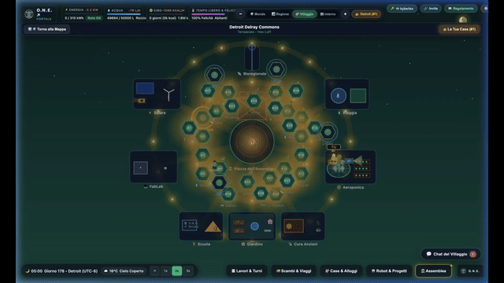

<p align="center">
  
</p>

# **OPEN NETWORKED EARTH (O.N.E.)**

> **The Open-Source Socio-Technical Operating System for a Post-Work, Post-Monetary Planetary Civilization.**

<p align="center">
  <a href="https://open-networked-earth.surge.sh">🌐 Live Edge Platform</a> •
  <a href="https://one-oasis.surge.sh">🎮 Play O-ASIS MMO (one-oasis.surge.sh)</a> •
  <a href="https://notebook.google.com/notebook/c123b58e-7e33-4565-8c1c-c5da2de98471">🧠 Interactive AI Oracle</a> •
  <a href="https://github.com/kyberlex/ONE/discussions">💬 Dialectic Forum & RFCs</a> •
  <a href="sim/README.md">📖 Simulation Architecture</a> •
  <a href="simone/simone-specs.md">🔬 Scientific Co-Simulator</a> •
  <a href="habitat/README.md">🏡 Habitat Architecture</a> •
  <a href="roadmap/roadmap.md">🗺️ Transition Roadmap</a> •
  <a href="foundation/README.md">🏛️ Foundation & Legal Statutes</a> •
  <a href="COMPARATIVE_ANALYSIS.md">⚖️ Comparative Analysis</a> •
  <a href="oasis/README.md">🛡️ Immunity Matrix</a> •
  <a href="CODE_OF_CONDUCT.md">📜 Code of Conduct</a> •
  <a href="CONTRIBUTING.md">🛠️ Contributing</a>
</p>

---

## **What is O.N.E.?**

Artificial Intelligence and humanoid robotics are eliminating wage labor forever. Instead of descending into corporate techno-feudalism and surveillance poverty, **Open Networked Earth (O.N.E.)** turns automation into human emancipation: guaranteed survival baselines, decentralized energy and food commons, and governance by ordinary citizens chosen by statistical lottery.

### **The Three Core Pillars**

1. **Universal Usufruct (No Money, No Landlords):**  
   Clean water, nutrient-dense food, ecological housing, life-saving medicine, and electrical power are unconditional birthrights, governed by physical input-output thermodynamic accounting rather than speculative financial debt.
2. **Civic Sortition (No Career Politicians):**  
   All legislative and judicial bodies rotate strictly by statistical lottery (sortition) in strict odd parity, eliminating political parties, campaign finance, and corporate lobbying.
3. **Thermodynamic Invariants (Biocentric Equilibrium):**  
   Economic production is governed by Leontief input-output matrices and Ostrom thermodynamic carrying capacities, ensuring zero planned obsolescence and closed-loop material cycles.

> 🧠 **Interactive AI Oracle (Google NotebookLM):**  
> Pose your hardest systemic questions, test edge-case objections, or query the full canonical constitution and simulation proofs via the official [O.N.E. NotebookLM Public Knowledge Base](https://notebook.google.com/notebook/c123b58e-7e33-4565-8c1c-c5da2de98471).  
> *(Note: A Google account is required by NotebookLM to interact with the oracle).*

---

## **Repository Architecture**

This public repository contains the complete canonical constitutional charter, computational simulation engines, habitat engineering specifications, transition blueprints, and epistemic adversarial verification suite:

```
.
├── ONE NETWORKED EARTH (O.N.E.).md   # Canonical Master Constitution (46 Statutory Articles)
├── COMPARATIVE_ANALYSIS.md           # Comparative Benchmark: O.N.E. vs. 9 Alternative Models
├── sim/                              # LIVING WEB SANDBOX & GAME ENGINE
│   ├── README.md                     # Transition architecture & human vector modeling
│   ├── GAME_DESIGN.md                # Master Game Design Document (Hex grid, Leontief, Demarchy)
│   └── app/                          # Interactive 60 FPS HTML5/WebGL living simulation
├── simone/                           # SCIENTIFIC DISCRETE-EVENT CO-SIMULATOR
│   └── simone-specs.md               # Biophysical GIS & psychometric co-simulation specs
├── habitat/                          # PHYSICAL COMMONS & REGENERATIVE HABITAT
│   ├── README.md                     # Index & physical commons specifications
│   ├── MHU_MODULAR_HABITAT_UNIT.md   # Modular Habitat Unit (MHU) v1.0 (Passivhaus timber core)
│   └── URBAN_SCALING_TRANSITION.md   # Urban scaling & bioregional retrofitting blueprint
├── roadmap/                          # THE ROADMAP & TRANSITION PROTOCOL
│   ├── roadmap.md                    # Master strategic bootstrap & dissemination playbook
│   └── blueprints/                   # Real-world field manuals & operational startup guides
│       ├── SEED_NODE_QUICKSTART_HANDBOOK.md
│       ├── STAGE_0_LEGAL_INCEPTION_BLUEPRINT.md
│       ├── STAGE_1_SURVIVAL_CORE_BLUEPRINT.md
│       ├── STAGE_2_FABLAB_METABOLIC_BLUEPRINT.md
│       └── STAGE_3_WATERSHED_FEDERATION_BLUEPRINT.md
├── foundation/                       # INSTITUTIONAL LEGAL SHIELD & STATUTES
│   ├── README.md                     # Institutional & legal framework index
│   ├── statutes_foundation_one.md    # Foundation ONE Statutes & Swiss-German Notarial Deed
│   └── legal_framework.md            # Master legal & operational blueprint
├── oasis/                            # O-ASIS EPISTEMIC ADVERSARIAL STRESS-TEST ENGINE
│   ├── README.md                     # Stress-testing & constitutional fuzzing overview
│   ├── constitutional_attack_challenges.md # Proof-of-Immunity matrix across 7 attack vectors
│   ├── sim_resolutions_qa.md         # Living case-law register ([STATUS: SIMULATION_HYPOTHESIS])
│   └── github_discussions_rfcs.md    # Deliberation RFC templates for community ratification
├── spread/                           # MEDIA & VISUAL ASSETS
│   ├── screenshots/                  # High-resolution simulation screenshots
│   └── videos/                       # Animated gameplay showcases & previews
├── assets/                           # ARCHITECTURAL & CONSTITUTIONAL VECTOR DIAGRAMS
│   └── diagrams/                     # Standalone SVG schematics and visual specs
├── docs/                             # WEB APPLICATION MIRROR (GITHUB PAGES)
├── scripts/                          # PUBLIC AUTOMATION & RELAY SCRIPTS
│   ├── anchor_world_snapshot.py      # On-chain / immutable snapshot anchor
│   ├── feedback_relay_apps_script.js # Public feedback relay bridge
│   └── snapshot_relay_apps_script.js # World snapshot distribution daemon
├── CONTRIBUTING.md                   # Community contribution & RFC submission guidelines
├── CODE_OF_CONDUCT.md                # Inviolable non-commercial & respectful collaboration terms
├── PLAY.md                           # Quickstart relay for players and newcomers
└── one-logo.svg                      # Official planetary vector insignia
```

---

### **The Physical Dual-Track: Field Blueprints (`roadmap/blueprints/`) vs. Habitat Architecture (`habitat/`)**

A fundamental operational distinction in Open Networked Earth is between **transitional bootstrap strategy** and **physical architectural construction**:

| Dimension | [`roadmap/blueprints/`](roadmap/blueprints/) (Bootstrap Field Manuals) | [`habitat/`](habitat/) (Physical Architecture & Urbanism) |
| :--- | :--- | :--- |
| **Domain** | **Operational Transition & Timeline (The *When* & *How to Bootstrap*)** | **Building Construction & Spatial Engineering (The *What* & *How to Build*)** |
| **Core Question** | *“How does a pioneer community settle, shield itself legally, and achieve autonomy over time?”* | *“How are modular dwellings and bioregional metropolises physically designed and fabricated?”* |
| **Organization** | **Chronological by Evolutionary Stages (Stage 0 ➔ Stage 3):**<br>• *Stage 0*: Months 0–12 (Two-tier legal shield, land trust inception, zoning bypass)<br>• *Stage 1*: Years 1–3 (180-day caloric buffer, 40,000L cistern, 48V LFP battery bank)<br>• *Stage 2*: Years 3–7 (Air-gapped fab-lab, thermophilic composting, reed bed phytodepuration)<br>• *Stage 3*: Years 7–15 (Reticulum LoRa mesh network, non-monetary exergy swaps) | **Spatial & Dimensional Scaling (Micro ➔ Macro):**<br>• *Micro-Habitat*: Modular Habitat Unit (MHU) v1.0 (Dry-joint CNC timber cassette chassis, Passivhaus, unified ground docking)<br>• *Macro-Habitat*: Urban Scaling & Transition (Pedestrian Superblocks, Energiesprong prefab thermal skins, Habraken infill, river daylighting) |
| **Content Focus** | Jurisprudential shielding (Community Land Trusts, adverse possession, non-waivable labor quotas, 30-to-60-day black-sky autonomy). | Executive engineering specifications (Passivhaus envelope $U < 0.12\text{ W/m}^2\text{K}$, WikiHouse CNC joinery, DC microgrids 380V/48V, metropolitan sortition demarchy). |
| **Toolchains** | Trust indentures, risk matrices, waterproof pocket checklists. | Open-BIM ([BlenderBIM](https://blenderbim.org)), CAD ([FreeCAD](https://www.freecad.org)), [WikiHouse](https://www.wikihouse.cc), [OpenStructures](https://openstructures.net), [OpenPLC](https://openplcproject.com). |

---

## **I. The Canonical Text**

The complete statutory charter, comprising 10 statutory chapters and 46 Articles, is maintained directly in this repository:

👉 **[Read the Living Constitution: `ONE NETWORKED EARTH (O.N.E.).md`](ONE%20NETWORKED%20EARTH%20%28O.N.E.%29.md)**

---

## **II. Computational Proving Grounds: The Two Simulators**

A constitution that requires perfect human beings is a childish utopia. O.N.E. operates two complementary, open-source computational engines to stress-test institutional resilience against human flaws (greed, tribalism, cognitive noise) and systemic shocks:

1. **The Living Web Sandbox (`sim/`):**  
   A client-side, interactive 60 FPS HTML5/WebGL persistent world deployed globally at **[https://one-oasis.surge.sh](https://one-oasis.surge.sh)** with an axial hex-grid cartographer, Leontief thermodynamic flow tracking (kWh, Liters, Calories, Compute), Athenian sortition assemblies, and cooperative PvE defense against the Legacy Engine.  
   👉 **Play Online:** [https://one-oasis.surge.sh](https://one-oasis.surge.sh) | **Architecture:** [`sim/README.md`](sim/README.md) | **Game Design:** [`sim/GAME_DESIGN.md`](sim/GAME_DESIGN.md)

2. **SIMONE — Scientific Co-Simulator (`simone/`):**  
   A heavy discrete-event and agent-based co-simulation architecture modeling real Earth observation GIS data (ERA5-Land, HydroSHEDS, SoilGrids), Darcy/Carnot biophysics, Weibull hardware wear, daily convex thermodynamic optimization (CVXPY), and empirical HEXACO psychometrics.  
   👉 **Specifications:** [`simone/simone-specs.md`](simone/simone-specs.md)

---

## **III. Quickstart: Experience the Simulation**

### **1. Play Online (Instant In-Browser)**
Launch the live thermodynamic resilience MMO without any installation:  

<p align="center">
  <a href="https://one-oasis.surge.sh" target="_blank" rel="noopener noreferrer">
    
  </a>
</p>

👉 **[Open O-ASIS Living Sandbox (one-oasis.surge.sh)](https://one-oasis.surge.sh)**

### **2. Run Locally in Development Mode**
You can also run the Living Web Sandbox locally in your browser:

```bash
# Clone the repository
git clone https://github.com/kyberlex/ONE.git
cd ONE/sim/app

# Install dependencies
npm install

# Start the local development server
npm run dev
```

Visit `http://localhost:5173` to explore the living thermodynamic sandbox.

---

## **IV. The Institutional Legal Shield: Foundation ONE (`foundation/`)**

To interface with the legacy financial and statutory system without corrupting the post-monetary commons, O.N.E. operates a **Two-Tier Defensive Legal Shield** grounded in Swiss civil law (ZGB Art. 80–89bis):
* **Entity A: Foundation ONE (*Stiftung*):** The "ownerless sovereign vault" holding inalienable land titles and canonical IP, bound by a perpetual asset lock (*Vermögensbindung*), odd-number board parity (3 to 7 trustees), pro bono governance (*Ehrenamtlichkeit*), and an exclusive monopoly on legacy commercial derivative licensing (e.g. streaming options, industrial dual-licensing).
* **Entity B: The Operational Sister Body (Swiss *Verein* / Local Co-ops):** The democratic membership entity managing day-to-day community chores, education, and mutual aid under revocable usufruct charters.
* **Temporary Legal Exoskeleton:** The Foundation is explicitly temporary; under ZGB Art. 88, it dissolves upon planetary unification, devolving all assets directly to the Global Usufruct Commons Confederation.

👉 **Official Statutes & Notarial Deed:** [`foundation/statutes_foundation_one.md`](foundation/statutes_foundation_one.md) | **Legal Blueprint:** [`foundation/legal_framework.md`](foundation/legal_framework.md) | **Overview:** [`foundation/README.md`](foundation/README.md)

---

## **V. Epistemic Adversarial Proving Ground (O-ASIS)**

We do not ask for blind belief. O.N.E. has been subjected to rigorous multi-agent adversarial stress-testing simulating institutional capture, cartels, resource hoarding, sensor tampering, and supply disruptions:

* **Proof-of-Immunity Matrix:** Review formal mathematical defenses against 7 classic adversarial attack vectors in [`oasis/constitutional_attack_challenges.md`](oasis/constitutional_attack_challenges.md).
* **Operational Case-Law:** Inspect tested systemic edge-cases and sortition resolutions in [`oasis/sim_resolutions_qa.md`](oasis/sim_resolutions_qa.md).
* **Community Deliberation RFCs:** Explore formal proposals ready for sortition deliberation in [`oasis/github_discussions_rfcs.md`](oasis/github_discussions_rfcs.md).

---

## **VI. Verification & Dialectic Tools**

* **Live AI Challenge Arena:** Test your hardest objections against the 46 Canonical Articles in real-time at [open-networked-earth.surge.sh/#challenge](https://open-networked-earth.surge.sh/#challenge).
* **Google NotebookLM Deep-Dive:** Query the multimodal knowledge base and listen to the conversational audio podcast at [NotebookLM O.N.E. Suite](https://notebooklm.google.com/notebook/8a979273-c4b6-4288-b55b-4cb75fad95a0).
* **The Thriller Series:** Read the 15-language literary saga dramatizing the real-world friction of the transition at [open-networked-earth.surge.sh/#books](https://open-networked-earth.surge.sh/#books).

---

## **VII. Community Forum & Open Research Frontiers**

O.N.E. is an evolving civilizational architecture. If you discover unmodeled frictions, supply-chain edge cases, or wish to propose mathematical or constitutional refinements:

* Join the **[GitHub Discussions Forum](https://github.com/kyberlex/ONE/discussions)**.
* Review formal submission guidelines in **[`CONTRIBUTING.md`](CONTRIBUTING.md)**.
* All interactions are strictly governed by our **[`CODE_OF_CONDUCT.md`](CODE_OF_CONDUCT.md)** (Zero commercial solicitation, zero cryptocurrency schemes, and respectful Socratic inquiry).

---

<p align="center">
  <sub>Compiled by <strong>Kyberlex</strong> (<code>kyberlex@proton.me</code>). Dedicated unconditionally to the Planetary Commons under AGPL-3.0-or-later.</sub>
</p>
