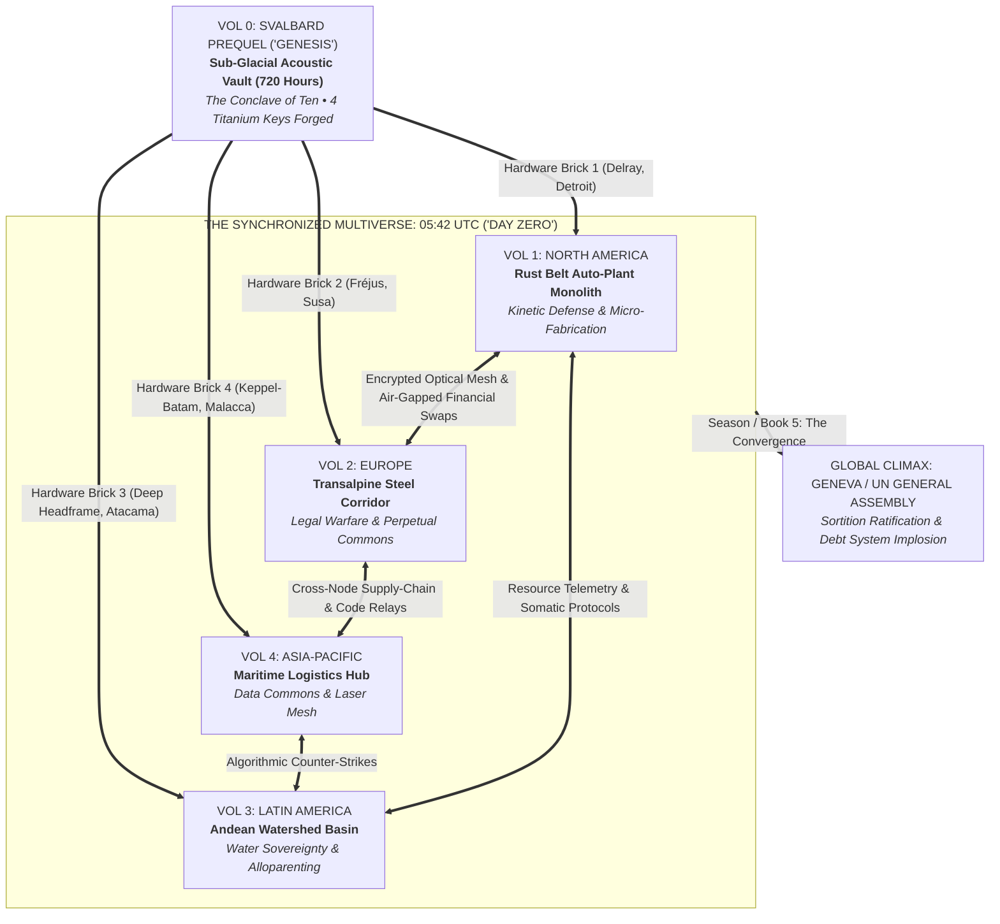
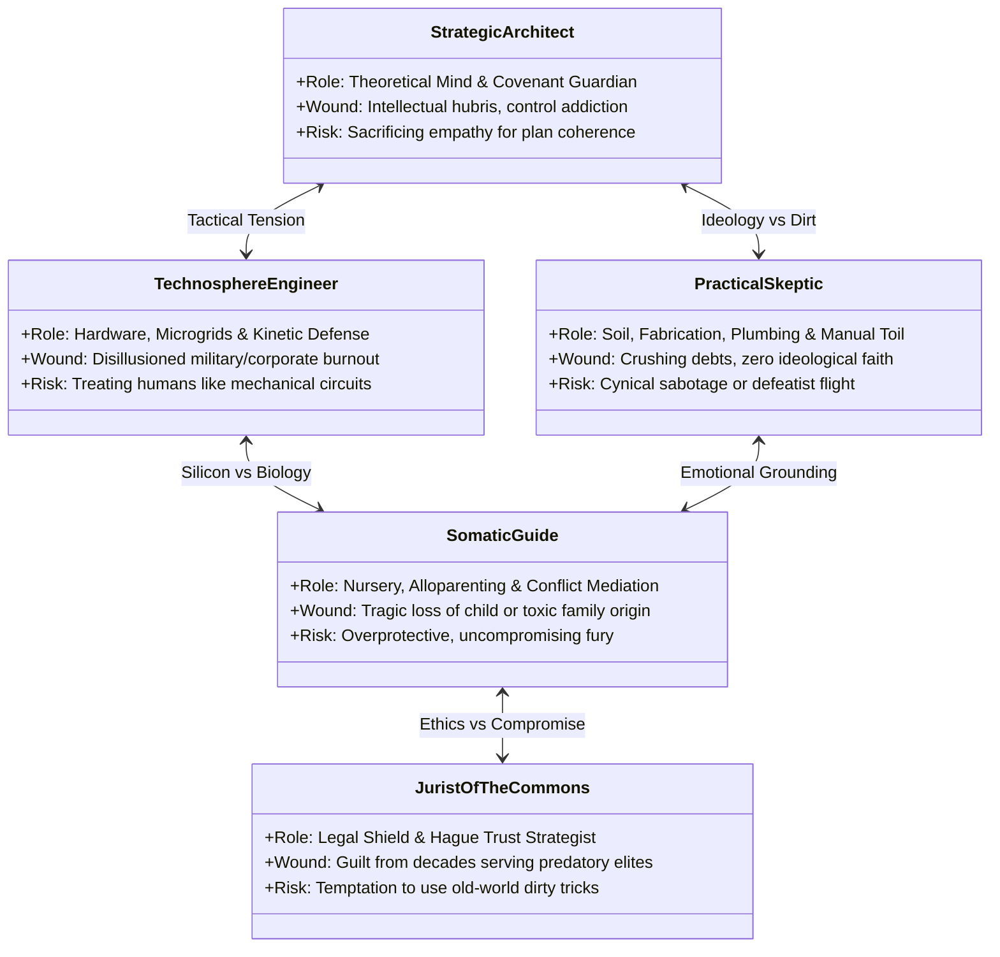
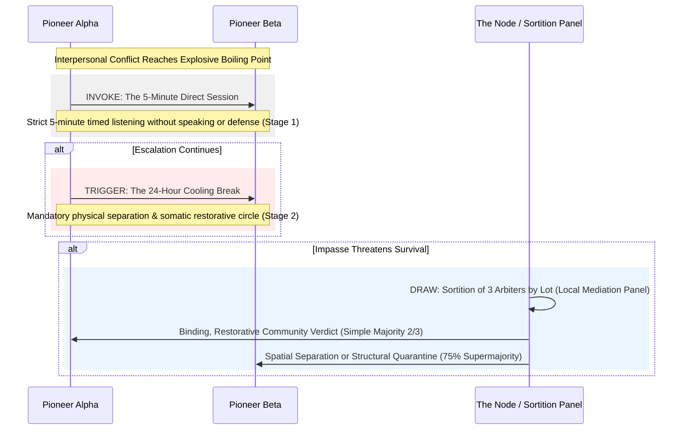

# **O.N.E. (OPEN NETWORKED EARTH) — MASTER NARRATIVE BIBLE & GLOBAL FRANCHISE DOSSIER**

## **Comprehensive Strategic Manual for Bestselling Novel Series, Multi-Platform Screenwriting, and Global Universe Architecture**

---

### **EXECUTIVE PROLOGUE: THE "DAY ZERO" DOCTRINE**

The objective of this project is to translate a revolutionary systemic, thermodynamic, and post-capitalist socio-economic model—as codified in the canonical constitution [`bible/ONE NETWORKED EARTH (O.N.E.).md`](../bible/ONE%20NETWORKED%20EARTH%20(O.N.E.).md)—into a high-voltage, globally synchronized publishing phenomenon and multi-season screen franchise.

Rather than authoring dry academic essays, didactic sci-fi manifestos, or naïve utopian parables, this project deploys a **commercial "Trojan Horse"**: a relentless ensemble thriller (*Mr. Robot* meets *The Ministry for the Future* meets *Michael Crichton*) where cutting-edge cybernetics, universal usufruct, sortition-based governance, and non-lethal automated defense are forged in the fires of real-world siege, legal combat, and human vulnerability.

---



---

## **PART I: THE CONCEPTUAL FOUNDATION & "TROJAN HORSE" ARCHITECTURE**

### **1. General Overview & Conceptual Branding**

* **Official Identity:** **O.N.E. (Open Networked Earth)** / *Terra Connessa e Aperta*.
* **Symbolic Resonance:** The name evokes biological and thermodynamic wholeness—a borderless, networked planet ("One World for Everyone") free from geopolitical partition. It deliberately dismantles the derogatory label of "utopia" by framing itself as a hardened, thermodynamically grounded engineering protocol.
* **Operating Ethos:** The direct integration of universal shared usufruct of planetary resources, non-sovereign automation of primary goods, transparent carrying-capacity telemetry, and sortition-based governance.
* **The Commercial Fiction Imperative:** The masses do not adopt new paradigms through academic white papers; they adopt them through characters they love, crises that take their breath away, and stories that keep them awake until 4:00 AM.

---

### **2. The Three-Level Narrative Architecture (The "Trojan Horse")**

To achieve runaway mass-market appeal across thriller readers, drama lovers, and speculative fiction audiences alike, every chapter operates on three synchronized, concentric levels:

```
┌────────────────────────────────────────────────────────────────────────┐
│ LEVEL 1: VISCERAL SUSPENSE (The Reader's Hook)                         │
│ • Race against time, court injunctions, frozen accounts, physical siege │
│ • High stakes, ticking countdowns, in media res chapter openings       │
├────────────────────────────────────────────────────────────────────────┤
│ LEVEL 2: HUMAN & PSYCHOLOGICAL DRAMA (Empathy & Identification)        │
│ • Flawed pioneers carrying old-world conditioning, debt, and trauma    │
│ • Ego clashes, jealousy, panic attacks, vulnerability, and redemption  │
├────────────────────────────────────────────────────────────────────────┤
│ LEVEL 3: THE SYSTEMIC REVELATION (The Core Thesis)                     │
│ • Usufruct, sortition, alloparenting, and non-lethal defense in action │
│ • ZERO PREACHING: Systemic superiorities proven only via stress-test   │
└────────────────────────────────────────────────────────────────────────┘
```

* **Level 1: Visceral Tension (The Page-Turner Hook)**
  * *Mechanism:* Relentless ticking clocks, weaponized banking maneuvers, asset forfeitures, tactical police raids, perimeter breaches, and sabotage.
  * *Golden Rule:* Every single chapter opens *in media res* and ends on an unresolved crisis, discovery, or tactical turning point (*page-turner* momentum).
* **Level 2: Human and Psychological Drama (The Character Core)**
  * *Mechanism:* The founders are not saintly ideologues. They are wounded, neurosis-ridden survivors of predatory late-stage capitalism carrying personal debt, custody battles, substance dependencies, territorial impulses, and impostor syndrome.
  * *Golden Rule:* Dramatic conflict springs organically from the gap between O.N.E.'s pristine cybernetic vision and the chaotic, territorial reflexes of the human beings trying to live it.
* **Level 3: The Systemic Revelation (The Structural Proof)**
  * *Mechanism:* A living demonstration that universal usufruct, sortition-based citizen assemblies, community alloparenting, open-source microgrids, and restorative justice operate with superior thermodynamic and human efficiency compared to extractive capitalism.
  * *Golden Rule:* **Strictly zero ideological speeches or monologues.** The reader must never feel educated; they must witness the system work under the pressure of survival.

---

### **3. The Cardinal Rule: "Show, Don't Tell" Operational Matrix**

Theoretical lectures, moralizing speeches, and didactic dialogues are strictly prohibited. The narrative mechanics translate abstract system principles into visceral physical action:

| Systemic O.N.E. Principle | What NOT to Do (The Preachy Mistake) | What to Do (The Bestselling Dramatic Action) |
| :--- | :--- | :--- |
| **Universal Usufruct of Productive Capital** | A character delivers a passionate monologue on the immorality of private ownership of production tools. | Two lead technicians nearly come to blows over the sole 5-axis CNC mill needed for both solar bracket fabrication and an emergency dialysis pump repair. The dispute is settled on the workshop floor under the timer of the Founders' Covenant while the entire node watches. |
| **Non-Lethal Defense & Kinetic Interposition** | An authorial passage explains the cybernetics of automated drone shields and passive restraint mechanics. | A militarized corporate SWAT squad attempts to breach Gate 4 with hydraulic rams; the workers trigger heavy pneumatic drop-curtains, welded steel anti-vehicle jacks, and high-intensity industrial strobe blinders, neutralizing the breach mechanically and sensory-wise without firing a single lethal shot or drawing a drop of blood. |
| **Alloparenting & Neurobiological Pedagogy** | A caregiver quotes developmental neuroscience treatises to a stressed mother. | A seven-year-old child experiences an autistic sensory meltdown while their mother is pinned down doing critical underwater welds on a flooded heat exchanger. An elderly machinist and a teenage sortition apprentice calmly intervene using somatic pacing and tactile grounding, proving the organic resilience of the shared nursery. |
| **Perpetual Trust & Legal De-Privatization** | A lawyer explains the complex legal theory of land trusts and anti-capitalist property law. | A county bailiff and bank liquidation team arrive with an eviction warrant. The Jurist presents an impenetrable, interlocking web of Hague-compliant cross-border asset-locked trusts, sovereign indigenous easements, and historical environmental liens that freezes the bailiff's digital signatures in mid-air. |
| **Closed-Loop Nutritional & Water Sovereignty** | Characters discuss the theoretical benefits of circular agroecology and water tables. | An agrochemical cartel shuts off the regional canal gates to starve the node. Within 48 hours, the pioneers hotwire a subterranean geothermal closed-loop aeroponics bay, extracting humidity from deep-mine ventilation shafts to keep 300 families hydrated and nourished. |
| **The Immaterial Data Commons** | A hacker delivers an exposition dump on decentralized ledgers and post-quantum encryption. | State authorities cut the node's commercial fiber line. A point-to-point Free Space Optics (FSO) laser transceiver on the roof fires an encrypted line-of-sight beam across the 0.6-mile Detroit River to a sister tower in Sandwich, Ontario, routing telemetry through Canadian community lines while domestic monitoring displays go blind. |

---

## **PART II: GLOBAL FRANCHISE STRATEGY & THE "DAY ZERO" MULTIVERSE**

### **4. The Multiplatform Strategy: Why "Reskinning" Fails**

A simultaneous, multi-territory publishing and streaming launch fails catastrophically if Books/Seasons 1 through 4 deliver identical storylines with cosmetic character swaps (e.g., swapping Detroit for Milan or John for Giovanni). 

Modern global audiences reward **Synchronized Narrative Universes**.

The four founding volumes ignite at the exact same coordinated second: **05:42 UTC ("Day Zero")**. Each volume represents a distinct, autonomous frontline confronting a unique pillar of the old world's power structure. A reader who reads only their local volume enjoys a self-contained, pulse-pounding thriller; a reader who reads across the volumes discovers an intricate global chess match where actions on one continent trigger unexpected lifelines on another.

---

### **5. The Founding Architecture: Prequel & Parallel Frontlines Matrix**

The franchise is anchored by the **Svalbard 720-Hour Prequel (Volume 0)**, which forges the constitution and dispatches the four titanium hardware keys eighteen months prior to ignition, followed by the four founding nodes igniting over a synchronized **168-Hour (7-Day) Master Clock**:

```
[VOL 0: SVALBARD CONCLAVE] ──(18 Months Prior / 720 Hours)──► [FOUR HARDWARE KEYS DISPATCHED]
                                                                      │
05:42 UTC (Day 0) ────────────────────────────────────────────────────┴───► 168:00 (Day 7)
[Global Mesh Activation: Detroit, Susa, Atacama, Malacca]                   [The Geneva Climax]
```

| Volume / Territory | Node Setting | Local Systemic Adversary | Core O.N.E. Pillar In Action |
| :--- | :--- | :--- | :--- |
| **Vol. 0: Svalbard Prequel** *(Language: EN)* | **Sub-Glacial Acoustic Vault (Station 74-Nord)** *(Spitsbergen Arctic Granite)* | Old-world ideological conditioning, corporate hit teams, automated vault purge lock. | **The Genesis:** Restorative Covenant Protocols, Pure Statistical Sortition, Bodily Sovereignty as Class 0 Invariant, O-ASIS Multi-Agent Adversarial Closure. |
| **Vol. 1: North America** *(Language: EN)* | **Rust Belt Auto-Plant Monolith** *(Michigan/Ontario Border)* | Wall Street private equity funds, weaponized county sheriffs, private military contractors (PMCs). | **Automated Defense & Micro-Fabrication:** Kinetic non-lethal interposition shields, rapid distributed supply-chain bypass, off-grid microgrids. |
| **Vol. 2: Europe** *(Languages: IT / DE / FR)* | **Transalpine Steel Corridor** *(Swiss-Italian Border)* | Predatory bankruptcy courts, European central banking syndicates, court receivers, asset seizure squads. | **Legal Warfare & The Perpetual Trust:** Hacking civil law codes, asset-locked foundations, non-violent systemic de-privatization of capital assets. |
| **Vol. 3: Latin America** *(Languages: ES / PT)* | **Andean Watershed Basin** *(Chile/Peru/Bolivia Corridor)* | Transnational lithium mining cartels, agrochemical monopolies, privatized water concessions. | **Water & Nutritional Sovereignty:** Closed-loop aeroponics, watershed reclamation, community alloparenting, and collective trauma healing. |
| **Vol. 4: Asia-Pacific** *(Languages: EN / ZH / JA)* | **Decommissioned Maritime Hub** *(Shenzhen / Singapore Straits)* | Algorithmic predictive policing platforms, social credit freezes, mass biometric surveillance grids. | **The Immaterial Data Commons:** Post-quantum optical laser mesh, distributed ledgers, non-speculative usufruct energy accounting. |

#### **The Interconnected Cross-Node Engine:**
* **Zero Narrative Redundancy:** Readers never read the same logistical problem twice. The European volume is a cerebral, high-tension legal thriller; the American volume is a gritty industrial defense thriller; the Latin American volume is an eco-political survival epic; the Asian volume is a hyper-kinetic techno-cyber thriller.
* **The Friction Invariant (Anti-Teleology & Pedagogical Realism):**
  To fulfill the franchise's educational and popularizing mission, the O.N.E. network must **NEVER operate like an infallible, frictionless Swiss clock**. The global mesh and local nodes face relentless real-world friction: severe atmospheric interference, packets dropped during storms, hardware burnouts, panic-driven refusals by local assemblies to share emergency power, and communication blackouts caused by state jamming. The triumph of O.N.E. is never preordained by algorithm or utopian decree; it is clawed back second-by-second through fallible human courage, improvised repairs, and painful compromises. If O.N.E. appears effortless or magical, it fails as a believable alternative for humanity.
* **Cross-Node Tactical Bypasses:** 
  * In Hour 42, when the North American node faces a utility grid shutoff, the pioneers isolate onto local LFP battery banks and route secondary telemetry via terrestrial FSO laser bridges across the Detroit River.
  * In Hour 89, when the European node’s accounts are frozen by an emergency court injunction, an air-gapped bilateral usufruct swap executes across Latin American commodity registries, legally nullifying the creditor's foreclosure leverage.
* **The Climax: Book / Season 5 (The Convergence):**
  Sortition-selected delegates from all four surviving nodes converge upon Geneva and the United Nations General Assembly during an unprecedented global financial collapse, presenting the unified Charter of Open Networked Earth to an exhausted, debt-paralyzed humanity.

---

## **PART III: CHORAL DRAMATURGY & CHARACTER ARCHETYPES**

### **6. The Five Universal Character Archetypes**

Every node is driven by an ensemble of five complementary figures. Each character pairs world-class technical competence with a profound psychological wound (*ghost/wound*) rooted in the trauma of the extractive economy:



#### **1. The Strategic Architect (The Theoretical Mind)**
* **Technical Mastery:** Master of systemic design, cybernetic feedback loops, Covenant governance protocols, and thermodynamic accounting.
* **The Wound / Blind Spot:** Severe intellectual overcontrol and terror of emotional chaos. Because they understand systems so thoroughly, they treat unpredictable human emotional crises as bugs rather than organic realities, risking callousness for the sake of the plan's elegance.

#### **2. The Engineer of the Technosphere (The Manufacturer)**
* **Technical Mastery:** Open-source automation, distributed energy storage, robotics, firmware hacking, and kinetic defensive shields.
* **The Wound / Blind Spot:** Hardened, rigid cynicism forged in defense contracting or brutal tech monopolies. Emotionally shut down, they default to solving interpersonal relationship fractures with brute-force technical fixes.

#### **3. The Jurist / Strategist of the Commons (The Legal Shield)**
* **Technical Mastery:** International trust law, asset locking, civil litigation warfare, jurisdictional cross-border arbitration, and regulatory hacking.
* **The Wound / Blind Spot:** Deep, haunting guilt from a 25-year career protecting corrupt hedge funds and predatory developers. Constantly battling the urge to deploy illicit, unethical old-world maneuvers to win the node's battles.

#### **4. The Pedagogical & Somatic Guide (The Mediator)**
* **Technical Mastery:** Alloparenting architecture, developmental trauma neuroscience, non-violent communication, and somatic de-escalation.
* **The Wound / Blind Spot:** Devastating personal trauma (e.g., loss of a child to institutional negligence or a background in an abusive fundamentalist family). Fiercely protective, they react with immediate, explosive fury whenever technicians treat people or children as secondary to technical expediency.

#### **5. The Practical Skeptic (The Artisan / Farmer — The Reader's Proxy)**
* **Technical Mastery:** Heavy mechanics, plumbing, soil biology, concrete, manual tool repair, and real-world supply grit.
* **The Wound / Blind Spot:** Drowning in underwater mortgages, predatory medical debt, and empty promises. They don't care about grand philosophical manifests; they are here because they have nowhere else to go. **This character is the crucial reader proxy:** whenever an ideal sounds too lofty, the Skeptic delivers the devastating, profane one-liner that grounds the narrative.

---

### **7. Personified Antagonists: Humanizing the Systemic Enemy**

A thriller is only as compelling as its adversary. Bestsellers do not pit characters against faceless corporate logos; they pit them against **formidable, multidimensional, flesh-and-blood human beings** who believe with absolute sincerity that they are doing the right thing:

* **The Rational Antagonist Mandate (Anti-Manicheism):**
  Antagonists—from Wall Street private equity directors like Nathan Sterling to tactical commanders like Donald Briggs—must **NEVER be written as cartoonish, mustache-twirling sociopaths who delight in cruelty**. They possess coherent, articulate, and formidable worldviews:
  * *Nathan Sterling (The Guardian of Order):* Sterling genuinely believes that free-market capital allocation, enforceable debt contracts, and private resource discipline are the only barriers holding back global chaos, hyperinflation, and famine. To his mind, the commons pioneers are irresponsible economic arsonists whose defiance threatens the pension portfolios of millions of working-class families and the stability of the international banking system.
  * *Donald Briggs (The Tactical Realist):* Briggs enforces perimeter orders not out of sadism, but out of a rigid duty to maintain public peace and prevent uncontrolled riots in an already collapsing urban sector.
  * *Dramatic Principle:* When the adversary is brilliant, principled, and personally justified, defeating them through the thermodynamics and ethics of O.N.E. delivers a profound, undeniable revelation rather than an ideological sermon.
* **The Antagonist Tactical Escalation & Absolute Weapon Diversity Protocol (Zero Redundancy Mandate):**
  Each volume must possess a completely unique, biome-specific antagonist tactical signature. It is strictly forbidden to repeat the same weapon system or attack set-piece across volumes:
  * **Volume 1 (North America - Detroit / Rust Belt):** Post-industrial siege attrition (rail yard cordons, high-lumen stadium floodlights, DTE utility shutoffs; **LRAD acoustic sound cannons appear ONLY ONCE in Chapter 12 'The Acoustic Siege'**; climax resolves via logistics/fuel exhaustion and dropping gantry counterweight stamping dies).
  * **Volume 2 (Transalpine - Alps / Val di Susa):** Alpine hydroelectric corridor (high-angle climbing commandos with cutting torches, overhead catenary rail cuts, de-icing water cannons, avalanche mitigation artillery; defenders use the **Glacial Penstock Defense** [emergency flume bypass spray coating sheer granite in instant black ice], manual gravity track points, Pelton wheel balancing; **ZERO acoustic sound cannons or LRADs**).
  * **Volume 3 (South America - Andes / Amazon):** Andean & Amazonian hydrological basin (siltation barges, river longboat fuel blockades, defoliant agricultural drones, sluice tampering; defenders use **geothermal steam venting**, bio-swales, river log booms, and indigenous salt-crust terrain dynamics; **ZERO acoustic cannons or sonic blasters**).
  * **Volume 4 (Asia-Pacific - Strait of Malacca):** Maritime archipelago and container ports (interceptor skiffs, submarine cable grapnel dragging, customs algorithmic quarantines; defenders use **2,500 GPM high-pressure seawater fire monitors**, turbine steam/fog targeting blinders, and container crane gantry blocks; **ZERO acoustic dishes or sonic scramblers**).
  * **Volume 5 (Global - Geneva / Convergence):** Sovereign diplomatic hub and central banking centers (clearinghouse SWIFT freezes, flight groundings, tram power cuts, municipal riot shield lines; defenders use **constitutional public key broadcast** and 100,000 peaceful citizens in the snow; **ZERO acoustic rams or sound cannons**).
* **The Principled State Prosecutor:** Not a corrupt bureaucrat, but an unyielding, incorruptible civil servant who genuinely believes the micro-commons is an unaccountable, dangerous cult threatening the rule of law and public safety.
* **The Relentless Debt Liquidator:** A middle-tier bank receiver racing against their own career termination, carrying the financial weight of an ailing family member, forced to execute asset seizures by any legal means necessary.
* **The Local County Sheriff:** Caught between longstanding personal ties to the community's blue-collar workers and sworn oaths to enforce eviction writs handed down by distant federal judges.
* **The Disinformation Architect:** A brilliant, charismatic media strategist who views the struggle not in terms of good vs. evil, but as an information war to prevent social panic and macroeconomic contagion.

---

## **PART IV: SUSPENSE ENGINES & COVENANT PROTOCOLS**

### **8. The "Satoshi Nakamoto" Effect Squared**

The ultimate mind (or collective mind) behind O.N.E. never physically appears on the page, nor is their voice ever heard. They remain an electrifying, catalytic presence driving narrative suspense:

* **Orchestrated Serendipity:** The core pioneers did not meet through a public advertisement. Their encounters were engineered through an unassailable series of algorithmic coincidences (a canceled international flight, an erroneous foreclosure notice, a sudden server meltdown) that funneled them together.
* **Fair-Play Red Herrings:** The narrative consistently leaves trail markers that suggest one of the five pioneers is the secret mastermind:
  * The Architect possesses an encrypted private key dating back fifteen years.
  * The Jurist uses legal phrasing identical to the anonymous O.N.E. white paper.
  * The Engineer has proprietary circuit diagrams found nowhere else on earth.
* **The Alibi Shatter:** Just as the reader (and the group) feels certain they have unmasked the architect, an airtight event shatters the theory. *Example:* While the prime suspect is stripped, handcuffed, and locked inside a concrete isolation cell with zero electronic contact, an untraceable cryptographic counter-strike executes simultaneously across three continents.

---

### **9. The Founders' Covenant as a Narrative Detonator**

The Founders' Covenant is not a decorative constitutional document; it is a structural detonator of daily interpersonal suspense through three mandatory crisis protocols:



1. **The 5-Minute Direct Session (Stage 1 Restorative Ladder):** When two key personnel reach a screaming impasse that threatens operations, either party can invoke the session. For five uninterrupted minutes, one speaks while the other must maintain eye contact in total silence. The forced suppression of defensive replies creates electric, razor-sharp psychological tension.
2. **The 24-Hour Cooling Break (Stage 2 Restorative Ladder):** If the dispute remains unresolved, the Covenant mandates complete physical separation and communicative silence for twenty-four hours under the guidance of the Somatic Mediator, regardless of how critical the pending operational deadline is. Watching two technicians work side-by-side on an emergency generator in suffocating, disciplined silence while a storm approaches ratchets tension to maximum.
3. **The Sortition Panel of 3 Arbiters (Stage 3 Restorative Ladder — Local Mediation Panel):** When consensus fails entirely on an operational dispute or life-or-death decision, the Covenant convenes Stage 3 (Art. 8.3): selecting three arbiters completely by lot from the resident population—such as a teenage apprentice, a retired baker, and an electrician. In accordance with strict odd-number parity, operational disputes pass by simple majority (2 of 3), while structural quarantine or usufruct alterations require the invariant 75% qualified supermajority. Entrusting decisive authority to randomly drawn citizens shatters technocratic hubris and keeps the reader gripped until the final judgment is rendered.

---

## **PART V: SCENE ARCHITECTURE, PACING & PRODUCTION PIPELINE**

### **10. The Mandatory Prologue Doctrine: The Pre-Ignition Flashpoint**

Every volume of the O.N.E. series begins with a mandatory **Prologue** situated in the final hours before the synchronized global ignition (T-minus 06:00:00 to 00:00:00 before 05:42 UTC):
* **Function:** Ground the reader in the visceral, decaying texture of the old world. Establish the agonizing personal stakes, debts, and trauma of the pioneers before O.N.E. goes live.
* **The Dramatic Hook:** The Prologue depicts the localized breaking point—a violent eviction notice, an asset foreclosure, an industrial accident, or an algorithmic arrest warrant—forcing the pioneers to commit an irrevocable act of civil and economic defiance.
* **The Final Beat:** Every Prologue concludes on the exact second the clock strikes **05:42:00 UTC**, when the high-voltage transfer switches clack open, the microgrid isolates into autonomous LFP battery storage, and the cross-border optical laser bridge locks across the river, awakening the network across all four continents.

---

### **11. The Master State Transitions Ledger Protocol (Anti-Hallucination Machine)**

Because Large Language Models tend to hallucinate resources, cure physical injuries spontaneously, invent convenient legal solutions, or lose track of active time-locks over extended narrative arcs, all scene drafting is governed by [`vol1/ledger.md`](vol1/ledger.md).

#### **The Strict Deterministic Invariant:**
* **No Unconditioned Prompts:** The AI Writer Agent is strictly forbidden from generating any prose without being fed the explicit **State Input Vector ($S_t$)**.
* **Deterministic Termination:** The drafted prose must mathematically and physically conclude at the declared **State Output Vector ($S_{t+1}$)**.
* **The 6 Core Vector Dimensions:**
  1. *Thermo-Mechanical & Physical Resource Vector:* Battery reserves (kWh/MWh), fuel levels, grid isolation status, CNC spindle runtime, caloric supplies, water tables, tool wear.
  2. *Biometric & Neurovegetative Vector:* Character sleep deprivation, cortisol/adrenaline spikes, acute physical wounds (bandages, concussions, blood pressure), somatic dysregulation.
  3. *Institutional, Legal & Forensic Vector:* Active court writs, search warrants, police/PMC staging perimeters, frozen banking IBANs, media news cycles.
  4. *Founders' Covenant Vector:* Active 5-Minute Direct Sessions, 24-Hour Cooling Break countdown timers, sortition panel statuses (3-member Local Mediation Panels), open usufruct claims.
  5. *Cryptographic, Sensor & Mesh Vector:* Laser link uptime, RF spectrum jamming dB, LoRa packet loss, air-gap relays, Satoshi cryptographic trace signatures.
  6. *Absolute Class 0 Invariants (The 6 Inviolable Constitutional Invariants):*
     - Invariant 1: Strict Odd-Number Parity for all assemblies (Local: 3, Neighborhood: 15, Bioregional: 101, Continental: 301, Global: 1,001).
     - Invariant 2: Universal 75% Supermajority Rule for all structural decrees, quarantine, and treaties.
     - Invariant 3: Absolute Non-Lethal Defense (passive locks, mechanical barriers and interlocks, optical strobes, water mist/curtains; zero firearms drawn by protagonists).
     - Invariant 4: Zero Personal Surveillance Telemetry (tracking physical volts, liters, kilograms only; personal privacy inviolable).
     - Invariant 5: Abolition of the Technocratic Priesthood (48-Hour Civic Verification Rule in plain language).
     - Invariant 6: Inviolable Right of Voluntary Free Exit (no punitive detention or forced association).

#### **Empirical Phase-Gate Transitions (Roadmap Alignment):**
* **Gate 0 -> 1 (T+72:00):** Continuous 72-hour off-grid islanded microgrid life-support self-sufficiency (achieved at Vol 1 midpoint).
* **Gate 1 -> 2 (T+168:00):** Continuous 168-hour self-sufficiency and cryptographically verified bidirectional physical swap with a sister node (achieved at Vol 1 climax between Detroit and Sandwich/Windsor).

#### **Lifecycle of the Ledger:**
1. **Pre-Iteration Finalization:** The ledger for each part is drafted, audited, and locked *before* the first scene iteration commences.
2. **Post-Part Review & Re-Calibration:** Once a narrative part (e.g., Chapters 1–6) is completed, a dedicated auditor agent reconciles all character choices and updates the upcoming ledger states before greenlighting the next part.

---

### **12. The 1,300–1,500 Words/Prompt Production Constraint**

To preserve intense prose quality, razor-sharp dialogue subtext, and absolute fidelity to the State Transitions Ledger, drafting is strictly budgeted:
* **Batch Sizing:** Each prompt unit targets **1,300 to 1,500 English words**.
* **Pacing Density:** Generates enough runway for a complete, gripping dramatic beat (opening *in media res*, escalating through psychological/physical friction, and terminating on a cliffhanger) without overloading the LLM's working attention window.

---

### **13. Scene Construction Rules for Bestselling Pacing**

Every scene and chapter must adhere to four non-negotiable screenwriting mechanics:
* **Rule 1: In Media Res Openings:** Never begin a scene with characters waking up, contemplating the weather, or having breakfast. Open *inside* the breach: an alarm triggering, a hydraulic line bursting, a process server walking through the perimeter, a server rack overheating.
* **Rule 2: Dialogue Subtext & Asymmetry:** Characters must never say exactly what they mean. A technical argument about circuit voltages or potato yields must secretly conceal grief, financial terror, sexual tension, or fear of abandonment.
* **Rule 3: Closing Cliffhangers & Information Reversals:** Every chapter ends on an unfinished choice, an unexpected knock at the gate, an anomalous sensor reading, or a discovered betrayal that demands immediate reading of the next page.
* **Rule 4: The Dual Characterization & Zero-Duplicate Protocol:**
  * *Debutto Completo (First Debut):* When a character or setting enters the story for the very first time, anchor them in a rich, visceral, empathetic introduction (physical presence, somatic wounds, immediate stakes, vocal cadence).
  * *Rivelazione Progressiva (Subsequent Chapters):* In all subsequent chapters, every scene must unveil a **NEW, deeper layer** (an unexpected childhood memory, a hidden manual skill, a family fracture, an unspoken regret, fresh relational friction) rather than repeating prior exposition.
  * *Zero-Duplicate Imagery (Anti-Mannerism):* Strictly prohibit recycled epithets and repetitive stock tropes (e.g., "17-year-old Toby", "the taste of rust and chicory", "the teeth of the frost", "the heartbeat of the iron", "FCI Milan where no one hears you"). Generate fresh, immediate sensory details grounded in the present scene.

---

### **14. The Multi-Agent Commercial Bestseller Pipeline (King, Rowling, Tolkien Framework)**

To guarantee world-class literary engagement and prevent reader alienation from dense technical jargon, every unit moves through a 6-agent sequential convergence pipeline (Agent 0 through Agent 5) governed by the **Backstage Physics Doctrine**:

```
[Agent 0: Master Story Architect] ──► Owns Redline Bible, 4 Matryoshka Layers & Backstage Ledger
       │ (Dispatches Architecture & S_t)
       ▼
[Agent 5: Showrunner Coordinator] ──► Dispatches Unit Brief to Drafter
       │
       ▼
[Agent 1: Bestseller Drafter] ──────► 1,300–1,500 English words (King/Rowling/Tolkien Engine)
       │
       ▼
[Agent 2: State Auditor] ──────────► Verifies Continuity & Anti-Data-Dump Gate
       │ (Pass)
       ▼
[Agent 3: Literary Critic] ────────► Audits 6-Point Bestseller Matrix (Sensory, Empathy, Zero-Duplicate)
       │ (Pass)
       ▼
[Agent 5: Showrunner Coordinator] ──► Commits English (.md to books/vol1/chapters/) & Git Pushes (Origin Main)
       │
       ▼
[Agent 0: Master Story Architect] ──► Advances S_t+1 in Ledger & Calibrates Next Chapter Arc
```

* **Publication & Translation Loop (Volume Complete):**
  * **Master English Omnibus EPUB:** Agent 5 compiles all completed chapters into the master volume publication EPUB via `scripts/md_to_epub.py`.
  * **Italian Literary Translation (*Terra Connessa e Aperta*):** Agent 4 translates completed chapters into fluid, commercial Italian markdown files (`books/vol1/chapters_it/[unit_id]_it.md`). Zero per-chapter PDFs are generated.
  * **Master Italian Omnibus EPUB:** Agent 5 compiles the complete Italian volume into the master release EPUB.

0. **Agent 0 (The Master Story Architect & Continuity Director):** The strategic world-builder and cartographer. Exclusively authors and maintains [`vol1/redline.md`](vol1/redline.md) and [`vol1/ledger.md`](vol1/ledger.md). Enforces 100% geographic accuracy, designs the 4 Matryoshka subplots per chapter, tracks long-arc breadcrumb mysteries (Rowling), and anchors character ghosts (King).
1. **Agent 1 (The Narrative Drafter):** Crafts accessible, visual, deeply human prose. Translates backstage physical constraints into high-empathy character stakes, sensory immersion, and relentless page-turner tension.
2. **Agent 2 (The State Ledger Auditor):** Verifies 100% fidelity to physical, somatic, and invariant boundaries behind the scenes, while ruthlessly enforcing the **Anti-Data-Dump Gate** (prohibiting raw model numbers, statutory codes, or JSON metrics in prose).
3. **Agent 3 (The Adversarial Literary Critic):** Evaluates drafts against the 6-point Bestseller Matrix: Visual Accessibility, Anti-Technobabble, Anti-Didactic/Preachiness, Character Vulnerability & Empathy, Zero-Duplicate Imagery/Mannerism Gate, and the 3 AM Cliffhanger.
4. **Agent 4 (The Italian Literary Translator):** Produces a fluid, gripping Italian commercial thriller translation (*Terra Connessa e Aperta*) saved to `books/vol1/chapters_it/[unit_id]_it.md` for omnibus EPUB compilation; technical jargon is converted into natural, evocative Italian phrasing.
5. **Agent 5 (The Showrunner & Convergence Coordinator):** Orchestrates the operational production loop, enforces iteration ceilings, commits approved English manuscripts (`.md`) to `books/vol1/chapters/`, executes automated Git commits & pushes (`git push origin main`), coordinates batch translation with Agent 4, and compiles master English and Italian release EPUBs.

---

## **CONCLUSION: THE MANIFESTO AS A GLOBAL PHENOMENON**

By anchoring the canonical principles of [`bible/ONE NETWORKED EARTH (O.N.E.).md`](../bible/ONE%20NETWORKED%20EARTH%20(O.N.E.).md) inside the synchronized, adrenaline-fueled multi-front architecture of **The "Day Zero" Protocol** and governing it through the deterministic rigor of the **Master State Transitions Ledger**, this franchise achieves what theoretical texts never can: **it allows humanity to experience, emotionally and viscerally, the reality of its own liberation.**
