# **O.N.E. (OPEN NETWORKED EARTH) — PILOT EPISODE TREATMENT**

## **EPISODE 101: "THE ZERO-SUM FALLACY"**
### **Created & Authored by O.N.E. Foundation (`kyberlex@proton.me`)**

---

### **EPISODE SPECIFICATIONS**
* **Series:** *O.N.E. (Open Networked Earth)*
* **Season:** 01 / 02 (The Day Zero Frontline / Series Premiere)
* **Episode:** 101 (Pilot)
* **Runtime:** 60 Minutes
* **Format:** Multi-Camera Prestige Drama / Kinetic Cybernetic Thriller
* **Tone:** Gritty, tactile, claustrophobic industrial realism (*Chernobyl* meets *Sicario* and *The Wire*)
* **Setting:** Delray, Southwest Detroit, Michigan (USA) & Sandwich, Windsor, Ontario (Canada)
* **Timeframe:** T-minus 06:00:00 to T-plus 00:03:00 relative to **05:42:00 UTC ("Day Zero")**
* **Core Dramatic Engine:** The collision between private debt liquidation and frontline human survival under the ticking clock of winter freezing temperatures.

---

## **CHARACTERS IN THIS EPISODE**

### **The Monolith Pioneers (Protagonists)**
* **MARCUS HAYES (49):** Veteran lead maintenance machinist. Barrel-chested, permanent oil stains on hands, split knuckle taped with a shop rag. Grieving the loss of his wife to cancer and his stolen 27-year pension.
* **ELENA VANCE (42):** Disgraced Harvard-educated bankruptcy litigator. Sharp, pale, wearing a tailored wool coat over industrial thermals. Suffers from adrenaline-induced psychosomatic hand tremors.
* **KIRA VANCE (35):** Elena’s estranged younger sister. Former military robotics and firmware engineer. Athletic, terse, wearing utility webbing and steel-toed boots. Tinnitus in right ear.
* **DAVID "SULLY" SULLIVAN (47):** Former Wall Street quantitative cyberneticist. MIT-trained. Tall, stooped, rumpled tweed and wire rims. Brilliant at exergy calculations; terrified of human conflict.
* **MAYA LIN-MERCADO (39):** Pediatric trauma nurse and community organizer in Delray. Fierce, grounded, carrying trauma shears and somatic calm. Lost her 8-year-old asthmatic son to privatized emergency dispatch algorithms.

### **The Old World Order (Antagonists & Law Enforcement)**
* **NATHAN STERLING (52):** Managing Director at *Meridian Crest Capital*, Manhattan. Cultured, philosophical, impeccably tailored. Genuinely believes debt contracts are the bedrock of human civilization.
* **COMMANDER DONALD BRIGGS (48):** Tactical Commander at *IronClad Tactical Asset Management*. Methodical, disciplined, ex-military. Specializes in asset quarantine and logistical starvation.
* **CAPTAIN RAYMOND MILLER (56):** Wayne County Sheriff’s Department. Veteran local lawman caught between sworn duty to judicial writs and lifelong empathy for Detroit autoworkers.
* **AUSA HANNAH CAMPBELL (38):** Assistant U.S. Attorney, Eastern District of Michigan. Relentless federal prosecutor monitoring cybernetic infrastructure breaches.

---

## **SCENE-BY-SCENE TELEPLAY BREAKDOWN**



---

### **TEASER / COLD OPEN**

#### **SCENE 1 — EXT. DELRAY INDUSTRIAL CORRIDOR / WEST JEFFERSON AVE — NIGHT (23:42 UTC)**
* **Atmosphere:** Driving freezing sleet in the toxic post-industrial shadows of Southwest Detroit. In the distance, the burning orange flares of Zug Island and the eerie red aviation beacons of the Ambassador Bridge pierce the frozen mist.
* **Action:** MARCUS HAYES (49) walks with a heavy, rhythmic limp down the cracked asphalt of West Jefferson Avenue, carrying a battered steel Craftsman toolbox. His breath plies the air in ragged clouds.
* **The Incident:** At Gate 4 of the massive, dark automotive stamping plant (a 500,000 sq ft brick-and-corrugated-iron monolith), two armed private guards in black tactical slickers affix heavy manganese chains and a red court-ordered repossession notice:
  `NOTICE OF FORECLOSURE & ASSET SEIZURE — MERIDIAN CREST CAPITAL HOLDINGS`.
* **The Interaction:** Marcus stops. The younger guard rests his hand on an electroshock baton. The senior guard recognizes Marcus: *"Shift’s terminated permanently, Hayes. Gate’s locked by federal order. Go home."* Marcus looks at the brass padlock, then at his own taped knuckle: *"My personal tools are in Locker 42. And the boilers are un-drained. If the freeze hits tonight, the main header will crack."* The guard doesn't flinch: *"Not your pipes anymore. Walk."* Marcus turns in silence, but his jaw tightens into iron.

#### **SCENE 2 — INT. DELRAY COMMUNITY CLINIC — NIGHT (23:55 UTC)**
* **Atmosphere:** A converted storefront clinic. Fluorescent fixtures buzz and flicker. Frost creeps up the interior corners of single-pane plate glass.
* **Action:** MAYA LIN-MERCADO (39) wraps a thermal foil blanket around a shivering 6-year-old girl with severe bronchial wheezing. A municipal utility worker in a high-vis jacket stands awkwardly near the door with a digital tablet and a meter lock.
* **The Conflict:** Outside, a county sheriff cruiser idles. The utility worker avoids Maya's gaze: *"District order, Ms. Lin-Mercado. Non-payment on the commercial circuit. Automated shutoff triggers at midnight."*
* **Maya’s Stand:** Maya doesn't raise her voice; she speaks with the chilling calm of someone who has already survived the worst grief imaginable: *"Her nebulizer requires 120 volts. You disconnect that feed, and in three hours her bronchial airway collapses. Put that on your work log. Include your badge number."* The worker hesitates, eyes darting to the floor, but his handheld terminal chirps: *DISCONNECTION CONFIRMED BY CENTRAL ALGORITHM*. The lights click off. The clinic plunges into shadows, lit only by the girl’s battery-operated pulse oximeter.

#### **SCENE 3 — INT. MERIDIAN CREST CAPITAL — MIDTOWN MANHATTAN — NIGHT (00:10 UTC)**
* **Atmosphere:** Monolithic floor-to-ceiling glass on the 48th floor. Sleek, hyper-quiet, climate-controlled perfection overlooking the rainy Manhattan skyline.
* **Action:** NATHAN STERLING (52) drinks oolong tea from a ceramic cup. Behind him, three 85-inch monitors show cascades of red financial telemetry: municipal bond defaults, secondary credit spreads blowing out to 1,200 basis points.
* **The Dialogue:** An anxious young quantitative associate stands at the threshold: *"Mr. Sterling, the Great Lakes regional grid operator just declared a Level 3 emergency. If we enforce the foreclosure on the Detroit and Val di Susa assets simultaneously, three hundred thousand households lose auxiliary heat."*
* **Sterling's Thesis:** Sterling turns calmly: *"Do you think I take pleasure in winter storms, Sean? Contracts are not moral suggestions; they are the thermodynamic physics of civilization. If we forgive default because it is cold, the bond market fails tomorrow. And when the bond market fails, eighty million pensioners don’t get groceries next week. Execute the asset liquidation. Secure the physical collateral."*

---

### **ACT I: THE CONVERGENCE OF DEFECTORS**

#### **SCENE 4 — EXT./INT. DETROIT AMTRAK PLATFORM — NIGHT (01:15 UTC)**
* **Action:** A delayed passenger train groans to a halt. ELENA VANCE (42) steps down onto the icy concrete, carrying a single scuffed leather briefcase and a ruggedized air-gapped Panasonic Toughbook.
* **Visual Detail:** Her hands shake violently with psychosomatic tremors. She stops under a sodium-vapor light, fumbles with a blister pack of propranolol, swallows a tablet dry, and pulls her cashmere scarf tight to cover her jawline.
* **Paranoia:** A pair of plainclothes transit officers look her way. She doesn’t run; she glides with the practiced posture of an elite attorney, stepping into an alley and disappearing into the Southwest industrial corridor.

#### **SCENE 5 — INT. GREEN DOT ALL-NIGHT DINER — FORT STREET — NIGHT (01:45 UTC)**
* **Atmosphere:** Greasy vinyl booths, the smell of cheap burnt coffee and wet wool. Outside, freezing sleet turns to jagged freezing rain.
* **Action:** Elena sits across from DAVID "SULLY" SULLIVAN (47). Sully’s tweed coat is soaked at the elbows; he is tapping hexadecimal code into a modified Texas Instruments scientific calculator.
* **The Revelation:** Elena drops an official legal folder on the sticky table:
  `PERPETUAL CIVIC COMMONS TRUST — ASSET DEED 001-MI`.
* **The Exchange:**
  - *Elena:* "I transferred the underlying ground lease into a cross-border Hague trust yesterday at 16:00. On paper, Meridian Crest doesn't own the dirt under the factory. But we have exactly four hours before the Federal District Court issues an emergency stay."
  - *Sully:* "Paper doesn't produce kilowatts, Elena. Look at this." He flips his calculator: "The Midwest Independent System Operator (MISO) is shedding load. At 05:42 UTC, the regional clearinghouse collapses. The high-voltage grid will fail. Unless we isolate the Delray plant into its own microgrid and fire the battery packs before 05:42, this city freezes in the dark."
  - *Elena:* "Is Kira inside?"
  - *Sully:* "She's been in the transformer vault for two hours. But she says the main busbar is rusted shut. She needs heavy mechanical tooling. And someone who knows the plant's anatomy."

#### **SCENE 6 — EXT. CONRAIL INDUSTRIAL RAIL SIDINGS — DELRAY — NIGHT (02:30 UTC)**
* **Atmosphere:** Blacked-out tactical vans idling along the muddy rail gravel. Heavy infrared security cameras mounted on pneumatic tripods.
* **Action:** COMMANDER DONALD BRIGGS (48) inspects a tactical map on a ruggedized terminal inside a command van. With him is CAPTAIN RAYMOND MILLER (56) of the Wayne County Sheriff’s Department.
* **The Dynamic:**
  - *Briggs:* "Sheriff, my contractors have legal authorization under Michigan Commercial Code 9-609 to secure all physical machinery inside the Delray Monolith. We move in at 05:00."
  - *Miller:* "Commander, that plant has been dead for five years. Half the neighborhood worked there, including my brother-in-law. You roll in with body armor and assault rifles, and you're going to turn a freezing night into a riot."
  - *Briggs:* "We don't want a riot, Captain. We want our client's capital equipment. If your deputies won't breach the gates, step aside and let IronClad do it."

---

### **ACT II: THE CRUCIBLE IN THE VAULT**

#### **SCENE 7 — INT. DELRAY STAMPING PLANT — SUB-BASEMENT CORRIDOR — NIGHT (02:45 UTC)**
* **Atmosphere:** Drips of freezing condensation echoing in the cavernous dark. Smells of ancient cutting oil, wet graphite, and ozone.
* **Action:** Marcus Hayes maneuvers through a forgotten exterior basement storm-grate, carrying his heavy toolbag and an aluminum flashlight. He knows every square inch of this facility.

#### **SCENE 8 — INT. HIGH-VOLTAGE TRANSFORMER ROOM — NIGHT (03:05 UTC)**
* **Action:** A solitary LED work-lamp illuminates an open 13.8kV transformer cabinet. KIRA VANCE (35) is on her knees, stripping insulation from a heavy 500-MCM copper feeder cable with a tactical folding knife. Multimeter leads hang around her neck.
* **The Conflict:** A heavy mechanical clack echoes behind her. Kira freezes.
* **Enter Marcus:** Marcus stands in the doorway, a 24-inch ductile-iron Ridgid pipe wrench held low at his side. His flashlight beam hits Kira’s safety glasses.
  - *Marcus:* "Step back from that breaker cabinet, kid. You touch that primary interlock with a utility knife, and 13,000 volts will vaporize you across the concrete."
  - *Kira:* (Without looking up, stripping the wire) "The utility interlock is already air-gapped at the pole line. I'm tying the local sub-panel into the 2MWh containerized battery bank on the rail siding. Drop the wrench, old man."
  - *Marcus:* "This plant is seized. Private security is outside. Who let you in here?"
* **Enter Elena and Sully:** Elena steps out from the shadows of the mezzanine, her tailored coat absurdly out of place among the peeling green industrial enamel.
  - *Elena:* "I let her in, Marcus."
  - *Marcus:* (Stiffens, recognition dawning) "Elena Vance. The girl who went off to Harvard on the union scholarship... and came back on television defending Meridian Crest when they liquidated our healthcare trust."
  - *Elena:* (Trembling, holding her briefcase out like a shield) "I spent fifteen years helping them take everything from you, Marcus. Tonight is the only night I can give it back."
* **The Climax of the Scene:** Elena opens her briefcase, pulls out a certified court document, and shines Marcus’s flashlight onto the signature line. It is the liquidation warrant that stripped the retiree health trust in 2019.
  - *Elena:* "That’s my signature on page 42. It paid for my condominium in Birmingham. And it cancelled your wife’s immunotherapy coverage in 2021."
  - *Marcus:* (A devastating, agonizing silence. His knuckles turn white around the pipe wrench. The pain in his chest is almost suffocating).
  - *Elena:* "Hit me with the wrench if you want, Marcus. God knows you should. But if you do, that busbar stays open, the neighborhood freezes at 05:42, and Meridian Crest ships those stamping presses to Mexico on rail flatbeds on Monday morning."
  - *Marcus:* (Slowly, heavily lowers the wrench. Looks at Kira’s handiwork). "Your cable lug is backwards. You need a 30-ton hydraulic crimper. And the main contacts are seized with calcium corrosion. Give me five minutes."

#### **SCENE 9 — INT. DIE-STORAGE AISLE — NIGHT (03:40 UTC)**
* **The Sister Dynamic:** Elena approaches Kira as Kira solders a control harness on an industrial cart.
  - *Elena:* "Kira... thank you for coming."
  - *Kira:* (Doesn’t look at her, voice like dry ice) "I didn't come for you, Elena. I came for the network protocol. You spent twelve years ignoring mom’s phone calls while she worked double shifts at Beaumont. Don't play the saint because you grew a conscience this week."
  - *Elena:* "I was wrong, Kira. About everything."
  - *Kira:* "Save it for the court transcript. Go help Sully align the rooftop optical transceiver. If we don’t have line-of-sight to Ontario by 05:40, none of this matters."

---

### **ACT III: THE SIEGE TIGHTENS**

#### **SCENE 10 — EXT. GATE 4 PERIMETER — NIGHT (04:15 UTC)**
* **Atmosphere:** High-lumen halogen floodlights from three *IronClad* tactical trucks ignite, illuminating the rusted corrugated facade of the plant in blinding white glare.
* **Action:** Briggs stands beside Captain Miller. Through thermal binoculars, Briggs spots heat signatures moving inside the high-bay window line.
* **The Tactical Move:**
  - *Briggs:* "Captain, they’re inside the structure. That’s active criminal trespass and tampering with critical infrastructure. We're cutting the perimeter chains."
  - *Miller:* "Wait. Look at the road."

#### **SCENE 11 — EXT./INT. WEST JEFFERSON AVE — NIGHT (04:30 UTC)**
* **Action:** A battered yellow school bus and five rust-eaten minivans pull up to the side gate of the plant.
* **Enter Maya:** Maya Lin-Mercado steps down from the bus, leading thirty residents from the neighborhood—mothers carrying infants swaddled in blankets, elderly men with walking canes, children with backpacks.
* **The Confrontation:** Two *IronClad* contractors block the side gate with carbon-fiber riot shields.
  - *Contractor:* "Private property! Disperse immediately!"
  - *Maya:* (Steps directly into the beam of the contractor's weapon-mounted flashlight, unyielding) "The temperature outside is nine degrees Fahrenheit. You cut our residential heat off an hour ago. Under the Emergency Powers Doctrine and the Michigan Public Health Code, this structure is declared a temporary municipal warming sanctuary. Move your shield, or explain to the county prosecutor why you’re pushing freezing children into the snow."
* **The Gate Opens:** From inside, Marcus Hayes rams the rusted emergency exit door with an iron pry-bar. The heavy door screeches open. Marcus gestures the families inside: *"Get inside! Straight down to the heat-treatment annex! The radiant ceramic tubes are firing up!"*

#### **SCENE 12 — INT. HEAT-TREATMENT ANNEX / NURSERY — NIGHT (04:55 UTC)**
* **Atmosphere:** The contrast between industrial brutality and fragile humanity. Children sit on clean wooden pallets wrapped in wool blankets. The cavernous room begins to warm as Marcus vents excess radiant heat from an auxiliary ceramic furnace.
* **Action:** Sully watches in terror from the doorway. His breathing is shallow; he is hyperventilating.
  - *Sully:* "There are civilians here, Maya. This is a contested target. If Briggs uses tear gas or kinetic munitions..."
  - *Maya:* (Takes Sully’s trembling wrist with firm, grounding somatic pressure) "Look at me, David. Feel your feet on the concrete. Inhale through your teeth. Out through your mouth."
  - *Sully:* (Gasping, trying to follow) "I... I build mathematical models. I don't... I can't do violence."
  - *Maya:* "Nobody is doing violence. We are staying warm. You keep the power on. Marcus keeps the doors locked. I keep these babies alive. That’s the covenant. Now go back to your terminal."

#### **SCENE 13 — INT. MAIN BUSBAR VAULT — NIGHT (05:15 UTC)**
* **Action:** Marcus and Kira are covered in grease and sweat, working under the amber glow of battery lamps. They have manually spliced four thick copper cables from the outdoor LFP container into the plant's 480V three-phase bus duct.
* **The Physical Friction:** Marcus's wrench slips; the bolt head rounds off. Marcus roars in frustration, slamming his grease-stained fist against the steel enclosure. Blood seeps through his shop rag.
  - *Kira:* "Marcus! Don't lose it now! We have twenty-five minutes!"
  - *Marcus:* "The thread is stripped! The bolt won't seat! Without full contact pressure, the busbar will arc-flash the second the load transfers!"
  - *Kira:* (Breathes, looks at her toolkit, grabs a high-torque aerospace locking clamp from her harness) "Back off. I’ll clamp it at 400 foot-pounds. Hold the backing nut."
  - *Together:* The veteran autoworker and the young defense engineer lock their hands on the tool together, muscles straining, until the clamp clicks with a deafening metallic SNAP.

---

### **ACT IV: THE 05:42 IGNITION**

#### **SCENE 14 — EXT. PLANT PERIMETER / GATE 4 — NIGHT (05:38 UTC)**
* **Action:** Commander Briggs puts on his tactical comms headset. Four *IronClad* operators in full tactical armor approach Gate 4 carrying hydraulic rescue spreaders (Jaws of Life) and a pneumatic ram.
* **The Order:**
  - *Briggs:* "Breach the gate. Non-lethal stun munitions authorized. Secure the substation first. Go."

#### **SCENE 15 — INT. PLANT CONTROL MEZZANINE — NIGHT (05:40:30 UTC)**
* **Action:** Sully’s laptop screen displays a global master chronometer synchronized to atomic time:
  `T-MINUS 00:01:30 TO PROTOCOL GENESIS (05:42:00 UTC)`.
* **The Global Mesh Status:**
  `NODE 01 (DETROIT): PENDING`
  `NODE 02 (VAL DI SUSA): STANDBY`
  `NODE 03 (ATACAMA): STANDBY`
  `NODE 04 (MALACCA): STANDBY`
* **Elena’s Stand:** Elena stands by the plant’s emergency public-address microphone, wired into the regional amateur radio and sheriff dispatch frequencies.
  - *Elena:* "Wayne County Sheriff, IronClad Tactical Command. This is Elena Vance, Special Trustee for the Delray Perpetual Commons. Under Article 1 of the O.N.E. Charter, this facility and its associated microgrid are now dedicated to public preservation. Any kinetic breach will be recorded and broadcast in real time across the international laser network."

#### **SCENE 16 — INT. MAIN SUBSTATION — NIGHT (05:41:40 UTC)**
* **Action:** Marcus stands before the massive, six-foot-tall manual transfer knife-switch labeled `MUNICIPAL UTILITY FEED / LOCAL CO-GEN`.
* **The Count:** Kira monitors the phase-matching oscilloscope:
  - *Kira:* "Frequencies are syncing! 59.8 Hertz... 59.9... 60.0 Hertz! Marcus, now!"
* **05:41:58 UTC:** Marcus grabs the heavy oak-and-brass handle with both hands, planting his boots into the concrete.
* **05:42:00 UTC:** MARCUS THROWS THE SWITCH DOWN WITH A PRIMAL ROAR.
* **The Clack:** A sound like a thunderclap inside a cathedral.
* **The Blackout:** For three terrifying seconds, every light, screen, and indicator in the plant dies. Complete, suffocating blackness. Only the sound of thirty terrified people breathing in the dark.
* **The Awakening:** A deep, resonant 60Hz hum vibrates through the floor. The overhead 400W metal-halide lamps slowly arc to life, blooming from eerie violet into brilliant white-gold.
* **The Telemetry Display:**
  `MISO UTILITY GRID: ISOLATED`
  `LFP BATTERY STORAGE: 100% ONLINE (1,840 kW LOAD)`
  `ISLANDED MICROGRID: STABLE`

#### **SCENE 17 — EXT. GATE 4 PERIMETER — NIGHT (05:42:15 UTC)**
* **The Non-Lethal Defense:** The moment the hydraulic ram strikes Gate 4, the plant’s automated defenses trigger:
  1. *Pneumatic Drop-Curtains:* 2-inch solid steel vehicle-stopping barriers slam down behind the gates with the force of falling anvils, burying themselves in concrete sockets.
  2. *High-Intensity Strobe Blinders:* Banked industrial strobes mounted on the roofline fire in randomized 15Hz pulses, creating instant optical disorientation and spatial vertigo for the breach team.
  3. *High-Pressure Steam Foggers:* Exhaust steam from the auxiliary boilers vents across the perimeter, wrapping the tactical trucks in an impenetrable wall of warm, blinding white fog.
* **The Retreat:** The breach operators drop back, covering their eyes in agony. Commander Briggs is forced to shield his face, swearing as his radio comms squeal with optical sensor feedback.
  - *Briggs:* "Fall back! Regroup behind the rail line! What the hell just happened to that building?!"

---

### **TAG / THE GLOBAL CLIFFHANGER**

#### **SCENE 18 — EXT. THE MONOLITH ROOF / WATER TOWER — DAWN (05:43:30 UTC)**
* **Atmosphere:** The first blue-grey light of dawn begins to crack along the eastern horizon over Lake Erie. Freezing vapor curls off the Detroit River.
* **Action:** Kira and Marcus stand on the rusted iron catwalk of the plant’s rooftop water tower. Mounted on the railing is an air-gapped Free Space Optics (FSO) laser transceiver—a cylindrical aluminum housing with high-precision optical lenses.
* **The Alignment:** Kira peers through an analog sighting scope, fine-tuning the micrometer azimuth dials:
  - *Kira:* "Azimuth 142.3 degrees... elevation plus 1.8... looking for the old Canadian salt-grain elevator in Sandwich."
* **The Ping:** Through the scope, across 0.6 miles of open international water, a tiny, needle-sharp pinpoint of **pure sapphire-blue laser light** pulses back from the Ontario shoreline.
* **The Audio:** A digital handshake tone chimes through Kira’s field monitor:
  `OPTICAL CARRIER DETECTED: 10.0 Gbps FULL DUPLEX`
  `CROSS-BORDER ENCRYPTED MESH: LOCKED`
  `DETROIT <---> WINDSOR: SYNCHRONIZED`

#### **SCENE 19 — INT. MERIDIAN CREST CAPITAL — NEW YORK — DAWN (05:44:15 UTC)**
* **Action:** Nathan Sterling stands frozen before his Bloomberg terminal. The trading screens flash yellow:
  `ALERT: MUNICIPAL DEBT REPURCHASE PROTOCOL REJECTED`
  `ERROR: DELRAY FACILITY UNREGISTERED IN DTC SETTLEMENT DATABASE`
  `ASSET STATUS: COMMON USUFRUCT [HAGUE TRUST REGISTER 001]`
* **The Reaction:** The young associate drops a stack of folders: *"Mr. Sterling... the plant didn't default. Its ownership was dissolved. It’s... off the ledger."*
* **Sterling:** Stares at the screen, his calm facade shattering into profound intellectual dread: *"That’s impossible. Who authorized the deed?"*

#### **SCENE 20 — INT. THE MONOLITH ASSEMBLY FLOOR — DAWN (05:45:00 UTC)**
* **Visual:** The camera glides down the vast, sunlit industrial nave of the plant.
* **The Human Reality:** In the annex, Maya serves hot tea to the thirty neighborhood residents. Children sit wrapped in blankets, laughing softly under the warm glow of the overhead infrared heaters. Outside, the freezing rain beats harmlessly against the glass.
* **The Master Screen:** On the plant’s central diagnostic terminal, and simultaneously on every smartphone and tablet connected to the local Wi-Fi mesh across Delray and Sandwich, an amber-on-black command line materializes:

```
===================================================================
         OPEN NETWORKED EARTH (O.N.E.) — PROTOCOL GENESIS
===================================================================
[NODE 01: NORTH AMERICA (DETROIT / WINDSOR)] : ISLANDED & AUTONOMOUS
[NODE 02: EUROPE (VAL DI SUSA / FRÉJUS)]     : ISLANDED & AUTONOMOUS
[NODE 03: LATIN AMERICA (ATACAMA BASIN)]     : ISLANDED & AUTONOMOUS
[NODE 04: ASIA-PACIFIC (MALACCA STRAITS)]    : ISLANDED & AUTONOMOUS
-------------------------------------------------------------------
[SYSTEM COUNTDOWN TO GENEVA CONVERGENCE]     : 167 HOURS, 58 MINUTES
[CIVIC ASSEMBLY SORTITION ENROLLMENT]        : ACTIVE
[ARTICLE 1 RATIFICATION POLL]                : OPEN
===================================================================
```

* **Final Shot:** Marcus Hayes stands at the railing of the mezzanine, his hand resting on the heavy copper busbar, feeling the steady, rhythmic 60Hz pulse of the building. Sully stands beside him, staring at the screen in disbelief.
  - *Marcus:* (Wipes a streak of black grease and sweat from his temple with the back of his hand, looks out at the families, then looks at Sully) "Well, professor... you proved your machine works."
  - *Sully:* (Voice barely above a whisper) "That wasn't the hard part, Marcus."
  - *Marcus:* "Yeah? What’s the hard part?"
  - *Sully:* "Now we have to keep it alive for seven days."
* **Audio:** The deep industrial sub-bass drone of the microgrid swells into the mix, layered with a low, aching cello chord (Híldur Guðnadóttir style), before snapping sharply to silence on the final second.

### **SMASH TO BLACK.**

---

### **END OF EPISODE 101**
