# **O.N.E. (OPEN NETWORKED EARTH)**
## **TELEVISION PITCH DECK & EXECUTIVE ONE-PAGER**

> **"A relentless ensemble thriller about the renegotiation of human survival."**

---

### **1. CORE PITCH METRICS**
* **Project Title:** *O.N.E. (Open Networked Earth)*
* **Format:** Premium Drama Series (6 Seasons / 8–10 Episodes per Season / 60 Min)
* **Genre:** Hard Socio-Political Sci-Fi / Cybernetic Thriller / Institutional Drama
* **Comps:** *The Wire* meets *Chernobyl* and *Andor*, with the epic scope of *The Expanse* and the institutional realism of *Succession*
* **Source Material:** The 6-Volume Novel Saga (274 completed chapters) and the official *Living Constitution of O.N.E.*
* **Creator / Attribution:** **O.N.E. Foundation** (`kyberlex@proton.me`)
* **Primary Target:** Premium Cable & SVOD (HBO/Max, Apple TV+, FilmNation / European Public Co-Production Alliance)

---

### **2. THE LOGLINE**
> When cascading ecological collapse, automated job displacement, and predatory debt push civilization to the brink of systemic collapse, a clandestine collective of engineers, jurists, and frontline workers deploys an open-source constitutional network—igniting a high-stakes multi-front siege as legacy financial empires fight to retain ownership of the human future.

---

### **3. THE HOOK: "WHY NOW?"**
Modern speculative fiction is saturated with two exhausted extremes: **hopeless post-apocalyptic misery** (*The Last of Us*, *The Road*) or **glib, naive utopian fantasies**. 

*O.N.E.* delivers what audiences are starving for: **Grounded Systemic Realism**.
* **The Existential Dilemma:** What happens when AI and automation eliminate the necessity of wage labor, but institutions demand debt payments anyway?
* **The Backstage Physics:** No magical sci-fi gadgets. Every conflict is anchored in physical thermodynamics: depleting batteries, freezing pipes, unbending legal codes, and high-voltage busbars.
* **Propulsive Thriller Engine:** Relentless commercial pacing, ticking-clock countdowns, institutional raids, and frozen accounts create an edge-of-your-seat narrative where survival is a tactile engineering battle rather than a theoretical debate.

---

### **4. THE 6-SEASON MASTER TRAJECTORY**

1. **Season 1 — *The Conclave* (Genesis):** Ten defectors locked 250 meters beneath the Arctic granite in Svalbard. A 720-hour freeze-up clock before pack ice traps them for the winter. They stress-test the Constitution against an adversarial AI (*O-ASIS*) and forge the four titanium hardware keys.
2. **Season 2 — *Ground Zero* (North America):** Detroit/Windsor. Day Zero (05:42 UTC). A 500,000 sq ft stamping plant is seized by autoworkers and defecting lawyers, using non-lethal kinetic defenses and cross-river optical lasers to survive a private equity siege.
3. **Season 3 — *The Alpine Corridor* (Europe):** Val di Susa / Fréjus Tunnel. Alpine hydro-turbines and freight lines de-privatized under international trust law, defended at -14°C by glacial penstock water screens against predatory bankruptcy syndicates.
4. **Season 4 — *The Andean Watershed* (Latin America):** Atacama Basin at 4,000m altitude. Reclaiming privatized lithium aquifers for aeroponic food security, proving the power of communal *Ayllu* alloparenting against mining cartels.
5. **Season 5 — *The Maritime Commons* (Asia-Pacific):** Singapore / Batam. Automated gantry cranes and container vessels converted into an optical laser commons, surviving monsoons and algorithmic predictive policing.
6. **Season 6 — *The Convergence* (Global Climax):** Geneva. Four laser beams converge on the Palais des Nations as global fiat markets crash. 1,001 ordinary citizens selected by lot vote on Article 1 in front of 100,000 people in the snow.

---

### **5. CORE CHARACTER DYNAMICS**

* **MARCUS HAYES (The Working-Class Skeptic):** 49. Veteran Detroit machinist with a limp and grease-stained hands. Lost his pension and wife to medical bankruptcy. **The Audience Proxy:** He refuses grand speeches; he demands to know who is fixing the pump when it breaks at 3:00 AM.
* **ELENA VANCE (The Jurist of the Commons):** 42. Disgraced Harvard corporate bankruptcy litigator who switched sides after realizing her eviction covenants caused hypothermia deaths. Armed with Hague trust law and crushing institutional guilt.
* **KIRA VANCE (The Technosphere Engineer):** 35. Elena’s estranged sister. Ex-military drone engineer who trusts circuit boards more than humans. The volatile sisterly friction between Elena and Kira drives the emotional core of the series.
* **DAVID "SULLY" SULLIVAN (The Theoretical Mind):** 47. Ex-Wall Street high-frequency trading quant. MIT cyberneticist who can calculate planetary energy balances to nine decimal places, but panics when voices are raised in a room.
* **MAYA LIN-MERCADO (The Somatic Anchor):** 39. Pediatric trauma nurse whose son died during an algorithmic municipal water shutoff. The moral compass who ensures human beings are never treated as technical collateral.
* **NATHAN STERLING (The Principled Antagonist):** 52. Wall Street private equity managing director. Cultured, formidable, and articulate. He is not evil: he genuinely believes enforceable debt is the only barrier keeping humanity from savage chaos.

---

### **6. VISUAL PALETTE & DIRECTORIAL TONE**

* **Cinematography:** High-contrast duality between the suffocating, sterile glass towers of Wall Street (*Succession*) and the raw, steam-and-grease industrial reality of Delray (*Chernobyl*). Tactile, somatic camera work focusing on physical friction.
* **Aesthetic Anchors:** Heavy analog fail-safes (knife-switches, manual dial gauges, CRT monochrome displays) juxtaposed against high-precision Free Space Optics laser transceivers.
* **Aural Landscape:** Minimalist, industrial-visceral score (analog modular synths, bowing rebar, distorted cellos in the style of Jóhann Jóhannsson and Hildur Guðnadóttir).

---

### **7. PRODUCTION & BUSINESS ADVANTAGE**

* **Multi-Territory Co-Production Structure:** With storylines situated in the US, Italy/France/Switzerland, Chile/Bolivia, and Singapore, the production qualifies for substantial European, Canadian, and Asian production incentives, soft-money tax credits, and regional equity funding.
* **Complete Source Universe:** 274 fully drafted chapters, extensive state ledgers, technical blueprints, and a complete narrative dossier provide an unmatched anti-hallucination roadmap for showrunners and writers' rooms.
* **Public Engagement & IP:** Anchored in open-source and commons values, creating an organic, passionate global community of builders, civic hackers, and elevated-drama fans.

---

### **CONTACT & ATTACHMENT**
* **Creator / Rights Holder Contact:** **O.N.E. Foundation** (`kyberlex@proton.me`)
* **Repository Architecture:** [`https://github.com/kyberlex/ONE`](https://github.com/kyberlex/ONE)
* **Master Dossier & Scripts:** [`books/tv_series_bible.md`](tv_series_bible.md) & [`books/pilot_episode_treatment.md`](pilot_episode_treatment.md)
