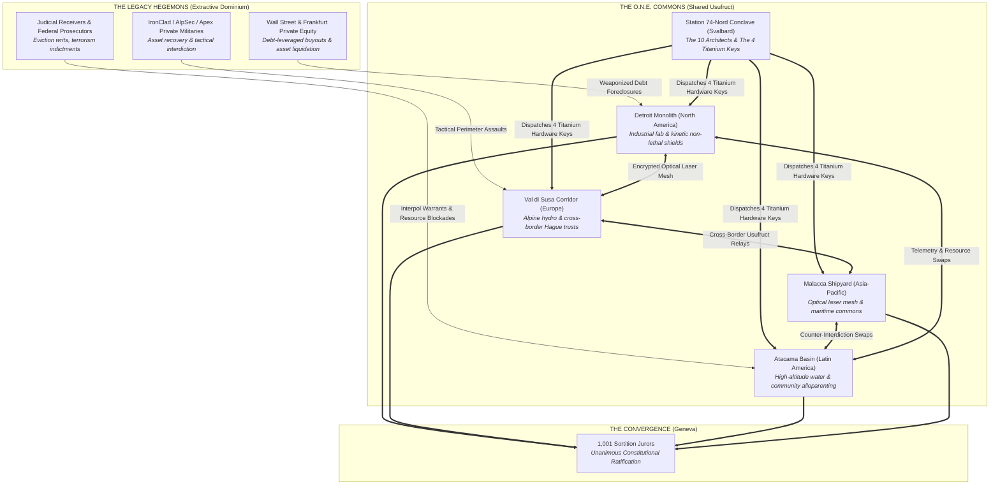
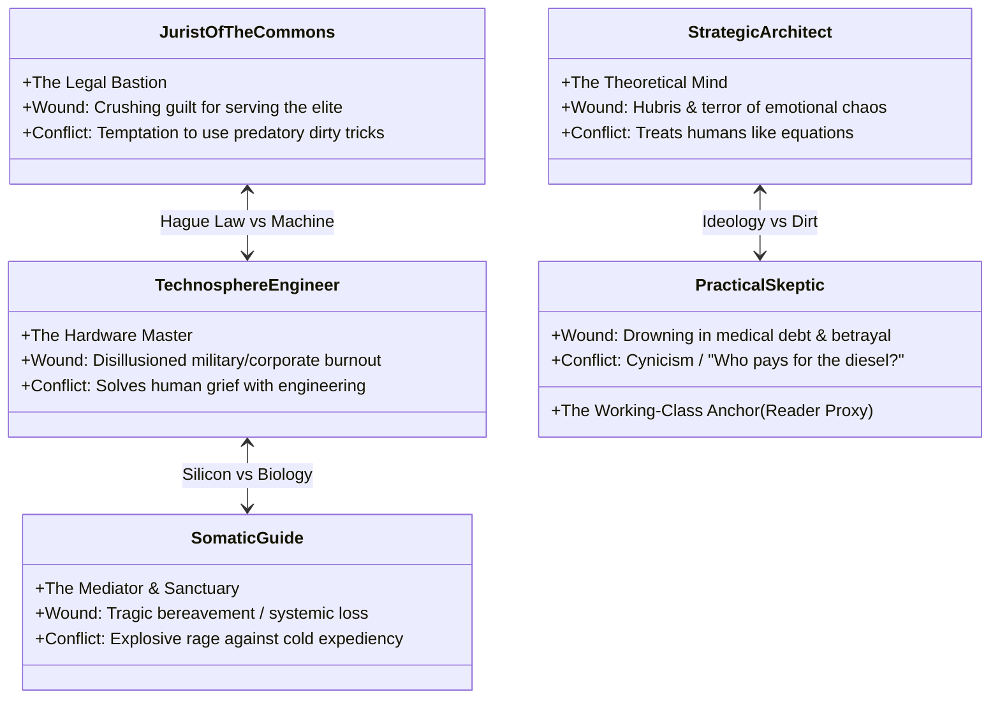
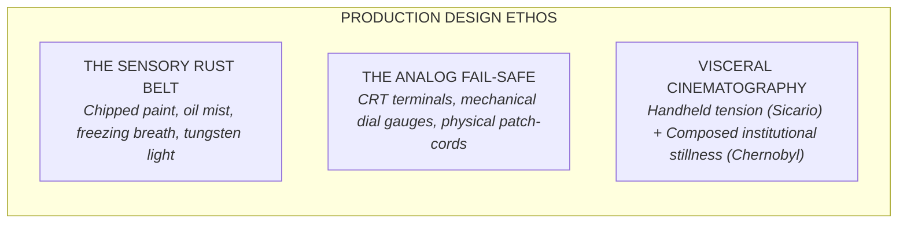

# **O.N.E. (OPEN NETWORKED EARTH) — OFFICIAL TV SERIES BIBLE**

## **A Multi-Season Prestige Drama & Cybernetic Thriller**

---

### **DOCUMENT METADATA & CONTROL**
* **Project Title:** *O.N.E. (Open Networked Earth)*
* **Format:** Premium Drama Series (6 Seasons / 8–10 episodes per season, 60 minutes)
* **Genre:** Hard Socio-Political Sci-Fi / Cybernetic Thriller / Geopolitical Drama
* **Comparable Series (Comps):** *The Wire* meets *Chernobyl* and *Andor*, with the geopolitical scale of *The Expanse* and the psychological tension of *Succession*
* **Source Material:** The 6-Volume Novel Saga (*The Conclave*, *Ground Zero*, *The Transalpine Corridor*, *The Andean Watershed*, *The Maritime Commons*, *The Geneva Charter* — 274 canonical chapters) and the *Living Constitution of O.N.E.*
* **Creator / Public Attribution:** **O.N.E. Foundation** (`kyberlex@proton.me`)
* **License:** Creative Commons Attribution-ShareAlike 4.0 / AGPL-3.0-or-later
* **Target Platforms:** HBO / Max, Apple TV+, FilmNation / European Public Broadcasting Alliances (ARTE/ZDF/BBC)

---

## **1. EXECUTIVE SUMMARY & SERIES LOGLINE**

### **Series Logline**
> When cascading ecological collapse, predatory debt, and unbridled automation threaten to plunge civilization into neo-feudal corporate warfare, an anonymous collective and a network of rogue frontline workers deploy a verified post-capitalist operating system—triggering a high-stakes global siege across four continents as legacy empires fight to retain ownership of the human future.

### **The Three-Tier Dramatic Architecture**
*O.N.E.* rejects didactic exposition and naïve utopian tropes. It is an adrenaline-fueled, multi-threaded ensemble thriller operating across three concentric dramatic tiers:

```
┌────────────────────────────────────────────────────────────────────────┐
│ LEVEL 1: VISCERAL SUSPENSE (The Propulsive Commercial Engine)          │
│ • Ticking clocks, frozen bank accounts, tactical raids, siege warfare  │
│ • Industrial microgrids fighting for power, cross-border laser meshes   │
├────────────────────────────────────────────────────────────────────────┤
│ LEVEL 2: HUMAN & PSYCHOLOGICAL DRAMA (Empathy & Relational Stakes)     │
│ • Wounded pioneers burdened by old-world debts, grief, and cynicism    │
│ • Ego clashes, panic attacks, toxic conditioning, and betrayal         │
├────────────────────────────────────────────────────────────────────────┤
│ LEVEL 3: SYSTEMIC GROUNDING (Authentic Worldbuilding Depth)            │
│ • Usufruct, statistical sortition, alloparenting, non-lethal defense   │
│ • ZERO PREACHING: Engineering and legal systems proven under stress    │
└────────────────────────────────────────────────────────────────────────┘
```

---

## **2. THE THEMATIC ENGINE: THE RENEGOTIATION OF SURVIVAL**

At its core, *O.N.E.* explores the ultimate inflection point of human civilization: **What happens to the human soul when survival is no longer conditioned on wage labor?**

### **Thematic Pillars**
1. **The Post-Work Dignity Dilemma:** When automated micro-fabrication, off-grid renewables, and closed-loop agroecology decouple human survival from market employment, the entire architecture of social status, debt coercion, and obedience collapses.
2. **Algorithmic Transparency vs. Oligarchic Extraction:** The war between an immutable, open-source constitutional protocol (governed by sortition and physical carrying capacities) and centralized corporate algorithms designed to harvest human attention and debt.
3. **The Thermodynamic Law of Nature:** Rejecting speculative financial debt in favor of biophysical Leontief accounting. Energy, calories, liters, and raw materials cannot be created from financial speculation.
4. **Anti-Manicheism & The Rational Antagonist:** The adversaries are not cartoon villains. They are brilliant, cultured, and terrified leaders who genuinely believe that private debt, hierarchy, and market discipline are the only barriers holding back human savagery and economic hyperinflation.
5. **The Backstage Physics Doctrine:** Narrative drama never bogs down in technobabble or lectures. The laws of physics, mechanical wear-and-tear, and depleted batteries act as the invisible pressure cooker driving raw, human choices.

---

## **3. SYSTEM ARCHITECTURE & THE FACTION MATRIX**



### **The Faction Profiles**
* **The Networkers (The Pioneers of O.N.E.):** Blue-collar machinists, disillusioned corporate lawyers, pediatric nurses, systems engineers, and water hydrologists. They do not claim private ownership of the facilities; they hold them in **perpetual usufruct** on behalf of the community.
* **The Legacy Hegemony:** Financial holding firms (*Meridian Crest*, *Vanguard Continental*), transnational mining cartels (*Salar Consortium*), and predictive policing tech conglomerates (*Aegis-Omni*). They fight not out of malice, but to protect sovereign bonds, pension funds, and the global creditor architecture.
* **The Disconnected / The Traditionalists:** Working-class communities and small business owners terrified that algorithmic de-privatization will strip their hard-earned life savings and traditional family autonomy.
* **The Sortition Assemblies:** Ordinary citizens selected purely by lot (statistical representation with strict odd-number parity: 3, 15, 101, 1,001) who hold absolute veto power over technocrats and engineers under the 75% Qualified Supermajority rule.

---

## **4. THE 6-SEASON MASTER NARRATIVE ARC**

```
SEASON 1: THE CONCLAVE (Svalbard Prequel — 720 Hours)
│ 10 Architects • Arctic Granite Vault • The Birth of the Constitution • 4 Keys Forged
▼
SEASON 2: GROUND ZERO (Detroit / North America — 168 Hours / Day Zero)
│ Auto-Plant Monolith • Kinetic Defense • River Laser Bridge • Wall Street PE Siege
▼
SEASON 3: THE ALPINE CORRIDOR (Val di Susa / Europe — 168 Hours)
│ Glacial Penstocks • Transalpine Rail • Hague Trust Warfare • Asset Liquidation Battle
▼
SEASON 4: THE ANDEAN WATERSHED (Atacama / Latin America — 168 Hours)
│ High-Altitude Lithium Flats • Closed-Loop Water • Alloparenting Ayllu • Mining Cartels
▼
SEASON 5: THE MARITIME COMMONS (Malacca Straits / Asia-Pacific — 168 Hours)
│ Container Berths • Laser Mesh vs Monsoons • Seawater Fire Monitors • Predictive Policing
▼
SEASON 6: THE CONVERGENCE (Lake Geneva / Global Climax — Day Seven)
│ 1,001 Sortition Jurors • 100,000 in the Snow • Sovereign Debt Implosion • Universal Ratification
```

---

### **SEASON 1: THE CONCLAVE (Adapted from Volume 0: Genesis)**
* **Setting:** The Svalbard Sub-Glacial Acoustic Vault (**Station 74-Nord**), carved 250 meters deep into Spitsbergen granite (78°13'N). Faraday-shielded, air-gapped, lit by analog tungsten bulbs. Zero sunlight.
* **Format / Tone:** Claustrophobic psychological chamber thriller (*12 Angry Men* meets *Chernobyl* meets *Margin Call*).
* **The Ticking Clock:** **The 720-Hour Freeze-Up Window.** A retrofitted research trawler waiting in the fjord must depart before multi-year polar pack ice seals the bay for nine winter months.
* **The Central Conflict:** Ten fugitives and whistleblowers from ten distinct geopolitical superpowers must negotiate and draft the *Living Constitution of O.N.E.* Every clause is forged through brutal ideological standoffs:
  - Julian Mercer (Wall Street quant) fighting for market price signals.
  - Dr. Chen Liang (Chinese state planner) pushing for AI optimization.
  - Nayra Calvimontes (Bolivian indigenous jurist) defending the sacred commons and communal alloparenting (*Ayllu*).
  - Ananya Patel (Indian union organizer) demanding the absolute abolition of technocratic priests.
* **Season Climax:** The protocol passes the multi-agent adversarial simulation (**O-ASIS**). The delegates forge the **Four Titanium Hardware Keys**, slag the vault's servers with thermite, and board the ice-streaked trawler into the polar night, scattering across four continents.

---

### **SEASON 2: GROUND ZERO (Adapted from Volume 1: North America)**
* **Setting:** A decommissioned 500,000 sq ft automotive stamping plant on West Jefferson Avenue in Delray, Southwest Detroit, facing the Detroit River and Zug Island, directly across from Sandwich, Ontario.
* **Format / Tone:** Gritty post-industrial siege thriller (*Sicario* meets *The Wire*).
* **The Ticking Clock:** **The 168-Hour (7-Day) Master Clock**, igniting at **05:42 UTC ("Day Zero")**.
* **The Central Conflict:** Marcus Hayes (a cynical, debt-crushed veteran machinist), Elena Vance (a disgraced corporate bankruptcy lawyer), and Kira Vance (Elena's estranged younger sister, a defense robotics engineer) seize the plant to protect its community microgrid and tooling.
* **The Adversary:** Nathan Sterling (*Meridian Crest Capital*), armed with federal eviction writs, and Commander Donald Briggs (*IronClad PMC*), deploying rail-yard cordons, floodlights, and acoustic interdiction.
* **Season Climax:** The workers activate the plant's 2,000-ton hydraulic gantry dies and pneumatic strobe curtains, executing an airtight **non-lethal perimeter defense**. Across the foggy river, a Free Space Optics laser locks onto a grain elevator in Canada, transmitting microgrid telemetry across borders as the node passes its 168-hour survival gate.

---

### **SEASON 3: THE ALPINE CORRIDOR (Adapted from Volume 2: Europe)**
* **Setting:** An alpine rail-marshalling terminal and hydroelectric facility at the mouth of the Fréjus Alpine Tunnel in the **Val di Susa (Franco-Italian border)**, surrounded by 3,500-meter peaks.
* **Format / Tone:** Cerebral high-altitude legal and engineering thriller.
* **The Central Conflict:** Giulia Bellini (a guilt-ridden former insolvency trustee from Milan) and Matteo Rossi (a fierce alpine locomotive engineer) convert regional rail freight and Pelton hydro-turbines into an autonomous common trust.
* **The Adversary:** The Frankfurt banking syndicate, corrupt insolvency receivers, and *AlpSec* tactical squads attempting to shut down the transalpine corridor.
* **Key Set-Pieces:** The **Glacial Penstock Defense** (spraying emergency flume water across sheer granite cliffs at -14°C to coat approach routes in instant black ice without firing a single bullet); deploying the Hague-compliant perpetual asset trust that legally freezes private equity liquidation warrants.
* **Season Climax:** The high-altitude laser dome on Mount Rocciamelone locks line-of-sight relays across the Alps toward Lake Geneva, opening the physical tunnel for humanitarian supply trains.

---

### **SEASON 4: THE ANDEAN WATERSHED (Adapted from Volume 3: Latin America)**
* **Setting:** A deep mine headframe and high-altitude watershed in the Atacama Basin (Chile/Bolivia border) at 4,000 meters elevation.
* **Format / Tone:** Hyper-visceral ecological and cultural survival epic.
* **The Central Conflict:** Carlos Quispe (an indigenous Aymara deep-hole driller) and Dr. Carmen Morales (a hydrologist) reclaim lithium brine evaporation fields and mountain aquifers to establish closed-loop aeroponic greenhouses.
* **The Adversary:** The *Salar Mining Consortium* and privatized water cartels backed by *AndesGuard* gunboats and defoliant agricultural drones.
* **Thematic Core:** Demonstrating **Alloparenting (*Ayllu*)**—collective child-rearing and trauma recovery that insulates families from corporate hostage-taking.
* **Season Climax:** High-pressure geothermal steam venting and bio-swales neutralize a mercenary raid on the water filtration hubs; the Atacama node signs a bilateral raw-material usufruct pact with the Detroit Monolith.

---

### **SEASON 5: THE MARITIME COMMONS (Adapted from Volume 4: Asia-Pacific)**
* **Setting:** The Keppel-Batam shipyard, rusted dry docks, and container anchorages across the **Strait of Malacca (Singapore / Indonesia / Malaysia)**.
* **Format / Tone:** Hyper-kinetic, neon-streaked maritime cyber-thriller.
* **The Central Conflict:** Captain Jin Wei (a veteran tanker master) and Dr. Lin Zhang (a whistleblower data scientist) liberate automated container gantry cranes and establish a floating, solar-powered data haven.
* **The Adversary:** The *Aegis-Omni* predictive policing platform, algorithmic social-credit blacklists, and maritime debt recovery flotillas.
* **Key Set-Pieces:** Laser communication through blinding tropical monsoon downpours (managing 50% packet drops); repelling mercenary boarding skiffs with **2,500 GPM high-pressure seawater fire monitors** and turbine steam foggers.
* **Season Climax:** The maritime node links the Asian optical mesh with the transalpine network, initiating the final cryptographic call for the Global Assembly.

---

### **SEASON 6: THE CONVERGENCE (Adapted from Volume 5: Global Climax)**
* **Setting:** Geneva, Switzerland — The frozen shores of Lake Geneva, the Palais des Nations, and the surrounding Alpine cantonments.
* **Format / Tone:** Epochal political thriller and grand courtroom climax (*Judgment at Nuremberg* meets *The West Wing*).
* **The Setup:** As global fiat markets face systemic margin calls and hyperinflationary collapse, the four continental delegations slip through sealed borders and converge on Geneva.
* **The Core Drama:** The convening of the **Global Commons Assembly**:
  - **1,001 Citizens Selected by Pure Statistical Sortition** from 80 countries, sitting in judgment of the legacy debt regime.
  - High-intensity diplomatic combat against the G20 Financial Stabilization Board and central bank governors who attempt to declare planetary financial martial law.
  - Nathan Sterling and Elena Vance face off in an electrifying, multi-hour constitutional cross-examination.
* **The Climax / Series Finale:** The 1,001 sortition jurors, defying political threats, vote by a **78% supermajority** (surpassing the 75% Class-0 threshold) to ratify the *Living Constitution of O.N.E.*, enact universal debt cancellation, and transfer essential planetary infrastructure into perpetual common usufruct.
* **Final Image:** 100,000 citizens stand peacefully in the Geneva snow. The screens of the Palais des Nations flicker, displaying real-time planetary carrying capacities, energy flows, and food reserves. The era of coercive survival has ended; the era of human history has begun.

---

## **5. ENSEMBLE DRAMATURGY & CORE CHARACTER DOSSIERS**

Every regional node is structured around the **Five Universal Human Archetypes**, ensuring deep psychological empathy, relatable friction, and zero ideological cardboard:



---

### **Lead Protagonists (Detroit Monolith / North America)**

#### **1. Marcus Hayes (The Practical Skeptic — The Reader's Proxy)**
* **Role:** Lead Maintenance Machinist & Microgrid Tooling Specialist.
* **Age:** 49. Thick-shouldered, grease-stained Carhartt coat, walks with a subtle limp from an industrial accident; split knuckle taped with a shop rag.
* **The Ghost / Wound:** Lost his 27-year pension and home during the 2009 automotive bailout; buried his wife after predatory medical debt consumed their savings. Marcus trusts nothing that cannot be measured with a micrometer.
* **Dramatic Function:** He calls out all grand philosophical speeches. If Sully or Elena sound too utopian, Marcus asks who is replacing the blown hydraulic seal at 3:00 AM.

#### **2. Elena Vance (The Jurist of the Commons — The Legal Shield)**
* **Role:** Restorative Trust Litigator & Foundation Architect.
* **Age:** 42. Harvard Law graduate, tailored wool overcoats worn over thermal work shirts, suffering from psychosomatic hand tremors under adrenaline spikes.
* **The Ghost / Wound:** Spent 15 years as an equity partner drafting predatory municipal debt instruments. Suffered a nervous breakdown after an eviction covenant she authored cut off winter heating to 3,000 families, causing multiple hypothermia deaths.
* **Dramatic Function:** She knows how to break the corporate legal machine because she helped design its teeth.

#### **3. Kira Vance (The Technosphere Engineer — The Hardware Master)**
* **Role:** Industrial Robotics & Automated Non-Lethal Defense.
* **Age:** 35. Elena's estranged younger sister. Tactical utility gear, high-frequency tinnitus from military testing explosions.
* **The Ghost / Wound:** Designed guidance algorithms for defense contractors until she saw her autonomous prototypes turned against domestic civilian protests. She trusts machines infinitely more than people.
* **Dramatic Function:** The volatile sisterly friction between Kira's cold technological detachment and Elena's legal guilt forms the emotional powder keg of the node.

#### **4. David "Sully" Sullivan (The Strategic Architect — The Cybernetist)**
* **Role:** Thermodynamic Modeling, Covenant Protocols, and Exergy Accounting.
* **Age:** 47. MIT-trained mathematician. Rumpled tweed, wire-rimmed glasses, rarely makes eye contact.
* **The Ghost / Wound:** Intellectual cowardice. Formerly designed High-Frequency Trading algorithms that drained municipal pension funds. He can calculate planetary exergy to nine decimal places, but freezes in terror when two humans yell at each other in the room.

#### **5. Maya Lin-Mercado (The Somatic Guide — The Nursery & Sanctuary)**
* **Role:** Pediatric Trauma Nurse, Conflict Mediator, and Nutritional Commons.
* **Age:** 39. First-generation Mexican-American community organizer from Southwest Detroit.
* **The Ghost / Wound:** Her eight-year-old asthmatic son, Mateo, died during a privatized city water shutoff when dispatch algorithms delayed ambulances by 40 minutes.
* **Dramatic Function:** The emotional moral compass. When Kira or Sully view people as mere statistics or tactical assets, Maya steps in with quiet, terrifying moral authority.

---

### **The Formidable Antagonists (Anti-Manicheism)**

#### **Nathan Sterling (The Wall Street Guardian of Order)**
* **Role:** Managing Director, *Meridian Crest Capital*.
* **Age:** 52. Cultured, impeccably tailored, soft-spoken, and intellectually formidable.
* **Worldview:** Sterling is not evil; he is a fervent believer in contractual order. He views the O.N.E. pioneers as dangerous economic arsonists whose defiance will destroy the pension savings of millions of ordinary teachers and firefighters. His battles with Elena are high-velocity intellectual duels.

#### **Commander Donald Briggs (The Tactical Realist)**
* **Role:** Operational Commander, *IronClad Tactical Asset Management*.
* **Age:** 48. Former military officer with decades of logistics experience.
* **Worldview:** He does not revel in violence; he views perimeter enforcement as essential hygiene to prevent urban anarchy. His tactics are methodical, disciplined, and focused on logistics starvation rather than cinematic brutality.

---

### **The Catalytic Catalyst: The "Satoshi Nakamoto" Protocol**
* **The Kyberlex Entity:** The architect behind the initial O.N.E. seed algorithms **never appears on screen** and has no audible voice.
* **Orchestrated Serendipity:** The pioneers did not meet by chance; their lives intersected through an unassailable series of bureaucratic glitches and encrypted leaks.
* **Fair-Play Red Herrings:** Each season drops subtle clues suggesting that one of the leads might be the secret creator—only for airtight alibis to shatter the theory, reinforcing that **the network belongs to no single hero**.

---

## **6. VISUAL LANGUAGE, TONE & PRODUCTION DESIGN**



### **Directorial Tone & Visual Influences**
* **Cinematography:** A deliberate contrast between the cold, suffocating glass-and-steel monoliths of legacy corporate towers (*Succession*) and the tactile, steam-and-rust vitality of the industrial nodes (*Chernobyl*).
* **The Somatic Camera:** In moments of systemic crisis, the camera stays tight on human physical strain—sweating foreheads, blistered fingers adjusting high-voltage lugs, the rhythmic vibration of diesel generators.
* **Soundscape:** Minimalist analog score composed of low-frequency modular synthesis, bowed industrial metal, and cellos (reminiscent of Jóhann Jóhannsson, Hildur Guðnadóttir, and Trent Reznor/Atticus Ross). No triumphant orchestral fanfares; the music groans and vibrates with mechanical friction.

---

## **7. PILOT EPISODE OUTLINE ("THE ZERO-SUM FALLACY")**

* **Cold Open (23:42 UTC — 6 Hours to Day Zero):**
  A bleak, freezing November rain in Delray, Southwest Detroit. Marcus Hayes is forced to pack his toolbox as corporate receivers padlock the stamping plant gates. A process server serves an immediate eviction notice on Maya's community clinic down the street. In New York, Nathan Sterling looks at trading screens as automated margin calls liquidate Midwest municipal utilities.
* **Act I (02:00:00 to Day Zero):**
  Elena Vance arrives in Detroit under an assumed name, carrying an air-gapped ruggedized laptop and an asset-locked trust deed. She meets Sully in an unheated diner; Sully reveals that the global financial clearinghouses will freeze all liquidity by dawn. If they don't seize physical production capacity tonight, the neighborhood will freeze.
* **Act II (04:30:00 to Day Zero):**
  Infiltration of the Monolith. Kira breaches the digital security gates using an encrypted key provided by an anonymous source. Marcus catches them inside the transformer room with a pipe wrench. Elena does not offer money; she shows Marcus the private equity bankruptcy liquidation filing that wiped out his wife's healthcare trust. Marcus lowers the wrench: *"You've got twenty minutes before the night guard makes his rounds."*
* **Act III (05:20:00 to Day Zero):**
  *IronClad PMC* surveillance vans identify unusual telemetry from the plant. Tactical teams mobilize. Inside, Kira, Marcus, and Sully frantically splice heavy 480V three-phase busbars into the plant's backup LFP battery bank. Tension explodes between Elena and Kira over childhood betrayals. Maya arrives with thirty neighborhood families seeking shelter from the winter freezing rains.
* **Act IV (05:41:45 to Day Zero):**
  PMC tactical squads reach the perimeter gates with hydraulic shears. At 05:41:59 UTC, Marcus reaches for the master knife-switch.
  **05:42:00 UTC:** Clack. The main grid transfer switches fire open. The plant goes dark for three terrifying seconds—then hums back to life under autonomous microgrid power. High-intensity pneumatic strobe blinders fire at the perimeter, disorienting the breach team without a shot fired.
* **Cliffhanger:**
  On the plant's roof, Kira and Marcus align an optical Free Space Optics laser transceiver across the dark Detroit River. Through the fog, a tiny blue pinpoint pulses back from the Canadian shore in Sandwich, Ontario.
  Inside, every terminal in the facility, and hundreds of connected community screens across Detroit, illuminate with a simple black-and-amber display:
  ```
  [OPEN NETWORKED EARTH — PROTOCOL GENESIS ACTIVE]
  [NODE 01: NORTH AMERICA — ISLANDED & AUTONOMOUS]
  [TIME TO GLOBAL CONVERGENCE: 167 HOURS, 59 MINUTES]
  [ARTICLE 1 RATIFICATION POLL: OPEN]
  ```

---

## **8. PACKAGING, IP ARCHITECTURE & BROADCASTER STRATEGY**

1. **Format Viability:** 6 seasons, 8–10 episodes per season. Designed to satisfy the growing global appetite for intelligent, grounded, high-stakes speculative drama that addresses real socio-ecological anxieties.
2. **International Co-Production Model:** Because the storyline spans North America, Europe (Italy/France/Switzerland), Latin America, and Asia-Pacific, the series is uniquely positioned for cross-border tax incentives and multi-territory funding (e.g., European public broadcasters alongside a global SVOD streamer).
3. **Intellectual Property Purity:** All rights belong inalienably to the commons under copyleft and AGPL invariants, preventing corporate buyouts from sanitizing the core anti-extractive message.
4. **Immediate Production Deliverables:**
   - **Step 1:** Series Bible (*this document*).
   - **Step 2:** Pilot Episode Scene Beat Sheet & Treatment.
   - **Step 3:** One-Pager / Pitch Deck for independent showrunners and European production partners.
