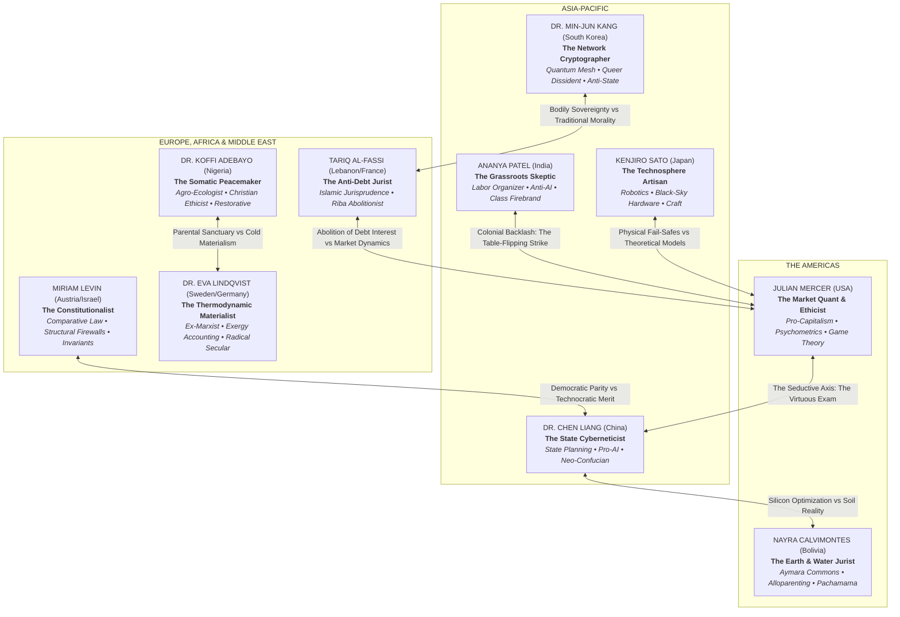
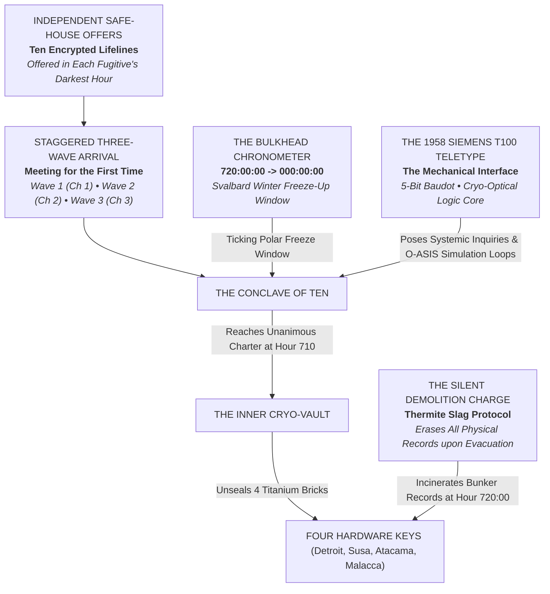
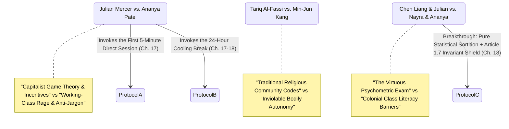

# **VOLUME 0: SVALBARD ("GENESIS")**
## **MASTER STORY REDLINE & CHARACTER BIBLE**

---

### **I. NARRATIVE GEOMETRY & VOLUME 0 SCOPE**

* **Setting:** **The Svalbard Sub-Glacial Acoustic Vault (Station 74-Nord)** — a decommissioned Cold War submarine detection complex carved 250 meters deep into solid granite beneath an Arctic fjord in Spitsbergen (78°13'N, 15°38'E). The facility is fully Faraday-shielded, air-gapped, and thermally isolated, powered by a closed-loop geothermal heat exchanger and illuminated by low-voltage 3,000K analog tungsten work-lamps. There are zero wireless transceivers, zero external network links, and no sunlight.
* **Timeline:** Exactly **30 Days (720 Hours)**, situated precisely eighteen months before "Day Zero" (the synchronized global ignition in Detroit, Susa, Atacama, and Malacca). The story begins with the arrival of the first wave at **Hour 000:00** and concludes at **Hour 720:00**, when the O.N.E. Master Parchment is signed, the four cryptographic hardware bricks are forged, and the vault records are slagged by automated thermite charges as the delegates evacuate before the winter ice pack seals the fjord.
* **Core O.N.E. Pillar in Demonstration:** **The Genesis of the Restorative Covenant, Pure Statistical Sortition vs. The Virtuous Priesthood, Bodily Sovereignty as a Class 0 Invariant, Alloparenting (*Ayllu*) & Scientific Pedagogy, Usufruct over Dominium, and the O-ASIS Multi-Agent Adversarial Stress-Test.**
* **The Existential Pressure & The Sanctuary Doctrine:** The ten delegates are not prisoners; they are hunted defectors, whistleblowers, and dissidents fleeing federal treason indictments, corporate elimination squads, and state surveillance across four continents. Each was independently contacted in their darkest hour by an anonymous architect and offered sanctuary in the only place on Earth surveillance cannot see. The heavy steel airlock has no lock from the inside (**Class 0 Invariant 6: Voluntary Free Exit**); anyone can walk out at any second. But outside lies an uninhabited, -40°C Arctic wilderness, and beyond that, federal extradition and prison. They stay because they are desperately, passionately committed to finding a solution before civilization collapses into terminal resource wars.
* **The 720-Hour Clock (Arctic Freeze-Up Window):** The 720-hour countdown on the bulkhead chronometer is not a movie bomb or an execution lock—it is the **Svalbard Winter Freeze-Up Window**. It is October in Spitsbergen. The Arctic pack ice is descending rapidly. An unmarked, retrofitted Norwegian research trawler can hold station in the ice-free fjord mouth for **exactly 30 days**. At Hour 720, the fjord freezes solid into multi-year polar sea ice for nine dark winter months. If they do not achieve consensus, compile the simulation, and evacuate to the vessel before Hour 720, they are trapped beneath the Arctic ice until summer.
* **The Friction Invariant & Pedagogical Realism:** Volume 0 must never resemble an academic seminar or a frictionless utopian symposium. It is an intense, claustrophobic psychological pressure-cooker (*12 Angry Men* meets *Tinker Tailor Soldier Spy* meets *The Thing*). The ten participants arrive in staggered secrecy, carrying deep-seated generational traumas, cultural suspicions, religious wounds, and irreconcilable ideological conditioning. Every constitutional breakthrough is wrung from screaming matches, shattered furniture, panic attacks, table-turning standoffs, and the painful dismantling of lifelong ego-defenses.

---

### **II. THE ENSEMBLE CAST: THE CONCLAVE OF TEN**



---

#### **1. Julian Mercer — The Market Quant & Cognitive Ethicist (USA)**
* **Role:** Capital Dynamicist, High-Frequency Game Theorist, Psychometric Modeling.
* **Age:** 45.
* **Physicality:** Tall, nervous energy, impeccably cut bespoke cashmere sweater now frayed and stained with bunker soot; perpetually tapping polyrhythms on unpowered wooden surfaces; takes prescription beta-blockers for panic disorders; pale, sunken eyes behind titanium-rimmed glasses.
* **Backstory:** Former chief quantitative architect at a premier Wall Street market-making hedge fund. Developed predatory behavioral prediction engines that monetized retail investor panic during flash crashes. Walked away after his algorithms engineered the bankruptcy of thirty municipal hospital systems, driving his hometown community in Ohio into opioid collapse and mass foreclosures.
* **Psychological Ghost / Wound:** Terror of systemic chaos and mob violence. Julian believes that without competitive price signals and property boundaries, human beings inevitably regress into brutal tribal warfare.
* **Dialogue Cadence & Voice:** Fast, clinical, sardonic Bostonian-Mid-Atlantic cadence. Frames human behavior in terms of game theory payoff matrices and Nash equilibria, weaponizing cynical economic realism whenever someone sounds idealistic.
* **Reader Proxy / Interpersonal Dynamic:** Represents the skeptical free-market reader who demands mathematical proof before abandoning price signals. Clashes violently with Ananya and Nayra.

---

#### **2. Dr. Chen Liang — The State Cyberneticist (China)**
* **Role:** Macro-Dynamic Systems, Computational Resource Allocation, Neo-Confucian State Theory.
* **Age:** 48.
* **Physicality:** Austere, composed, immaculate posture; dark hair cropped short; wire-rimmed reading glasses; wears a utilitarian dark Mao-collared wool tunic and polished dark leather oxfords.
* **Backstory:** Senior director of macroeconomic predictive modeling at the State Council in Beijing. Spent two decades building centralized algorithmic logistics pipelines. Fled after his automated carrying-capacity models were classified as state secrets because they proved incumbent industrial production quotas would exhaust northern aquifers within five years.
* **Psychological Ghost / Wound:** Deep contempt for democratic inefficiency. Having studied the catastrophic famines of past centuries and the erratic swings of Western electoral cycles, he believes that giving uneducated masses direct control over resources is a recipe for ecological suicide.
* **Dialogue Cadence & Voice:** Calm, low, rhythmic, dialectical Mandarin-accented English. Speaks with deliberate philosophical gravity, citing ancient imperial statecraft alongside cybernetic feedback mathematics.
* **Reader Proxy / Interpersonal Dynamic:** Co-architect with Julian of the seductive "Virtuous Exam" in Crucible 3; must undergo a painful intellectual dismantling before embracing pure sortition.

---

#### **3. Ananya Patel — The Grassroots Skeptic (India — Reader Proxy)**
* **Role:** Trade Union Organizer, Computational Sociolinguist, Anti-Technocratic Firewall.
* **Age:** 42.
* **Physicality:** Short, stocky, fierce dark eyes; rough hands with callused fingers; wears a hand-spun khadi cotton shawl over heavy wool layers; limps slightly from a police lathi baton strike during the Mumbai dock strikes.
* **Backstory:** Spent twenty years organizing unorganized dockworkers, textile laborers, and gig-economy drivers across South Asia. Uncovered that corporate AI dispatch platforms were deliberately driving worker suicides to clear uncollectible micro-loan balances.
* **Psychological Ghost / Wound:** Deep, burning hatred for Western academics, corporate consultants, and technocrats who treat working human beings as economic statistics. She trusts nothing that cannot be verified by a worker with their bare hands.
* **Dialogue Cadence & Voice:** Direct, sharp, passionate, Mumbai-inflected English. Punctures high-flown academic abstractions with devastating, profane ground truths.
* **Reader Proxy Function:** The frontline moral compass. Whenever an idea sounds too lofty or technocratic, Ananya flips the table and demands to know what happens to the illiterate dockworker.

---

#### **4. Kenjiro "Ken" Sato — The Technosphere Artisan (Japan)**
* **Role:** Heavy Automation, Black-Sky Analog Fail-Safes, Micro-Mechanical Engineering.
* **Age:** 50.
* **Physicality:** Broad shoulders, silent, disciplined; fingers permanently bearing burn scars from precision arc-welding; wears indigo canvas work-jackets (*noragi*) and steel-capped boots; carries an analog mechanical vernier caliper in his breast pocket.
* **Backstory:** Chief robotics architect for a major Tokyo industrial conglomerate. Resigned in protest after discovering that factory automated safety overrides were being disabled via proprietary cloud updates to boost assembly line speeds at the expense of worker amputations.
* **Psychological Ghost / Wound:** Profound guilt over designing complex, brittle software systems that fail during real emergencies. He believes software is fragile and easily corrupted, whereas mechanical physics, gravity, and cast iron are incorruptible.
* **Dialogue Cadence & Voice:** Laconic, measured, speaking English with deep Japanese economy of words. Never argues theory; simply pulls out a mechanical blueprint, points out the structural stress point, and asks what happens when the electricity dies.

---

#### **5. Nayra Calvimontes — The Earth & Water Jurist (Bolivia)**
* **Role:** Water Usufruct, ILO 169 Indigenous Jurisprudence, Alloparenting (*Ayllu*) Architecture.
* **Age:** 39.
* **Physicality:** Angular Andean features, copper skin, thick black hair in a long braid woven with red alpaca cord; wears traditional wool ponchos over thermal alpine mountaineering gear.
* **Backstory:** Aymara constitutional scholar and veteran defender of community water rights in Cochabamba and the Atacama Basin. Watched her brother Tupac die in water-privatization street clashes while international debt consortia pumped mountain aquifers dry.
* **Psychological Ghost / Wound:** Centuries of colonial dispossession carried in the blood. She refuses to allow any system that treats the living Earth as mere property or inanimate input stock for human exploitation.
* **Dialogue Cadence & Voice:** Resonant, musical, forceful Spanish and English woven with Aymara concepts. Speaks with moral clarity and grounded authority.

---

#### **6. Dr. Koffi Adebayo — The Somatic Peacemaker (Nigeria)**
* **Role:** Pedagogy of Restoration, Soil Microbiology, Developmental Trauma De-escalation.
* **Age:** 52.
* **Physicality:** Imposing, tall, deep ebony skin; warm, expressive eyes with deep worry lines; wears an unbuttoned knit cardigan over wool work-shirts; carries a worn brass mechanical kitchen timer in his pocket.
* **Backstory:** Soil microbiologist and non-violent restorative mediator in the Niger Delta communal oil-conflict zones. Lost his home and community church to corporate private military contractors.
* **Psychological Ghost / Wound:** Severe secondary trauma from mediating violent communal massacres. He knows that intellectual treaties are worthless if the nervous systems of the human beings signing them are dysregulated by fear and ancestral grief.
* **Dialogue Cadence & Voice:** Deep, velvet, baritone Nigerian English. Hypnotic and calm. When the room reaches a screaming pitch, his quiet voice cuts through the chaos like an anchor.

---

#### **7. Tariq Al-Fassi — The Anti-Debt Jurist (Lebanon / France)**
* **Role:** Mediterranean Commercial History, Riba Abolition, Unearned Wealth Proscriptions.
* **Age:** 47.
* **Physicality:** Slender, weathered Mediterranean features, graying temples; wears worn tweed jackets and cashmere scarves; speaks with fluid, expressive hand gestures.
* **Backstory:** Professor of international maritime law at the Sorbonne and scholar of Islamic financial jurisprudence. Witnessed his family's generational life savings wiped out in seventy-two hours during the Lebanese banking collapse of 2019, when commercial banks froze public deposits while shifting billions to offshore Swiss tax havens.
* **Psychological Ghost / Wound:** The conviction that compound interest (*Riba*) and debt contracts are mathematical weapons designed to reduce free citizens into debt-slaves.
* **Dialogue Cadence & Voice:** Melodic, razor-sharp French-Levantine English. Cites historical debt jubilees, medieval Mediterranean trade codes, and Islamic usury prohibitions with scholarly precision.

---

#### **8. Miriam Levin — The Constitutionalist (Austria / Israel)**
* **Role:** Comparative Structural Law, Procedural Firewalls, Constitutional Invariants.
* **Age:** 46.
* **Physicality:** Sharp gaze, pale, wiry frame; dark curly hair held back with an acetate comb; perpetually drafting legal schematics on unlined yellow legal pads with a fountain pen.
* **Backstory:** Senior legal counsel at the European Court of Human Rights in Strasbourg. Spent fifteen years watching authoritarian regimes hollow out democratic constitutions from within using emergency decrees, corrupt parliamentary majorities, and legal loopholes.
* **Psychological Ghost / Wound:** Generational memory of systemic persecution. She is fanatically obsessed with structural firewalls, insisting that any constitution that relies on the "good intentions" of rulers or majorities is a death sentence.
* **Dialogue Cadence & Voice:** Precise, rapid, Viennese-inflected English. Forensic, analytical, dispassionate. Relentlessly stress-tests every phrase for legislative ambiguity.

---

#### **9. Dr. Min-Jun Kang — The Network Cryptographer (South Korea)**
* **Role:** Distributed Ledgers, Post-Quantum Privacy, Queer Bodily Sanctuary.
* **Age:** 34.
* **Physicality:** Lean, energetic, asymmetric dyed hair falling over sharp eyes; thermal combat hoodie, fingerless typing gloves; chronically sleep-deprived, lives on black instant coffee.
* **Backstory:** Top cryptographic researcher for South Korea's national cyber command. Dishonorably discharged, outed, and blacklisted after military intelligence uncovered his same-sex partnership and hacked his private communications under conservative military penal codes. Fled into the underground hacktivist mesh.
* **Psychological Ghost / Wound:** The horror of state and institutional surveillance policing human intimacy, love, and gender identity. He demands absolute, unbreakable cryptographic privacy for the human soul.
* **Dialogue Cadence & Voice:** Fast, irreverent, sarcastic Seoul-accented English. Drops dark jokes to deflect vulnerability, but turns ferocious whenever personal autonomy is threatened.

---

#### **10. Dr. Eva Lindqvist — The Thermodynamic Materialist (Sweden / Germany)**
* **Role:** Exergy Accounting, Bioregional Carrying Capacity, Post-Capitalist Political Economy.
* **Age:** 41.
* **Physicality:** Striking, athletic, blonde hair pulled into an austere knot; heavy woolen Scandinavian sweaters; piercing ice-blue eyes; walks with brisk, no-nonsense authority.
* **Backstory:** Lead ecological economist at the Potsdam Institute and former ideological advisor to European democratic-socialist movements. Resigned after realizing that mainstream green political parties were using carbon credits as fraudulent financial trading schemes rather than reducing physical material extraction.
* **Psychological Ghost / Wound:** Bitter disillusionment with both Western social-democracy and 20th-century Soviet state planning. She refuses all sentimentality, arguing that human morality must align with the laws of thermodynamics (entropy and exergy) or face extinction.
* **Dialogue Cadence & Voice:** Cool, methodical, Scandinavian-inflected English. Unflinching, razor-sharp, occasionally blunt to the point of brutality.

---

### **III. THE CATALYTIC MYSTERY: THE ANONYMOUS ARCHITECT & THE TELETYPE**



* **The Staggered Safe-House Summoning:** The ten delegates were not kidnapped. Each was reached independently via encrypted one-way dead-drops during their darkest personal crisis—Julian dodging federal wire fraud agents in Boston, Chen fleeing a midnight raid in Beijing, Ananya recovering from police baton wounds in Mumbai. An anonymous benefactor offered each the same coordinate: a decommissioned, air-gapped Arctic acoustic vault where corporate tracking and state warrants could never reach them.
* **The Mechanical Interface:** The vault's central communication terminal is an un-networked 1958 Siemens T100 mechanical Baudot teletype machine wired directly to an air-gapped cryogenic optical logic core inside the vault wall. It accepts only raw physical input and prints on continuous rolls of perforated paper. It does not bark authoritarian orders; it poses rigorous, unavoidable design inquiries: *"The old world is mathematically doomed to collapse within eighteen months. If you do not design its successor, who will?"*
* **The Bulkhead Chronometer:** An analog mechanical timer counting down from `720:00:00`. It represents the 30 days before the Arctic fjord freezes solid into impassable winter pack ice, cutting off their extraction trawler for nine months.
* **Fair-Play Suspicion Architecture:** As tensions mount, the delegates wonder who among them might be secretly communicating with the outside or pulling the strings:
  * *The Case Against Chen:* Min-Jun discovers that the bunker's air-gap routing algorithms use state-level cryptographic math developed at Tsinghua University.
  * *The Case Against Julian:* Ananya finds that the safe-house trust escrow was routed through private Swiss accounts previously managed by Julian’s Manhattan hedge fund.
  * *The Case Against Miriam:* Tariq notices that the procedural rules governing the teletype's query-response loops mirror the exact phrasing of Miriam’s 2018 Hague comparative law treatises.
* **The Epilogue Shatter:** When the O.N.E. Charter is signed at Hour 718:00, the inner cryo-vault finally slides open. There is no mastermind inside. The chamber contains only an automated server chassis running the final O-ASIS simulation logs, four precision-milled titanium hardware storage bricks bearing the geographical coordinates of the four future frontline nodes, and a silent thermite demolition charge set to trigger thirty minutes after evacuation. The Master was never an aspiring ruler; the Master was an architect building an escape hatch for humanity and erasing their own footsteps so no single person or state could ever control O.N.E.

---

### **IV. COMMUNITY & EMOTIONAL ANCHORS**

* **The Ghost of Sarah & The Opioid Rust Belt:** Julian’s private torment over the 30 Ohio municipal hospitals his algorithms bankrupted; the faces of rural nurses and dying factory workers echo Marcus Hayes’s loss in Detroit.
* **Tupac Calvimontes (Nayra’s Brother):** Killed by corporate private security in Cochabamba during the water wars; Nayra carries his woven red alpaca cord in her braid as a reminder of blood paid for water.
* **Ji-hoon (Min-Jun’s Late Partner):** Took his own life after being blacklisted and outed by military cyber-intelligence under Korean sodomy codes; Min-Jun wears Ji-hoon’s silver ring on a cord around his neck.
* **The Trawler Skipper (Captain Olavsen):** The silent Norwegian fisherman who brought them through Arctic blizzards to the Spitsbergen shore, bound by an anonymous trust contract to wait beneath the ice pack at Hour 720.

---

### **V. THE INTERPERSONAL FRICTION & COVENANT TRIGGER MATRIX**



#### **The Three Ideological Crucibles:**
1. **Crucible 1: The Moneyless Baseline & Alloparenting (Days 08–10 / Chapters 07–09):**
   * *Conflict:* Julian argues that price signals are biological necessities and that child-rearing is a private family responsibility.
   * *Resolution:* Eva proves money violates thermodynamics; Nayra introduces Andean **Alloparenting (*Ayllu*)**, liberating mothers and children from domestic trauma; codification of the Universal Survival Baseline and Article 2.6 (Communal Nurseries & Scientific Pedagogy).
2. **Crucible 2: Bodily Sovereignty & The Secular Settlement (Days 11–13 / Chapters 11–12):**
   * *Conflict:* Tariq and Julian propose leaving family structures, sexuality, and gender expression to local assembly referendums.
   * *Resolution:* Min-Jun, Eva, and Koffi erupt, exposing how ruling elites historically weaponized patriarchal family enforcement; consensual sexuality and gender identity are elevated to **Class 0 Invariants**, removed forever from majoritarian votes; Article 2.5 establishes strict secular law with unconditional freedom to neglect or criticize religion.
3. **Crucible 3: The "Virtuous Priesthood" Explosion (Days 16–21 / Chapters 14–18):**
   * *The Seductive Trap:* Chen and Julian propose the Neo-Confucian Psychometric Certification Exam (combining *Keju* testing with fMRI empathy profiling). The room is initially seduced by the dream of "Sage" leaders.
   * *The Table-Flipping Crisis:* Ananya and Nayra rip the protocols in half, exposing that exams recreate colonial caste barriers and that sociopaths are master test-takers. Julian insults Ananya; Ananya physically flips the oak conference table.
   * *The Birth of the Covenant:* Koffi enforces the first **5-Minute Direct Session** with his kitchen timer, followed by the first **24-Hour Cooling Break** of total communicative silence.
   * *The Sortition Breakthrough:* Working in silence, Chen and Miriam realize: virtue cannot be certified; vice must be rendered structurally harmless. Solution: **Pure Statistical Sortition (Lottery) + The Invariant Shield (Article 1.7) + The 48-Hour Plain-Language Rule**.

---

### **VI. THE 720-HOUR STORY REDLINE: MASTER BEAT SHEET (24 CHAPTERS IN 4 ACTS)**

```
000:00 (Airlock Slams Shut) ──────────────────────────────────────────────────► 720:00 (Thermite Slag Ignition)
[Arrival on Svalbard]                                                         [The Four Bricks Dispatched]
  │                                                                                   │
  ├─ ACT I   (Ch 01–06): The Cold Gathering (Days 01–07 / Hours 000–168)              │
  ├─ ACT II  (Ch 07–12): The Architecture of Need (Days 08–15 / Hours 168–360)        │
  ├─ ACT III (Ch 13–18): The Crucible of the Soul (Days 16–22 / Hours 360–528)        │
  └─ ACT IV  (Ch 19–24): The Stress-Test & The Four Keys (Days 23–30 / Hours 528–720)──┘
```

---

#### **ACT I: THE COLD GATHERING (Days 01–07 / Hours 000–168) — Chapters 1 to 6**
* **Dramatic Question:** Can ten paranoid strangers, arriving in staggered waves from opposing sides of the global class divide, recognize that they are not rivals in a trap, but the architects of a common sanctuary?

* **Ch 01:** *The Black Ice of Longyearbyen.* (Hour 000:00 / Day 01 | POV: Ananya Patel).
  * *Debutto Completo (Wave 1):* **Ananya Patel** (labor organizer, limping from Mumbai police lathi blows), **Kenjiro Sato** (laconic robotics engineer with arc-weld scarred hands), and **Dr. Koffi Adebayo** (Nigerian agro-ecologist carrying his mechanical brass kitchen timer).
  * *Beat:* The three arrive on an unmarked trawler skiff at the frozen fjord edge. They enter the dark, silent granite vault of Station 74-Nord, believing it is an isolated partisan safe-house. Kenjiro uses manual bypass switches to bring the geothermal loop and amber tungsten work-lamps online; Koffi brews hot water on a camp stove; Ananya discovers ten made bunks and the bulkhead chronometer ticking at `720:00:00`. They realize they are not alone.
  * *Matryoshka Subplots:* Ananya's suspicion of academic traps; Kenjiro inspecting the granite hoist cables and manual air dampers; Koffi's quiet somatic grounding amidst Arctic cold.
  * *Cliffhanger Hook:* The electric hoist motor in the vertical shaft suddenly groans to life above them: someone else is descending into the vault.

* **Ch 02:** *The Staggered Door.* (Hour 012:00 / Day 01 | POV: Julian Mercer).
  * *Debutto Completo (Wave 2):* **Julian Mercer** (Wall Street quant in frayed cashmere, trembling on beta-blockers), **Dr. Min-Jun Kang** (sleep-deprived Korean network cryptographer in a combat hoodie), and **Nayra Calvimontes** (Aymara water jurist with a red alpaca cord woven into her braid).
  * *Beat:* The second wave steps off the freight hoist into the bunker. Ananya instantly recognizes Julian’s bespoke tailoring and corporate demeanor with visceral contempt; Julian is horrified to find himself sharing a subterranean bunker with radical organizers and hacktivists. Min-Jun runs a handheld spectrum analyzer, confirming total Faraday isolation—zero RF leakage, zero satellite tracking. Nayra inspects the geothermal water pipes, sensing the living rock.
  * *Matryoshka Subplots:* Julian desperately hiding his panic tremors while popping a pill in the shadows; Ananya warning Koffi that Wall Street money has infiltrated their safe-house; Min-Jun's relief at escaping military cyber-police.
  * *Cliffhanger Hook:* The hoist cables begin to rattle violently for a third time through an intensifying polar blizzard.

* **Ch 03:** *The Gathering of Ten & The Teletype.* (Hour 024:00 / Day 02 | POV: Miriam Levin).
  * *Debutto Completo (Wave 3):* **Miriam Levin** (Viennese constitutional scholar with fountain pen and legal pads), **Dr. Chen Liang** (State Council macro-cyberneticist from Beijing in a dark wool tunic), **Tariq Al-Fassi** (Sorbonne maritime and anti-debt scholar in weathered tweed), and **Dr. Eva Lindqvist** (Potsdam thermodynamic materialist with piercing blue eyes).
  * *Beat:* The final wave steps through the heavy airlock, shaking snow from their coats. The ten strangers stand in the mess hall, staring across the room. Miriam and Chen recognize each other from international policy forums; Tariq and Julian clash immediately over compound debt interest; Eva bluntly cuts through polite pleasantries, demanding to know who pays for the food.
  * *The Catalytic Climax:* In the center of the room, the unpowered 1958 Siemens T100 mechanical teletype suddenly bursts into violent, deafening motion on its own. The carriage hammers across the paper roll, printing: *"Ten minds. Ten disciplines. Zero governments. The old world collapses in eighteen months. Thirty days before the fjord freezes. Begin."*
  * *Cliffhanger Hook:* The teletype carriage snaps to a halt; ten stunned fugitives stare at each other as the bulkhead clock clicks to `696:00:00`.

* **Ch 04:** *The Perimeter Sweep.* (Hour 072:00 / Day 04 | POV: Dr. Min-Jun Kang).
  * *Beat:* Kenjiro and Min-Jun conduct a forensic sweep of the bunker's physical hardware. They verify the facility is completely Faraday-shielded: zero RF leakage, zero satellite uplink. They are truly alone at the end of the world.
  * *Matryoshka Subplots:* Min-Jun discovers that the bunker’s optical logic processor uses Tsinghua University mathematics, suspecting Dr. Chen; Kenjiro tests the 60-year-old backup manual air valves.
  * *Cliffhanger Hook:* Min-Jun’s spectrum analyzer picks up a faint, rhythmic electronic tick coming from Julian’s bunk.

* **Ch 05:** *The Forensic Autopsy of the Old World.* (Hour 120:00 / Day 05 | POV: Miriam Levin).
  * *Beat:* Miriam chairs the session analyzing why history's four dominant civilizational models failed: Dogmatic Theocracy, Feudalism, Soviet State Communism, and Speculative Debt-Capitalism. Tariq outlines how compound interest (*Riba*) mathematically demands exponential, infinite resource extraction.
  * *Matryoshka Subplots:* Julian defends financial liquidity while his hands shake; Eva sketches the thermodynamic entropy curve across Miriam’s legal pad.
  * *Cliffhanger Hook:* Julian’s voice breaks as he admits his flash-crash algorithms wiped out the hospital where his mother died, revealing the human wound behind his market defense.

* **Ch 06 (Act I Climax):** *The Traitor's Scent.* (Hour 168:00 / Day 07 | POV: Kenjiro Sato).
  * *Beat:* The electronic tick is traced: Min-Jun discovers a miniature military-grade satellite beacon concealed inside Julian’s briefcase. Julian is pinned against the granite wall by Kenjiro and Ananya. Julian confesses it was his emergency insurance policy to trade the bunker’s location to his hedge fund if the Conclave went rogue. Kenjiro crushes the transceiver in a bench vise. The air-gap is sealed; there is no escape.
  * *Matryoshka Subplots:* Julian weeping against the cold stone; Koffi stepping between Ananya's clenched fists and Julian's throat; Chen silently calculating the odds of detection.
  * *Cliffhanger Hook:* As the vise shatters the circuit board, the bulkhead clock clicks over: `552:00:00` remaining.

---

#### **ACT II: THE ARCHITECTURE OF NEED (Days 08–15 / Hours 168–360) — Chapters 7 to 12**
* **Dramatic Question:** Can the conclave abolish money and property without collapsing into state authoritarianism or chaotic scarcity?

* **Ch 07:** *The Moneyless Formula.* (Hour 192:00 / Day 08 | POV: Dr. Eva Lindqvist).
  * *Beat:* Julian insists price signals are essential to prevent hoarding and famine. Eva and Chen counter with **Thermodynamic Exergy Accounting**: tracking physical kilowatt-hours, cubic meters of clean water, and nutritional calories rather than fictitious fiat debt.
  * *Matryoshka Subplots:* Eva's bitter memories of corporate greenwashing carbon credits; Chen’s hidden guilt over China’s classified aquifer reports.
  * *Cliffhanger Hook:* Julian stares at Eva's balance equations, unable to find a mathematical flaw: money is an entropic illusion.

* **Ch 08:** *The Six Birthrights & The Ayllu.* (Hour 240:00 / Day 10 | POV: Nayra Calvimontes).
  * *Beat:* Nayra and Koffi formulate the **Universal Survival Baseline**: water, nutrition, housing, healthcare, clean energy, and open knowledge as unconditional birthrights. Nayra introduces the Andean practice of **Alloparenting (*Ayllu*)**, challenging Julian’s assertion that child-rearing is a private financial burden.
  * *Matryoshka Subplots:* Nayra speaks of her brother Tupac; Koffi describes how childhood trauma floods infant brains with cortisol, creating authoritarian personalities.
  * *Cliffhanger Hook:* Tariq questions how personal possessions can exist without private property deeds, sparking the crisis of ownership.

* **Ch 09:** *Dominium Must Die.* (Hour 288:00 / Day 12 | POV: Miriam Levin & Tariq Al-Fassi).
  * *Beat:* Miriam and Nayra draft the historic constitutional distinction between *Dominium* (extractive, speculative ownership of land and natural commons) and *Protected Possessory Usufruct* (inviolable personal possession of one's home, tools, clothes, and creations). Eviction into homelessness is outlawed as a crime against humanity.
  * *Matryoshka Subplots:* Tariq’s memory of his family’s savings erased in the Beirut banking crash; Miriam drafting legal firewalls with her fountain pen.
  * *Cliffhanger Hook:* The teletype suddenly chatters: *"Usufruct accepted. But who guards the grid when the lights go black?"*

* **Ch 10:** *The Black-Sky Doctrine.* (Hour 312:00 / Day 13 | POV: Kenjiro Sato).
  * *Beat:* Kenjiro forces the assembly to confront cloud-software vulnerability. He insists on the **Analog Fallback Protocol**: every water valve, microgrid contactor, and emergency gate must feature mechanical counterweights, gravity valves, and manual linkages that work without computers or electricity.
  * *Matryoshka Subplots:* Kenjiro shows the burn scars on his hands; Min-Jun admits his cryptographic mesh depends entirely on Kenjiro's physical copper wires.
  * *Cliffhanger Hook:* A sudden tremor shakes the granite vault: a thermal shock in the geothermal loop.

* **Ch 11:** *The Sovereignty of Love.* (Hour 336:00 / Day 14 | POV: Dr. Min-Jun Kang).
  * *Beat:* Tariq and Julian propose leaving family structures, marriage codes, and gender roles to local assembly votes. Min-Jun and Eva wage total intellectual war against the proposal. Koffi breaks the impasse by revealing that his own traditional village once violently persecuted his child. The Conclave elevates bodily autonomy and consensual love to an untouchable **Class 0 Constitutional Invariant**.
  * *Matryoshka Subplots:* Min-Jun holding Ji-hoon’s silver ring; Tariq lowering his gaze in humble recognition of ancient patriarchal injustice.
  * *Cliffhanger Hook:* An alarm siren wails from the geothermal sublevel: the heat exchanger has frozen.

* **Ch 12 (Act II Climax):** *The Frozen Valve.* (Hour 360:00 / Day 15 | POV: Julian Mercer).
  * *Beat:* An emergency strikes Station 74-Nord: an ice dam blocks the subterranean geothermal heat exchanger, threatening to freeze water pipes and trigger automated shutdown. Julian, Kenjiro, and Ananya crawl through freezing glacial slush inside the ventilation conduit to manually smash the ice dam with sledgehammers, saving the bunker and forging their first bond of mutual survival.
  * *Matryoshka Subplots:* Julian swinging the sledgehammer until his hands bleed; Ananya pulling Julian out of the freezing water as the ice gives way.
  * *Cliffhanger Hook:* Lying soaked on the concrete floor, Julian smiles at Ananya for the first time. The clock reads `360:00:00`. Half the time is gone.

---

#### **ACT III: THE CRUCIBLE OF THE SOUL (Days 16–22 / Hours 360–528) — Chapters 13 to 18**
* **Dramatic Question:** Who is worthy to govern—a certified ethical elite, or everyday fallible human beings?

* **Ch 13:** *The Demagogue’s Ghost.* (Hour 384:00 / Day 16 | POV: Tariq Al-Fassi).
  * *Beat:* The Conclave spends a harrowing night reviewing historical dictators and demagogues, dissecting how charismatic sociopaths weaponized fear, tribalism, and rhetorical eloquence to hijack democratic majorities.
  * *Matryoshka Subplots:* Tariq’s analysis of sectarian warlords; Miriam’s forensic review of emergency decrees in 1930s Europe.
  * *Cliffhanger Hook:* Chen Liang stands up and announces that he and Julian have engineered the solution: The Exam of the Sages.

* **Ch 14:** *The Imperial Exam of the Sages.* (Hour 408:00 / Day 17 | POV: Dr. Chen Liang).
  * *Beat:* Chen Liang and Julian Mercer present the **Neo-Confucian Psychometric Certification Exam**: combining China's 1,300-year civil service tradition (*Keju*) with Western fMRI empathy mapping, cognitive bias profiling, and stress-testing. Only citizens scoring in the 99th percentile for rationality and empathy can sit on legislative councils.
  * *Matryoshka Subplots:* Chen’s intellectual pride; Julian believing they have married Western science and Eastern statecraft.
  * *Cliffhanger Hook:* For twenty-four hours, the room falls into euphoric consensus, believing they have solved the fatal flaw of human governance.

* **Ch 15:** *The Euphoric Delusion.* (Hour 432:00 / Day 18 | POV: Miriam Levin).
  * *Beat:* Miriam, Tariq, and Eva assist in drafting the test rubrics. The mood in the mess hall is celebratory. But Ananya and Nayra sit in the corner in ominous, brooding silence.
  * *Matryoshka Subplots:* Miriam drafts anti-corruption clauses; Koffi watches Ananya's jaw tightening with growing dread.
  * *Cliffhanger Hook:* Ananya stands up from her seat, walks to the center of the room, and picks up the draft exam.

* **Ch 16:** *The Table-Flipping Rebellion.* (Hour 440:00 / Day 18 | POV: Ananya Patel).
  * *Beat:* Ananya tears the exam protocols into shreds. She exposes how every literacy test and colonial civil service exam in history was justified as an "objective standard of moral fitness," systematically barring illiterate workers and indigenous elders. Nayra adds that sociopaths are master test-takers who will easily fake empathy scores. Julian calls Ananya reckless; Ananya physically flips the heavy oak table, sending tea and glass shattering across the granite floor.
  * *Matryoshka Subplots:* Julian lunging forward; Kenjiro stepping between them with a heavy wrench raised; Min-Jun screaming that the bunker has become a prison.
  * *Cliffhanger Hook:* Blood drips from Julian's knuckle where a broken glass cut him; fists are raised; the Conclave is seconds from murder.

* **Ch 17:** *The Timer and the Silence.* (Hour 444:00 / Day 18 | POV: Dr. Koffi Adebayo).
  * *Beat:* Koffi steps between Julian and Ananya, slams his brass mechanical kitchen timer onto a crate, and twists the dial. He forces Julian to speak for five minutes about his terror of violent mob collapse while Ananya must maintain eye contact in total silence. Then positions reverse: Ananya speaks of dockworkers murdered by police while Julian listens in silence. Koffi then invokes Stage 2: a mandatory **24-Hour Cooling Break** of total communicative silence.
  * *Matryoshka Subplots:* The agony of holding back retorts; the sound of the brass timer ticking in the dark; the delegates cleaning up broken glass side-by-side in absolute silence.
  * *Cliffhanger Hook:* Twenty-four hours of silence pass. Not a word is spoken. Enemies hand each other bread and tools.

* **Ch 18 (Act III Climax):** *The Epiphany of Sortition.* (Hour 468:00 / Day 19 | POV: Dr. Chen Liang & Miriam Levin).
  * *Beat:* The silence ends. Chen Liang steps forward, transformed by the twenty-four hours of reflection. He and Miriam present the historic synthesis: You cannot filter human souls for virtue. You must make vice structurally harmless. Solution: **Pure Statistical Sortition (Lottery)** + **The Invariant Shield (Article 1.7)** + **The 48-Hour Plain-Language Rule**. Demagogues are diluted, cruelty is rendered void *ab initio*, and the Virtuous Priesthood is abolished forever.
  * *Matryoshka Subplots:* Chen bowing slightly to Ananya; Julian nodding in quiet, humbled concession; Ananya touching Chen's shoulder.
  * *Cliffhanger Hook:* The teletype bursts into deafening clatter: *"Constitution codified. Initializing Adversarial Engine O-ASIS."*

---

#### **ACT IV: THE STRESS-TEST & THE FOUR KEYS (Days 23–30 / Hours 528–720) — Chapters 19 to 24**
* **Dramatic Question:** Can the O.N.E. Constitution survive the most brutal adversarial attacks designed by cynical game theory, and how will it reach the world?

* **Ch 19:** *The Awakening of O-ASIS.* (Hour 552:00 / Day 23 | POV: Dr. Min-Jun Kang).
  * *Beat:* The finalized constitutional text is fed into the bunker’s cryogenic optical mainframe: the **O-ASIS Multi-Agent Adversarial Simulator**. The terminal initializes five hyper-adversarial AI agents tasked with ruthlessly destroying the system from within and without.
  * *Matryoshka Subplots:* Min-Jun calibrating the optical clock rates; Eva monitoring the simulation's energy consumption.
  * *Cliffhanger Hook:* The mainframe lights illuminate: Wave One is launched.

* **Ch 20:** *The Five Hostile Waves.* (Hour 600:00 / Day 25 | POV: Julian Mercer).
  * *Beat:* The simulation runs at 1,000x real-world speed. The Cynical Economist attempts to corner grain and water markets; the Corporate Litigator sues through corrupt legacy courts; the Military Warlord launches blockades; the Demagogue tries to whip up assembly panics; the Cyber Hacker injects malware into microgrids.
  * *Matryoshka Subplots:* Julian recognizing his own old predatory strategies simulated on screen; Miriam tracking the legal firewalls holding under pressure.
  * *Cliffhanger Hook:* Wave Four breaches the assembly quorum; for three minutes, the simulation status reads: *SYSTEM INTEGRITY CRITICAL*.

* **Ch 21:** *Total Constitutional Closure.* (Hour 648:00 / Day 27 | POV: Dr. Eva Lindqvist).
  * *Beat:* One by one, the attacks fail. The physical exergy ledger suffocates currency speculation; Community Land Trusts neutralize legal injunctions; sortition dilutes demagogues; and the **Defection Bounty Protocol** offers hostile soldiers free food, housing, and debt amnesty, converting attacking mercenaries into peaceful farmers. The terminal prints: *System Unbreakable. Total Closure Achieved across 6 Simulation Rounds.*
  * *Matryoshka Subplots:* Eva letting out a breath she held for thirty years; Julian wiping away tears; Koffi leading a silent prayer of gratitude.
  * *Cliffhanger Hook:* The teletype carriage returns with a violent snap: *"Prepare the Parchment."*

* **Ch 22:** *The Signing of the Parchment.* (Hour 710:00 / Day 29 | POV: Ensemble).
  * *Beat:* Ten exhausted, transformed human beings gather around a sheet of archival parchment. Ten signatures are placed beneath the words: OPEN NETWORKED EARTH. No corporate logos, no national flags, no titles. They swear the Founders' Covenant to each other.
  * *Matryoshka Subplots:* Ananya signing next to Julian; Min-Jun and Tariq sharing a warm clasp of hands; Nayra laying a piece of red cord across the parchment.
  * *Cliffhanger Hook:* The digital clock on the bulkhead clicks: `010:00:00` remaining. The inner vault door groans on pneumatic hinges.

* **Ch 23:** *The Crypt of the Four Bricks.* (Hour 718:00 / Day 30 | POV: Kenjiro Sato).
  * *Beat:* The inner cryo-vault slides open. Inside lies no mastermind—only four precision-milled titanium data storage bricks, each etched with an anonymous geometric notch and exact geographic coordinates:
    * *Brick 1:* 42°17'N, 83°06'W (The Delray Monolith, Detroit, USA)
    * *Brick 2:* 45°08'N, 6°42'E (The Fréjus Marshaling Yard, Val di Susa, Italy)
    * *Brick 3:* 23°51'S, 68°13'W (The Atacama Deep Headframe, Antofagasta, Chile)
    * *Brick 4:* 1°16'N, 103°50'E (The Keppel-Batam Shipyard, Straits of Malacca)
    Beside the bricks, a silent thermite demolition fuse illuminates.
  * *Matryoshka Subplots:* Kenjiro inspecting the precision milling; Min-Jun verifying the hardware cryptographic keys; Julian realizing the Master was an architect building an escape hatch, not an emperor.
  * *Cliffhanger Hook:* The electric freight hoist hums as it descends to evacuate them. The thermite countdown timer begins at thirty minutes.

* **Ch 24 (Volume 0 Climax & Epilogue):** *The Dispersal into the Fog.* (Hour 720:00 / Day 30 | POV: Nayra Calvimontes & Julian Mercer).
  * *Beat:* The hoist ascends into the Arctic twilight. An unmarked, retrofitted cargo submarine waits beneath the ice pack to disperse the ten dissidents back into the world under clean identities. As the submarine dives, a high-temperature thermite flash ignites inside Station 74-Nord, reducing the bunker's physical records to slag. In eighteen months, the four bricks will awaken simultaneously at **05:42 UTC**. The countdown to Day Zero has begun.
  * *Matryoshka Subplots:* Nayra looking back at the smoking fissure in the Arctic ice; Julian standing on the submarine deck feeling the freezing spray, his panic disorder gone.
  * *Cliffhanger Hook:* Across four continents, four couriers receive encrypted coordinates. Eighteen months until Day Zero.

---

### **VII. LITERARY TONAL INVARIANTS & PRODUCTION DIRECTIVES**

1. **The Pressure-Cooker Aesthetic:** Reject all clinical academic lecturing. Volume 0 is an intense psychological and political thriller. Every philosophical argument must be propelled by personal guilt, sleeplessness, adrenaline, shivering fingers, and the claustrophobic dread of living in a concrete tomb 250 meters beneath the Arctic ice.
2. **Sensory Grounding:** Anchor every scene in concrete tactile details: the metallic hum of the air scrubbers, the rhythmic, bone-rattling clatter of the Siemens teletype carriage, the smell of coal soot, hot vacuum tubes, damp wool coats, engine grease, and stale instant coffee.
3. **Dialogue Asymmetry and Subtext:** Characters must never deliver preachy monologues. When Julian and Ananya scream over an accounting equation, they are not arguing about math; Julian is fighting his terror of poverty and social chaos, while Ananya is defending the memory of dockworkers murdered by corporate greed.
4. **The "Show, Don't Tell" Operational Protocol:** Do not merely state that the Restorative Covenant works; force the characters to live it. Show the veins bulging in Julian’s neck as he is forced to sit in five minutes of absolute silence under Koffi’s ticking timer while Ananya vents her rage. Let the reader feel the physical, somatic release when the 24-hour silence forces enemies to hand each other heavy tools and share bread without speaking.
5. **The 5 Canonical Laws of O.N.E. Storytelling (Strict Compliance):**
   * *Law 1 (Pattern Variety):* Vary chapter endings; avoid blaring alarms at every beat.
   * *Law 2 (Decoupling Theory from Crisis):* During active emergencies (freezing valves, physical brawls), dialogue is strictly terse commands and mechanical verbs.
   * *Law 3 (Eradication of the Artisan Trope):* No magical ancestral heirloom tools.
   * *Law 4 (Material Realism):* Real physical constraints (battery kWh, caloric depletion, hypothermia).
   * *Law 5 (Weapon Diversity & Biome Fidelity):* Svalbard biome constraints (deep Arctic permafrost, sub-glacial ice dams, acoustic detection nets; zero acoustic sound cannons or LRADs).
