# **O.N.E. MASTER STATE TRANSITIONS LEDGER**
## **Formal Anti-Hallucination State Machine & Deterministic Multi-Vector Input/Output Tracker**

---

### **I. LEDGER SPECIFICATION & SYSTEMIC CONSERVATION RULES**

This ledger functions as the **mathematical and narrative state machine** for the entire O.N.E. book series. 
Large Language Models easily hallucinate resources, cure wounds spontaneously, invent non-existent legal avenues, forget active time-locks, or solve structural crises with "magical" plot contrivances.

To guarantee that the novel is **100% sound, thermodynamically grounded, and psychologically unassailable**, while simultaneously delivering the captivating, accessible reading experience of global bestsellers (King, Rowling, Tolkien), the system operates under the **Backstage Physics Doctrine**:

> **THE BACKSTAGE PHYSICS DOCTRINE & THE THREE BESTSELLER GATES:**  
> 1. **Invisible Backstage Law:** This ledger is **invisible backstage natural law**. It governs the physical limits, resource burn rates, sleep debt, and legal countdowns of the world ($S_t \rightarrow S_{t+1}$).  
> 2. **The Friction Invariant (Anti-Teleology):** The O.N.E. network and its industrial hardware **NEVER operate as an infallible, frictionless computer**. The node's victory is wrung second-by-second from real-world entropy: atmospheric laser attenuation (fog/rain), packet losses, circuit blowouts, tool fractures, supply panic, and human doubts. If the network appears magical or preordained, the educational mission fails.  
> 3. **The Rational Antagonist Mandate (Anti-Manicheism):** Antagonists (Nathan Sterling, Donald Briggs, Sheriff Miller, AUSA Campbell) are formidable, intelligent, and driven by coherent institutional logic (protecting autoworker pension funds, preventing macroeconomic contagion, enforcing rule of law). They are never written as two-dimensional sociopathic monsters.  
> 4. **Dual Characterization & Zero-Duplicate Gate:** First debut must ground the character viscerally; every subsequent appearance must unveil a **new, deeper psychological or biographical facet**. Repetitive stock epithets and recycled sensory tropes ("the 17-year-old Toby", "the taste of rust and chicory", "the teeth of the frost", "FCI Milan") are strictly prohibited.  
> 5. **ZERO-TOLERANCE ANTI-DATA-DUMP RULE:** Authors and agents are strictly forbidden from dumping raw JSON specs, equipment model numbers (e.g. "Haas five-axis CNC mill"), fuel liter totals, or statutory case numbers into dialogue or narration. Technical realities must be experienced through character sensation, emotional stakes, and physical drama—never through raw telemetry.



#### **The 7 Immutable Vector Dimensions:**
1. **Vector A: Thermo-Mechanical & Resource Dynamics (Backstage)**  
   *Energy storage (MWh), fuel reserve (liters), active microgrid load, CNC machine operating hours, water consumption (L/person/day), caloric inventory (days remaining), structural perimeter integrity (%), tool wear, atmospheric attenuation (dB/packet loss).*
2. **Vector B: Biometric & Neurovegetative State (Backstage)**  
   *Per-character tracking: cumulative sleep debt (hours), acute trauma / injuries, cortisol & adrenaline elevation, heart rate / somatic dysregulation, blood sugar/hydration levels.*
3. **Vector C: Institutional, Legal & Forensic Reality (Backstage)**  
   *Active court injunctions, judicial search warrant countdowns, frozen bank accounts (IBAN lists), tactical police/PMC staging distance (km), media narrative cycle (hours to broadcast), macroeconomic market pressure.*
4. **Vector D: Founders' Covenant & Governance Status (Backstage)**  
   *Active 5-Minute Direct Sessions (Stage 1), 24-Hour Cooling Break countdowns (Stage 2), active sortition bodies (Local Mediation Panels: 3 citizens; Neighborhood Councils: 15 citizens), graduated voting thresholds (Art. 4.5: 75% Constitutional Supermajority, 60% Qualified Majority for plans/treaties, 50%+1 Simple Majority for routine/emergency with 30-day sunset), open usufruct resource claims, restorative justice inquiries.*
5. **Vector E: Cryptographic, Sensor & Mesh Backbone (Backstage)**  
   *RF jamming status, terrestrial Free Space Optics (FSO) laser link uptime, optical packet drop rate (%), air-gapped data transfers, cryptographic hashes of the Invisible Architect (Satoshi traces).*
6. **Vector F: Class 0 Invariant Guardrails (The 6 Inviolable Constitutional Invariants)**  
   *1) Strict Odd-Number Parity for all sortition bodies (3, 15, 101, 301, 1001); 2) Universal 75% qualified supermajority for structural decrees, amendments, and quarantine; 3) Absolute non-lethal defense invariant (passive locks, mechanical drop-curtains, optical strobes and water mist; zero firearms drawn by protagonists); 4) Zero personal surveillance telemetry (monitoring only physical watts, liters, kg, Celsius); 5) Abolition of the technocratic priesthood (Practical Intelligibility Mandate in plain language); 6) Inviolable right of voluntary free exit (no penal bondage).*
7. **Vector G: Anti-Data-Dump & Literary Quality Gate (Zero Tolerance)**  
   *Strict prohibition against transcribing raw vector metrics, technical spec-sheets, or statutory codes directly into story prose or dialogue. Strict enforcement of progressive character revelation and non-repetitive sensory prose.*

---

## **II. VOLUME 1: NORTH AMERICA ("GROUND ZERO") — STATE LEDGER**

### **PROLOGUE: THE UNRAVELING (T-Minus 06:00 to 00:00 before Day Zero)**
* **Temporal Marker:** Monday, October 12, 23:42 UTC $\rightarrow$ Tuesday, October 13, 05:42 UTC.
* **Geographic Grounding (100% Verified):** Decommissioned Great Lakes Stamping & Assembly Plant, West Jefferson Avenue, Delray District, Southwest Detroit. Situated on the northern bank of the **Detroit River** at the mouth of the **Old Channel of the River Rouge**, directly facing the historic **Sandwich district of Windsor, Ontario, Canada**, flanked by the **Ambassador Bridge** upstream and the **Gordie Howe International Bridge** downstream.
* **Point of View:** Marcus Hayes (The Practical Skeptic / Heavy Diesel Mechanic) & Elena Vance (The Jurist).

```json
{
  "unit_id": "VOL1-PROLOGUE",
  "word_budget": "1300-1500 words",
  "geographic_grounding": {
    "neighborhood": "Delray, Southwest Detroit, MI",
    "facility_location": "West Jefferson Ave & Dearborn St along the Detroit River",
    "waterway": "Detroit River at the Old Channel of the River Rouge (opposite Sandwich, Windsor, ON)",
    "adversary_staging": "Norfolk Southern / Conrail rail sidings off West Jefferson Ave"
  },
  "matryoshka_subplots": {
    "layer_1_surrogate_paternity": "Marcus shields 17-year-old Toby Morales; Marcus is haunted by his late wife Sarah's death from cancer after his automotive health benefits were terminated.",
    "layer_2_class_and_guilt": "Marcus's working-class contempt vs. Elena's corporate past on Woodward Ave; Elena is driven by secret guilt over hypothermia deaths caused by her eviction boilerplate and terror of FCI Milan.",
    "layer_3_human_sanctuary": "Maya Lin-Mercado in Bay 4 tending to 7-year-old autistic Leo and diabetic neighbors; failing generator threatens insulin storage and triggers Leo's auditory panic.",
    "layer_4_breadcrumb_mystery": "The black aluminum drive delivered via dead-drop envelope carries a hand-scratched childhood cipher belonging to Elena's estranged younger sister, Kira Vance (industrial robotics engineer in hiding)."
  },
  "input_state_vector": {
    "temporal_clock": "T-minus 06:00:00 (23:42 UTC)",
    "thermo_mechanical": {
      "facility_power": "Backup diesel generator knocking irregularly; ~11 hours fuel remaining if heating kept dead; freezing rain through Bay 4 roof",
      "grid_status": "Municipal utility power severed 3 days prior by corporate creditors",
      "tooling": "Primary milling console offline due to blown capacitor; requires delicate solder",
      "weather_temp": "4°C, freezing autumn rain, high humidity over the Detroit River"
    },
    "biometric_somatic": {
      "marcus_hayes": "Sleepless for 38 hours; split index finger bleeding into oily cloth; suppressing grief and rage",
      "elena_vance": "Hypothermic; left-hand tremors; expensive Italian loafers caked in yellow Delray mud; terror of federal prison",
      "toby_morales": "17 years old; hands vibrating violently from cold; holding needle-nose pliers",
      "maya_and_leo": "Sheltering in rear bay; Leo sensitive to siren frequencies; insulin cooling critical"
    },
    "institutional_forensic": {
      "court_writs": "Wayne County Circuit Court Emergency Eviction Order #26-881; enforcement window opens at dawn (06:00)",
      "adversary_position": "Two IronClad tactical vehicles and Wayne County Sheriff scout staged at rail siding",
      "banking_status": "Escrow accounts frozen; zero appeal capital"
    },
    "founders_covenant": {
      "covenant_state": "Pre-formalization; philosophical framework on thumb drive; unsigned",
      "disputes": "Violent class clash: Marcus accuses Elena of playing tourist; Elena warns defiance means 15 years in FCI Milan"
    },
    "mesh_cryptographic": {
      "connectivity": "Commercial cell towers choked; localized short-range radio only",
      "invisible_architect_trail": "Matte-black aluminum drive delivered via dead-drop envelope; carries Kira's scratched cipher and countdown to 05:42:00 UTC"
    },
    "absolute_prohibitions": "Class 0 Guardrail: ZERO lethal weapons; Marcus carries a tire iron strictly for mechanical leverage."
  },
  "narrative_action_events": [
    "Marcus guides 17-year-old Toby through soldering the circuit trace in the freezing dark; Marcus shields the terrified boy, haunted by Sarah's memory.",
    "Elena bursts through the loading dock with the stamped eviction order; bitter class recriminations erupt over her corporate law firm on Woodward Ave and her fear of FCI Milan.",
    "Maya warns from the rear bay threshold that the dying generator is threatening the insulin storage for elderly neighbors and terrifying young Leo.",
    "A Wayne County scout cruiser sweeps the clerestory glass with a roof spotlight; Marcus blinds it with a marine spotlight. Elena produces the black drive and spots Kira's hand-carved childhood mark.",
    "Marcus throws the high-voltage knife switch on the battery rack; contactors hammer shut with a deafening clack, the dead factory roars awake under clean 60 Hz LFP battery power, and the rooftop FSO transceiver locks its line-of-sight laser beam across the black Detroit River onto the Canadian grain elevators in Sandwich as sirens wail."
  ],
  "output_state_vector": {
    "temporal_clock": "05:42:00 UTC (Day Zero Ignition)",
    "thermo_mechanical": {
      "facility_power": "Clean modular battery array activates; diesel generator shuts down; heating restored to nursery bay",
      "grid_status": "Completely islanded microgrid active; high-capacity solar inverters online",
      "tooling": "Primary fabrication consoles green; automated systems running"
    },
    "biometric_somatic": {
      "marcus_hayes": "Adrenaline surge; split knuckle numbed; fierce protective focus locked on the perimeter",
      "elena_vance": "Stark realization that they have crossed the Rubicon into an irreversible transnational event"
    },
    "institutional_forensic": {
      "court_writs": "Sheriff and IronClad tactical convoy begins rolling down West Jefferson Ave",
      "adversary_position": "PMC sensors detect sudden electromagnetic power bloom inside the plant"
    },
    "founders_covenant": {
      "covenant_state": "Declared under duress; Marcus and Elena committed to mutual defense of the node"
    },
    "mesh_cryptographic": {
      "connectivity": "Terrestrial Free Space Optics (FSO) line-of-sight laser locks across the Detroit River to Sandwich, Ontario relay terminal, connecting to international subsea fiber cables",
      "invisible_architect_trail": "Terminal displays: 'NODE 01: NORTH AMERICAN MONOLITH [ONLINE]. HOLD THE PERIMETER.'"
    },
    "absolute_prohibitions": "Class 0 Non-Lethal Defense initiated. Zero lethal firearms drawn."
  },
  "reconciliation_status": {
    "status": "COMMITTED_AND_LOCKED",
    "word_count_en": 1495,
    "english_manuscript": "books/vol1/chapters/vol1_prologue_en.md",
    "italian_publication_pdf": "pdfs(it)/vol1_prologue_it.pdf",
    "audits": {
      "agent_2_state_ledger": "LEDGER_PASSED (7-vector & Anti-Data-Dump Gate: PASS)",
      "agent_3_literary_critic": "STYLE_APPROVED (Bestseller Matrix: PASS)"
    }
  }
}
```

---

### **PART I: THE ASYMMETRIC BREACH (Chapters 1–12)**

#### **Chapter 1: The Breach at Gate 1**
* **Temporal Marker:** Day Zero, 06:00:00 UTC $\rightarrow$ 07:15:00 UTC (T+1 hour).
* **POV:** Marcus Hayes (The Practical Skeptic / Heavy Diesel Mechanic & Electrician).

```json
{
  "unit_id": "VOL1-CH01",
  "word_budget": "1300-1500 words",
  "input_state_vector": {
    "temporal_clock": "06:00:00 UTC (Day Zero, T+00:18:00)",
    "thermo_mechanical": {
      "battery_reserve": "138 kWh remaining (discharge rate: 18 kW under high-intensity yard floodlights and shop blowers)",
      "perimeter_fences": "Chain-link with reinforced steel crash bollards; Gate 1 roll-up steel shutter and mechanical winch primed",
      "water_store": "12,000 liters potable water in central cistern"
    },
    "biometric_somatic": {
      "marcus_hayes": "Hands trembling; pipe wrench gripped white-knuckled; blood seeping into index finger bandage; cold sweat",
      "toby_morales": "17 years old; shivering; clutching heavy steel spanners alongside Marcus"
    },
    "institutional_forensic": {
      "sheriffs_dept": "3 Wayne County Sheriff patrol cruisers + 2 armored tactical BearCats from IronClad PMC arrived at Gate 1 on West Jefferson Ave",
      "legal_action": "Sheriff Deputy Miller megaphone order: 'Eviction Order #26-881. You have 3 minutes to open the gates or breach will commence.'"
    },
    "founders_covenant": {
      "covenant_state": "ACTIVE; strict adherence to Class 0 Non-Lethal Defense Invariant",
      "active_protocols": "Industrial mechanical interdiction and passive perimeter defense"
    },
    "mesh_cryptographic": {
      "mesh_status": "Operational; localized hardwired surveillance cameras monitoring West Jefferson approach; short-range radio active"
    },
    "absolute_prohibitions": "STRICT ZERO-LETHALITY: No kinetic projectile weapons, no lethal electrified fencing."
  },
  "narrative_action_events": [
    "Sheriff Miller issues final warning; IronClad contractor operators deploy hydraulic cutting shears on Gate 1 perimeter chains.",
    "Marcus trips the mechanical release winch on the heavy industrial steel drop-curtain, dropping a 3-ton rolling steel shutter that seals the inner truck bay with a deafening iron crash.",
    "Marcus and Toby shove welded I-beam hedgehogs into the approach lane, physically halting the armored BearCat advance ten yards from the threshold.",
    "Kira activates high-intensity industrial LED strobe floodlights along the parapet, blinding the breaching crew's optics and forcing the operators to retreat to their vehicles.",
    "Marcus steps out onto the icy asphalt holding a pipe wrench and Elena's certified property trust filing, confronting Miller under cruiser lights as news cameras begin broadcasting."
  ],
  "output_state_vector": {
    "temporal_clock": "07:15:00 UTC",
    "thermo_mechanical": {
      "battery_reserve": "128 kWh remaining (floodlights drawing steady load)",
      "gate_1_status": "Gate outer chain cut, but inner threshold barricaded with steel drop-curtain and welded I-beam hedgehogs",
      "power_grid": "Islanded LFP microgrid operating perfectly at 60 Hz"
    },
    "biometric_somatic": {
      "marcus_hayes": "Adrenaline crash beginning; severe chill; relief mixed with terrifying awareness that county tactical SWAT will return with heavier equipment",
      "toby_morales": "Standing proud despite frostbitten fingers, inspired by Marcus"
    },
    "institutional_forensic": {
      "sheriffs_dept": "Tactical retreat to perimeter road; area cordoned with police tape; tactical staging declared",
      "media_cycle": "Local Detroit news vans arriving at highway overpass; live broadcasts begin"
    },
    "founders_covenant": {
      "covenant_state": "Zero-lethality verified; zero resident casualties; zero law enforcement injuries",
      "disputes": "Elena and Marcus argue over media exposure—Marcus fears federal intervention; Elena insists public transparency is their only armor"
    },
    "mesh_cryptographic": {
      "mesh_status": "Terrestrial FSO optical link across river confirmed steady; monitoring Canadian and international mirrors"
    },
    "absolute_prohibitions": "All Class 0 invariants maintained."
  },
  "reconciliation_status": {
    "status": "COMMITTED_AND_LOCKED",
    "word_count_en": 1495,
    "english_manuscript": "books/vol1/chapters/vol1_ch01_en.md",
    "italian_publication_pdf": "pdfs(it)/vol1_ch01_it.pdf",
    "audits": {
      "agent_2_state_ledger": "LEDGER_PASSED (7-vector & Anti-Data-Dump Gate: PASS)",
      "agent_3_literary_critic": "STYLE_APPROVED (Bestseller Matrix: PASS)"
    }
  }
}
```

#### **Chapter 2: The Paper Bastion**
* **Temporal Marker:** Day Zero, 07:15:00 UTC $\rightarrow$ 08:30:00 UTC (T+01:33:00 to T+02:48:00).
* **POV:** Elena Vance (The Jurist of the Commons).

```json
{
  "unit_id": "VOL1-CH02",
  "word_budget": "1300-1500 words",
  "input_state_vector": {
    "temporal_clock": "07:15:00 UTC (Day Zero)",
    "thermo_mechanical": {
      "battery_reserve": "121 kWh remaining (discharge rate: 18 kW, solar inverter beginning to trickle charge with dawn)",
      "gate_4_status": "Gate structural integrity compromised (35% cut through), barricaded with welded I-beams",
      "water_store": "11,950 liters potable water in central cistern",
      "drone_fleet": "6 quadcopters docked and recharging; 2 patrolling outer perimeter"
    },
    "biometric_somatic": {
      "elena_vance": "Adrenaline surge transitioning to hyper-focus; hands still tremor slightly; guilt weaponized into legal precision",
      "kira_vance": "Adrenaline crash; severe temple throbbing; resting against console railing; icy hands",
      "marcus_hayes": "Tired relief; checking perimeter welds; protective over Toby; coffee brewed on battery ring",
      "maya_and_leo": "Leo stabilized with weighted blanket; insulin cooler steady at 4°C"
    },
    "institutional_forensic": {
      "sheriffs_dept": "Tactical retreat to rail sidings; Sheriff Miller under direct pressure from County Executive and Meridian Crest",
      "pmc_reinforcements": "Commander Briggs ordering tactical perimeter floodlights and heavy concertina blockades from Ohio depot (ETA 3 hours)",
      "media_cycle": "Detroit local news satellite vans (WDIV, Fox 2) broadcasting live from West Fort Street overpass; decentralized stream at 58,000 viewers"
    },
    "founders_covenant": {
      "covenant_state": "ACTIVE; Zero-Lethality affirmed; Elena assumes lead under Restorative Jurisdictional Defense"
    },
    "mesh_cryptographic": {
      "mesh_status": "Laser link steady; Node 2 (Transalpine) and Node 4 (Shenzhen) routing decentralized legal filings to international registries"
    },
    "absolute_prohibitions": "Class 0 Guardrail: STRICT NON-VIOLENCE. Elena relies purely on open legal transparency and blockchain usufruct registry."
  },
  "narrative_action_events": [
    "Elena confronts Wayne County Prosecutor and corporate counsel Nathan Sterling on live broadcast from the Monolith’s staging platform.",
    "Elena transmits emergency Hague International Trust filings live, citing unalienable commons usufruct and proving Meridian Crest’s foreclosure violated federal stay orders.",
    "The decentralized livestream surges past 100,000 viewers as Elena exposes the offshore shell entity holding Delray’s toxic debt.",
    "Meridian Crest's publicly traded bond tranches drop 4% in pre-market trading, triggering fury in Sterling’s Manhattan office.",
    "Outside, Briggs ignores Miller's warnings and confirms the heavy transport and perimeter cordon convoy is crossing the Ohio-Michigan state line."
  ],
  "output_state_vector": {
    "temporal_clock": "08:30:00 UTC",
    "thermo_mechanical": {
      "battery_reserve": "114 kWh remaining",
      "solar_trickle": "3.5 kW diffuse dawn solar generation beginning through clouds"
    },
    "biometric_somatic": {
      "elena_vance": "Exhausted vindication; vocal cords strained from live broadcast; left-hand tremor subdued",
      "marcus_hayes": "Admitting to Elena that her legal papers bought them precious time, but warning that corporate mercenaries don't obey judges"
    },
    "institutional_forensic": {
      "legal_status": "County judge stays physical breach for 2 hours pending evidentiary hearing; Meridian Crest PR in crisis control",
      "adversary_position": "Briggs establishes forward tactical staging area at Conrail yard"
    },
    "founders_covenant": {
      "covenant_state": "Pillar II (Usufruct Transparency) validated; zero physical engagement"
    },
    "mesh_cryptographic": {
      "mesh_status": "Geneva mirror and Shenzhen node confirm tamper-proof notarization of Delray Trust Charter"
    },
    "absolute_prohibitions": "All Class 0 invariants maintained."
  },
  "reconciliation_status": {
    "status": "COMMITTED_AND_LOCKED",
    "word_count_en": 1420,
    "english_manuscript": "books/vol1/chapters/vol1_ch02_en.md",
    "italian_publication_pdf": "pdfs(it)/vol1_ch02_it.pdf",
    "audits": {
      "agent_2_state_ledger": "LEDGER_PASSED (7-vector & Anti-Data-Dump Gate: PASS)",
      "agent_3_literary_critic": "STYLE_APPROVED (Bestseller Matrix: PASS)"
    }
  }
}
```

#### **Chapter 3: The First Usufruct Dispute**
* **Temporal Marker:** Day Zero, 08:30:00 UTC $\rightarrow$ 10:00:00 UTC (T+02:48:00 to T+04:18:00).
* **POV:** Marcus Hayes (The Practical Skeptic / Heavy Diesel Mechanic).

```json
{
  "unit_id": "VOL1-CH03",
  "word_budget": "1300-1500 words",
  "input_state_vector": {
    "temporal_clock": "08:30:00 UTC (Day Zero)",
    "thermo_mechanical": {
      "battery_reserve": "114 kWh remaining (discharge: 16 kW base load, 3.5 kW diffuse solar generation input)",
      "gate_4_status": "Reinforced with welded iron rail; intact against casual ramming but vulnerable to heavy hydraulic winches",
      "water_store": "11,900 liters potable water in central cistern",
      "tooling": "Primary CNC milling bay powered and initialized; requires compressed air and coolant flow",
      "weather_temp": "5°C, persistent river drizzle, humidity 88%"
    },
    "biometric_somatic": {
      "marcus_hayes": "Sleep debt: 41 hours; right knuckles stiffened under electrical tape; sustained adrenaline; caffeine crash impending",
      "elena_vance": "Vocal strain; intense psychological relief tempered by dread of perimeter siege; monitoring court filings on tablet",
      "kira_vance": "Resting fitfully on canvas; temple throb reduced; monitoring perimeter telemetry from gantry console",
      "toby_morales": "17 years old; hands steadying; eagerness to prove mechanical utility at the milling console",
      "gus_and_frank": "Local Delray residents/squatters; hypothermic, desperate, anxious over family survival needs"
    },
    "institutional_forensic": {
      "court_stay": "Wayne County Circuit Court 2-hour evidentiary freeze in effect until 10:00 UTC; Meridian Crest legal counsel in crisis session",
      "adversary_position": "Commander Briggs positioning 3 armored tactical transports and stadium floodlight generator trucks at Conrail yard (200 yards out), sealing the perimeter with concertina wire",
      "media_cycle": "National cable networks picked up the story; live overpass cameras streaming to 140,000 global viewers"
    },
    "founders_covenant": {
      "covenant_state": "ACTIVE; First live challenge to Usufruct Prioritization (survival needs vs. defensive infrastructure)",
      "active_protocols": "Marcus Hayes designated facilitator under Article II (Usufruct Allocation)"
    },
    "mesh_cryptographic": {
      "mesh_status": "Laser uplink stable; Shenzhen node mirroring open-source CAD blueprints for municipal ceramic water filter housings"
    },
    "absolute_prohibitions": "Class 0 Guardrail: ZERO lethal force; purely restorative dispute resolution under duress."
  },
  "narrative_action_events": [
    "Inside Bay 3, two terrified neighborhood residents, Gus (diabetic father) and Frank (roofer), nearly come to blows over the only working automated milling console.",
    "Gus demands immediate fabrication of ceramic filter casings for contaminated well water; Frank insists on milling steel brackets to reinforce Gate 4 before Briggs attacks.",
    "Marcus steps between them with a 24-inch pipe wrench, refusing violence and invoking the Covenant's first Usufruct Priority: biological survival before perimeter fortification.",
    "Toby Morales discovers an unindexed cache of carbide end-mills in an old storage bin, proposing a dual-tooling sequence that can run both parts simultaneously.",
    "As the mill begins to carve the first ceramic filter housing, a blinding glare of 500,000-lumen stadium floodlights erupts outside—Briggs has sealed the perimeter with concertina wire and armored transports."
  ],
  "output_state_vector": {
    "temporal_clock": "10:00:00 UTC",
    "thermo_mechanical": {
      "battery_reserve": "98 kWh remaining (spindle draw from CNC mill: 12 kW)",
      "filter_production": "First 4 ceramic filter housings completed; community water purification secured for 24 hours"
    },
    "biometric_somatic": {
      "marcus_hayes": "Exhausted but grounded; deep paternal pride in Toby's initiative; blinking against the blinding perimeter glare",
      "community_morale": "Tension converted into shared labor; 12 neighbors actively helping in assembly"
    },
    "institutional_forensic": {
      "court_stay": "2-hour judicial window expires; Judge Kowalski dissolves injunction under corporate pressure",
      "adversary_position": "Briggs issues final 5-minute tactical surrender warning via bullhorn broadcast"
    },
    "founders_covenant": {
      "covenant_state": "Article II usufruct consensus precedent established without police or violence"
    },
    "mesh_cryptographic": {
      "mesh_status": "Optical telemetry confirms high-lumen floodlight alignment and perimeter surveillance telemetry"
    },
    "absolute_prohibitions": "All Class 0 invariants maintained."
  },
  "reconciliation_status": {
    "status": "COMMITTED_AND_LOCKED",
    "word_count_en": 1475,
    "english_manuscript": "books/vol1/chapters/vol1_ch03_en.md",
    "italian_publication_pdf": "pdfs(it)/vol1_ch03_it.pdf",
    "audits": {
      "agent_2_state_ledger": "LEDGER_PASSED (7-vector & Anti-Data-Dump Gate: PASS)",
      "agent_3_literary_critic": "STYLE_APPROVED (Bestseller Matrix: PASS)"
    }
  }
}
```

#### **Chapter 4: Blackout Protocol**
* **Temporal Marker:** Day Zero, 10:00:00 UTC $\rightarrow$ 11:30:00 UTC (T+04:18:00 to T+05:48:00).
* **POV:** David "Sully" Sullivan (The Strategic Architect / Ex-HFT Cyberneticist).

```json
{
  "unit_id": "VOL1-CH04",
  "word_budget": "1300-1500 words",
  "input_state_vector": {
    "temporal_clock": "10:00:00 UTC (Day Zero)",
    "thermo_mechanical": {
      "battery_reserve": "98 kWh remaining (discharge: 14 kW base load, ~4 kW diffuse morning solar generation)",
      "gate_4_status": "Braced with newly milled 1/2-inch structural steel brackets; holding perimeter against spotlight glare and tactical intimidation",
      "water_store": "11,900 liters central cistern; 4 active ceramic filter manifolds purifying 80 liters/hr",
      "grid_status": "DTE regional distribution feeder active but heavily loaded; utility crew dispatched to substation",
      "weather_temp": "4°C, freezing river drizzle, fog lifting slightly"
    },
    "biometric_somatic": {
      "david_sully_sullivan": "Agoraphobic anxiety; sensory overload from sudden darkness and cold; hyper-focused on thermodynamic flow graphs",
      "marcus_hayes": "Adrenaline surge; protective positioning at Gate 4 with Toby and Frank; watching the perimeter spotlights glare",
      "elena_vance": "Reviewing court dissolution notice; establishing open civil defense channel with media overpass",
      "kira_vance": "Active on gantry console; monitoring electrical back-feed circuits to sustain neighborhood lifelines",
      "neighborhood_delray": "300 residents in surrounding 20 blocks facing freezing temperatures and imminent municipal cutoff"
    },
    "institutional_forensic": {
      "court_stay": "Expired at 10:00 UTC; Judge Kowalski formally dissolves injunction under federal and corporate pressure",
      "adversary_position": "Briggs broadcasting 5-minute surrender ultimatum; Conrail yard sealed by IronClad contractors; DTE utility coordinators pressured to sever Delray grid sector",
      "media_cycle": "Live feeds surpassing 200,000 global viewers; helicopter cameras documenting standoff"
    },
    "founders_covenant": {
      "covenant_state": "ACTIVE; Article III (Grid Bi-Directionality & Commons Energy Sovereignty) invoked",
      "active_protocols": "Sully facilitates automated microgrid islanding and backward-feeder energization"
    },
    "mesh_cryptographic": {
      "mesh_status": "Shenzhen Node 4 routing distributed grid synchronization algorithms; Swiss Node 2 monitoring European bond markets"
    },
    "absolute_prohibitions": "Class 0 Guardrail: ZERO lethal force; purely thermodynamic and structural defense."
  },
  "narrative_action_events": [
    "Briggs's 5-minute surrender ultimatum blares through vehicle bullhorns as IronClad spotlights rake the brick façade of Bay 3, while freezing winds buffet sheltered families.",
    "At 10:04 UTC, DTE Energy substations, coerced by Meridian Crest executive security, open the breakers to sever all electrical power to the entire Delray industrial pocket to freeze out the occupation.",
    "The regional grid goes dead, plunging twenty residential blocks—streetlights, heaters, clinics, and tenement homes—into freezing darkness.",
    "Inside the control mezzanine, David 'Sully' Sullivan overcomes his paralyzing social anxiety, realizing the Monolith's regenerative flow battery and rooftop array can reverse-energize the local feeder line.",
    "Sully overrides the islanding interlocks; the plant roars as it pushes surplus power outward across the substation transformers, lighting up twenty surrounding Delray residential blocks with free, clean commons energy as dawn breaks over the Detroit River."
  ],
  "output_state_vector": {
    "temporal_clock": "11:30:00 UTC",
    "thermo_mechanical": {
      "battery_reserve": "76 kWh remaining (high reverse feeder export: 45 kW burst, settling to 22 kW steady-state)",
      "grid_status": "Delray local microgrid established; 20 residential blocks powered autonomously; DTE control center locked out",
      "gate_4_status": "Tactical spotlight glare temporarily disrupted as shockwave from grid reverse-surge trips Conrail feeder line"
    },
    "biometric_somatic": {
      "david_sully_sullivan": "Exhausted vindication; social panic replaced by theoretical mastery; hands trembling on the keyboard",
      "community_morale": "Hundreds of Delray residents stepping onto porches in wonder as heat and light return without utility meters"
    },
    "institutional_forensic": {
      "adversary_position": "Briggs disoriented by local neighborhood backlash and sudden transformer arc-flashes along Conrail fence",
      "public_standing": "Node shifts from 'armed squatters' to sole humanitarian lifeline for 2,000 low-income Detroit citizens"
    },
    "founders_covenant": {
      "covenant_state": "Article III (Commons Energy Distribution) successfully enacted in real time"
    },
    "mesh_cryptographic": {
      "mesh_status": "Global node consensus ratifies Delray microgrid telemetry as proof-of-concept for open municipal commons"
    },
    "absolute_prohibitions": "All Class 0 invariants maintained."
  },
  "reconciliation_status": {
    "status": "COMMITTED_AND_LOCKED",
    "word_count_en": 1488,
    "english_manuscript": "books/vol1/chapters/vol1_ch04_en.md",
    "italian_publication_pdf": "pdfs(it)/vol1_ch04_it.pdf",
    "audits": {
      "agent_2_state_ledger": "LEDGER_PASSED (7-vector & Anti-Data-Dump Gate: PASS)",
      "agent_3_literary_critic": "STYLE_APPROVED (Bestseller Matrix: PASS)"
    }
  }
}
```

#### **Chapter 5: The Five-Minute Crucible**
* **Temporal Marker:** Day Zero, 11:30:00 UTC $\rightarrow$ 13:00:00 UTC (T+05:48:00 to T+07:18:00).
* **POV:** Marcus Hayes (The Practical Skeptic / Heavy Diesel Mechanic).

```json
{
  "unit_id": "VOL1-CH05",
  "word_budget": "1300-1500 words",
  "input_state_vector": {
    "temporal_clock": "11:30:00 UTC (Day Zero)",
    "thermo_mechanical": {
      "battery_reserve": "76 kWh remaining (steady-state export to Delray: 22 kW, solar generation: 6.5 kW under clearing overcast)",
      "gate_4_status": "Spotlights flickering from reverse-feeder surge; IronClad staging armored recovery flatbeds with winches",
      "water_store": "11,800 liters central cistern; 4 active ceramic filter units",
      "chemical_drums": "12 abandoned 55-gallon rusted drums of trichloroethylene (TCE) solvents discovered in paint-curing pit behind Bay 2",
      "weather_temp": "6°C, river mist thinning, damp cold"
    },
    "biometric_somatic": {
      "marcus_hayes": "Sleep debt: 44 hours; right knuckles throbbing; acute tactical paranoia regarding impending mechanical breach; high adrenaline",
      "elena_vance": "Hyperventilating, acute legal PTSD triggered by federal terror indictment alert; fear of FCI Milan; trembling hands",
      "maya_lin_mercado": "Calm somatic center; monitoring Leo who is gradually relaxing as heating returns; step-in mediator",
      "toby_morales": "Torn between loyalty to Marcus's defensive instincts and fear of chemical poisoning"
    },
    "institutional_forensic": {
      "adversary_position": "Briggs regrouping after generator trip; coordinating with Wayne County Sheriff Miller for heavy mechanical push; AUSA Campbell drafting expedited search warrant",
      "public_standing": "Over 500 Delray citizens gathered along West Jefferson Avenue celebrating restored power and acting as spontaneous human shield"
    },
    "founders_covenant": {
      "covenant_state": "ACTIVE; Section 1.4 (Interpersonal Conflict & 5-Minute Timed Direct Sessions) invoked",
      "active_protocols": "Maya Lin-Mercado steps in to invoke 5-minute timed communication rule between Marcus and Elena"
    },
    "mesh_cryptographic": {
      "mesh_status": "Zurich Node 2 monitoring Meridian Crest margin calls; Geneva legal mirror logging all perimeter interactions"
    },
    "absolute_prohibitions": "Class 0 Guardrail: ZERO lethal weapons, ZERO hazardous biological/chemical weaponization."
  },
  "narrative_action_events": [
    "Following the blackout reversal, Marcus spots IronClad operators rigging heavy steel cables to pull Gate 4 off its hinges; in a desperate bid to fortify the perimeter, Marcus uses a forklift to haul four rusted 55-gallon drums of toxic industrial solvent to wedge behind the gate as a deterrent.",
    "Elena discovers Marcus at the gate; terrified that storing hazardous chemical solvents on an open boundary will trigger immediate Federal Superfund / domestic chemical terror charges and guarantee 30-year sentences at FCI Milan, she attempts to wrench the valve open to neutralize the threat.",
    "Marcus and Elena explode into a vicious screaming row—Marcus accusing her of elite legal cowardice, Elena accusing him of reckless suicidal martyrdom.",
    "Maya Lin-Mercado intervenes, physically placing herself between them, and invokes the Covenant's mandatory 5-Minute Direct Session.",
    "Elena speaks for five uninterrupted minutes while Marcus is held to total silence with a stopwatch; her raw confession of having caused hypothermia deaths on Woodward Avenue and her visceral terror of prison breaks through Marcus's defensive cynicism.",
    "Marcus relents and agrees to return the toxic drums to sealed containment, replacing them with dense structural scrap concrete and water balusters, forging a fragile, mutual respect between the two wounded survivors."
  ],
  "output_state_vector": {
    "temporal_clock": "13:00:00 UTC",
    "thermo_mechanical": {
      "battery_reserve": "62 kWh remaining (steady-state export maintained; forklift operations consumed 3.5 kWh)",
      "gate_4_status": "Reinforced with 4 tons of clean concrete ballast and welded structural scrap; toxic drums safely returned to sealed hazardous sump"
    },
    "biometric_somatic": {
      "marcus_hayes": "Cynical armor pierced; genuine empathy for Elena's legal trauma; exhaustion deepening",
      "elena_vance": "Cathartic stabilization; psychosomatic hand tremor subsided; renewed focus on counter-injunction"
    },
    "founders_covenant": {
      "covenant_state": "First successful test of the 5-Minute Direct Session protocol; relational trust anchored"
    },
    "absolute_prohibitions": "All Class 0 invariants maintained; zero chemical weaponization."
  },
  "reconciliation_status": {
    "status": "COMMITTED_AND_LOCKED",
    "word_count_en": 1470,
    "english_manuscript": "books/vol1/chapters/vol1_ch05_en.md",
    "italian_publication_pdf": "pdfs(it)/vol1_ch05_it.pdf",
    "audits": {
      "agent_2_state_ledger": "LEDGER_PASSED (7-vector & Anti-Data-Dump Gate: PASS)",
      "agent_3_literary_critic": "STYLE_APPROVED (Bestseller Matrix: PASS)"
    }
  }
}
```

#### **Chapter 6: The Infiltration**
* **Temporal Marker:** Day Zero, 13:00:00 UTC $\rightarrow$ 14:30:00 UTC (T+07:18:00 to T+08:48:00).
* **POV:** Kira Vance (The Technosphere Engineer / Ex-DARPA Contractor).

```json
{
  "unit_id": "VOL1-CH06",
  "word_budget": "1300-1500 words",
  "input_state_vector": {
    "temporal_clock": "13:00:00 UTC (Day Zero)",
    "thermo_mechanical": {
      "battery_reserve": "62 kWh remaining (steady-state export to Delray continuing at 22 kW; diffuse roof solar generation ~7 kW)",
      "gate_4_status": "Reinforced with 4 tons of concrete ballast and water barrels; winch attack neutralized",
      "waterway_perimeter": "Detroit River slip behind Bay 1; low-tide dock pilings submerged in river mist",
      "water_store": "11,800 liters central cistern",
      "weather_temp": "6°C, damp river fog, overcast"
    },
    "biometric_somatic": {
      "kira_vance": "High adrenaline; acute tactical spatial awareness; hyper-vigilant sensor tracking; lingering moral guilt over DARPA swarm patents",
      "marcus_hayes": "Sleep debt: 45 hours; physical fatigue countered by cold focus; armed solely with mechanical levers and non-lethal magnetic locks",
      "adversary_squad": "Four IronClad tactical operators equipped with thermal goggles, silent power shears, and zip-ties moving under dock pilings"
    },
    "institutional_forensic": {
      "adversary_mandate": "Covert PMC snatch-and-grab targeting the central server core before AUSA Campbell's federal warrant is publicly filed",
      "cordon_status": "West Jefferson Avenue blocked by 500 Delray civilian demonstrators"
    },
    "founders_covenant": {
      "covenant_state": "ACTIVE; Class 0 Strict Invariant: Zero lethal force, zero firearms, purely non-destructive containment"
    },
    "mesh_cryptographic": {
      "mesh_status": "Optical telemetry and localized thermal mesh active; automated magnetic interlocks primed on paint-curing bay"
    },
    "absolute_prohibitions": "Class 0 Guardrail: ZERO lethal force, ZERO firearms drawn by protagonists."
  },
  "narrative_action_events": [
    "While Briggs keeps media and sheriff deputies distracted at Gate 4, four elite IronClad operators in an unlit black Zodiac slip under the decayed timber docks behind Bay 1.",
    "Kira detects their thermal signatures breaching the river sluice and guides Marcus through the darkened machinery corridors via mesh audio.",
    "Rather than confronting armed mercenaries with physical violence, Kira and Marcus lure the squad into the abandoned, sealed paint-curing bay.",
    "Kira activates the industrial electromagnetic door latches, trapping the tactical squad inside an escape-proof steel vault with clean air and water, but zero communication.",
    "Kira secures their dropped encrypted comm-link, uncovering orders signed directly by Meridian Crest's private security director authorizing extrajudicial liquidation."
  ],
  "output_state_vector": {
    "temporal_clock": "14:30:00 UTC",
    "thermo_mechanical": {
      "battery_reserve": "58 kWh remaining (electromagnetic door latches holding ~1.5 kW draw)",
      "river_dock_status": "Zodiac secured and moored; dock slip sealed with mechanical grates"
    },
    "biometric_somatic": {
      "kira_vance": "Exhausted vindication; tactical mastery proven without lethal bloodshed; sibling tension with Elena lingering",
      "marcus_hayes": "46 hours sleepless; relief tempered by discovery of the liquidation orders"
    },
    "institutional_forensic": {
      "adversary_status": "Four PMC contractors detained non-violently under civil citizens' containment; corporate comms intercepted",
      "legal_exposure": "Irrefutable cryptographic evidence of corporate attempted violent breach captured on node telemetry"
    },
    "founders_covenant": {
      "covenant_state": "Article IV Restorative Detention & Non-Lethal Containment successfully validated"
    },
    "absolute_prohibitions": "All Class 0 invariants maintained; zero injuries, zero gunshots fired."
  },
  "reconciliation_status": {
    "status": "COMMITTED_AND_LOCKED",
    "word_count_en": 1492,
    "english_manuscript": "books/vol1/chapters/vol1_ch06_en.md",
    "italian_publication_pdf": "pdfs(it)/vol1_ch06_it.pdf",
    "audits": {
      "agent_2_state_ledger": "LEDGER_PASSED (7-vector & Anti-Data-Dump Gate: PASS)",
      "agent_3_literary_critic": "STYLE_APPROVED (Bestseller Matrix: PASS)"
    }
  }
}
```

#### **Chapter 7: The Media Hive**
* **Temporal Marker:** Day Zero, 14:30:00 UTC $\rightarrow$ 16:00:00 UTC (T+08:48:00 to T+10:18:00).
* **POV:** Maya Lin-Mercado (The Somatic Guide / Pediatric Nurse).

```json
{
  "unit_id": "VOL1-CH07",
  "word_budget": "1300-1500 words",
  "input_state_vector": {
    "temporal_clock": "14:30:00 UTC (Day Zero)",
    "thermo_mechanical": {
      "battery_reserve": "58 kWh remaining (steady-state export to Delray continuing at 22 kW; paint-curing bay magnetic hold drawing 1.5 kW)",
      "water_store": "11,800 liters central cistern; warm soup and pediatric hydration station active in Bay 4",
      "perimeter_status": "Gate 4 reinforced with concrete ballast; river slip sealed; four PMC contractors contained in paint-curing oven",
      "weather_temp": "5°C, damp chill, gray overcast"
    },
    "biometric_somatic": {
      "maya_lin_mercado": "Grounded somatic presence; monitoring 14 neighborhood children and elderly residents; hyper-vigilant for sensory shock in 7-year-old Leo",
      "marcus_hayes": "Sleep debt: 46 hours; exhaustion deepening, standing guard by Bay 4 threshold with wrench in pocket",
      "kira_vance": "Adrenaline fading into clinical focus as she analyzes decrypted liquidation orders from Meridian Crest",
      "elena_vance": "Translating intercepted liquidation dispatch into emergency federal court filings"
    },
    "institutional_forensic": {
      "media_onslaught": "Three national cable news satellite trucks parked on West Jefferson Avenue framing the facility as a radical armed barricaded compound",
      "public_standing": "Over 600 Delray residents gathered outside chanting against corporate utility shutoffs, caught between cameras and sheriff cruisers"
    },
    "founders_covenant": {
      "covenant_state": "ACTIVE; Article V Radical Transparency & Public Witnessing protocol primed",
      "active_protocols": "Non-violent civilian truth-telling and de-escalation of national media panic"
    },
    "mesh_cryptographic": {
      "mesh_status": "Air-gapped mesh cameras broadcasting 4K uncompressed live streams to Geneva, Shenzhen, and Andean sister nodes"
    },
    "absolute_prohibitions": "Class 0 Guardrail: ZERO brandishing of weapons, ZERO exploitation of children, absolute protection of somatic dignity."
  },
  "narrative_action_events": [
    "As news helicopters circle low over Delray, national cable broadcasts declare the Great Lakes plant an armed extremist bunker hoarding stolen utility assets.",
    "Inside Bay Four, Maya Lin-Mercado tends to autistic Leo and neighborhood toddlers who are trembling from the acoustic vibrations of the helicopter rotors.",
    "Elena rushes in with news of the slander broadcast, warning that public opinion is being conditioned to accept a catastrophic SWAT assault.",
    "Rejecting corporate spin and legal obfuscation, Maya opens the heavy bay window facing the media line, exposing the truth of the shared pediatric nursery and community sanctuary to live global cameras.",
    "The sight of local mothers nursing infants and children coloring quietly beside working heaters shatters the corporate terrorist narrative on live national television, forcing AUSA Campbell to freeze tactical authorization."
  ],
  "output_state_vector": {
    "temporal_clock": "16:00:00 UTC",
    "thermo_mechanical": {
      "battery_reserve": "53 kWh remaining (microgrid export stable, heating maintained in Bay 4)"
    },
    "biometric_somatic": {
      "maya_lin_mercado": "Somatic calm maintained under national media spotlight; Leo stabilized through rhythmic humming",
      "marcus_hayes": "47 hours sleepless; protective pride watching the community stand united"
    },
    "institutional_forensic": {
      "media_narrative": "Corporate spin discredited; public sympathy surges across Midwest; Sheriff Miller orders tactical teams to stand down"
    },
    "founders_covenant": {
      "covenant_state": "Article V Radical Transparency validated on global media stage"
    },
    "absolute_prohibitions": "All Class 0 invariants maintained; zero violence, pure radical truth."
  },
  "reconciliation_status": {
    "status": "COMMITTED_AND_LOCKED",
    "word_count_en": 1482,
    "english_manuscript": "books/vol1/chapters/vol1_ch07_en.md",
    "italian_publication_pdf": "pdfs(it)/vol1_ch07_it.pdf",
    "audits": {
      "agent_2_state_ledger": "LEDGER_PASSED (7-vector & Anti-Data-Dump Gate: PASS)",
      "agent_3_literary_critic": "STYLE_APPROVED (Bestseller Matrix: PASS)"
    }
  }
}
```

#### **Chapter 8: The Cross-Border Handshake**
* **Temporal Marker:** Day Zero, 16:00:00 UTC $\rightarrow$ 17:30:00 UTC (T+10:18:00 to T+11:48:00).
* **POV:** David "Sully" Sullivan (The Strategic Architect / Ex-HFT Cyberneticist).

```json
{
  "unit_id": "VOL1-CH08",
  "word_budget": "1300-1500 words",
  "input_state_vector": {
    "temporal_clock": "16:00:00 UTC (Day Zero)",
    "thermo_mechanical": {
      "battery_reserve": "53 kWh remaining (microgrid export continuing at 22 kW to 20 Delray blocks; Bay 4 nursery heating maintained; rooftop FSO laser transceiver drawing 450 W)",
      "water_store": "11,600 liters central cistern",
      "weather_temp": "4°C, biting wind, dusk approaching over the Detroit River"
    },
    "biometric_somatic": {
      "sully_brand": "Severe caffeine jitters; tunnel-vision focus; old trauma of academic blacklisting surfacing as he interfaces with global peers",
      "kira_vance": "Physical exhaustion offset by intellectual excitement as roof FSO transceiver locks alignment across the river",
      "marcus_hayes": "47 hours sleepless; guarding the transformer vault and monitoring curing oven detainees",
      "four_pmc_detainees": "Secured inside Bay 1-C paint-curing oven; provided clean water and air; silent under magnetic lock"
    },
    "institutional_forensic": {
      "tactical_status": "Tactical assault frozen by AUSA Campbell and Sheriff Miller following Bay 4 media revelation",
      "corporate_retaliation": "Meridian Crest asset desk executing aggressive liquidity freezes and legal seizures against Detroit municipal accounts"
    },
    "founders_covenant": {
      "covenant_state": "ACTIVE; Article VI Inter-Node Mutual Aid & Sovereign Usufruct Swap initialized"
    },
    "mesh_cryptographic": {
      "mesh_status": "Terrestrial Free Space Optics (FSO) laser bridge locked across the Detroit River to historic Sandwich terminal in Windsor, Ontario; routing encrypted traffic through Canadian fiber trunks and transatlantic maritime cables"
    },
    "absolute_prohibitions": "Class 0 Guardrail: ZERO lethal violence, ZERO offensive cyberwarfare causing physical infrastructure destruction."
  },
  "narrative_action_events": [
    "As dusk falls over Delray, Sully and Kira align the rooftop Free Space Optics (FSO) transceiver across the 1.2 km span of the Detroit River to the grain elevator terminal in Sandwich, Ontario.",
    "The line-of-sight optical bridge locks, connecting Delray into the Canadian telecommunications trunk and subsea fiber cables, bypassing local DTE blackout and cellular jamming.",
    "A secure data transfer delivers verified counter-forensic banking documents from Zurich and Frankfurt financial registries regarding Meridian Crest's offshore debt filings.",
    "Elena audits the downloaded records, uncovering proof that Nathan Sterling falsified municipal environmental deeds in 2018 to manufacture artificial default on the plant.",
    "A sudden alert on the riverfront warns that an IronClad patrol boat on the Detroit River is maneuvering to deploy physical smoke canisters to obscure the optical line-of-sight."
  ],
  "output_state_vector": {
    "temporal_clock": "17:30:00 UTC",
    "thermo_mechanical": {
      "battery_reserve": "49 kWh remaining (roof transceiver drew 1.2 kWh during optical transfer)"
    },
    "biometric_somatic": {
      "sully_brand": "Vindicated but terrified by the scale of the financial conspiracy tracking them",
      "elena_vance": "Armed with irrefutable cryptographic evidence for federal court injunction"
    },
    "institutional_forensic": {
      "evidence_acquired": "Full forensic ledger of Meridian Crest's illegal debt structures and offshore mortgage fraud in hand"
    },
    "founders_covenant": {
      "covenant_state": "Article VI Inter-Node Mutual Aid proven operationally viable"
    },
    "absolute_prohibitions": "All Class 0 invariants maintained; zero injuries, zero lethal force."
  },
  "reconciliation_status": {
    "status": "COMMITTED_AND_LOCKED",
    "word_count_en": 1489,
    "english_manuscript": "books/vol1/chapters/vol1_ch08_en.md",
    "italian_publication_pdf": "pdfs(it)/vol1_ch08_it.pdf",
    "audits": {
      "agent_2_state_ledger": "LEDGER_PASSED (7-vector & Anti-Data-Dump Gate: PASS)",
      "agent_3_literary_critic": "STYLE_APPROVED (Bestseller Matrix: PASS)"
    }
  }
}
```

#### **Chapter 9: Miller's Doubt**
* **Temporal Marker:** Day Zero, 17:30:00 UTC $\rightarrow$ 19:00:00 UTC (T+11:48:00 to T+13:18:00).
* **POV:** Captain Raymond Miller (Wayne County Sheriff's Department).

```json
{
  "unit_id": "VOL1-CH09",
  "word_budget": "1300-1500 words",
  "input_state_vector": {
    "temporal_clock": "17:30:00 UTC (Day Zero)",
    "thermo_mechanical": {
      "battery_reserve": "49 kWh remaining (steady-state export to 20 Delray blocks at 22 kW; roof optical prism destroyed by microwave blast; heating maintained in Bay 4)",
      "water_store": "11,500 liters central cistern",
      "weather_temp": "2°C, freezing river fog, black ice forming on West Jefferson Ave"
    },
    "biometric_somatic": {
      "raymond_miller": "Severe cognitive dissonance; high blood pressure; gut-wrenching shame over cooperating with corporate mercenaries; memories of childhood in Delray",
      "marcus_hayes": "48 hours sleepless; jaw clenched; wrench gripped in pocket; grief over Sarah ignited by news of Meridian Crest's fake environmental report",
      "elena_vance": "Adrenaline surge; clutch of certified digital evidence tablets; ready to confront county law enforcement",
      "donald_briggs": "Impatient; staging snipers and shipping container barricades on rail sidings; urging immediate kinetic raid"
    },
    "institutional_forensic": {
      "parley_status": "Miller initiates emergency 15-minute white-flag parley at Gate 4 to negotiate voluntary evacuation before federal warrant takes effect",
      "federal_escalation": "AUSA Campbell finalizing federal warrant; tactical staging at Ambassador Bridge cargo plaza"
    },
    "founders_covenant": {
      "covenant_state": "ACTIVE; Article V Radical Transparency & Parley Invariants engaged",
      "active_protocols": "Direct face-to-face witnessing without weapons brandished"
    },
    "mesh_cryptographic": {
      "mesh_status": "Local mesh operational holding decrypted 42 GB evidence ledger from Shenzhen; roof laser offline",
      "evidence_in_hand": "Irrefutable forensic proof of Meridian Crest's 2018 bribery and falsified soil toxicity report"
    },
    "absolute_prohibitions": "Class 0 Guardrail: ZERO brandishing of lethal firearms, strict inviolability of white flag parley."
  },
  "narrative_action_events": [
    "Under a flashing amber cruiser light and a white cloth tied to an antenna, Sheriff Miller approaches Gate 4 alone to meet Marcus Hayes.",
    "The two childhood friends face each other through the chain-link fence, dredging up memories of Delray, their fathers on the stamping line, and Sarah's death.",
    "Miller pleads with Marcus to evacuate the plant, warning that the federal task force and IronClad will execute a lethal breach at nightfall.",
    "Elena Vance steps to the fence and shows Miller the decrypted bank transfers and fraudulent soil report proving Meridian Crest manufactured the plant's foreclosure.",
    "Miller suffers a shattering crisis of conscience, realizing his badge is being used to protect corporate criminals, while IronClad snipers paint the fence with laser sights."
  ],
  "output_state_vector": {
    "temporal_clock": "19:00:00 UTC",
    "thermo_mechanical": {
      "battery_reserve": "45 kWh remaining (microgrid export stable, Delray heaters holding)"
    },
    "biometric_somatic": {
      "raymond_miller": "Moral certainty broken; disgusted by corporate handlers; unwilling to order deputies to fire on friends",
      "marcus_hayes": "Defiant; protective resolve locked"
    },
    "institutional_forensic": {
      "sheriffs_dept": "Miller refuses to authorize Wayne County deputies to join IronClad's breach team, creating a tactical rift between police and mercenaries"
    },
    "founders_covenant": {
      "covenant_state": "Radical transparency creates first structural crack in state coalition"
    },
    "absolute_prohibitions": "All Class 0 invariants maintained; zero shots fired."
  },
  "reconciliation_status": {
    "status": "COMMITTED_AND_LOCKED",
    "word_count_en": 1489,
    "english_manuscript": "books/vol1/chapters/vol1_ch09_en.md",
    "italian_publication_pdf": "pdfs(it)/vol1_ch09_it.pdf",
    "audits": {
      "agent_2_state_ledger": "LEDGER_PASSED (7-vector & Anti-Data-Dump Gate: PASS)",
      "agent_3_literary_critic": "STYLE_APPROVED (Bestseller Matrix: PASS)"
    }
  }
}
```

#### **Chapter 10: The Broken Spindle**
* **Temporal Marker:** Day Zero, 19:00:00 UTC $\rightarrow$ 20:30:00 UTC (T+13:18:00 to T+14:48:00).
* **POV:** Marcus Hayes (The Practical Skeptic / Chief Machinist).

```json
{
  "unit_id": "VOL1-CH10",
  "word_budget": "1300-1500 words",
  "input_state_vector": {
    "temporal_clock": "19:00:00 UTC (Day Zero)",
    "thermo_mechanical": {
      "battery_reserve": "45 kWh remaining (steady-state export to 20 Delray blocks at 22 kW; CNC mill drawing 8.5 kW during emergency prosthetic sleeve run; Bay 4 heating maintained)",
      "water_store": "11,400 liters central cistern",
      "weather_temp": "1°C, freezing rain turning to sleet, black ice locking down West Jefferson Ave"
    },
    "biometric_somatic": {
      "marcus_hayes": "49 hours sleepless; grief over Sarah rekindled by revelation of Meridian Crest's fake environmental report; aching hands and swollen split knuckle",
      "toby_morales": "Adrenaline-fueled hyperfocus; determined to prove worth to Marcus; reckless disregard for personal safety around hot machinery",
      "elena_vance": "Drafting emergency federal filing to Judge Kowalski incorporating Kaufman Cayman ledger; anxiety spiking as federal sirens approach"
    },
    "institutional_forensic": {
      "tactical_status": "Sheriff Miller's deputies form stationary roadblock on West Jefferson, stalling IronClad's ground breach; federal marshals converging from Ambassador Bridge cargo plaza",
      "legal_ticking_clock": "Judge Kowalski's civil seizure warrant enforceable once federal marshals establish perimeter command"
    },
    "founders_covenant": {
      "covenant_state": "ACTIVE; Article III Sovereign Usufruct & Emergency Commons Manufacturing engaged",
      "active_protocols": "Production prioritized for urgent human somatic needs (prosthetic sleeves and thermal valves)"
    },
    "mesh_cryptographic": {
      "mesh_status": "Local mesh distributing encrypted evidence packets to local press and legal archives; satellite link offline"
    },
    "absolute_prohibitions": "Class 0 Guardrail: ZERO lethal weapons, strict machine safety protocols."
  },
  "narrative_action_events": [
    "With Wayne County cruisers blocking West Jefferson, Marcus returns to Bay 2 to oversee the emergency milling of prosthetic sleeves for injured Delray residents.",
    "The five-axis CNC mill’s cooling pump fails due to sediment in the recycled coolant loop; spindle bearing temperature spikes past critical threshold.",
    "Toby Morales attempts to manually clear the jammed coolant intake without thermal gloves, risking severe third-degree burns.",
    "Marcus lunges across the bed, throwing Toby clear and taking a blast of scalding steam across his forearm as he manually dumps hydraulic relief.",
    "Toby breaks down, confessing his terror that they won't survive the federal assault; Marcus bandages his own arm and teaches Toby the true meaning of craft and community under the Covenant."
  ],
  "output_state_vector": {
    "temporal_clock": "20:30:00 UTC",
    "thermo_mechanical": {
      "battery_reserve": "38 kWh remaining (heavy spindle draw and relief valve cycle)"
    },
    "biometric_somatic": {
      "marcus_hayes": "Second-degree steam burn on left forearm treated with silver sulfadiazine by Maya; bond with Toby solidified as surrogate father",
      "toby_morales": "Humbled, shaken, but fiercely loyal; mastering machinist discipline"
    },
    "institutional_forensic": {
      "federal_cordon": "Federal marshals arrive at West Jefferson roadblock; high-stakes jurisdictional showdown with Sheriff Miller's deputies begins"
    },
    "founders_covenant": {
      "covenant_state": "Emergency prosthetic run completed; mutual aid solidarity deepened"
    },
    "absolute_prohibitions": "All Class 0 invariants maintained; zero weapons drawn."
  },
  "reconciliation_status": {
    "status": "COMMITTED_AND_LOCKED",
    "word_count_en": 1488,
    "english_manuscript": "books/vol1/chapters/vol1_ch10_en.md",
    "italian_publication_pdf": "pdfs(it)/vol1_ch10_it.pdf",
    "audits": {
      "agent_2_state_ledger": "LEDGER_PASSED (7-vector & Anti-Data-Dump Gate: PASS)",
      "agent_3_literary_critic": "STYLE_APPROVED (Bestseller Matrix: PASS)"
    }
  }
}
```

#### **Chapter 11: The Corporate Injunction**
* **Temporal Marker:** Day Zero, 20:30:00 UTC $\rightarrow$ 22:00:00 UTC (T+14:48:00 to T+16:18:00).
* **POV:** Elena Vance (The Constitutional Architect / Reformed Corporate Litigator).

```json
{
  "unit_id": "VOL1-CH11",
  "word_budget": "1300-1500 words",
  "input_state_vector": {
    "temporal_clock": "20:30:00 UTC (Day Zero)",
    "thermo_mechanical": {
      "battery_reserve": "38 kWh remaining (steady-state export to 20 Delray blocks at 22 kW; Bay 2 milling offline for cooling; Bay 4 nursery heating maintained)",
      "water_store": "11,400 liters central cistern",
      "weather_temp": "0°C, freezing sleet accumulating, icy sludge across West Jefferson Ave"
    },
    "biometric_somatic": {
      "elena_vance": "Severe anxiety, pounding heartbeat; shivering in wet wool coat; clutching certified encrypted tablet with Cayman ledgers",
      "marcus_hayes": "Left forearm bandaged in sling from second-degree steam scald; 50 hours sleepless; standing beside Elena at Gate 4 threshold",
      "toby_morales": "Guarding the Bay 2 disconnect switch; fiercely protective of Marcus",
      "hannah_campbell": "Exhausted, sharp-tongued, legally cornered; megaphone in hand backed by federal marshals in tactical gear"
    },
    "institutional_forensic": {
      "standoff_status": "Federal marshals in four armored Suburbans parked bumper-to-bumper against Wayne County cruisers; Captain Miller refusing to yield roadway without uncorrupted court warrant",
      "legal_clock": "AUSA Campbell serving emergency civil seizure writ issued by Judge Kowalski, demanding unconditional evacuation within 30 minutes"
    },
    "founders_covenant": {
      "covenant_state": "ACTIVE; Article I Usufruct Primacy & Article V Radical Transparency engaged",
      "active_protocols": "Public evidentiary confrontation at the legal perimeter"
    },
    "mesh_cryptographic": {
      "mesh_status": "Local mesh streaming live uncompressed audio-video of the federal confrontation to international public mirrors"
    },
    "absolute_prohibitions": "Class 0 Guardrail: ZERO lethal violence, zero weapons brandished by node defenders."
  },
  "narrative_action_events": [
    "Elena Vance steps to the Gate 4 perimeter with Marcus Hayes, confronting AUSA Hannah Campbell through the chain link as sleet pounds down.",
    "Campbell brandishes Judge Kowalski's emergency civil seizure writ, threatening immediate federal felony indictments and tactical forced entry.",
    "Elena dissects Kowalski's writ line by line, confronting Campbell with the Shenzhen forensic decrypt proving Meridian Crest falsified the 2018 mortgage deed and bribed Dr. Kaufman.",
    "Elena discovers a fatal jurisdictional flaw in the federal deed: the original 1919 parcel conveyance reserves the riparian riverfront in perpetual public trust, voiding Meridian Crest's private seizure.",
    "Campbell’s legal certainty collapses under public live-stream scrutiny, prompting IronClad's Donald Briggs to bypass federal command and deploy acoustic LRAD weaponry on rail cars."
  ],
  "output_state_vector": {
    "temporal_clock": "22:00:00 UTC",
    "thermo_mechanical": {
      "battery_reserve": "34 kWh remaining"
    },
    "biometric_somatic": {
      "elena_vance": "Vindicated legally but terrified by IronClad's unauthorized kinetic mobilization",
      "marcus_hayes": "Pain throbbing in burned arm; bracing for impending acoustic assault"
    },
    "institutional_forensic": {
      "federal_fracture": "AUSA Campbell freezes federal marshal entry pending judicial deed re-examination; IronClad rogue escalation begins"
    },
    "founders_covenant": {
      "covenant_state": "Constitutional trust doctrine validated on public record"
    },
    "absolute_prohibitions": "All Class 0 invariants maintained; zero lethal weapons."
  },
  "reconciliation_status": {
    "status": "COMMITTED_AND_LOCKED",
    "word_count_en": 1487,
    "english_manuscript": "books/vol1/chapters/vol1_ch11_en.md",
    "italian_publication_pdf": "pdfs(it)/vol1_ch11_it.pdf",
    "audits": {
      "agent_2_state_ledger": "LEDGER_PASSED (7-vector & Anti-Data-Dump Gate: PASS)",
      "agent_3_literary_critic": "STYLE_APPROVED (Bestseller Matrix: PASS)"
    }
  }
}
```

#### **Chapter 12: The Acoustic Siege (Part I Climax)**
* **Temporal Marker:** Day Zero, 22:00:00 UTC $\rightarrow$ 23:45:00 UTC (T+16:18:00 to T+18:03:00).
* **POV:** Kira Vance & Marcus Hayes (Dual POV / Industrial Defense Convergence).

```json
{
  "unit_id": "VOL1-CH12",
  "word_budget": "1300-1500 words",
  "input_state_vector": {
    "temporal_clock": "22:00:00 UTC (Day Zero)",
    "thermo_mechanical": {
      "battery_reserve": "34 kWh remaining (steady load from plant heating and high-pressure fire pumps)",
      "water_store": "11,400 liters central cistern + unmetered raw intake line to Detroit River",
      "weather_temp": "-1°C, sleet hardening to black ice glaze across West Jefferson Ave"
    },
    "biometric_somatic": {
      "kira_vance": "Acute spatial hyperfocus; mild tinnitus; cold-induced joint stiffness; fierce protective fury over Bay 4 families",
      "elena_vance": "Trembling from somatic adrenaline crash; acoustic nausea setting in",
      "marcus_hayes": "Throbbing hand burn in sling; standing guard with Toby at the primary intake standpipe",
      "leo_lin_mercado": "Severe acoustic sensory distress in Bay 4; comforted by Maya with industrial earmuffs"
    },
    "institutional_forensic": {
      "tactical_escalation": "IronClad private contractor Donald Briggs deploys two flatbed rail cars equipped with military-grade LRAD acoustic sound cannons on the Norfolk Southern spur",
      "federal_freeze": "AUSA Campbell and federal marshals remain in holding pattern behind Sheriff Miller's cruisers, radioing Sixth Circuit chambers"
    },
    "founders_covenant": {
      "covenant_state": "ACTIVE; Article II Non-Lethal Defense & Dynamic Proportionality engaged",
      "active_protocols": "Physical sound baffling and mechanical utility interdiction"
    },
    "mesh_cryptographic": {
      "mesh_status": "Local perimeter cameras monitoring rail siding activity; FSO optical bridge steady"
    },
    "absolute_prohibitions": "Class 0 Guardrail: ZERO lethal violence; zero ballistic weapons; acoustic neutralization strictly non-lethal."
  },
  "narrative_action_events": [
    "Donald Briggs powers up two rail-mounted LRAD acoustic cannons on the Norfolk Southern spur, directing focused sonic pulses against Gate 4 and Bay 2 clerestory glass.",
    "The deafening acoustic wave shatters high clerestory panes, sending vibrations through steel girders and inducing violent nausea among the defenders.",
    "In Bay 4, Maya distributes industrial earmuffs and foam earplugs; Marcus and Toby stack heavy automotive rubber conveyor belts and dense fiberglass insulation batts against the broken bays to baffle the sonic shockwave.",
    "Kira pilots a commercial utility quadcopter carrying a heavy leaded sound-dampening blanket, dropping it directly over the acoustic horn of the primary LRAD emitter.",
    "Marcus uncouples the 2.5-inch plant fire monitor hose, blasting 500 gallons per minute of freezing river water onto the contractor's rail generator, drowning the engine and silencing the siege as Part I culminates."
  ],
  "output_state_vector": {
    "temporal_clock": "23:45:00 UTC",
    "thermo_mechanical": {
      "battery_reserve": "31 kWh remaining (Part I closing reserve)"
    },
    "biometric_somatic": {
      "kira_vance": "Exhausted but victorious; deep shared relief with Elena as sisterly ice thaws",
      "marcus_hayes": "Soaked canvas coat freezing stiff, grinning through grit alongside Toby",
      "defenders": "Ear strain and somatic bruising; zero lethal casualties"
    },
    "institutional_forensic": {
      "tactical_retreat": "IronClad acoustic rail battery disabled by generator flood; Briggs withdraws to regroup; Part I closes with node perimeter intact"
    },
    "founders_covenant": {
      "covenant_state": "Part I: The Asymmetric Breach successfully concluded under Class 0 Covenant invariants"
    },
    "absolute_prohibitions": "All Class 0 invariants maintained; zero lethal weapons."
  },
  "reconciliation_status": {
    "status": "COMMITTED_AND_LOCKED",
    "word_count_en": 1492,
    "english_manuscript": "books/vol1/chapters/vol1_ch12_en.md",
    "italian_publication_pdf": "pdfs(it)/vol1_ch12_it.pdf",
    "audits": {
      "agent_2_state_ledger": "LEDGER_PASSED (7-vector & Anti-Data-Dump Gate: PASS)",
      "agent_3_literary_critic": "STYLE_APPROVED (Bestseller Matrix: PASS)"
    }
  }
}
```

---

### **PART II: THE STRUCTURAL BLOCKADE (Chapters 13–24)**

#### **Chapter 13: The Dry Tap**
* **Temporal Marker:** Day One $\rightarrow$ Day Two Transition, 00:00:00 UTC $\rightarrow$ 03:30:00 UTC (T+18:18:00 to T+21:48:00).
* **POV:** Maya Lin-Mercado (The Somatic Guide / Pediatric Nurse).

```json
{
  "unit_id": "VOL1-CH13",
  "word_budget": "1300-1500 words",
  "input_state_vector": {
    "temporal_clock": "00:00:00 UTC (Day One / Day Two Midnight)",
    "thermo_mechanical": {
      "battery_reserve": "28 kWh remaining (overnight base load ~6 kW, nursery heating prioritized)",
      "municipal_water": "Great Lakes Water Authority (GLWA) main line pressure dropping from 55 PSI to 0 PSI; shutoff valve actuated at Dearborn St junction",
      "cistern_reserve": "11,400 liters potable water in central basement cistern (~48 hours for 300 residents at strict ration)",
      "weather_temp": "-2°C, biting northern wind off Lake St. Clair, river shoreline freezing"
    },
    "biometric_somatic": {
      "maya_lin_mercado": "Severe somatic exhaustion; hands chapped from washing cloth diapers in cold water; hyper-vigilant for dehydration in infants; memory of Mateo's loss tightening her chest",
      "marcus_hayes": "52 hours sleepless; burned arm in sling; stubborn mechanical pride; inspecting basement pipe runs",
      "elena_and_kira": "Fragile sisterly truce; sharing hot chicory broth in tool crib; comparing legal deeds to satellite pipe maps",
      "community_delray": "300 sheltered residents, 14 infants and toddlers; anxiety rising as sink taps begin to sputter air"
    },
    "institutional_forensic": {
      "siege_escalation": "Meridian Crest shifts from kinetic breach to siege attrition; corporate lobby pressures municipal water board to declare emergency quarantine on Delray industrial pocket",
      "adversary_position": "Briggs establishes stationary surveillance picket along Conrail rail sidings, enforcing supply blockade"
    },
    "founders_covenant": {
      "covenant_state": "ACTIVE; Article II Sovereign Usufruct & Biological Water Rationing Protocol engaged",
      "active_protocols": "Equitable commons rationing without commercial priority"
    },
    "mesh_cryptographic": {
      "mesh_status": "Local pressure sensor mesh confirms complete deliberate municipal isolation; Transalpine node (Geneva) archiving water rights violation"
    },
    "absolute_prohibitions": "Class 0 Guardrail: ZERO violence, strict preservation of human hydration and infant life."
  },
  "narrative_action_events": [
    "At midnight, the sound of sputtering air echoes through the kitchen and nursery sinks as the municipal water line is cut.",
    "Maya discovers the dry tap while preparing formula for newborn twin infants in Bay 4; the realization of impending dehydration strikes the community with cold dread.",
    "A wave of panic sweeps the 300 sheltered neighbors; desperate families begin hoarding water from the open cistern.",
    "Maya steps onto the cistern rim, de-escalating the riot through somatic grounding and instituting the Covenant's strict per-capita emergency hydration rationing.",
    "Marcus Hayes and Toby Morales descend into the flooded basement sump beneath Bay 3, discovering the rusted iron seal of an abandoned 1920s subterranean artesian well."
  ],
  "output_state_vector": {
    "temporal_clock": "03:30:00 UTC",
    "thermo_mechanical": {
      "battery_reserve": "24 kWh remaining",
      "cistern_reserve": "10,950 liters preserved under locked rationing manifold"
    },
    "biometric_somatic": {
      "maya_lin_mercado": "Grounded moral leadership established; panic neutralized across residential bays",
      "marcus_hayes": "Renewed mechanical purpose; preparing heavy drill rig with Toby"
    },
    "institutional_forensic": {
      "blockade_status": "Municipal water cutoff confirmed public on news; citywide outrage brewing"
    },
    "founders_covenant": {
      "covenant_state": "Article II Biological Primacy validated under siege conditions"
    },
    "absolute_prohibitions": "All Class 0 invariants maintained."
  },
  "reconciliation_status": {
    "status": "COMMITTED_AND_LOCKED",
    "word_count_en": 1497,
    "english_manuscript": "books/vol1/chapters/vol1_ch13_en.md",
    "italian_publication_pdf": "pdfs(it)/vol1_ch13_it.pdf",
    "audits": {
      "agent_2_state_ledger": "LEDGER_PASSED (7-vector & Anti-Data-Dump Gate: PASS)",
      "agent_3_literary_critic": "STYLE_APPROVED (Bestseller Matrix: PASS)"
    }
  }
}
```

#### **Chapter 14: The Rouge Aquifer Bypass**
* **Temporal Marker:** Day Two, 03:30:00 UTC $\rightarrow$ 07:00:00 UTC (T+21:48:00 to T+25:18:00).
* **POV:** Marcus Hayes (The Practical Skeptic).

```json
{
  "unit_id": "VOL1-CH14",
  "word_budget": "1300-1500 words",
  "input_state_vector": {
    "temporal_clock": "03:30:00 UTC (Day Two Dawn approaching)",
    "thermo_mechanical": {
      "battery_reserve": "24 kWh remaining (overnight base load ~5 kW; core drill draw estimated at 3.5 kW)",
      "cistern_reserve": "10,950 liters preserved under locked rationing manifold (~44 hours remaining)",
      "aquifer_well": "Detroit Artesian Well No. 3, sealed 1928, depth 420 ft in bedrock limestone; 24-inch concrete slab encasing flange",
      "weather_temp": "-3°C, freezing wind off Lake St. Clair, sleet encrusting roofs"
    },
    "biometric_somatic": {
      "marcus_hayes": "53 hours sleepless; left arm strapped in canvas sling; deep mechanical stubbornness; sharp pain when lifting heavy torque wrenches",
      "toby_morales": "Exhausted but determined; desperate to prove his machinist worth; hands trembling from cold water and adrenaline",
      "maya_lin_mercado": "Maintaining vigil in nursery; monitoring infant hydration; holding community steady",
      "elena_and_kira": "Drafting emergency state environmental whistleblower petition regarding municipal water weaponization"
    },
    "institutional_forensic": {
      "siege_escalation": "IronClad establishes fortified surveillance picket along Conrail sidings; drone surveillance over plant roof",
      "media_cycle": "Detroit local news reports citywide outrage over water shutoff; Wayne County Sheriff Miller questions legal authority of municipal cutoff"
    },
    "founders_covenant": {
      "covenant_state": "ACTIVE; Article II Biological Primacy & Sovereign Hydration Protocol in force",
      "active_protocols": "Community water commons defense; strict non-violent perimeter hold"
    },
    "mesh_cryptographic": {
      "mesh_status": "Operational; Node 3 (Andean Basin) transmits ultrasonic cavitation filtration blueprints for deep aquifer water purification"
    },
    "absolute_prohibitions": "Zero firearms, zero lethal booby-traps; pure civil and technical resistance."
  },
  "narrative_action_events": [
    "Marcus and Toby haul the heavy diamond-tipped core drill down into the freezing, flooded sump beneath Bay 3.",
    "Marcus instructs Toby on bracing the high-torque drill motor against kickback as pain tears through Marcus's injured arm.",
    "The diamond core bit strikes an unexpected 1920s woven steel rebar grid, screeching and smoking; Marcus uses recycled hydraulic coolant to prevent thermal seizure.",
    "They breach the concrete casing and reach the twelve corroded 1928 flange studs; using penetrating solvent and an iron cheater pipe, they free the frozen nuts one by one without snapping them.",
    "They pry off the cast-iron cap; pressurized glacial water roars up from the 420-foot artesian well into the test pipe, cold, sweet, and uncontaminated."
  ],
  "output_state_vector": {
    "temporal_clock": "07:00:00 UTC",
    "thermo_mechanical": {
      "battery_reserve": "19 kWh remaining",
      "artesian_well_status": "Bypass successfully tapped; flow rate 180 liters/minute of pristine deep aquifer water",
      "cistern_reserve": "Replenishment beginning; immediate dehydration threat permanently broken"
    },
    "biometric_somatic": {
      "marcus_hayes": "Exhaustion turning into fierce mechanic's triumphant pride; arm throbbing but holding",
      "toby_morales": "Initiated as full master artisan; profound bond sealed with Marcus"
    },
    "institutional_forensic": {
      "blockade_breached": "Meridian Crest's water siege defeated from subterranean commons"
    },
    "founders_covenant": {
      "covenant_state": "Article II Sovereign Usufruct vindicated"
    },
    "absolute_prohibitions": "All Class 0 invariants maintained."
  },
  "reconciliation_status": {
    "status": "COMMITTED_AND_LOCKED",
    "word_count_en": 1494,
    "english_manuscript": "books/vol1/chapters/vol1_ch14_en.md",
    "italian_publication_pdf": "pdfs(it)/vol1_ch14_it.pdf",
    "audits": {
      "agent_2_state_ledger": "LEDGER_PASSED (7-vector & Anti-Data-Dump Gate: PASS)",
      "agent_3_literary_critic": "STYLE_APPROVED (Bestseller Matrix: PASS)"
    }
  }
}
```

#### **Chapter 15: The Sister Standoff**
* **Temporal Marker:** Day Two, 07:00:00 UTC $\rightarrow$ 11:30:00 UTC (T+25:18:00 to T+29:48:00).
* **POV:** Kira Vance (The Technosphere Engineer).

```json
{
  "unit_id": "VOL1-CH15",
  "word_budget": "1300-1500 words",
  "input_state_vector": {
    "temporal_clock": "07:00:00 UTC (Day Two Morning)",
    "thermo_mechanical": {
      "battery_reserve": "19 kWh remaining (solar dawn heavily diffused by overcast sleet, ~1.2 kW solar harvest commencing; base load ~4.5 kW)",
      "water_supply": "Detroit Artesian Well No. 3 flowing continuously; manifold supplying central cistern and boiler loop; dehydration crisis averted",
      "weather_temp": "-1°C, sleet turning to freezing sludge, biting northern gusts off the Detroit River"
    },
    "biometric_somatic": {
      "kira_vance": "High-frequency tinnitus piercing right ear; 48 hours sleepless; frozen fingers recalibrating optical sensors; cynical emotional armor fraying under sisterly proximity",
      "elena_vance": "Tremor in left hand returning as adrenaline subsides; crushing guilt over past corporate foreclosure work; clutching childhood cipher drive",
      "marcus_and_toby": "Resting in Bay 3 after well victory; Toby asleep under heavy canvas blankets",
      "community_delray": "Relief sweeping the nursery as steam rises from soup kettles; 300 residents hydrated and steadfast"
    },
    "institutional_forensic": {
      "siege_escalation": "Meridian Crest management panics after water cutoff fails; Briggs orders localized cellular jamming across Delray rail corridor",
      "law_enforcement": "Sheriff Miller rejects IronClad request to sever electrical utility rights-of-way outside the fence"
    },
    "founders_covenant": {
      "covenant_state": "ACTIVE; Article I Restorative Truth; sisterly tension mounting toward Protocol B (24-Hour Cooling Break)",
      "active_protocols": "Non-violent de-escalation; spatial mediation"
    },
    "mesh_cryptographic": {
      "mesh_status": "Local mesh operational despite cellular jamming; Node 2 (Transalpine) forwarding legal counter-injunction draft"
    },
    "absolute_prohibitions": "Class 0 Guardrail: ZERO lethal force, zero firearms, bodily autonomy inviolable."
  },
  "narrative_action_events": [
    "Kira works in the frigid tool crib recalibrating drone sensor optics as gray morning light reveals the sleet-slicked perimeter.",
    "Elena enters with hot chicory broth, attempting a reconciliation, but Kira coldly rebuffs her, mocking her corporate guilt.",
    "The confrontation erupts over their father's deathbed hospital bills: Elena reveals she liquidated her partnership bonus to pay off the predatory mortgage, while Kira accuses her of laundering blood money earned from evicting working families.",
    "Elena places the black aluminum drive on the workbench, demanding to know why Kira delivered the seed code directly to her if she despised her so deeply.",
    "The emotional explosion threatens to turn physical before Maya steps between them, warning that their childhood ghosts cannot become the funeral pyre of the three hundred people in the plant."
  ],
  "output_state_vector": {
    "temporal_clock": "11:30:00 UTC",
    "thermo_mechanical": {
      "battery_reserve": "17.5 kWh remaining (solar trickle offsetting base load)",
      "water_supply": "Cistern level at 14,200 liters and climbing"
    },
    "biometric_somatic": {
      "kira_vance": "Emotional defenses cracked open; raw childhood grief exposed",
      "elena_vance": "Exhausted catharsis; sisterly estrangement redefined around mutual survival"
    },
    "institutional_forensic": {
      "jamming_active": "Cellular blackout confirmed outside; mesh holding"
    },
    "founders_covenant": {
      "covenant_state": "Cooling protocol narrowly averted through Maya's mediation"
    },
    "absolute_prohibitions": "All Class 0 invariants maintained."
  },
  "reconciliation_status": {
    "status": "COMMITTED_AND_LOCKED",
    "word_count_en": 1487,
    "english_manuscript": "books/vol1/chapters/vol1_ch15_en.md",
    "italian_publication_pdf": "pdfs(it)/vol1_ch15_it.pdf",
    "audits": {
      "agent_2_state_ledger": "LEDGER_PASSED (7-vector & Anti-Data-Dump Gate: PASS)",
      "agent_3_literary_critic": "STYLE_APPROVED (Bestseller Matrix: PASS)"
    }
  }
}
```

#### **Chapter 16: Aeroponic Bloom**
* **Temporal Marker:** Day Two, 11:30:00 UTC $\rightarrow$ 17:00:00 UTC (T+29:48:00 to T+35:18:00).
* **POV:** Sully (The Cryptographer & Systemic Polymath).

```json
{
  "unit_id": "VOL1-CH16",
  "word_budget": "1300-1500 words",
  "input_state_vector": {
    "temporal_clock": "11:30:00 UTC (Day Two Midday)",
    "thermo_mechanical": {
      "battery_reserve": "17.5 kWh remaining (diffused solar harvest peaking at ~2.4 kW despite overcast sky; base load ~4.2 kW)",
      "water_supply": "Detroit Artesian Well No. 3 flowing steadily at 180 L/min; central cistern at 14,200 liters; closed-loop nutrient line primed",
      "food_reserves": "External supply cut off; nursery pantry has 48 hours dry rations; baby formula strictly rationed",
      "weather_temp": "-1°C, sleet tapering into freezing fog over the Detroit River"
    },
    "biometric_somatic": {
      "sully": "High nervous velocity; nicotine craving held off by chewing toothpicks; fingers stained with nutrient salts and flux; laser-focused on micro-irrigation cycles",
      "maya_lin_mercado": "Calming nursery mothers as word of the food blockade spreads; managing kitchen calorie allotments",
      "kira_and_elena": "Fragile working truce; Elena auditing emergency municipal agricultural zoning; Kira defending the mesh from RF jamming",
      "marcus_and_toby": "Waking from deep sleep; Marcus testing shoulder mobility while Toby inspects pipe seals"
    },
    "institutional_forensic": {
      "blockade_phase_2": "IronClad shifts siege doctrine from water to starvation; private security vans turn away charity supply trucks at West Jefferson Gate 1",
      "rf_jamming": "Tactical jamming vans active along Norfolk Southern rail corridor"
    },
    "founders_covenant": {
      "covenant_state": "ACTIVE; Article II Sovereign Usufruct & Circular Nourishment",
      "active_protocols": "Community production; non-monetary open allocation"
    },
    "mesh_cryptographic": {
      "mesh_status": "Internal 802.11ah HaLow sub-gigahertz mesh robust; external links restricted to optical laser transceiver pointed across river to Windsor"
    },
    "absolute_prohibitions": "Class 0 Guardrail: ZERO lethal force, zero firearms, bodily autonomy inviolable."
  },
  "narrative_action_events": [
    "Sully organizes Delray volunteers in Bay 2 around vertical A-frame racks built from recycled food-grade PVC and 3D-printed ultrasonic misting nozzles.",
    "Panic ripples through the nursery as rumors spread that IronClad has blocked a church truck carrying fresh milk and infant formula at the perimeter.",
    "Maya brings calm to the workshop floor, ordering rationing while Sully hooks the nutrient dosing manifold to the pure artesian water supply.",
    "Sully balances the delicate energy draw, adjusting high-efficiency LED grow strips to maximize chlorophyll absorption without tripping low-voltage battery thresholds.",
    "Under the purple-gold glow of the grow lights, the first tray of accelerated microgreens and nutrient-dense shoots unfurls, offering visceral proof that the commons can feed its own."
  ],
  "output_state_vector": {
    "temporal_clock": "17:00:00 UTC",
    "thermo_mechanical": {
      "battery_reserve": "15.8 kWh remaining (aeroponic ultrasonic misting cycled efficiently)",
      "food_production": "First bio-yield harvested; 12 vertical A-frames operational"
    },
    "biometric_somatic": {
      "sully": "Exhausted vindication; community morale surged with fresh greens",
      "maya_lin_mercado": "Infant formula crisis postponed but looming"
    },
    "institutional_forensic": {
      "perimeter_cordon": "IronClad tightens outer perimeter; storm sewer access identified as sole remaining gap"
    },
    "founders_covenant": {
      "covenant_state": "Circular commons validated under real-world caloric stress"
    },
    "absolute_prohibitions": "All Class 0 invariants maintained."
  },
  "reconciliation_status": {
    "status": "COMMITTED_AND_LOCKED",
    "word_count_en": 1474,
    "english_manuscript": "books/vol1/chapters/vol1_ch16_en.md",
    "italian_publication_pdf": "pdfs(it)/vol1_ch16_it.pdf",
    "audits": {
      "agent_2_state_ledger": "LEDGER_PASSED (7-vector & Anti-Data-Dump Gate: PASS)",
      "agent_3_literary_critic": "STYLE_APPROVED (Bestseller Matrix: PASS)"
    }
  }
}
```

#### **Chapter 17: The Trojan Food Run**
* **Temporal Marker:** Day Two, 17:00:00 UTC $\rightarrow$ 21:30:00 UTC (T+35:18:00 to T+39:48:00).
* **POV:** Toby Morales (The Apprentice Machinist & Local Youth).

```json
{
  "unit_id": "VOL1-CH17",
  "word_budget": "1300-1500 words",
  "input_state_vector": {
    "temporal_clock": "17:00:00 UTC (Day Two Dusk)",
    "thermo_mechanical": {
      "battery_reserve": "15.8 kWh remaining (dusk settling, solar harvest at zero; aeroponic misting cycled on low-draw schedule; base load ~3.8 kW)",
      "water_supply": "Well flowing steadily; central cistern at 14,200 liters",
      "food_reserves": "First harvest of aeroponic greens active; infant formula critically low with under 24 hours supply in nursery pantry",
      "weather_temp": "-2°C, freezing fog turning to crusty river ice; sharp north wind along the Detroit River"
    },
    "biometric_somatic": {
      "toby_morales": "17 years old, pulse racing with protective adrenaline; grease beneath fingernails; desperate to protect nursery infants",
      "marcus_hayes": "Bandaged arm throbbing; inspecting perimeter weld points; fiercely paternal eye on Toby",
      "maya_lin_mercado": "Rationing formula; comforting crying mothers in the nursery",
      "david_sullivan": "Decoding the rhythmic optical pulse from Sandwich grain silos in Windsor"
    },
    "institutional_forensic": {
      "blockade_escalation": "IronClad maintains heavy cordon at Gate 1; thermal surveillance drones patrolling West Jefferson Avenue; storm sewer outflow near Old Channel of River Rouge identified as sole blind spot",
      "tactical_patrols": "PMC contractor foot patrols staging along Conrail rail sidings"
    },
    "founders_covenant": {
      "covenant_state": "ACTIVE; Article II Mutual Protection & Generational Responsibility",
      "active_protocols": "Non-violent spatial evasion; de-escalation"
    },
    "mesh_cryptographic": {
      "mesh_status": "Laser optical transceiver receiving handshake from Windsor cross-border node; sub-gigahertz local mesh operational"
    },
    "absolute_prohibitions": "Class 0 Guardrail: ZERO lethal force, zero firearms, bodily autonomy inviolable."
  },
  "narrative_action_events": [
    "Toby Morales watches nursery mothers weeping over empty formula cans and resolves to act without waiting for permission.",
    "Toby and two Delray neighborhood teenagers descend into the abandoned brick sewer conduits beneath Bay 3, following the underground drainage line toward the River Rouge culvert.",
    "Marcus discovers Toby's tool pouch left on the workbench and realizes the boy has gone underground; panic and surrogate paternal guilt drive Marcus into a frantic pursuit.",
    "Navigating ice-cold sewer sludge and crumbling century-old brickwork, Toby locates the cached formula crates left by church couriers near the perimeter railway culvert.",
    "As Toby surfaces near the rail embankment with the supplies, an IronClad night patrol thermal scope locks onto him; boots pound on frozen gravel and a tactical searchlight traps him against the fence."
  ],
  "output_state_vector": {
    "temporal_clock": "21:30:00 UTC",
    "thermo_mechanical": {
      "battery_reserve": "14.1 kWh remaining (night cycle baseline draw)",
      "food_reserves": "Formula retrieved but stranded at outer fence"
    },
    "biometric_somatic": {
      "toby_morales": "Cornered under tactical spotlight, heart hammering, clutching formula crate",
      "marcus_hayes": "Reaching perimeter culvert, ready to put his own body between IronClad and Toby"
    },
    "institutional_forensic": {
      "hostage_crisis": "First direct detention confrontation between corporate PMC and local youth"
    },
    "founders_covenant": {
      "covenant_state": "Protocol A & spatial sanctuary tested under imminent kinetic capture"
    },
    "absolute_prohibitions": "All Class 0 invariants maintained."
  },
  "reconciliation_status": {
    "status": "COMMITTED_AND_LOCKED",
    "word_count_en": 1495,
    "english_manuscript": "books/vol1/chapters/vol1_ch17_en.md",
    "italian_publication_pdf": "pdfs(it)/vol1_ch17_it.pdf",
    "audits": {
      "agent_2_state_ledger": "LEDGER_PASSED (7-vector & Anti-Data-Dump Gate: PASS)",
      "agent_3_literary_critic": "STYLE_APPROVED (Bestseller Matrix: PASS)"
    }
  }
}
```

#### **Chapter 18: The 24-Hour Silence**
* **Temporal Marker:** Day Two, 21:30:00 UTC $\rightarrow$ Day Three, 06:00:00 UTC (T+39:48:00 to T+48:18:00).
* **POV:** Maya Lin-Mercado (The Somatic Guide & Pediatric Mediator).

```json
{
  "unit_id": "VOL1-CH18",
  "word_budget": "1300-1500 words",
  "input_state_vector": {
    "temporal_clock": "21:30:00 UTC (Day Two Night)",
    "thermo_mechanical": {
      "battery_reserve": "14.1 kWh remaining (baseline overnight load, heaters throttled)",
      "food_reserves": "Formula retrieved by Marcus and Toby; 48 hours breathing room for nursery infants",
      "weather_temp": "-3°C, heavy river fog, freezing slush along the Detroit River shoreline"
    },
    "biometric_somatic": {
      "maya_lin_mercado": "Exhausted relief from formula arrival shattering into fierce maternal trauma as freezing gales whistle through the broken clerestory glass from Chapter 12",
      "kira_vance": "Cold tactical detachment pushed to the limit; suggesting basement relocation next to battery hazard",
      "marcus_hayes": "Sore bruised knee, adrenaline hangover after dragging Toby back into the pipe",
      "toby_morales": "Hypothermic shock and trembling relief"
    },
    "institutional_forensic": {
      "perimeter_cordon": "IronClad PMC tightens grip after culvert skirmish; armored transport patrols repositioned",
      "sheriff_miller": "County deputies maintain perimeter distance, growing increasingly uneasy with PMC methods"
    },
    "founders_covenant": {
      "covenant_state": "ACTIVE; Article IV Conflict Escalation Protocol",
      "active_protocols": "24-Hour Mandatory Cooling Break triggered following physical altercation between Maya and Kira"
    },
    "mesh_cryptographic": {
      "mesh_status": "Transceiver pinging steady optical heartbeat to Sandwich grain elevator across the river"
    },
    "absolute_prohibitions": "Class 0 Guardrail: ZERO lethal force, total respect for bodily autonomy."
  },
  "narrative_action_events": [
    "Marcus drags Toby and the formula crates through the culvert door just as IronClad operators unleash a secondary smoke canister and searchlight flare that sweeps the yard.",
    "Freezing winter gales through the unsealed clerestory panes plunge the nursery bay into sub-zero chill; 7-year-old Leo enters severe sensory overload as biting drafts pour in.",
    "Kira Vance coldly suggests relocating the seventy-four children into the unheated sub-basement next to the high-voltage battery banks to use them as physical shielding against perimeter fire.",
    "Grief and protective fury over her deceased son Mateo boil over in Maya, leading to a fierce physical confrontation as she shoves Kira against the console.",
    "Elena Vance steps between them and formally invokes the Founders' Covenant 24-Hour Cooling Break, locking Kira and Maya into an unbroken, suffocating twenty-four-hour vow of silence."
  ],
  "output_state_vector": {
    "temporal_clock": "06:00:00 UTC (Day Three Dawn)",
    "thermo_mechanical": {
      "battery_reserve": "12.8 kWh remaining (morning solar trickle pending)",
      "nursery_state": "Windows temporarily sealed with industrial foam and insulated blankets"
    },
    "biometric_somatic": {
      "maya_lin_mercado": "Frozen in disciplined silence, tending to Leo with steady somatic breathing",
      "kira_vance": "Silent, working side by side with Maya in absolute communicative vacuum"
    },
    "institutional_forensic": {
      "siege_status": "Dawn of Day Three; 48 hours under total corporate blockade"
    },
    "founders_covenant": {
      "covenant_state": "24-Hour Cooling Break strictly enforced across Bay Four"
    },
    "absolute_prohibitions": "All Class 0 invariants maintained."
  },
  "reconciliation_status": {
    "status": "COMMITTED_AND_LOCKED",
    "word_count_en": 1488,
    "english_manuscript": "books/vol1/chapters/vol1_ch18_en.md",
    "italian_publication_pdf": "pdfs(it)/vol1_ch18_it.pdf",
    "audits": {
      "agent_2_state_ledger": "LEDGER_PASSED (7-vector & Anti-Data-Dump Gate: PASS)",
      "agent_3_literary_critic": "STYLE_APPROVED (Bestseller Matrix: PASS)"
    }
  }
}
```

#### **Chapter 19: The Silent Shift**
* **Temporal Marker:** Day Three, 06:00:00 UTC $\rightarrow$ 11:30:00 UTC (T+48:18:00 to T+53:48:00).
* **POV:** Marcus Hayes (The Pragmatic Skeptic & Mechanical Custodian).

```json
{
  "unit_id": "VOL1-CH19",
  "word_budget": "1300-1500 words",
  "input_state_vector": {
    "temporal_clock": "06:00:00 UTC (Day Three Dawn)",
    "thermo_mechanical": {
      "battery_reserve": "12.8 kWh remaining (morning solar trickle pending through gray overcast; nursery heaters maintained on lowest viable setting)",
      "nursery_state": "Shattered clerestory windows temporarily sealed with heavy insulating blankets and expandable foam",
      "weather_temp": "-4°C, freezing sleet beginning to fall along the Detroit River; gusting north winds"
    },
    "biometric_somatic": {
      "marcus_hayes": "Exhausted, bruised left knee and throbbing bandaged arm; watching Kira and Maya with anxious vigilance",
      "maya_lin_mercado": "Bound by the 24-hour vow of silence; somatic focus channeled into repairing the clinic oxygen concentrator",
      "kira_vance": "Silent, disciplined, working alongside Maya without a single spoken word; cheek bruised from the collision",
      "toby_morales": "Resting in warm blankets after hypothermic rescue; guarding the formula crates"
    },
    "institutional_forensic": {
      "perimeter_cordon": "Armored personnel carriers circling West Jefferson Avenue; surveillance vans idling; federal observers watching from Fort Street"
    },
    "founders_covenant": {
      "covenant_state": "ACTIVE; Article IV 24-Hour Cooling Break in effect across Bay Four; communicative silence observed strictly"
    },
    "mesh_cryptographic": {
      "mesh_status": "Laser optical pulse stable across the river to Windsor grain elevators"
    },
    "absolute_prohibitions": "Class 0 Guardrail: ZERO lethal force, zero firearms, bodily autonomy inviolable."
  },
  "narrative_action_events": [
    "Marcus watches the dawn light cut across Bay Four, where Kira and Maya work side by side in deafening, disciplined silence to repair an emergency pediatric oxygen concentrator.",
    "The lack of spoken language forces an intense, tactile choreography: passing tools, adjusting valve seats, and communicating purely through breath, eye contact, and mechanical rhythm.",
    "Toby rests wrapped in moving blankets, guarded by Rosa and the mothers as they mix the first warm bottles of Father Gabriel's formula.",
    "Marcus reflects on his late wife Sarah and the silent routines of their long marriage, recognizing the fragile bridge being built between Maya's protective grief and Kira's scarred discipline.",
    "Outside the plant, an armored IronClad convoy halts at the outer rail perimeter, deploying a new high-frequency microwave denial antenna toward the roof."
  ],
  "output_state_vector": {
    "temporal_clock": "11:30:00 UTC",
    "thermo_mechanical": {
      "battery_reserve": "11.6 kWh (solar trickle offset by base load; oxygen concentrator restored)",
      "equipment_status": "Pediatric oxygen concentrator operational; clerestory insulated"
    },
    "biometric_somatic": {
      "marcus_hayes": "Deep physical fatigue; knee stiffening; newfound respect for the women's discipline",
      "maya_and_kira": "Five hours of silent collaboration completed without breach of protocol"
    },
    "institutional_forensic": {
      "perimeter_cordon": "Microwave denial system staged along Conrail line"
    },
    "founders_covenant": {
      "covenant_state": "Hour 5.5 of 24-Hour Cooling Break maintained flawlessly"
    },
    "absolute_prohibitions": "All Class 0 invariants maintained."
  },
  "reconciliation_status": {
    "status": "COMMITTED_AND_LOCKED",
    "word_count_en": 1482,
    "english_manuscript": "books/vol1/chapters/vol1_ch19_en.md",
    "italian_publication_pdf": "pdfs(it)/vol1_ch19_it.pdf",
    "audits": {
      "agent_2_state_ledger": "LEDGER_PASSED (7-vector & Anti-Data-Dump Gate: PASS)",
      "agent_3_literary_critic": "STYLE_APPROVED (Bestseller Matrix: PASS)"
    }
  }
}
```

#### **Chapter 20: The Transalpine Handshake**
* **Temporal Marker:** Day Three, 11:30:00 UTC $\rightarrow$ 16:45:00 UTC (T+53:48:00 to T+59:03:00).
* **POV:** David "Sully" Sullivan (The Strategic Architect & Theoretical Mind).

```json
{
  "unit_id": "VOL1-CH20",
  "word_budget": "1300-1500 words",
  "input_state_vector": {
    "temporal_clock": "11:30:00 UTC (Day Three Midday)",
    "thermo_mechanical": {
      "battery_reserve": "11.6 kWh (solar trickle offset by base load; pediatric oxygen concentrator operating in Bay Four)",
      "external_threat": "Active Denial System (microwave antenna) deployed on Conrail spur, aiming at roof clerestory; heating effect beginning to register on exterior wall sensors",
      "weather_temp": "-3°C, sleet transitioning to heavy wet snow over the Detroit River"
    },
    "biometric_somatic": {
      "david_sullivan": "Hyper-caffeinated, trembling hands, social agoraphobia flaring as the plant vibrates; terrified of direct confrontation but brilliant at terminal telemetry",
      "elena_vance": "Guilt and exhaustion mounting; reviewing transnational corporate filings in the tool crib",
      "marcus_hayes": "Limping from swollen knee, reporting the microwave threat to Sully and Elena"
    },
    "institutional_forensic": {
      "meridian_crest": "Nathan Sterling facing impending European bond redemption deadline in Zurich/Milan; Meridian Crest's Luxembourg subsidiary vulnerable to unindexed collateral audits",
      "ironclad_pmc": "Briggs preparing to power up the microwave dish at 12:00 UTC"
    },
    "founders_covenant": {
      "covenant_state": "Hour 6 of 24-Hour Cooling Break in effect across Bay Four (Maya and Kira silent)"
    },
    "mesh_cryptographic": {
      "node_topology": "Optical transceiver locked with Sandwich, Windsor, bridging to transatlantic fiber relays"
    },
    "absolute_prohibitions": "Class 0 Guardrail: ZERO lethal violence, zero firearms, strict non-violent asymmetric resistance."
  },
  "narrative_action_events": [
    "Marcus bursts into the air-gapped terminal room in the stamping plant's mezzanine, warning Sully and Elena that IronClad has deployed a military Active Denial microwave array aimed at the nursery roof.",
    "With physical defenses useless against directed energy without blowing their tiny power reserve, Sully calculates that only an asymmetric financial counter-strike can force Meridian Crest to order Briggs to stand down.",
    "Sully establishes an encrypted, low-latency laser handshake through the Windsor relay to Node 2 (housed in an alpine hydroelectric valley across the Swiss-Italian border).",
    "Working with Node 2's legal-algorithmic custodian, Elena and Sully execute an unindexed sovereign commons lien against Meridian Crest’s primary European debt-refinancing tranche at the Zurich clearinghouse.",
    "The sudden freezing of $180 million in European liquid credit triggers emergency alarms on Nathan Sterling's terminal in New York, forcing Meridian Crest to freeze IronClad's microwave deployment minutes before power-up."
  ],
  "output_state_vector": {
    "temporal_clock": "16:45:00 UTC",
    "thermo_mechanical": {
      "battery_reserve": "10.9 kWh (slight draw from high-throughput laser transceiver burst)",
      "microwave_threat": "Temporarily halted as IronClad operators receive urgent stand-down call from Sterling"
    },
    "biometric_somatic": {
      "david_sullivan": "Adrenaline crash, severe hand tremor, relief mixed with dread of upcoming federal escalation",
      "elena_vance": "Steeled resolve; realizes old corporate legal maneuvers are no longer enough"
    },
    "institutional_forensic": {
      "corporate_pressure": "Sterling facing margin-call collapse in New York; 48 hours until contract default"
    },
    "founders_covenant": {
      "covenant_state": "Hour 10.75 of 24-Hour Cooling Break maintained"
    },
    "absolute_prohibitions": "All Class 0 invariants maintained."
  },
  "reconciliation_status": {
    "status": "COMMITTED_AND_LOCKED",
    "word_count_en": 1475,
    "english_manuscript": "books/vol1/chapters/vol1_ch20_en.md",
    "italian_publication_pdf": "pdfs(it)/vol1_ch20_it.pdf",
    "audits": {
      "agent_2_state_ledger": "LEDGER_PASSED (7-vector & Anti-Data-Dump Gate: PASS)",
      "agent_3_literary_critic": "STYLE_APPROVED (Bestseller Matrix: PASS)"
    }
  }
}
```

#### **Chapter 21: Leo’s Sensory Storm**
* **Temporal Marker:** Day Three, 17:00:00 UTC $\rightarrow$ 22:30:00 UTC (T+59:18:00 to T+64:48:00).
* **POV:** Maya Lin-Mercado (The Moral North Star & Somatic Anchor).

```json
{
  "unit_id": "VOL1-CH21",
  "word_budget": "1300-1500 words",
  "input_state_vector": {
    "temporal_clock": "17:00:00 UTC (Day Three Late Afternoon)",
    "thermo_mechanical": {
      "battery_reserve": "10.9 kWh (aeroponic mist pulses reduced to minimum survival; oxygen concentrator running steadily)",
      "external_threat": "Active denial dish stood down; Michigan State Police and Sheriff deploy low-altitude tactical helicopters hovering at 100 feet above Bay Four clerestory",
      "weather_temp": "-5°C, heavy lake-effect snowstorm developing over Southwest Detroit and Detroit River"
    },
    "biometric_somatic": {
      "maya_lin_mercado": "Severe sleep deprivation (42 hours), sensory empathy stretched to breaking point; protecting nursery",
      "leo_morales": "Severe sensory overload triggered by low-frequency rotor downwash and flashing searchlights through clerestory; entering acute autistic meltdown",
      "marcus_hayes": "Exhausted, leg elevated on a wooden crate near Bay Four door"
    },
    "institutional_forensic": {
      "perimeter_cordon": "Sheriff and MSP employing tactical spotlights and bullhorns; ground vehicles struggling with heavy snow accumulation",
      "meridian_crest": "Corporate legal team scrambling in Manhattan to respond to Zurich clearinghouse audit"
    },
    "founders_covenant": {
      "covenant_state": "Hour 11.0 of 24-Hour Cooling Break in effect across Bay Four (Maya and Kira silent)"
    },
    "mesh_cryptographic": {
      "node_topology": "Optical transceiver locked with Sandwich, Windsor, bridging to transatlantic fiber relays"
    },
    "absolute_prohibitions": "Class 0 Guardrail: ZERO lethal violence, zero firearms, strict non-violent somatic and communal de-escalation."
  },
  "narrative_action_events": [
    "Low-altitude police helicopters hover at 100 feet over the stamping plant's roof, the deafening rotor wash and blinding searchlights through the snow rattling the clerestory glass and vibrating the metal frame.",
    "The deafening rotor roar and visual searchlight assault triggers an overwhelming autistic meltdown in seven-year-old Leo Morales; terrified by the noise, Leo begins violently banging his head against the concrete floor while other children cry in panic.",
    "Maya steps into the crisis, refusing to let neighbors restrain Leo with physical force or chemical sedatives, which would cause severe trauma.",
    "Instead, Maya initiates a collective somatic pacing protocol—grounding rhythmic breathing, synchronous foot-tapping, and humming that ripples across eighty shivering residents in Bay Four, creating a calming somatic buffer against the helicopter thrum.",
    "Kira, bound by the 24-Hour Cooling Break silence, silently rigs a sound-dampening baffle using foam panels and heavy rubber conveyor belts directly beneath the clerestory roof, softening the rotor resonance and allowing Leo to finally ground himself in Maya's arms as the helicopters are forced to pull back due to heavy snow."
  ],
  "output_state_vector": {
    "temporal_clock": "22:30:00 UTC",
    "thermo_mechanical": {
      "battery_reserve": "10.3 kWh",
      "weather_temp": "-6°C, heavy blizzard enveloping Delray; helicopters grounded by zero visibility"
    },
    "biometric_somatic": {
      "maya_lin_mercado": "Somatic exhaustion, deep emotional catharsis; profound communal bonding with Rosa, Toby, and Delray mothers",
      "leo_morales": "Stabilized, sleeping wrapped in heavy wool against Maya's chest",
      "kira_vance": "Quiet respect deepened; unspoken reconciliation advancing"
    },
    "institutional_forensic": {
      "perimeter_cordon": "Tactical cordon frozen in place by blinding snow"
    },
    "founders_covenant": {
      "covenant_state": "Hour 16.5 of 24-Hour Cooling Break preserved"
    },
    "absolute_prohibitions": "All Class 0 invariants maintained."
  },
  "reconciliation_status": {
    "status": "COMMITTED_AND_LOCKED",
    "word_count_en": 1444,
    "english_manuscript": "books/vol1/chapters/vol1_ch21_en.md",
    "italian_publication_pdf": "pdfs(it)/vol1_ch21_it.pdf",
    "audits": {
      "agent_2_state_ledger": "LEDGER_PASSED (7-vector & Anti-Data-Dump Gate: PASS)",
      "agent_3_literary_critic": "STYLE_APPROVED (Bestseller Matrix: PASS)"
    }
  }
}
```

#### **Chapter 22: The Turncoat at the Gate**
* **Temporal Marker:** Day Three, 22:45:00 UTC $\rightarrow$ Day Four, 03:30:00 UTC (T+65:03:00 to T+69:48:00).
* **POV:** Elena Vance (The Jurist / Strategist of the Commons).

```json
{
  "unit_id": "VOL1-CH22",
  "word_budget": "1300-1500 words",
  "input_state_vector": {
    "temporal_clock": "22:45:00 UTC (Day Three Night)",
    "thermo_mechanical": {
      "battery_reserve": "10.3 kWh (baseline life support, pediatric oxygen running, perimeter sensors on low power)",
      "weather_temp": "-6°C, heavy lake-effect blizzard sweeping along West Jefferson Avenue and Detroit River"
    },
    "biometric_somatic": {
      "elena_vance": "Extreme fatigue, sore throat, moral burden intensifying as the corporate legal framework collapses into street-level warfare",
      "marcus_hayes": "Guarding Gate 1, swollen knee wrapped in burlap and grease rag, leaning against the gatehouse pillar",
      "private_turncoat": "IronClad contractor shivering at the chain-link fence, teeth chattering from frostbite and moral disgust"
    },
    "institutional_forensic": {
      "ironclad_pmc": "Internal dissent brewing among lower-tier contract guards following orders to cut water to infants and children in the nursery",
      "meridian_crest": "Sterling under extreme pressure from New York clearinghouse, demanding Briggs execute kinetic breach at dawn"
    },
    "founders_covenant": {
      "covenant_state": "Hour 16.75 of 24-Hour Cooling Break in effect (Maya and Kira silent)"
    },
    "mesh_cryptographic": {
      "node_topology": "Air-gapped inspection terminal in security gatehouse ready for external media sanitization"
    },
    "absolute_prohibitions": "Class 0 Guardrail: ZERO lethal violence, zero firearms, strict non-violent verification and protection of whistleblowers."
  },
  "narrative_action_events": [
    "Elena and Marcus investigate the flickering flashlight beam at Gate 1 amidst the howling blizzard on West Jefferson Avenue.",
    "A junior IronClad security contractor, terrified of his own command, approaches the chain-link fence in the blinding snow.",
    "Disgusted by Briggs's orders to sabotage municipal water mains and shut down infant medical equipment, the guard slips a waterproof thumb drive through the wire.",
    "The drive contains Briggs's dawn tactical assault plan, including armored bulldozer breach coordinates and private frequency channels.",
    "Elena must decide whether to trust the whistleblower's offering or treat it as a deadly Trojan deception, balancing the survival of eighty residents against the impending dawn strike."
  ],
  "output_state_vector": {
    "temporal_clock": "03:30:00 UTC (Day Four Early Morning)",
    "thermo_mechanical": {
      "battery_reserve": "9.8 kWh",
      "weather_temp": "-7°C, blizzard continuing"
    },
    "biometric_somatic": {
      "elena_vance": "Stunned, strategic clarity replacing legal panic",
      "marcus_hayes": "Alert, preparing perimeter non-lethal deterrents based on breach telemetry"
    },
    "institutional_forensic": {
      "tactical_breach_timeline": "Dawn raid scheduled for 06:00 UTC"
    },
    "founders_covenant": {
      "covenant_state": "Hour 21.5 of 24-Hour Cooling Break maintained"
    },
    "absolute_prohibitions": "All Class 0 invariants maintained."
  },
  "reconciliation_status": {
    "status": "COMMITTED_AND_LOCKED",
    "word_count_en": 1484,
    "english_manuscript": "books/vol1/chapters/vol1_ch22_en.md",
    "italian_publication_pdf": "pdfs(it)/vol1_ch22_it.pdf",
    "audits": {
      "agent_2_state_ledger": "LEDGER_PASSED (7-vector & Anti-Data-Dump Gate: PASS)",
      "agent_3_literary_critic": "STYLE_APPROVED (Bestseller Matrix: PASS)"
    }
  }
}
```

#### **Chapter 23: The Toxic Slander**
* **Temporal Marker:** Day Four, 03:30:00 UTC $\rightarrow$ 05:45:00 UTC (T+69:48:00 to T+72:03:00).
* **POV:** Elena Vance (The Jurist / Strategist of the Commons).

```json
{
  "unit_id": "VOL1-CH23",
  "word_budget": "1300-1500 words",
  "input_state_vector": {
    "temporal_clock": "03:30:00 UTC (Day Four Early Morning)",
    "thermo_mechanical": {
      "battery_reserve": "9.8 kWh (minimal life-support and emergency radio monitoring)",
      "weather_temp": "-7°C, heavy blizzard off Detroit River, wind gusts at 45 knots"
    },
    "biometric_somatic": {
      "elena_vance": "Adrenaline surge, intense legal and media focus, voice strained",
      "marcus_hayes": "Preparing non-lethal heavy barricades at rail siding, knee supported by stiff splint",
      "maya_and_kira": "Final 2.5 hours of 24-Hour Cooling Break; cooperating in absolute silence to secure children and oxygen systems"
    },
    "institutional_forensic": {
      "media_offensive": "National cable news network begins broadcasting coordinated disinformation segment alleging illicit radiological materials inside Monolith",
      "tactical_breach_timeline": "Briggs's armored bulldozers staging at Norfolk Southern rail spur for 06:00 UTC assault",
      "us_attorneys_office": "AUSA Hannah Campbell awakened by emergency federal task force alerts regarding radiological claims"
    },
    "founders_covenant": {
      "covenant_state": "Hour 21.5 of 24-Hour Cooling Break in effect"
    },
    "mesh_cryptographic": {
      "node_topology": "Optical laser link routing live sensor feeds and atmospheric radiation monitoring to public verification mirrors"
    },
    "absolute_prohibitions": "Class 0 Guardrail: ZERO lethal violence, radical public transparency, non-violent defense."
  },
  "narrative_action_events": [
    "Elena returns to the central bay and monitors national cable news broadcasting fabricated reports of a radiological threat in Delray.",
    "The slander is designed to provide legal and political cover for Briggs's 06:00 UTC bulldozer assault.",
    "Elena coordinates with Sully to open an unmediated, real-time public telemetry feed disproving any radiation anomalies.",
    "Kira and Maya, still forbidden from speaking by the Cooling Break, communicate through hand signals and mechanical blueprints to fortify Bay Four.",
    "As the clock ticks toward dawn and the bulldozers fire up their diesel engines outside, Hannah Campbell begins to question the fabricated intelligence."
  ],
  "output_state_vector": {
    "temporal_clock": "05:45:00 UTC (15 minutes to Dawn Breach)",
    "thermo_mechanical": {
      "battery_reserve": "9.1 kWh",
      "weather_temp": "-7°C, pre-dawn twilight over Detroit River"
    },
    "biometric_somatic": {
      "elena_vance": "Exhausted but steely, holding public broadcast microphone",
      "marcus_hayes": "In position at rail spur gate, non-lethal cable traps armed"
    },
    "institutional_forensic": {
      "bulldozer_engines": "Diesels idling at staging line 200 meters from Bay Four"
    },
    "founders_covenant": {
      "covenant_state": "Hour 23.75 of 24-Hour Cooling Break; minutes from expiration"
    },
    "absolute_prohibitions": "All Class 0 invariants maintained."
  },
  "reconciliation_status": {
    "status": "COMMITTED_AND_LOCKED",
    "word_count_en": 1468,
    "english_manuscript": "books/vol1/chapters/vol1_ch23_en.md",
    "italian_publication_pdf": "pdfs(it)/vol1_ch23_it.pdf",
    "audits": {
      "agent_2_state_ledger": "LEDGER_PASSED (7-vector & Anti-Data-Dump Gate: PASS)",
      "agent_3_literary_critic": "STYLE_APPROVED (Bestseller Matrix: PASS)"
    }
  }
}
```

#### **Chapter 24: The River Rouge Intake Cut (Part II Climax / Midpoint)**
* **Temporal Marker:** Day Four, 05:45:00 UTC $\rightarrow$ 08:30:00 UTC (T+72:03:00 to T+74:48:00).
* **POV:** Marcus Hayes (The Veteran Machinist / Ground Anchor).

```json
{
  "unit_id": "VOL1-CH24",
  "word_budget": "1300-1500 words",
  "input_state_vector": {
    "temporal_clock": "05:45:00 UTC (15 minutes to Dawn Breach)",
    "thermo_mechanical": {
      "battery_reserve": "9.1 kWh (critical floor, emergency laser relay and life support only)",
      "weather_temp": "-7°C, freezing pre-dawn sleet off Detroit River, ice floes choking the Old Channel of the River Rouge"
    },
    "biometric_somatic": {
      "marcus_hayes": "Severe pain in right knee, soaked boots, hands stiffened with grease and cold, adrenaline peak",
      "elena_vance": "Voice hoarse from international broadcast, standing beside terminal tracking public telemetry mirrors",
      "maya_and_kira": "Final 15 minutes of 24-Hour Cooling Break; cable traps secured, prepared to coordinate aloud once timer expires at 06:00 UTC"
    },
    "institutional_forensic": {
      "tactical_assault": "Two Caterpillar D8 bulldozers with steel blades advancing toward Norfolk Southern rail spur gate; 60 IronClad operators staging",
      "sabotage_vector": "Secondary IronClad contractor operating an industrial tanker upstream on Old Channel of River Rouge preparing chemical dye/solvent dump into water intake",
      "us_attorneys_office": "Campbell initiates emergency federal sensor review, demanding immediate stay of any state police mobilization"
    },
    "founders_covenant": {
      "covenant_state": "Hour 23.75 of 24-Hour Cooling Break in effect (expires at 06:00 UTC)"
    },
    "mesh_cryptographic": {
      "node_topology": "Optical link fully saturated broadcasting uncurated telemetry to 3,000+ public academic mirrors"
    },
    "absolute_prohibitions": "Class 0 Guardrail: ZERO lethal violence, no firearms drawn, non-violent physical and mechanical resistance."
  },
  "narrative_action_events": [
    "At 06:00 UTC, the 24-Hour Cooling Break officially expires; Maya and Kira speak their first words to each other, sealing an iron alliance.",
    "The twin Caterpillar D8 bulldozers advance against the rail spur gate; Kira's braided cable snares and kinetic tension traps foul the tracks of the lead scraper without harming the operator.",
    "IronClad shifts tactics: a secondary sabotage team dumps toxic chemical dye into the Old Channel of River Rouge directly upstream of the node's water intake pump.",
    "The plant's fresh water supply for 80 residents faces immediate ruin within minutes.",
    "Marcus dives into the freezing, flooded subterranean sump beneath Bay 3 to manually shut the emergency bronze shear valve before the poison penetrates the cisterns."
  ],
  "output_state_vector": {
    "temporal_clock": "08:30:00 UTC (Mid-Morning Day Four)",
    "thermo_mechanical": {
      "battery_reserve": "8.4 kWh",
      "weather_temp": "-6°C, gray overcast"
    },
    "biometric_somatic": {
      "marcus_hayes": "Mild hypothermia, shivering violently, water supply saved, treated with blankets and hot broth by Maya and Toby",
      "elena_vance": "Receives first direct, unrecorded contact from AUSA Hannah Campbell"
    },
    "institutional_forensic": {
      "bulldozer_advance": "Lead bulldozer immobilized; IronClad assault temporarily halted pending hazardous materials inspection"
    },
    "founders_covenant": {
      "covenant_state": "Cooling Break successfully completed and logged; Part II Climax achieved"
    },
    "absolute_prohibitions": "All Class 0 invariants maintained."
  },
  "reconciliation_status": {
    "status": "COMMITTED_AND_LOCKED",
    "word_count_en": 1490,
    "english_manuscript": "books/vol1/chapters/vol1_ch24_en.md",
    "italian_publication_pdf": "pdfs(it)/vol1_ch24_it.pdf",
    "audits": {
      "agent_2_state_ledger": "LEDGER_PASSED (7-vector & Anti-Data-Dump Gate: PASS)",
      "agent_3_literary_critic": "STYLE_APPROVED (Bestseller Matrix: PASS)"
    }
  }
}
```

#### **Chapter 25: The Federal Warrant (Part III Opening)**
* **Temporal Marker:** Day Four, 08:30:00 UTC $\rightarrow$ 12:00:00 UTC (T+74:48:00 to T+78:18:00).
* **POV:** AUSA Hannah Campbell (The Systemic Anchor / Uncorrupted Prosecutor).

```json
{
  "unit_id": "VOL1-CH25",
  "word_budget": "1300-1500 words",
  "input_state_vector": {
    "temporal_clock": "08:30:00 UTC (Mid-Morning Day Four)",
    "thermo_mechanical": {
      "battery_reserve": "8.4 kWh (minimal lighting and life-support only)",
      "weather_temp": "-6°C, gray overcast across the Detroit River"
    },
    "biometric_somatic": {
      "hannah_campbell": "Severe sleep deficit, coffee-fueled tension, professional dread as federal agencies mobilize",
      "marcus_hayes": "Recovering from hypothermic dive under heavy blankets in Bay Four",
      "elena_vance": "Monitoring legal dockets and preparing federal emergency filings"
    },
    "institutional_forensic": {
      "federal_mobilization": "Joint Terrorism Task Force stages 80 federal marshals and FBI HRT tactical units at Ambassador Bridge US Customs & Cargo Plaza on West Fort Street",
      "us_attorneys_office": "Campbell receives formal directive from Main Justice in Washington ordering immediate execution of federal search warrant 26-CR-881",
      "meridian_crest_pressure": "Nathan Sterling's legal liaisons demand immediate kinetic entry before noon margin call"
    },
    "founders_covenant": {
      "covenant_state": "Cooling Break logged and concluded; Node entering active defensive consolidation"
    },
    "mesh_cryptographic": {
      "node_topology": "Optical laser link stable, public sensor feeds streaming worldwide with 5,000+ verification nodes"
    },
    "absolute_prohibitions": "Class 0 Guardrail: ZERO lethal force, complete institutional transparency."
  },
  "narrative_action_events": [
    "Hannah Campbell arrives at the federal staging area at the Ambassador Bridge Cargo Plaza amidst swirling exhaust and tactical command vehicles.",
    "Special Agent in Charge Miller presents Campbell with an unsealed federal warrant authorizing kinetic tactical breach of the Delray stamping plant.",
    "Campbell reviews the live optical telemetry streaming from the plant, confronting Miller with forensic proof that the radiological claims were fabricated.",
    "Meridian Crest's corporate counsel applies intense pressure, threatening Campbell's career if the warrant is delayed beyond noon.",
    "Campbell demands a mandatory two-hour evidentiary verification window before tactical forces advance, placing herself directly in the crosshairs of federal authority."
  ],
  "output_state_vector": {
    "temporal_clock": "12:00:00 UTC (Noon Day Four)",
    "thermo_mechanical": {
      "battery_reserve": "7.8 kWh",
      "weather_temp": "-5°C, overcast"
    },
    "biometric_somatic": {
      "hannah_campbell": "Committed to uncovering institutional fraud, operating under extreme internal scrutiny",
      "elena_vance": "Alerted to federal tactical staging at Ambassador Bridge"
    },
    "institutional_forensic": {
      "federal_standoff": "Two-hour evidentiary verification granted; tactical assault held at Fort Street perimeter"
    },
    "founders_covenant": {
      "covenant_state": "Defensive consolidation active"
    },
    "absolute_prohibitions": "All Class 0 invariants maintained."
  },
  "reconciliation_status": {
    "status": "COMMITTED_AND_LOCKED",
    "word_count_en": 1486,
    "english_manuscript": "books/vol1/chapters/vol1_ch25_en.md",
    "italian_publication_pdf": "pdfs(it)/vol1_ch25_it.pdf",
    "audits": {
      "agent_2_state_ledger": "LEDGER_PASSED (7-vector & Anti-Data-Dump Gate: PASS)",
      "agent_3_literary_critic": "STYLE_APPROVED (Bestseller Matrix: PASS)"
    }
  }
}
```

#### **Chapter 26: The Red Herring**
* **Temporal Marker:** Day Four, 12:00:00 UTC $\rightarrow$ 14:30:00 UTC (T+78:18:00 to T+80:48:00).
* **POV:** Marcus Hayes (The Practical Skeptic / Heavy Diesel & Fab Specialist).

```json
{
  "unit_id": "VOL1-CH26",
  "word_budget": "1300-1500 words",
  "input_state_vector": {
    "temporal_clock": "12:00:00 UTC (Noon Day Four)",
    "thermo_mechanical": {
      "battery_reserve": "7.8 kWh",
      "weather_temp": "-5°C, overcast, snow flurry off Detroit River"
    },
    "biometric_somatic": {
      "marcus_hayes": "Recovering from hypothermic dive, dry wool clothes, right knee wrapped tight, simmering distrust",
      "sully": "Nervous exhaustion, typing frantically on air-gapped terminal, avoidance of direct eye contact",
      "elena_vance": "Coordinating with community defense team following Campbell’s stay"
    },
    "institutional_forensic": {
      "federal_standoff": "Two-hour verification window ticking down; tactical assault held at Fort Street perimeter",
      "meridian_crest_crisis": "Nathan Sterling facing imminent noon margin call, desperate for escalation"
    },
    "founders_covenant": {
      "covenant_state": "Defensive consolidation active, internal friction simmering"
    },
    "mesh_cryptographic": {
      "node_topology": "Optical laser link holding stable; high-frequency public ledger sync"
    },
    "absolute_prohibitions": "Class 0 Guardrail: ZERO lethal force, non-violent physical restraint."
  },
  "narrative_action_events": [
    "Marcus dries his boots by the radiant heat manifold while Toby inspects the sealed intake lines.",
    "While searching for spare multimeter probes in Sully's discarded tweed coat, Marcus discovers a military-grade cryptographic hardware key.",
    "The engraved hardware key bears an encrypted signature identical to the mathematical proof in the original Satoshi white paper.",
    "Marcus suspects Sully of being the secret puppetmaster orchestrating the siege from within, gambling with neighborhood lives.",
    "Marcus corners Sully in the tool crib with an eighteen-inch pipe wrench, demanding the unvarnished truth before the federal clock runs out."
  ],
  "output_state_vector": {
    "temporal_clock": "14:30:00 UTC (Early Afternoon Day Four)",
    "thermo_mechanical": {
      "battery_reserve": "7.2 kWh",
      "weather_temp": "-5°C, snow flurries"
    },
    "biometric_somatic": {
      "marcus_hayes": "Adrenaline surge, confrontation peaking",
      "sully": "Cornered, sweating, forced into immediate emotional reckoning"
    },
    "institutional_forensic": {
      "federal_standoff": "Verification window entering final stages"
    },
    "founders_covenant": {
      "covenant_state": "Internal treason accusation looming; potential sortition/mediation trigger"
    },
    "absolute_prohibitions": "All Class 0 invariants maintained."
  },
  "reconciliation_status": {
    "status": "COMMITTED_AND_LOCKED",
    "word_count_en": 1496,
    "english_manuscript": "books/vol1/chapters/vol1_ch26_en.md",
    "italian_publication_pdf": "pdfs(it)/vol1_ch26_it.pdf",
    "audits": {
      "agent_2_state_ledger": "LEDGER_PASSED (7-vector & Anti-Data-Dump Gate: PASS)",
      "agent_3_literary_critic": "STYLE_APPROVED (Bestseller Matrix: PASS)"
    }
  }
}
```

#### **Chapter 27: Sully’s Confession**
* **Temporal Marker:** Day Four, 14:30:00 UTC $\rightarrow$ 16:00:00 UTC (T+80:48:00 to T+82:18:00).
* **POV:** Sean Sullivan / Sully (The Reluctant Cryptographer & Monetary Historian).

```json
{
  "unit_id": "VOL1-CH27",
  "word_budget": "1300-1500 words",
  "input_state_vector": {
    "temporal_clock": "14:30:00 UTC (Early Afternoon Day Four)",
    "thermo_mechanical": {
      "battery_reserve": "7.2 kWh",
      "weather_temp": "-5°C, snow flurries continuing off Detroit River"
    },
    "biometric_somatic": {
      "sully": "Cornered against tool crib mesh, hyperventilating, heart pounding, terrified of Marcus's wrench",
      "marcus_hayes": "Adrenaline surge, gripping 18-inch Ridgid wrench, eyes hard with grief and protective fury",
      "elena_vance": "Hearing shouting from tool crib, rushing from Bay Two"
    },
    "institutional_forensic": {
      "federal_standoff": "Hannah Campbell’s verification window expiring; tactical units at Fort Street preparing for breach authorization",
      "meridian_crest_crisis": "Julian Ross demanding immediate entry from DOJ"
    },
    "founders_covenant": {
      "covenant_state": "Threat of physical escalation triggers emergency Covenant intervention"
    },
    "mesh_cryptographic": {
      "node_topology": "Hardware root key exposed; public ledger sync continuing worldwide"
    },
    "absolute_prohibitions": "Class 0 Guardrail: ZERO lethal force, complete institutional transparency."
  },
  "narrative_action_events": [
    "Sully, pinned against the pegboard with Marcus’s pipe wrench inches from his face, breaks down in a breathless confession.",
    "Elena bursts into the tool crib, demanding to know what Marcus is doing and physically intervening to shield Sully.",
    "Sully reveals the origin of the titanium hardware key: an anonymous dead-drop locker at Zurich Hauptbahnhof six months earlier, accompanied by a ciphered manifest.",
    "Sully insists he is not the Satoshi mastermind; he was contacted as an academic specialist to verify the consensus mathematics, only to realize he was an unwitting custodian.",
    "Elena inspects the key’s cryptographic timestamp and confirms that Sully could not have originated the genesis block; the true Invisible Mind remains an elusive global phantom as the federal sirens echo outside."
  ],
  "output_state_vector": {
    "temporal_clock": "16:00:00 UTC (Late Afternoon Day Four)",
    "thermo_mechanical": {
      "battery_reserve": "6.8 kWh",
      "weather_temp": "-6°C, twilight settling over Delray"
    },
    "biometric_somatic": {
      "sully": "Drained, emotionally shattered, honest",
      "marcus_hayes": "Skepticism tempered by Elena's verification, wrench lowered but distrust lingering",
      "elena_vance": "Galvanized by the revelation of the third-party architect"
    },
    "institutional_forensic": {
      "federal_standoff": "Campbell’s stay expired; FBI HRT tactical teams maneuvering toward Gate Four"
    },
    "founders_covenant": {
      "covenant_state": "Community preparing for non-violent perimeter defense"
    },
    "absolute_prohibitions": "All Class 0 invariants maintained."
  },
  "reconciliation_status": {
    "status": "COMMITTED_AND_LOCKED",
    "word_count_en": 1482,
    "english_manuscript": "books/vol1/chapters/vol1_ch27_en.md",
    "italian_publication_pdf": "pdfs(it)/vol1_ch27_it.pdf",
    "audits": {
      "agent_2_state_ledger": "LEDGER_PASSED (7-vector & Anti-Data-Dump Gate: PASS)",
      "agent_3_literary_critic": "STYLE_APPROVED (Bestseller Matrix: PASS)"
    }
  }
}
```

#### **Chapter 28: The Neighbor Influx**
* **Temporal Marker:** Day Four, 16:00:00 UTC $\rightarrow$ 18:30:00 UTC (T+82:18:00 to T+84:48:00).
* **POV:** Maya Lin-Mercado (The Somatic Guide & Community Mediator).

```json
{
  "unit_id": "VOL1-CH28",
  "word_budget": "1300-1500 words",
  "input_state_vector": {
    "temporal_clock": "16:00:00 UTC (Late Afternoon Day Four)",
    "thermo_mechanical": {
      "battery_reserve": "6.8 kWh",
      "weather_temp": "-6°C, twilight settling over Delray, freezing lake wind off the Detroit River",
      "district_grid": "Municipal utility power severed across Southwest Detroit; residential heating blackouts spreading through Delray and Springwells"
    },
    "biometric_somatic": {
      "maya_lin_mercado": "Deeply exhausted, somatic grounding active, maternal protective instincts heightened",
      "leo_mercado": "Clinging to Maya's sweater, sensory overwhelm rising from distant tactical vehicle sirens",
      "marcus_hayes": "Adrenaline crash following Sully confrontation, aching knee, torn knuckles wrapped in fresh cloth",
      "elena_vance": "Analytical alertness, processing the five-year-old genesis timestamp"
    },
    "institutional_forensic": {
      "federal_standoff": "Hannah Campbell's stay officially expired; federal tactical vehicles staging along West Jefferson and Dearborn St",
      "civilian_movement": "200 neighborhood residents converging on Gate 1 seeking shelter and heat"
    },
    "founders_covenant": {
      "covenant_state": "Open Usufruct dilemma: admission of vulnerable civilians vs tactical perimeter compromise"
    },
    "mesh_cryptographic": {
      "node_topology": "Optical laser link holding; global nodes monitoring Detroit perimeter live"
    },
    "absolute_prohibitions": "Class 0 Guardrail: ZERO lethal force, complete sanctuary protection for children and unarmed civilians."
  },
  "narrative_action_events": [
    "As dusk falls over Delray, temperatures plunge to -6°C and city utility blackouts leave hundreds of neighborhood houses without heat.",
    "Maya and 7-year-old Leo hear cries and knocking at Gate 1 along West Jefferson Avenue; over two hundred local residents have gathered with blankets and children.",
    "Marcus and Elena rush to Gate 1; Marcus warns that opening the gate risks letting IronClad spotters and federal tactical infiltrators breach the perimeter.",
    "Maya confronts Marcus and Sully, arguing that turning freezing mothers and elders away makes their whole revolution a grotesque hypocrisy.",
    "Federal searchlights suddenly blaze across West Jefferson, catching the terrified crowd against the chain-link fence as Maya reaches for the manual gate release."
  ],
  "output_state_vector": {
    "temporal_clock": "18:30:00 UTC (Early Evening Day Four)",
    "thermo_mechanical": {
      "battery_reserve": "6.2 kWh",
      "weather_temp": "-7°C, freezing winds"
    },
    "biometric_somatic": {
      "maya_lin_mercado": "Adrenaline surge, protective fury",
      "marcus_hayes": "Moral crisis peaking",
      "civilians": "Severe hypothermia risk, huddled at Gate 1"
    },
    "institutional_forensic": {
      "federal_standoff": "Tactical perimeter illuminated, confrontation imminent"
    },
    "founders_covenant": {
      "covenant_state": "Sortition trigger initiated: Local Mediation Panel (3 Arbiters) required under Stage 3 Restorative Ladder"
    },
    "absolute_prohibitions": "All Class 0 invariants maintained."
  },
  "reconciliation_status": {
    "status": "COMMITTED_AND_LOCKED",
    "word_count_en": 1470,
    "english_manuscript": "books/vol1/chapters/vol1_ch28_en.md",
    "italian_publication_pdf": "pdfs(it)/vol1_ch28_it.pdf",
    "audits": {
      "agent_2_state_ledger": "LEDGER_PASSED (7-vector & Anti-Data-Dump Gate: PASS)",
      "agent_3_literary_critic": "STYLE_APPROVED (Bestseller Matrix: PASS)"
    }
  }
}
```

#### **Chapter 29: The Sortition of Three**
* **Temporal Marker:** Day Four, 18:30:00 UTC $\rightarrow$ 21:00:00 UTC (T+84:48:00 to T+87:18:00).
* **POV:** Marcus Hayes (The Practical Skeptic / Heavy Diesel Mechanic).

```json
{
  "unit_id": "VOL1-CH29",
  "word_budget": "1300-1500 words",
  "input_state_vector": {
    "temporal_clock": "18:30:00 UTC (Early Evening Day Four)",
    "thermo_mechanical": {
      "battery_reserve": "6.2 kWh",
      "weather_temp": "-7°C, freezing winds off Detroit River, blowing snow",
      "district_grid": "Southwest Detroit blacked out; Delray residential grid dead; subzero chill threatening 200 civilians outside Gate 1"
    },
    "biometric_somatic": {
      "marcus_hayes": "Moral crisis peaking, right hand grasping Maya's arm at chain-fall release, torn knuckles aching, guilt over Sarah vs fear of PMC breach",
      "maya_lin_mercado": "Adrenaline surge, protective maternal rage, hands locked on manual gate release",
      "sully": "Shivering in shock, clutching data folder, terrified of inverter trip and blackout",
      "elena_vance": "Adrenaline high, invoking Covenant emergency sortition clause to prevent physical brawl between Marcus and Maya"
    },
    "institutional_forensic": {
      "federal_standoff": "FBI HRT and Wayne County tactical BearCats sweeping West Jefferson with high-intensity xenon searchlights; bullhorn dispersal orders echoing across riverfront",
      "pmc_staging": "IronClad unmarked SUVs maneuvering to flank Gate 1"
    },
    "founders_covenant": {
      "covenant_state": "Local Mediation Panel of 3 Arbiters invoked under Article 8.3 & Article 4.2 (Stage 3 Restorative Ladder / Direct Citizen Adjudication)",
      "panel_composition": "Three citizens drawn at random by lot: Toby Morales (apprentice), Martha Gable (retired seamstress), Lamar Washington (orderly)"
    },
    "mesh_cryptographic": {
      "node_topology": "Optical laser mesh broadcasting live unedited feed of Gate 1 standoff to global nodes and public relays"
    },
    "absolute_prohibitions": "Class 0 Guardrail: ZERO lethal weapons drawn; complete submission of founders to sortition ruling."
  },
  "narrative_action_events": [
    "Elena lunges between Marcus and Maya at Gate 1, invoking the Covenant's mandatory Sortition Clause to halt the physical struggle.",
    "The community gathers in the drafty muster bay under dimmed yellow emergency lamps while searchlight beams sweep through the clerestories.",
    "Three residents are drawn by lot from the brass sortition drum: 17-year-old Toby Morales, Mrs. Gable, and Lamar Washington.",
    "Marcus argues the tactical reality of IronClad trojan-horse infiltrators; Sully warns of battery failure; Maya testifies with the memory of Mateo.",
    "The panel deliberates under the ticking clock of federal assault horns, voting 2-1 (Toby and Martha voting YES) to throw open Gate 1 and admit the freezing neighbors into the core bays."
  ],
  "output_state_vector": {
    "temporal_clock": "21:00:00 UTC (Mid-Evening Day Four)",
    "thermo_mechanical": {
      "battery_reserve": "5.4 kWh (rapid thermal draw as radiant blowers activate in staging bays)",
      "weather_temp": "-8°C"
    },
    "biometric_somatic": {
      "marcus_hayes": "Humbled, surrendering personal control to citizen panel, bracing for tactical breach defense",
      "maya_lin_mercado": "Deep somatic relief tempered by immediate medical triage urgency",
      "civilians": "200 neighbors streaming through Gate 1 into heated shelter"
    },
    "institutional_forensic": {
      "federal_standoff": "Searchlights caught on live global broadcast illuminating freezing children entering plant, halting immediate tactical breach authorization"
    },
    "founders_covenant": {
      "covenant_state": "Direct sortition precedent established and locked into permanent node record"
    },
    "absolute_prohibitions": "All Class 0 invariants maintained."
  },
  "reconciliation_status": {
    "status": "COMMITTED_AND_LOCKED",
    "word_count_en": 1497,
    "english_manuscript": "books/vol1/chapters/vol1_ch29_en.md",
    "italian_publication_pdf": "pdfs(it)/vol1_ch29_it.pdf",
    "audits": {
      "agent_2_state_ledger": "LEDGER_PASSED (7-vector & Anti-Data-Dump Gate: PASS)",
      "agent_3_literary_critic": "STYLE_APPROVED (Bestseller Matrix: PASS)"
    }
  }
}
```

#### **Chapter 30: The Industrial Wall**
* **Temporal Marker:** Day Four, 21:00:00 UTC $\rightarrow$ 23:00:00 UTC (T+87:18:00 to T+89:18:00).
* **POV:** Kira Vance & Marcus Hayes (Dual POV / Industrial Grounding).

```json
{
  "unit_id": "VOL1-CH30",
  "word_budget": "1300-1500 words",
  "input_state_vector": {
    "temporal_clock": "21:00:00 UTC (Mid-Evening Day Four)",
    "thermo_mechanical": {
      "battery_reserve": "5.4 kWh (rapid thermal draw as radiant blowers activate in staging bays)",
      "weather_temp": "-8°C, subzero blizzard, heavy drifting snow along West Jefferson",
      "gate_status": "Gate 1 rolling shutter open; 200 civilians clearing threshold into Bay 2"
    },
    "biometric_somatic": {
      "kira_vance": "Extreme tactical focus; commanding roof parapet and crane gantry; monitoring incoming approach",
      "marcus_hayes": "Humbled by sortition outcome; standing guard at doorframe with pry bar; shielding civilians with Toby",
      "maya_lin_mercado": "Relief mixed with triage adrenaline, distributing blankets and hot broth in Bay 2",
      "toby_morales": "Exhausted but determined, standing shoulder-to-shoulder with Marcus"
    },
    "institutional_forensic": {
      "ironclad_assault": "Two unmarked armored bulldozers with matte-black blades advancing from Rouge River bridge toward Gate 1",
      "federal_posture": "Federal tactical commanders frozen by live broadcast of civilians entering, withholding live-fire support from PMC"
    },
    "founders_covenant": {
      "covenant_state": "ACTIVE; Class 0 Strict Invariant: Zero lethal force, purely non-destructive physical interdiction"
    },
    "mesh_cryptographic": {
      "node_topology": "FSO optical link transmitting multi-angle broadcast of Gate 1 perimeter to Canadian and international mirrors"
    },
    "absolute_prohibitions": "Class 0 Guardrail: ZERO firearms, ZERO lethal projectiles, absolute avoidance of civilian endangerment."
  },
  "narrative_action_events": [
    "Two armored bulldozers accelerate down West Jefferson toward the open threshold of Gate 1 where civilians are still entering.",
    "Marcus and Toby brace at the threshold with heavy pry bars to direct the remaining families behind concrete blast barriers.",
    "Marcus, Toby, and Kira release the mechanical brake dogs on an empty 40-ton Norfolk Southern hopper car on the spur, shoving it across the tracks to form an impassable steel wall across the primary approach.",
    "As the lead bulldozer maneuvers around the rail car, Marcus and Kira drop coiled two-inch steel hoist cables into the track bed.",
    "The braided steel wire ropes wrap tightly around the bulldozer drive sprockets and track pins, binding and throwing the tracks mechanically ten yards from the gate without explosives or gunfire."
  ],
  "output_state_vector": {
    "temporal_clock": "23:00:00 UTC (Late Evening Day Four)",
    "thermo_mechanical": {
      "battery_reserve": "4.6 kWh",
      "gate_status": "Gate 1 secured; bulldozers mechanically disabled and abandoned; civilians safely inside Bay 2"
    },
    "biometric_somatic": {
      "kira_vance": "Vindicated tactical mastery; adrenaline steadying into deep fatigue",
      "marcus_hayes": "Profound relief; awe at purely mechanical non-lethal defense",
      "civilians": "Warmed and fed in Bay 2, protected by the community commons"
    },
    "institutional_forensic": {
      "pmc_exposure": "IronClad contractor aggression captured irrefutably on global stream; public outrage forces federal command to halt assault"
    },
    "founders_covenant": {
      "covenant_state": "Class 0 invariant rigorously demonstrated under direct military pressure"
    },
    "absolute_prohibitions": "All Class 0 invariants maintained."
  },
  "reconciliation_status": {
    "status": "COMMITTED_AND_LOCKED",
    "word_count_en": 1499,
    "english_manuscript": "books/vol1/chapters/vol1_ch30_en.md",
    "italian_publication_pdf": "pdfs(it)/vol1_ch30_it.pdf",
    "audits": {
      "agent_2_state_ledger": "LEDGER_PASSED (7-vector & Anti-Data-Dump Gate: PASS)",
      "agent_3_literary_critic": "STYLE_APPROVED (Bestseller Matrix: PASS)"
    }
  }
}
```

#### **Chapter 31: The Alibi Shatter**
* **Temporal Marker:** Day Four, 23:00:00 UTC $\rightarrow$ Day Five, 01:30:00 UTC (T+89:18:00 to T+91:48:00).
* **POV:** Elena Vance (The Jurist of the Commons).

```json
{
  "unit_id": "VOL1-CH31",
  "word_budget": "1300-1500 words",
  "input_state_vector": {
    "temporal_clock": "23:00:00 UTC (Late Evening Day Four)",
    "thermo_mechanical": {
      "battery_reserve": "4.6 kWh (heavy drain from staging bay radiant blowers and emergency pneumatic compressor recharge)",
      "weather_temp": "-8°C, subzero blizzard conditions continuing across Southwest Detroit",
      "facility_status": "Gate 1 secured; 200 civilians settled in Bay 2 around radiant heaters; immobilized bulldozers stranded ten yards outside"
    },
    "biometric_somatic": {
      "elena_vance": "Severe intellectual tension and shock; adrenaline lingering after Gate 1 standoff",
      "sully": "Pale, trembling, panic-stricken; terrified of being framed as an illegal hacker",
      "marcus_hayes": "Exhausted, hands throbbing, suspicious and defensive of the node's integrity",
      "kira_vance": "Adrenaline crash; hypothermic tremor; analytical scrutiny of the network logs"
    },
    "institutional_forensic": {
      "european_banking_alert": "European creditor syndicate declares technical loan default against Meridian Crest, issuing a $40M margin call against Sterling's Manhattan clearinghouse",
      "federal_task_force": "AUSA Campbell receiving frantic calls from DOJ and SEC; federal monitoring of Monolith communications intensifies"
    },
    "founders_covenant": {
      "covenant_state": "Covenant investigation initiated: Class 0 non-aggression and transparency standards require immediate internal forensic audit"
    },
    "mesh_cryptographic": {
      "anomaly_signature": "Public financial wire alerts received via FSO bridge from Zurich and Frankfurt bank registries during localized power dip"
    },
    "absolute_prohibitions": "Class 0 Invariants maintained; zero internal physical coercion."
  },
  "narrative_action_events": [
    "Elena descends into the damp sub-basement vault where Sully is anxiously analyzing foreign financial wire alerts.",
    "Marcus and Kira enter; Marcus demands answers, suspecting Sully used the Satoshi hardware key discovered in Chapter 26.",
    "Sully shows the incoming public registry feed: an independent European creditor syndicate has declared a technical loan default against Meridian Crest, issuing a $40 million margin call against Sterling's Manhattan clearinghouse.",
    "Elena analyzes the filing timestamps, realizing the margin call was triggered in Zurich and Frankfurt at the exact minute Delray suffered its localized power dip, proving none of the four inside the plant triggered it.",
    "The realization dawns on the four founders: the 'Invisible Mind' operates on a global geopolitical chessboard, and Sterling's financial ruin has just made IronClad desperate and dangerous."
  ],
  "output_state_vector": {
    "temporal_clock": "01:30:00 UTC (Early Hours Day Five)",
    "thermo_mechanical": {
      "battery_reserve": "4.1 kWh",
      "power_anomaly": "Subterranean baseline frequency normalized; microgrid load managed"
    },
    "biometric_somatic": {
      "elena_vance": "Shattered certainty; sober recognition of global scope",
      "sully": "Exonerated but awestruck and terrified of external geopolitical forces",
      "marcus_hayes": "Grudgingly accepting Sully's innocence; grim determination facing retaliation",
      "kira_vance": "Obsessed with tracing the regulatory filing chain"
    },
    "institutional_forensic": {
      "meridian_crest_crisis": "Nathan Sterling facing catastrophic margin call in Midtown Manhattan; emergency board meeting called"
    },
    "founders_covenant": {
      "covenant_state": "Founders' unity restored through forensic transparency; alibi confirmed"
    },
    "absolute_prohibitions": "All Class 0 invariants maintained."
  },
  "reconciliation_status": {
    "status": "COMMITTED_AND_LOCKED",
    "word_count_en": 1487,
    "english_manuscript": "books/vol1/chapters/vol1_ch31_en.md",
    "italian_publication_pdf": "pdfs(it)/vol1_ch31_it.pdf",
    "audits": {
      "agent_2_state_ledger": "LEDGER_PASSED (7-vector & Anti-Data-Dump Gate: PASS)",
      "agent_3_literary_critic": "STYLE_APPROVED (Bestseller Matrix: PASS)"
    }
  }
}
```

#### **Chapter 32: The Informant Exposed**
* **Temporal Marker:** Day Five, 01:30:00 UTC $\rightarrow$ 04:00:00 UTC (T+91:48:00 to T+94:18:00).
* **POV:** Elena Vance (The Jurist of the Commons).

```json
{
  "unit_id": "VOL1-CH32",
  "word_budget": "1300-1500 words",
  "input_state_vector": {
    "temporal_clock": "01:30:00 UTC (Early Hours Day Five)",
    "thermo_mechanical": {
      "battery_reserve": "4.1 kWh (heavy continuous thermal draw for Bay 2 radiant blowers)",
      "weather_temp": "-9°C, bitter subzero gale off Detroit River, heavy frost accumulation",
      "facility_status": "Gate 1 secured; 200 civilians sheltered in Bay 2; roof gantry being reinforced following incoming transmission"
    },
    "biometric_somatic": {
      "elena_vance": "Hyper-alert, mental acuity sharp despite exhaustion; sleeplessness taking toll",
      "marcus_hayes": "Contrite over Sully; grimly fortifying roof access; split knuckle aching",
      "sully": "Exonerated, physically fragile, nursing hot tea in staging bay",
      "internal_residents": "Restless; whispers about the coming police retaliation"
    },
    "institutional_forensic": {
      "ironclad_contractors": "Briggs regrouping near Delray rail sidings; communications intercepts suggest private cell carrier triangulation",
      "federal_cordon": "Hannah Campbell under immense pressure from DOJ/SEC following Wall Street margin call"
    },
    "founders_covenant": {
      "covenant_state": "ACTIVE; Article 7 Non-Punitiveness and Restorative Quarantine Clause invoked"
    },
    "mesh_cryptographic": {
      "mesh_integrity": "Local packet snooping detected: rogue device transmitting localized RF pings to commercial cell tower on West End Ave"
    },
    "absolute_prohibitions": "Class 0 Strict Invariants: Zero retributive physical violence, bodily autonomy guaranteed."
  },
  "narrative_action_events": [
    "Elena notices anomalous localized RF transmissions leaking from the shelter bay during the network lockdown.",
    "Tracing the unauthorized device with a handheld spectrum wand, Elena unmasks an internal resident—Carl Davis, a desperate former machinist whose family is threatened by Briggs's creditors.",
    "Confronted by an angry crowd of residents demanding expulsion into the blizzard, Elena steps in to prevent mob retribution.",
    "Elena invokes the Founders' Covenant restorative spatial quarantine: Carl is neither beaten nor cast out, but relieved of communication gear and assigned to kitchen heating duty under supervised communal care.",
    "Carl breaks down, confessing Briggs's plan: an assault team is preparing an amphibious river approach along the Old Channel of the River Rouge before dawn."
  ],
  "output_state_vector": {
    "temporal_clock": "04:00:00 UTC (Pre-Dawn Day Five)",
    "thermo_mechanical": {
      "battery_reserve": "3.7 kWh",
      "facility_status": "Internal perimeter secured; riverfront watch alerted to amphibious approach"
    },
    "biometric_somatic": {
      "elena_vance": "Morally vindicated; reaffirmed Covenant authority without violence",
      "carl_davis": "Quarantined in Bay 3, cooperative, remorseful",
      "marcus_hayes": "Mobilizing non-lethal riverfront defenses with Toby"
    },
    "institutional_forensic": {
      "ironclad_pmc": "Amphibious insertion team staging near Zug Island shoreline"
    },
    "founders_covenant": {
      "covenant_state": "Restorative justice precedent established; mob violence averted without state apparatus"
    },
    "absolute_prohibitions": "All Class 0 invariants maintained."
  },
  "reconciliation_status": {
    "status": "COMMITTED_AND_LOCKED",
    "word_count_en": 1464,
    "english_manuscript": "books/vol1/chapters/vol1_ch32_en.md",
    "italian_publication_pdf": "pdfs(it)/vol1_ch32_it.pdf",
    "audits": {
      "agent_2_state_ledger": "LEDGER_PASSED (7-vector & Anti-Data-Dump Gate: PASS)",
      "agent_3_literary_critic": "STYLE_APPROVED (Bestseller Matrix: PASS)"
    }
  }
}
```

#### **Chapter 33: The Latin American Pulse**
* **Temporal Marker:** Day Five, 04:00:00 UTC $\rightarrow$ 06:30:00 UTC (T+94:18:00 to T+96:48:00).
* **POV:** David "Sully" Sullivan (The Strategic Architect).

```json
{
  "unit_id": "VOL1-CH33",
  "word_budget": "1300-1500 words",
  "input_state_vector": {
    "temporal_clock": "04:00:00 UTC (Pre-Dawn Day Five)",
    "thermo_mechanical": {
      "battery_reserve": "3.7 kWh (continuous radiant heater draw in Bay 2; water pump and roof spotlight reserve)",
      "weather_temp": "-10°C, blizzard howling off Detroit River, ice floes choking River Rouge channel",
      "facility_status": "Gate 1 secured; Bay 2 sheltered; Carl Davis in restorative quarantine; Marcus and Toby fortifying riverfront pumphouse against approaching rigid-hull boats"
    },
    "biometric_somatic": {
      "sully": "Mentally recovered from interrogation shock; feverish focus; shivering in tweed and wool; hot tea mug cooling beside keyboard",
      "marcus_hayes": "Adrenaline surge; frostbitten knuckles; setting up high-power marine spotlights on river pier",
      "elena_vance": "Standing watch with Maya in Bay 3; vigilant; upholding Covenant authority",
      "kira_vance": "Calibrating optical laser transceiver on roof gantry under freezing gale"
    },
    "institutional_forensic": {
      "ironclad_contractors": "Briggs's three rigid-hull tactical craft approaching under radar shadow of Zug Island; night-vision assault team preparing river breach",
      "wall_street_fallout": "Meridian Crest facing catastrophic margin call in New York; emergency credit freeze active"
    },
    "founders_covenant": {
      "covenant_state": "ACTIVE; Article 4 Peer Node Mutual Defense & Hydro-Commons Treaty invoked"
    },
    "mesh_cryptographic": {
      "mesh_integrity": "Transcontinental fiber routing locking with Node 3 (Andean Basin, Chimborazo Hydro-Commons); incoming high-volume telemetry burst"
    },
    "absolute_prohibitions": "Class 0 Strict Invariants: Zero lethal force, non-violent physical interposition."
  },
  "narrative_action_events": [
    "Sully returns to the sub-basement terminal as sirens and ice collisions echo from the River Rouge channel outside.",
    "The Canadian fiber bridge routes an encrypted transmission from Node 3 in the Andean Basin (Ecuador), delivering a verified cryptographic packet containing sovereign water-rights telemetry.",
    "Analyzing the data, Sully discovers that the Andean node's legal and hydrological framework precisely matches the Great Lakes Basin aquifer underlying the Monolith.",
    "The Andean data reveals that Meridian Crest's private water extraction concession along the River Rouge was legally voided under international treaties registered with the Hague.",
    "Armed with this telemetry, Sully transmits the proof to Elena and prepares to deploy dockside pneumatic aerator bubbler lines to disrupt the draft of incoming rivercraft without lethal force."
  ],
  "output_state_vector": {
    "temporal_clock": "06:30:00 UTC (Dawn Approaching Day Five)",
    "thermo_mechanical": {
      "battery_reserve": "3.3 kWh",
      "facility_status": "Riverfront pumphouse defended; hydro-commons legal shield active"
    },
    "biometric_somatic": {
      "sully": "Exhilarated; theoretical cybernetics validated by global solidarity",
      "marcus_hayes": "Riverfront line held without bloodshed; grudging respect for global mesh"
    },
    "institutional_forensic": {
      "meridian_crest": "Legal claim to River Rouge water intake destroyed by international treaty filing"
    },
    "founders_covenant": {
      "covenant_state": "Global inter-node legal interoperability achieved"
    },
    "absolute_prohibitions": "All Class 0 invariants maintained."
  },
  "reconciliation_status": {
    "status": "COMMITTED_AND_LOCKED",
    "word_count_en": 1401,
    "english_manuscript": "books/vol1/chapters/vol1_ch33_en.md",
    "italian_publication_pdf": "pdfs(it)/vol1_ch33_it.pdf",
    "audits": {
      "agent_2_state_ledger": "LEDGER_PASSED (7-vector & Anti-Data-Dump Gate: PASS)",
      "agent_3_literary_critic": "STYLE_APPROVED (Bestseller Matrix: PASS)"
    }
  }
}
```

#### **Chapter 34: Campbell’s Doubt**
* **Temporal Marker:** Day Five, 06:30:00 UTC $\rightarrow$ 09:30:00 UTC (T+96:48:00 to T+99:48:00).
* **POV:** AUSA Hannah Campbell (The Systemic Dissident).

```json
{
  "unit_id": "VOL1-CH34",
  "word_budget": "1300-1500 words",
  "input_state_vector": {
    "temporal_clock": "06:30:00 UTC (Dawn Day Five)",
    "thermo_mechanical": {
      "battery_reserve": "3.3 kWh (stable draw; wind micro-turbines buffering dawn recharge)",
      "weather_temp": "-8°C, freezing mist rising from Detroit River, grey dawn breaking over Ambassador Bridge",
      "facility_status": "Monolith secure; riverfront assault repelled without injuries; public telemetry broadcast active"
    },
    "biometric_somatic": {
      "hannah_campbell": "40 hours without sleep; cold paper cup of burnt breakroom coffee; bloodshot eyes burning under fluorescent trailer lights; pounding tension headache",
      "special_agent_vance": "Aggressive, pacing tactical trailer floor, clutching breach clearance paperwork",
      "us_marshals": "Tactical entry team staged in full cold-weather gear at Fort Street staging yard"
    },
    "institutional_forensic": {
      "jttf_command": "Command trailer at Ambassador Bridge US Customs & Cargo Plaza on West Fort Street; live federal wiretap feeds flickering",
      "wall_street_pressure": "Nathan Sterling's legal counsel repeatedly calling Campbell's personal cell demanding immediate tactical assault",
      "meridian_crest_fraud": "Incoming unsealed blockchain evidence file delivered directly to Campbell's encrypted DOJ docket terminal"
    },
    "founders_covenant": {
      "covenant_state": "ACTIVE; Article 5 Radical Transparency invoked via public court docket filing"
    },
    "mesh_cryptographic": {
      "mesh_integrity": "Global node telemetry synchronized; automated public filing registered with EDMI clerk of court"
    },
    "absolute_prohibitions": "Class 0 Strict Invariants: Zero lethal force, non-violent defense."
  },
  "narrative_action_events": [
    "Hannah Campbell monitors the chaotic aftermath of IronClad's failed river raid from the federal command trailer at the Ambassador Bridge cargo plaza.",
    "Federal Tactical Teams and IronClad coordinators demand Campbell sign the exigent breach authorization to storm the plant before the morning shift arrives.",
    "A direct cryptographic packet from the Monolith pings Campbell’s encrypted terminal, bearing an unsealed public evidence brief certified by Hague arbitration.",
    "Auditing the forensic financial ledger, Campbell discovers that Meridian Crest forged the title deed transfers and packaged toxic subprime industrial debt into state receivership files.",
    "Campbell confronts the tactical commanders, refuses to sign the breach warrant, and freezes federal operational support, igniting a bitter standoff between the DOJ and Meridian Crest's private security apparatus."
  ],
  "output_state_vector": {
    "temporal_clock": "09:30:00 UTC (Morning Day Five)",
    "thermo_mechanical": {
      "battery_reserve": "3.1 kWh",
      "facility_status": "Federal raid halted; perimeter stand-off transitioning to legal confrontation"
    },
    "biometric_somatic": {
      "hannah_campbell": "Morally awakened; resolute; risking career and disbarment to uphold the law"
    },
    "institutional_forensic": {
      "doj_warrant": "Exigent breach warrant suspended; Campbell ordering emergency status hearing before Chief Judge Rosen"
    },
    "founders_covenant": {
      "covenant_state": "Radical transparency successfully fractures state-corporate alliance"
    },
    "absolute_prohibitions": "All Class 0 invariants maintained."
  },
  "reconciliation_status": {
    "status": "COMMITTED_AND_LOCKED",
    "word_count_en": 1375,
    "english_manuscript": "books/vol1/chapters/vol1_ch34_en.md",
    "italian_publication_pdf": "pdfs(it)/vol1_ch34_it.pdf",
    "audits": {
      "agent_2_state_ledger": "LEDGER_PASSED (7-vector & Anti-Data-Dump Gate: PASS)",
      "agent_3_literary_critic": "STYLE_APPROVED (Bestseller Matrix: PASS)"
    }
  }
}
```

#### **Chapter 35: The Ticking Margin Call**
* **Temporal Marker:** Day Five, 09:30:00 UTC $\rightarrow$ 14:00:00 UTC (T+99:48:00 to T+104:18:00).
* **POV:** Nathan Sterling (Managing Director, Meridian Crest Capital).

```json
{
  "unit_id": "VOL1-CH35",
  "word_budget": "1300-1500 words",
  "input_state_vector": {
    "temporal_clock": "09:30:00 UTC (Morning Day Five)",
    "thermo_mechanical": {
      "battery_reserve": "3.1 kWh (Monolith steady state; rooftop solar arrays gathering scattered winter light)",
      "weather_temp": "-6°C, overcast skies, icy slush coating West Jefferson and Fort Street",
      "facility_status": "Federal marshals standing down at Fort Street; community crowds forming protective shield at Gate 4; Delray node broadcasting forensic banking records"
    },
    "biometric_somatic": {
      "nathan_sterling": "Sleepless 48 hours; adrenaline and stimulant crash; pacing 44th-floor penthouse office in Midtown Manhattan; hands trembling over Bloomberg terminal",
      "julian_ross": "Panicked, breathless, calling from frozen sedan in Detroit",
      "commander_briggs": "Hardened, ruthless, isolated in tactical command post on Zug Island"
    },
    "institutional_forensic": {
      "wall_street_liquidation": "Meridian Crest commercial paper collapsing; primary broker dealers issuing 17:00 Friday margin call ultimatum ($380 million deficit)",
      "doj_reversal": "AUSA Campbell's stay filed on EDMI docket; Chief Judge Rosen scheduling emergency hearing; federal tactical umbrella permanently lost",
      "meridian_conspiracy": "Unsealed Hague arbitration brief published across major financial desks, exposing 2019 receivership fraud"
    },
    "founders_covenant": {
      "covenant_state": "ACTIVE; Article 5 Radical Transparency eroding corporate counterparty confidence"
    },
    "mesh_cryptographic": {
      "mesh_integrity": "Global node network synchronizing secondary market counter-pressures; real-time debt verification"
    },
    "absolute_prohibitions": "Class 0 Strict Invariants: Zero lethal force, non-violent resistance."
  },
  "narrative_action_events": [
    "Nathan Sterling watches his trading screens turn red in Manhattan as Meridian Crest's credit lines are frozen across major institutional clearinghouses.",
    "Julian Ross calls from the Ambassador Bridge plaza, confirming that AUSA Campbell discovered the forged 2019 title deed and stayed the federal warrant.",
    "Senior syndication partners and institutional lenders deliver an ultimatum: deliver clean unencumbered physical possession of the deepwater terminal by dawn, or Meridian Crest will be forced into involuntary bankruptcy and criminal referral.",
    "Realizing legal avenues are permanently closed and facing federal prison for embezzlement, Sterling makes the catastrophic decision to bypass federal authority entirely.",
    "Sterling contacts Commander Donald Briggs on an unrecorded satellite channel, ordering IronClad PMCs to prepare an all-out, live-fire kinetic assault against the Monolith at dawn."
  ],
  "output_state_vector": {
    "temporal_clock": "14:00:00 UTC (Mid-Morning Day Five)",
    "thermo_mechanical": {
      "battery_reserve": "2.9 kWh",
      "facility_status": "Under imminent private military threat; autonomous defense networks alerted"
    },
    "biometric_somatic": {
      "nathan_sterling": "Desperate; reckless; crossing the threshold into outright criminal violence"
    },
    "institutional_forensic": {
      "meridian_crest": "Liquidation clock ticking; private PMC mobilized for unauthorized armed assault"
    },
    "founders_covenant": {
      "covenant_state": "Radical transparency forces corporate antagonist to drop all institutional pretense"
    },
    "absolute_prohibitions": "All Class 0 invariants maintained."
  },
  "reconciliation_status": {
    "status": "COMMITTED_AND_LOCKED",
    "word_count_en": 1472,
    "english_manuscript": "books/vol1/chapters/vol1_ch35_en.md",
    "italian_publication_pdf": "pdfs(it)/vol1_ch35_it.pdf",
    "audits": {
      "agent_2_state_ledger": "LEDGER_PASSED (7-vector & Anti-Data-Dump Gate: PASS)",
      "agent_3_literary_critic": "STYLE_APPROVED (Bestseller Matrix: PASS)"
    }
  }
}
```

#### **Chapter 36 (Part III Climax): The Midnight Standoff**
* **Temporal Marker:** Day Five $\rightarrow$ Day Six, 14:00:00 UTC $\rightarrow$ 23:59:00 UTC (T+104:18:00 to T+114:17:00).
* **POV:** Marcus Hayes (The Practical Skeptic).

```json
{
  "unit_id": "VOL1-CH36",
  "word_budget": "1300-1500 words",
  "input_state_vector": {
    "temporal_clock": "14:00:00 UTC (Afternoon into Night, Day Five)",
    "thermo_mechanical": {
      "battery_reserve": "2.9 kWh (Monolith baseline; auxiliary capacitors charged for kinetic perimeter defense)",
      "weather_temp": "-8°C, freezing wind off Detroit River, black ice coating the roof parapet",
      "facility_status": "Gate Four reinforced with welded structural steel; community pickets holding outside; tactical lasers sighted on roofline"
    },
    "biometric_somatic": {
      "marcus_hayes": "Exhausted, aching joints, split knuckles taped with electrical cloth, cold wind stinging eyes; determined clarity",
      "elena_vance": "Guarded, holding legal injunction documents inside command post",
      "commander_briggs": "Stationed on Zug Island perimeter, armed mercenary units taking up sniper positions with live rounds"
    },
    "institutional_forensic": {
      "ironclad_mobilization": "IronClad contractors moving without federal escort; live fire authorization issued by Sterling",
      "civilian_shield": "Local Delray residents and autoworkers linking arms at perimeter",
      "legal_cordon": "AUSA Campbell's stay active, but private mercenaries operating outside judicial sanction"
    },
    "founders_covenant": {
      "covenant_state": "ACTIVE; Class 0 Strict Invariant test under lethal sniper threat"
    },
    "mesh_cryptographic": {
      "mesh_integrity": "Global optical downlink live; Shenzhen and Andean nodes mirroring rooftop video feed in real time"
    },
    "absolute_prohibitions": "Class 0 Strict Invariants: Zero firearms, zero lethal weapons, unarmed moral confrontation."
  },
  "narrative_action_events": [
    "As dusk falls over Delray and temperatures plunge to negative eight, red laser targeting dots appear on the roof parapet of Great Lakes Stamping.",
    "Kira warns Marcus that Briggs's contractors have deployed heavy sniper rifles and combat breaching vehicles along the rail spur without federal markings.",
    "Refusing to allow Toby or the younger residents to risk their lives, Marcus climbs the frozen steel ladder to the roof parapet alone.",
    "Standing exposed in the biting gale under the crisscrossing red laser reticles, Marcus lifts a marine quartz searchlight, pointing it directly across the dark river toward Briggs's command post.",
    "Marcus speaks through the plant's PA system into the night, refusing to draw a weapon, holding his ground as Briggs's contractors prepare the dawn breach."
  ],
  "output_state_vector": {
    "temporal_clock": "23:59:00 UTC (Midnight, Concluding Part III)",
    "thermo_mechanical": {
      "battery_reserve": "2.7 kWh",
      "facility_status": "Besieged by live-fire PMC perimeter; Part III concluded at peak tension"
    },
    "biometric_somatic": {
      "marcus_hayes": "Freezing, hypothermic tremors held in check by sheer will; moral defiance unbroken"
    },
    "institutional_forensic": {
      "standoff_deadlock": "Mercenaries held at bay by unarmed moral presence and global livestreaming"
    },
    "founders_covenant": {
      "covenant_state": "Class 0 Invariant fully preserved against lethal threat"
    },
    "absolute_prohibitions": "All Class 0 invariants maintained."
  },
  "reconciliation_status": {
    "status": "COMMITTED_AND_LOCKED",
    "word_count_en": 1493,
    "english_manuscript": "books/vol1/chapters/vol1_ch36_en.md",
    "italian_publication_pdf": "pdfs(it)/vol1_ch36_it.pdf",
    "audits": {
      "agent_2_state_ledger": "LEDGER_PASSED (7-vector & Anti-Data-Dump Gate: PASS)",
      "agent_3_literary_critic": "STYLE_APPROVED (Bestseller Matrix: PASS)"
    }
  }
}
```

---

### **PART IV: THE AMBASSADOR BRIDGE CONVERGENCE (Days 6–7 / Hours 144–168) — Chapters 37 to 48**

#### **Chapter 37: The March Begins**
* **Temporal Marker:** Day Six, 00:00:00 UTC $\rightarrow$ 06:00:00 UTC (T+114:18:00 to T+120:18:00).
* **POV:** Maya Lin-Mercado (The Moral Anchor).

```json
{
  "unit_id": "VOL1-CH37",
  "word_budget": "1300-1500 words",
  "input_state_vector": {
    "temporal_clock": "00:00:00 UTC (Dawn approaching, Day Six)",
    "thermo_mechanical": {
      "battery_reserve": "2.7 kWh (Monolith baseline; thermal loop sustaining core sanctuary)",
      "weather_temp": "-9°C, dense freezing fog over Detroit River, dawn twilight breaking",
      "facility_status": "Besieged by IronClad PMC perimeter along Norfolk Southern rail spur; live-fire sniper crosshairs held at bay by Marcus's rooftop vigil and global optical broadcast"
    },
    "biometric_somatic": {
      "maya_lin_mercado": "Exhausted from sleepless night tending vulnerable families in Bay 4; quiet moral resolve",
      "marcus_hayes": "Severe hypothermia held at bay after six-hour rooftop freeze; descends to floor as sirens and footfalls approach",
      "leo": "Sensory overload stabilizing under communal warmth and rhythm"
    },
    "institutional_forensic": {
      "mass_mobilization": "UAW automotive workers, health care staff, and Delray residents gathering in thousands at Clark Park and West Jefferson Ave",
      "ironclad_posture": "Briggs preparing heavy breaching transports for dawn assault, unaware of civilian convergence"
    },
    "founders_covenant": {
      "covenant_state": "ACTIVE; communal protection through unarmed mass civil presence"
    },
    "mesh_cryptographic": {
      "mesh_integrity": "Optical laser link broadcasting planetary view; worldwide solidarity feeds streaming into Detroit terminal"
    },
    "absolute_prohibitions": "Class 0 Strict Invariants: Zero firearms, zero lethal violence, radical nonviolent solidarity."
  },
  "narrative_action_events": [
    "As 05:00 approaches in the biting dark, Maya hears a low, rolling rumble that is not the diesel roar of Briggs's assault haulers.",
    "Looking through the southern bay doors, Maya witnesses the first wave of over five thousand Detroit citizens, autoworkers in high-visibility vests, nurses, and neighbors marching down West Jefferson Avenue.",
    "The marchers carry thermoses of hot coffee, insulation rolls, and emergency food supplies, forming an unbroken human wall between the IronClad perimeter and Gate Four.",
    "Marcus descends from the frozen roof, his skin gray from cold, greeted by cheers from the plant floor as the neighborhood envelops the Monolith.",
    "Briggs's contractors find themselves surrounded not by armed insurgents, but by thousands of their own neighbors singing and locking arms in the dawn mist."
  ],
  "output_state_vector": {
    "temporal_clock": "06:00:00 UTC (Dawn, Day Six)",
    "thermo_mechanical": {
      "battery_reserve": "2.6 kWh",
      "facility_status": "Civilian blockade established; corporate assault nullified by mass presence"
    },
    "biometric_somatic": {
      "maya_lin_mercado": "Overwhelmed with emotion and relief; communal bond fortified",
      "marcus_hayes": "Warmed by community hands; hypothermia averted"
    },
    "institutional_forensic": {
      "siege_broken": "Direct armed breach prevented without violence by spontaneous civil march"
    },
    "founders_covenant": {
      "covenant_state": "Universal usufruct and commons defense demonstrated in practice"
    },
    "absolute_prohibitions": "All Class 0 invariants maintained."
  },
  "reconciliation_status": {
    "status": "COMMITTED_AND_LOCKED",
    "word_count_en": 1490,
    "english_manuscript": "books/vol1/chapters/vol1_ch37_en.md",
    "italian_publication_pdf": "pdfs(it)/vol1_ch37_it.pdf",
    "audits": {
      "agent_2_state_ledger": "LEDGER_PASSED (7-vector & Anti-Data-Dump Gate: PASS)",
      "agent_3_literary_critic": "STYLE_APPROVED (Bestseller Matrix: PASS)"
    }
  }
}
```

#### **Chapter 38: The Canadian Counterpart**
* **Temporal Marker:** Day Six, 06:00:00 UTC $\rightarrow$ 11:00:00 UTC (T+120:18:00 to T+125:18:00).
* **POV:** David "Sully" Sullivan (The Strategic Architect).

```json
{
  "unit_id": "VOL1-CH38",
  "word_budget": "1300-1500 words",
  "input_state_vector": {
    "temporal_clock": "06:00:00 UTC (Morning, Day Six)",
    "thermo_mechanical": {
      "battery_reserve": "2.6 kWh (Monolith baseline; community brought auxiliary generators and diesel fuel to Gate Four)",
      "weather_temp": "-7°C, morning sun burning through freezing river fog; Ambassador Bridge cables rimed in ice",
      "facility_status": "Monolith secured by five thousand Detroit citizens; IronClad mercenaries forced into tactical withdrawal toward Zug Island"
    },
    "biometric_somatic": {
      "david_sullivan": "Adrenaline surge breaking his usual detached composure; trembling hands tracking VHF radio frequencies",
      "marcus_hayes": "Recovering by radiant heating manifold, wrapped in blankets with hot broth, speech returning",
      "elena_vance": "Coordinating cross-border legal jurisdiction with Canadian labor solicitors via encrypted mesh"
    },
    "institutional_forensic": {
      "canadian_mobilization": "Unifor Locals 444 & 195 walking out of Windsor Assembly and Engine plants; converging on Riverside Drive West and Huron Church Road",
      "cbsa_posture": "Canada Border Services Agency (CBSA) and Windsor Police facing massive civilian assembly at bridge plaza",
      "bridge_authority": "Detroit International Bridge Company attempting to maintain commercial freight operations under immense pressure"
    },
    "founders_covenant": {
      "covenant_state": "ACTIVE; cross-border international solidarity invoked under open commons usufruct"
    },
    "mesh_cryptographic": {
      "mesh_integrity": "Cross-river laser bridge established between Monolith roof and Windsor waterfront grain elevator"
    },
    "absolute_prohibitions": "Class 0 Strict Invariants: Zero firearms, zero violence, peaceful civil disobedience."
  },
  "narrative_action_events": [
    "From the radio vault, Sully monitors cross-river VHF maritime channels and intercepted CBSA police bands as the Canadian shift ends.",
    "Canadian autoworkers from Chrysler Windsor Assembly and Windsor Engine Plant walk off the lines, joining healthcare workers from Hôtel-Dieu Grace.",
    "Thousands of Canadian citizens march through historic Sandwich along Riverside Drive West and up Huron Church Road toward the Ambassador Bridge plaza.",
    "Sully calculates the thermodynamic impact: commercial freight between Ontario and Michigan generates $400 million daily; a civil shutdown will instantly freeze Meridian Crest's supply chain collateral.",
    "As Canadian and American citizens make visual contact across the narrow river, Sully and Kira establish a direct optical laser data link to the Windsor side, preparing the unified bridge stoppage."
  ],
  "output_state_vector": {
    "temporal_clock": "11:00:00 UTC (Midday approaching, Day Six)",
    "thermo_mechanical": {
      "battery_reserve": "2.5 kWh",
      "facility_status": "Cross-border convergence initiated; international bridge plaza in Windsor occupied by peaceful marchers"
    },
    "biometric_somatic": {
      "david_sullivan": "Intellectual detachment giving way to profound human awe and tears",
      "marcus_hayes": "Vital signs normalized; standing with workers at Gate Four"
    },
    "institutional_forensic": {
      "cross_border_crisis": "Bilateral international freight corridor threatened; Wall Street and Ottawa forced to negotiate"
    },
    "founders_covenant": {
      "covenant_state": "International solidarity protocol fully engaged"
    },
    "absolute_prohibitions": "All Class 0 invariants maintained."
  },
  "reconciliation_status": {
    "status": "COMMITTED_AND_LOCKED",
    "word_count_en": 1488,
    "english_manuscript": "books/vol1/chapters/vol1_ch38_en.md",
    "italian_publication_pdf": "pdfs(it)/vol1_ch38_it.pdf",
    "audits": {
      "agent_2_state_ledger": "LEDGER_PASSED (7-vector & Anti-Data-Dump Gate: PASS)",
      "agent_3_literary_critic": "STYLE_APPROVED (Bestseller Matrix: PASS)"
    }
  }
}
```

#### **Chapter 39: The Bridge Stoppage**
* **Temporal Marker:** Day Six, 11:00:00 UTC $\rightarrow$ 15:30:00 UTC (T+125:18:00 to T+129:48:00).
* **POV:** Marcus Hayes (The Veteran Machinist / Ground Anchor).

```json
{
  "unit_id": "VOL1-CH39",
  "word_budget": "1300-1500 words",
  "input_state_vector": {
    "temporal_clock": "11:00:00 UTC (Midday approaching, Day Six)",
    "thermo_mechanical": {
      "battery_reserve": "2.5 kWh (Monolith baseline; community auxiliary fuel keeping heat exchanges alive)",
      "weather_temp": "-6°C, sharp winter sunlight, Ambassador Bridge span rimed with frost and ice",
      "facility_status": "Monolith secured by community; marchers advancing toward Ambassador Bridge plaza"
    },
    "biometric_somatic": {
      "marcus_hayes": "Speech returned, stamina recovering, hands wrapped; determined to lead unarmed civilian crossing",
      "david_sullivan": "Maintaining optical link telemetry from radio vault; emotional resolve",
      "toby_morales": "Carrying thermal blankets and warm thermoses beside Marcus"
    },
    "institutional_forensic": {
      "international_border": "Ambassador Bridge truck lanes completely gridlocked; freight operators shutting off diesels",
      "law_enforcement": "Detroit Police and Wayne County Sheriff Miller staging at Porter Street; CBSA and Windsor Police holding bridge plaza",
      "meridian_crest": "Nathan Sterling’s credit freeze initiating in London/Zurich as trade halts"
    },
    "founders_covenant": {
      "covenant_state": "ACTIVE; cross-border international solidarity invoked under open commons usufruct"
    },
    "mesh_cryptographic": {
      "mesh_integrity": "Direct optical bridge holding between Monolith and Sandwich grain elevator"
    },
    "absolute_prohibitions": "Class 0 Strict Invariants: Zero firearms, zero violence, peaceful civil disobedience."
  },
  "narrative_action_events": [
    "Marcus leaves the stamping plant at the head of the Detroit contingent, walking up 21st Street and onto the Ambassador Bridge approach ramp alongside Toby and UAW autoworkers.",
    "Freight haulers and long-haul truckers form an intentional barricade with their rigs, cutting engines to protect the pedestrian marchers from tactical vehicle charges.",
    "On the Canadian side, Unifor autoworkers and Windsor hospital staff march past the CBSA booths and climb the northern span.",
    "At the center of the suspension span, directly over the international boundary marker high above the freezing Detroit River, Marcus and the Canadian labor delegation clasp hands.",
    "An unbroken human chain forms from the American shore to the Canadian shore, freezing $400 million daily freight and creating an impenetrable cross-border shield of bodies against corporate military eviction."
  ],
  "output_state_vector": {
    "temporal_clock": "15:30:00 UTC (Afternoon, Day Six)",
    "thermo_mechanical": {
      "battery_reserve": "2.4 kWh",
      "bridge_status": "Ambassador Bridge span completely occupied by peaceful human chain"
    },
    "biometric_somatic": {
      "marcus_hayes": "Windburned, weary, but exalted by the international human chain"
    },
    "institutional_forensic": {
      "trade_freeze": "North American automotive supply chain halted; federal authorities and Meridian Crest in full crisis"
    },
    "founders_covenant": {
      "covenant_state": "Transnational usufruct established on international sovereign bridge"
    },
    "absolute_prohibitions": "All Class 0 invariants maintained."
  },
  "reconciliation_status": {
    "status": "COMMITTED_AND_LOCKED",
    "word_count_en": 1463,
    "english_manuscript": "books/vol1/chapters/vol1_ch39_en.md",
    "italian_publication_pdf": "pdfs(it)/vol1_ch39_it.pdf",
    "audits": {
      "agent_2_state_ledger": "LEDGER_PASSED (7-vector & Anti-Data-Dump Gate: PASS)",
      "agent_3_literary_critic": "STYLE_APPROVED (Bestseller Matrix: PASS)"
    }
  }
}
```

#### **Chapter 40: Miller's Mutiny**
* **Temporal Marker:** Day Six, 15:30:00 UTC $\rightarrow$ 18:00:00 UTC (T+129:48:00 to T+132:18:00).
* **POV:** Sheriff James Miller (Wayne County Sheriff / The Torn Enforcer).

```json
{
  "unit_id": "VOL1-CH40",
  "word_budget": "1300-1500 words",
  "input_state_vector": {
    "temporal_clock": "15:30:00 UTC (Afternoon, Day Six)",
    "thermo_mechanical": {
      "battery_reserve": "2.4 kWh (Monolith baseline holding)",
      "weather_temp": "-7°C, low winter sun sinking over Lake St. Clair, freezing asphalt",
      "bridge_status": "Ambassador Bridge span completely occupied by peaceful transnational human chain; 4,000 freight trucks immobilized"
    },
    "biometric_somatic": {
      "sheriff_miller": "Exhausted, moral vertigo, elevated blood pressure, hand resting heavily on squad car door",
      "deputy_santos": "Young deputy shivering behind riot shield, reluctant to face neighbors and family friends on the ramp"
    },
    "institutional_forensic": {
      "command_directive": "Wayne County Executive and Governor's emergency liaison issue immediate chemical dispersal order (tear gas and armored transport advance)",
      "pmc_deployment": "IronClad private contractor BearCats and tactical squads equipped with CS canisters staging directly behind sheriff vehicles",
      "legal_crossroads": "Sheriff holds constitutional discretion as chief law enforcement officer of Wayne County"
    },
    "founders_covenant": {
      "covenant_state": "ACTIVE; unarmed civilian assembly invoking constitutional usufruct protection"
    },
    "mesh_cryptographic": {
      "mesh_integrity": "Live body camera feeds and community drone streams broadcast globally via optical cross-river link"
    },
    "absolute_prohibitions": "Class 0 Strict Invariants: Zero firearms, zero violence against peaceful citizens."
  },
  "narrative_action_events": [
    "Sheriff Miller stands at the base of the Porter Street ramp, receiving escalating direct orders from the County Executive over encrypted dispatch to deploy tear gas and clear the pedestrian blockade.",
    "IronClad tactical commander Briggs pulls two armored BearCats forward, demanding the sheriff's deputies step aside so private contractors can disperse the crowd with kinetic rounds and gas.",
    "Miller looks up the ramp at the human chain, recognizing former high school classmates, retired autoworkers from his old neighborhood, and young Toby Morales standing beside Marcus.",
    "Recognizing that compliance would cause a fatal stampede three hundred feet above the freezing river, Miller takes off his tactical helmet and badge, unbuckling his service belt in front of his deputies.",
    "Miller commands his deputies to turn their vehicles inward, forming a defensive barricade between the peaceful marchers and IronClad PMCs, declaring the bridge span protected under sheriff constitutional discretion."
  ],
  "output_state_vector": {
    "temporal_clock": "18:00:00 UTC (Dusk, Day Six)",
    "thermo_mechanical": {
      "battery_reserve": "2.4 kWh",
      "perimeter_security": "Ambassador Bridge American plaza secured by mutinous county deputies acting as civilian shield"
    },
    "biometric_somatic": {
      "sheriff_miller": "Trembling with the gravity of mutiny, but resolute and freed from moral paralysis"
    },
    "institutional_forensic": {
      "command_collapse": "County Executive authority fractured; IronClad PMCs legally neutralized on public right-of-way"
    },
    "founders_covenant": {
      "covenant_state": "Protective institutional sanctuary established"
    },
    "absolute_prohibitions": "All Class 0 invariants maintained."
  },
  "reconciliation_status": {
    "status": "COMMITTED_AND_LOCKED",
    "word_count_en": 1499,
    "english_manuscript": "books/vol1/chapters/vol1_ch40_en.md",
    "italian_publication_pdf": "pdfs(it)/vol1_ch40_it.pdf",
    "audits": {
      "agent_2_state_ledger": "LEDGER_PASSED (7-vector & Anti-Data-Dump Gate: PASS)",
      "agent_3_literary_critic": "STYLE_APPROVED (Bestseller Matrix: PASS)"
    }
  }
}
```

#### **Chapter 41: The Federal Collapse**
* **Temporal Marker:** Day Six, 18:00:00 UTC $\rightarrow$ 20:30:00 UTC (T+132:18:00 to T+134:48:00).
* **POV:** Elena Vance (The Whistleblower / The Corporate Apostate).

```json
{
  "unit_id": "VOL1-CH41",
  "word_budget": "1300-1500 words",
  "input_state_vector": {
    "temporal_clock": "18:00:00 UTC (Dusk, Day Six)",
    "thermo_mechanical": {
      "battery_reserve": "2.4 kWh (Monolith baseline holding)",
      "weather_temp": "-8°C, freezing darkness settling over Detroit River corridor",
      "bridge_status": "Ambassador Bridge span held by ten thousand citizens; American plaza barricaded by Wayne County Sheriff cruisers"
    },
    "biometric_somatic": {
      "elena_vance": "Exhausted, fingers stiff from typing encrypted disclosures, adrenaline surge, throat hoarse",
      "hannah_campbell": "Gray-faced, moral crisis, carrying federal case jacket and Department of Justice warrant seal"
    },
    "institutional_forensic": {
      "federal_warrant": "Exigent seizure warrant technically pending, but challenged by Judge Rosen's emergency stay",
      "meridian_crest": "Nathan Sterling under international asset freeze; securities fraud disclosures broadcasting live",
      "jurisdiction_neutral": "The Ambassador Bridge American toll plaza between county cruiser line and federal Suburban"
    },
    "founders_covenant": {
      "covenant_state": "ACTIVE; open transparency disclosure dissolving predatory corporate debt"
    },
    "mesh_cryptographic": {
      "mesh_integrity": "Cryptographic proof chains verified across transnational nodes and Ontario servers"
    },
    "absolute_prohibitions": "Class 0 Strict Invariants: Zero firearms, zero violence."
  },
  "narrative_action_events": [
    "Elena walks out from the Delray perimeter to the Ambassador Bridge toll plaza under the sweep of county cruiser searchlights, accompanied by Maya Lin-Mercado.",
    "Assistant US Attorney Hannah Campbell steps out of her federal Suburban alone, meeting Elena on the neutral asphalt between the sheriff's barricade and the federal perimeter.",
    "Elena presents the decrypted cryptographic ledger from Sullivan Brand, exposing Nathan Sterling's offshore shell entities and intentional pension asset stripping.",
    "Campbell reviews the irrefutable digital chain of custody, realizing the Department of Justice has been weaponized to enforce criminal racketeering.",
    "Campbell officially revokes the federal exigent seizure warrant on live broadcast, ordering federal marshals to stand down and initiating criminal arrest proceedings against Sterling."
  ],
  "output_state_vector": {
    "temporal_clock": "20:30:00 UTC (Night, Day Six)",
    "thermo_mechanical": {
      "battery_reserve": "2.4 kWh",
      "perimeter_security": "Federal assault threat completely neutralized; plant recognized under legal stay"
    },
    "biometric_somatic": {
      "elena_vance": "Vindicated, tears of release, somatic tension unwinding"
    },
    "institutional_forensic": {
      "federal_surrender": "Department of Justice warrant vacated; federal investigation turned against Meridian Crest"
    },
    "founders_covenant": {
      "covenant_state": "Transnational commons legal recognition achieved"
    },
    "absolute_prohibitions": "All Class 0 invariants maintained."
  },
  "reconciliation_status": {
    "status": "COMMITTED_AND_LOCKED",
    "word_count_en": 1465,
    "english_manuscript": "books/vol1/chapters/vol1_ch41_en.md",
    "italian_publication_pdf": "pdfs(it)/vol1_ch41_it.pdf",
    "audits": {
      "agent_2_state_ledger": "LEDGER_PASSED (7-vector & Anti-Data-Dump Gate: PASS)",
      "agent_3_literary_critic": "STYLE_APPROVED (Bestseller Matrix: PASS)"
    }
  }
}
```

#### **Chapter 42: Briggs's Final Stand**
* **Temporal Marker:** Day Six, 20:30:00 UTC $\rightarrow$ 22:45:00 UTC (T+134:48:00 to T+137:03:00).
* **POV:** Kira Vance (The Systems Architect / The Digital Insurgent).

```json
{
  "unit_id": "VOL1-CH42",
  "word_budget": "1300-1500 words",
  "input_state_vector": {
    "temporal_clock": "20:30:00 UTC (Night, Day Six)",
    "thermo_mechanical": {
      "battery_reserve": "2.4 kWh (Monolith baseline holding)",
      "weather_temp": "-8°C, freezing gale down Detroit River corridor",
      "plant_status": "Monolith core fabrication bay operating under clean autonomous power; civilian sanctuary active in Bay Two"
    },
    "biometric_somatic": {
      "kira_vance": "Adrenaline spike, sleep-deprived, protective fury over the Monolith core",
      "briggs": "Desperate, contract defaulted, facing racketeering indictment, reckless aggression"
    },
    "institutional_forensic": {
      "federal_cordon": "Federal Marshals holding perimeter and securing public plaza under Judge Rosen's stay",
      "ironclad_pmc": "Briggs and four rogue operators disconnected from command net, moving through unmonitored Delray rail spur"
    },
    "founders_covenant": {
      "covenant_state": "ACTIVE; strict non-lethal defense protocols engaged"
    },
    "mesh_cryptographic": {
      "mesh_integrity": "Internal sensor telemetry fully operational across fabrication bays"
    },
    "absolute_prohibitions": "Class 0 Strict Invariants: Zero firearms, zero lethal force by protagonists."
  },
  "narrative_action_events": [
    "Kira monitors perimeter telemetry from the high gantry above the stamping bay as celebration ripples through the sanctuary.",
    "Thermal sensors detect an unauthorized breach along the dark Conrail rail siding behind the plant's scrap yard.",
    "Briggs and four armed IronClad operators cut through the outer chain link, carrying military breaching thermite charges toward the core transformer bank.",
    "Kira alerts Marcus and activates the non-lethal industrial defense routines, sealing inner pressure bulkheads to protect the civilians.",
    "Briggs reaches the primary stamping bay threshold, igniting the first thermite fuse as Kira prepares to drop the heavy gantry counterweights."
  ],
  "output_state_vector": {
    "temporal_clock": "22:45:00 UTC (Night, Day Six)",
    "thermo_mechanical": {
      "battery_reserve": "2.3 kWh",
      "fabrication_bay": "Inner blast bulkheads sealed; thermite fuse sizzling on cold concrete"
    },
    "biometric_somatic": {
      "kira_vance": "Focused, heart pounding, hand hovering over pneumatic pressure controls"
    },
    "institutional_forensic": {
      "rogue_contractor_breach": "Active sabotage in progress inside private property right-of-way"
    },
    "founders_covenant": {
      "covenant_state": "Class 0 industrial mechanical containment initiated"
    },
    "absolute_prohibitions": "All Class 0 invariants maintained."
  },
  "reconciliation_status": {
    "status": "COMMITTED_AND_LOCKED",
    "word_count_en": 1499,
    "english_manuscript": "books/vol1/chapters/vol1_ch42_en.md",
    "italian_publication_pdf": "pdfs(it)/vol1_ch42_it.pdf",
    "audits": {
      "agent_2_state_ledger": "LEDGER_PASSED (7-vector & Anti-Data-Dump Gate: PASS)",
      "agent_3_literary_critic": "STYLE_APPROVED (Bestseller Matrix: PASS)"
    }
  }
}
```

#### **Chapter 43: The Non-Lethal Cage**
* **Temporal Marker:** Day Six, 22:45:00 UTC $\rightarrow$ Day Seven, 01:15:00 UTC (T+137:03:00 to T+139:33:00).
* **POV:** Kira Vance & Marcus Hayes (Dual POV / The Defensive Convergence).

```json
{
  "unit_id": "VOL1-CH43",
  "word_budget": "1300-1500 words",
  "input_state_vector": {
    "temporal_clock": "22:45:00 UTC (Night, Day Six)",
    "thermo_mechanical": {
      "battery_reserve": "2.3 kWh (Monolith baseline holding)",
      "weather_temp": "-9°C, blizzard strengthening across Detroit River",
      "fabrication_bay": "Inner blast bulkheads sealed; active thermite fuse sputtering on busbar housing"
    },
    "biometric_somatic": {
      "kira_vance": "Peak adrenaline, operating gantry winches from crane pulpit",
      "marcus_hayes": "Grounded, steel pry bar in hand, guarding perimeter baffles",
      "briggs": "Maniacal, reckless, blinded by thermite glare"
    },
    "institutional_forensic": {
      "tactical_response": "Wayne County Sheriff units and federal marshals navigating Ambassador Bridge gridlock, ETA 15 minutes",
      "ironclad_pmc": "Briggs and four rogue operators cut off, committing felonious arson"
    },
    "founders_covenant": {
      "covenant_state": "ACTIVE; absolute non-lethal industrial defense engaged"
    },
    "mesh_cryptographic": {
      "mesh_integrity": "Hardwired camera feeds and mechanical interlock telemetry live"
    },
    "absolute_prohibitions": "Class 0 Strict Invariants: Zero firearms, zero lethal force by protagonists, zero casualties."
  },
  "narrative_action_events": [
    "Kira drops the high-speed overhead crane magnetic grapple, severing the thermite canister from the busbar and dropping it into an empty sand casting pit before it breaches the core.",
    "Kira cuts the release clutches on the 50-ton overhead gantry, dropping a 4-ton cast-iron stamping die into the trackway, physically blocking the operators' advance.",
    "Briggs lunges with his steel crowbar at the secondary converter; Marcus intercepts him with a mechanical parry using a heavy stamping jig, disarming him without landing a single blow.",
    "Kira trips the mechanical counterweight release for the industrial fire-curtain bulkheads, sealing Briggs and his operators inside the dead stamping bay cell until federal marshals arrive.",
    "Outside, federal siren lights finally flash through the frost-covered clerestory windows as Campbell's tactical marshals breach the outer gates to take custody."
  ],
  "output_state_vector": {
    "temporal_clock": "01:15:00 UTC (Early Hours, Day Seven)",
    "thermo_mechanical": {
      "battery_reserve": "2.1 kWh",
      "plant_status": "Monolith power core completely intact; thermite extinguished harmlessly in sand pit; facility secured"
    },
    "biometric_somatic": {
      "kira_vance": "Trembling adrenaline crash, profound relief",
      "marcus_hayes": "Exhausted, hands steady, uninjured",
      "briggs": "Disarmed, secured behind fire curtains and 4-ton stamping die, catatonic defeat"
    },
    "institutional_forensic": {
      "federal_custody": "Briggs and contractors arrested by Federal Marshals under federal racketeering warrant"
    },
    "founders_covenant": {
      "covenant_state": "Zero-casualty defensive protocol verified by transnational broadcast"
    },
    "absolute_prohibitions": "All Class 0 invariants maintained."
  },
  "reconciliation_status": {
    "status": "COMMITTED_AND_LOCKED",
    "word_count_en": 1498,
    "english_manuscript": "books/vol1/chapters/vol1_ch43_en.md",
    "italian_publication_pdf": "pdfs(it)/vol1_ch43_it.pdf",
    "audits": {
      "agent_2_state_ledger": "LEDGER_PASSED (7-vector & Anti-Data-Dump Gate: PASS)",
      "agent_3_literary_critic": "STYLE_APPROVED (Bestseller Matrix: PASS)"
    }
  }
}
```i-Data-Dump Gate: PASS)",
      "agent_3_literary_critic": "STYLE_APPROVED (Bestseller Matrix: PASS)"
    }
  }
}
```

#### **Chapter 44: The Sister Reconciliation**
* **Temporal Marker:** Day Seven, 01:15:00 UTC $\rightarrow$ 04:30:00 UTC (T+139:33:00 to T+142:48:00).
* **POV:** Elena Vance & Kira Vance (Dual POV / The Sister Convergence).

```json
{
  "unit_id": "VOL1-CH44",
  "word_budget": "1300-1500 words",
  "input_state_vector": {
    "temporal_clock": "01:15:00 UTC (Early Dawn, Day Seven)",
    "thermo_mechanical": {
      "battery_reserve": "2.1 kWh",
      "plant_status": "Monolith power core steady-state; sunrise breaking over Detroit River",
      "ambient_temp": "-6°C, blizzard breaking, cold golden light hitting clerestory glass"
    },
    "biometric_somatic": {
      "elena_vance": "Adrenaline crash, mud-caked boots, profound vulnerability, seeking Kira",
      "kira_vance": "Exhausted, hands trembling, descending gantry to meet Elena on the shop floor",
      "marcus_hayes": "Guarding opened blast doors, watching over the sanctuary waking up"
    },
    "institutional_forensic": {
      "marshals_custody": "Briggs and contractors loaded into federal prisoner vans on West Jefferson",
      "campbell_posture": "Hannah Campbell formalizing civil non-interference protocol"
    },
    "founders_covenant": {
      "covenant_state": "ACTIVE; restorative reconciliation and emotional de-escalation"
    },
    "mesh_cryptographic": {
      "mesh_integrity": "Global node channels quiet, monitoring sunrise telemetry"
    },
    "absolute_prohibitions": "Class 0 Strict Invariants: Zero firearms, zero violence, bodily autonomy."
  },
  "narrative_action_events": [
    "Federal marshals escort Briggs and his disarmed contractors out of the stamping bay into custody as Elena arrives from the Ambassador Bridge.",
    "Elena and Kira meet in the center of Bay One amidst the cooling machinery and scorched sand pit, beneath their father's crane stencil.",
    "Elena produces their father's battered machinist logbook recovered from corporate bankruptcy liquidation files, revealing his true sacrifice.",
    "The sisters confront their decade-long estrangement—Elena's corporate guilt and Kira's military cynicism—breaking down in raw mutual forgiveness.",
    "As the golden dawn of Day Seven spills across the Detroit River and illuminates the open gates, Marcus and Maya bring warm coffee, signaling the dawn of the sovereign commons."
  ],
  "output_state_vector": {
    "temporal_clock": "04:30:00 UTC (Sunrise, Day Seven)",
    "thermo_mechanical": {
      "battery_reserve": "2.0 kWh",
      "plant_status": "Facility stable; four hundred citizens moving freely between bays"
    },
    "biometric_somatic": {
      "elena_vance": "Somatic release, grief integrated, emotional clarity",
      "kira_vance": "Tinnitus quieted, emotional barrier dissolved, grounded in family and community"
    },
    "institutional_forensic": {
      "meridian_crest": "Nathan Sterling facing imminent margin call at 17:00; corporate siege completely broken"
    },
    "founders_covenant": {
      "covenant_state": "Somatic harmony restored across core founders"
    },
    "absolute_prohibitions": "All Class 0 invariants maintained."
  },
  "reconciliation_status": {
    "status": "COMMITTED_AND_LOCKED",
    "word_count_en": 1478,
    "english_manuscript": "books/vol1/chapters/vol1_ch44_en.md",
    "italian_publication_pdf": "pdfs(it)/vol1_ch44_it.pdf",
    "audits": {
      "agent_2_state_ledger": "LEDGER_PASSED (7-vector & Anti-Data-Dump Gate: PASS)",
      "agent_3_literary_critic": "STYLE_APPROVED (Bestseller Matrix: PASS)"
    }
  }
}
```

#### **Chapter 45: The Wall Street Default**
* **Temporal Marker:** Day Seven, 14:00:00 UTC $\rightarrow$ 17:15:00 UTC (T+152:18:00 to T+155:33:00 / 09:00 to 12:15 EST).
* **POV:** Nathan Sterling (The Besieged Financier).

```json
{
  "unit_id": "VOL1-CH45",
  "word_budget": "1300-1500 words",
  "input_state_vector": {
    "temporal_clock": "14:00:00 UTC (09:00 EST, Friday, Day Seven)",
    "thermo_mechanical": {
      "nyse_clearing": "Depository Trust & Clearing Corporation opening bell; sovereign credit default spreads widening exponentially",
      "meridian_crest_hvac": "Manhattan high-rise penthouse office; stale recycled air, hum of dual Bloomberg terminals"
    },
    "biometric_somatic": {
      "nathan_sterling": "Amphetamine tachycardia; severe insomnia; soaking silk shirt collars; acute panic attacks disguised as cold aggression",
      "staff_posture": "Senior partners quietly shredding documents, junior analysts whispering in trading pits"
    },
    "institutional_forensic": {
      "sec_enforcement": "Formal trading halt petition filed by Southern District of New York; FINRA margin calls triggered on 12 offshore debt tranches",
      "court_record": "Campbell's unsealed affidavit detailing Great Lakes Stamping mortgage embezzlement broadcast on CNBC"
    },
    "founders_covenant": {
      "covenant_state": "VINDICATED; transnational public usufruct withstands private predatory leverage"
    },
    "mesh_cryptographic": {
      "mesh_integrity": "Transnational blockchain receipts confirming debt nullification mirrored across European and Asian nodes"
    },
    "absolute_prohibitions": "Class 0 Guardrail: Invariant adherence across all narrative POVs."
  },
  "narrative_action_events": [
    "Nathan Sterling watches the NYSE opening bell from his 48th-floor Midtown office as Meridian Crest's stock enters a catastrophic free-fall.",
    "Creditor banks and prime brokers refuse his collateral pledges, demanding $120 million in immediate liquid cash margin by 17:00.",
    "Sterling attempts to wire emergency funds from the Cayman shadow accounts, only to find the cryptographic keys frozen by Campbell's federal seizure orders.",
    "His chief legal officer walks in, drops a formal resignation and a grand jury subpoena on Sterling's mahogany desk, and exits.",
    "At 17:00 sharp, the trading screens flash terminal red as Meridian Crest formally defaults; Federal Marshals and SEC agents step off the elevators to place Sterling under arrest."
  ],
  "output_state_vector": {
    "temporal_clock": "17:15:00 UTC (12:15 EST, Day Seven)",
    "thermo_mechanical": {
      "meridian_crest_status": "Offices padlocked; clearing accounts liquidated; debt instruments formally extinguished"
    },
    "biometric_somatic": {
      "nathan_sterling": "Somatic collapse, total disbelief, wrists handcuffed in bespoke suit"
    },
    "institutional_forensic": {
      "legal_outcome": "Meridian Crest enters involuntary Chapter 7 liquidation; fraudulent liens on Great Lakes Stamping permanently expunged"
    },
    "founders_covenant": {
      "covenant_state": "Institutional predator dismantled purely through truth and non-violent legal/economic transparency"
    },
    "absolute_prohibitions": "All Class 0 invariants maintained."
  },
  "reconciliation_status": {
    "status": "COMMITTED_AND_LOCKED",
    "word_count_en": 1484,
    "english_manuscript": "books/vol1/chapters/vol1_ch45_en.md",
    "italian_publication_pdf": "pdfs(it)/vol1_ch45_it.pdf",
    "audits": {
      "agent_2_state_ledger": "LEDGER_PASSED (7-vector & Anti-Data-Dump Gate: PASS)",
      "agent_3_literary_critic": "STYLE_APPROVED (Bestseller Matrix: PASS)"
    }
  }
}
```

#### **Chapter 46: The Micro-Commons Proclamation**
* **Temporal Marker:** Day Seven, 17:30:00 UTC $\rightarrow$ 21:00:00 UTC (T+155:48:00 to T+159:18:00 / 12:30 to 16:00 EST).
* **POV:** Marcus Hayes (The Practical Skeptic / Working-Class Proclamation).

```json
{
  "unit_id": "VOL1-CH46",
  "word_budget": "1300-1500 words",
  "input_state_vector": {
    "temporal_clock": "17:30:00 UTC (12:30 EST, Friday, Day Seven)",
    "thermo_mechanical": {
      "facility_power": "Monolith microgrid stable at 100% renewable generation; secondary stamping presses cleaned and recalibrated for community tooling",
      "crowd_dynamics": "Over 10,000 citizens gathered inside and outside Bay One, West Jefferson Ave, and the River Rouge waterfront; open perimeter",
      "weather_temp": "2°C, brilliant afternoon sun bouncing off Detroit River ice floes, crisp cold air"
    },
    "biometric_somatic": {
      "marcus_hayes": "Exhausted but grounded; right knuckle healing under clean bandage; holding Sarah's old brass pocket watch; profound emotional vindication",
      "toby_morales": "Beside Marcus at the podium; calm confidence, wearing clean work coveralls",
      "elena_and_kira": "Standing side by side on the gantry above; mutual respect, somatic peace",
      "maya_and_leo": "Maya standing with neighborhood mothers in the front row; Leo smiling, wearing noise-canceling headphones"
    },
    "institutional_forensic": {
      "city_county_posture": "Sheriff Miller and Detroit municipal authorities officially recognize the plant as a historic public usufruct commons under charter",
      "federal_status": "Hannah Campbell attends in civilian attire; federal dismissal entered with prejudice in EDMI"
    },
    "founders_covenant": {
      "covenant_state": "FORMALIZED; proclamation of the Great Lakes Usufruct Commons Charter to the assembled public"
    },
    "mesh_cryptographic": {
      "mesh_integrity": "Global optical ping linking Detroit, Geneva, Shenzhen, and the Andean nodes; live un-censorable planetary broadcast"
    },
    "absolute_prohibitions": "Class 0 Strict Invariants: Zero firearms, zero violence, universal open access, preservation of human dignity."
  },
  "narrative_action_events": [
    "Ten thousand automotive workers, neighborhood families, Canadian allies, and local residents pour through the open gates of Great Lakes Stamping under clear skies.",
    "Elena Vance and Kira Vance stand together on the gantry, presenting the unsealed municipal charter establishing the plant as an irrevocable public commons.",
    "Marcus Hayes steps onto the bed of the historic six-ton stamping press, facing the vast crowd with a microphone hooked to the shop PA horns.",
    "Marcus delivers the Micro-Commons Proclamation: not as an abstract manifesto, but in the plain, blunt language of a shop floor machinist who watched his father and wife sacrificed to corporate balance sheets.",
    "Marcus and Toby start the primary stamping press, striking the first commemorative open-source tool token as the entire bay roars in unified celebration, linking with the global nodes."
  ],
  "output_state_vector": {
    "temporal_clock": "21:00:00 UTC (16:00 EST, Day Seven)",
    "thermo_mechanical": {
      "commons_status": "The Monolith officially operational as Great Lakes Public Usufruct Commons; tools open to all basin workers"
    },
    "biometric_somatic": {
      "marcus_hayes": "Deep somatic peace, grief transformed into living solidarity, pride in Toby"
    },
    "institutional_forensic": {
      "municipal_treaty": "Cross-border Great Lakes basin labor pact formally ratified between Detroit and Windsor worker delegations"
    },
    "founders_covenant": {
      "covenant_state": "Living demonstration of Covenant governance achieved across thousands of participants"
    },
    "absolute_prohibitions": "All Class 0 invariants maintained."
  },
  "reconciliation_status": {
    "status": "COMMITTED_AND_LOCKED",
    "word_count_en": 1462,
    "english_manuscript": "books/vol1/chapters/vol1_ch46_en.md",
    "italian_publication_pdf": "pdfs(it)/vol1_ch46_it.pdf",
    "audits": {
      "agent_2_state_ledger": "LEDGER_PASSED (7-vector & Anti-Data-Dump Gate: PASS)",
      "agent_3_literary_critic": "STYLE_APPROVED (Bestseller Matrix: PASS)"
    }
  }
}
```

#### **Chapter 47: The 05:42:00 Anniversary**
* **Temporal Marker:** Day Seven, 21:00:00 UTC $\rightarrow$ Day Eight, 05:42:00 UTC (T+159:18:00 to T+168:00:00).
* **POV:** David "Sully" Sullivan (The Strategic Architect & Theoretical Mind).

```json
{
  "unit_id": "VOL1-CH47",
  "word_budget": "1300-1500 words",
  "input_state_vector": {
    "temporal_clock": "21:00:00 UTC (16:00 EST, Friday, Day Seven)",
    "thermo_mechanical": {
      "facility_power": "Monolith microgrid stable at 100% renewable generation; ambient shop temperature maintained at 18°C via radiant waste heat",
      "global_nodes": "All four continental nodes (Detroit, Geneva, Atacama, Shenzhen) approaching steady-state thermodynamic autonomy",
      "weather_temp": "0°C, clear autumn night over Detroit River, stars visible through clerestory glass"
    },
    "biometric_somatic": {
      "david_sullivan": "Severe cognitive fatigue; sensory overwhelm subsiding into deep philosophical stillness; watching telemetry screens",
      "marcus_hayes": "Calm, protective presence; checking boiler lines and machine shut-offs with Toby",
      "elena_and_kira": "Sleeping wrapped in coats in the mezzanine conference room; first deep rest in seven days",
      "maya_lin_mercado": "Singing softly to children asleep in Bay Four nursery"
    },
    "institutional_forensic": {
      "international_attention": "Global news networks broadcasting live satellite imagery of Great Lakes Stamping and the Windsor waterfront",
      "federal_posture": "EDMI dismissals permanent; corporate liquidation trustees in Manhattan initiating debt expungement"
    },
    "founders_covenant": {
      "covenant_state": "Genesis phase concluding; planetary readiness verification in progress"
    },
    "mesh_cryptographic": {
      "node_topology": "Low-orbit optical laser mesh synchronizing genesis blocks across all four continental nodes with zero packet loss"
    },
    "absolute_prohibitions": "Class 0 Guardrail: ZERO lethal violence, radical public transparency, strict peer verification."
  },
  "narrative_action_events": [
    "Sully retreats to the quiet mezzanine terminal as twilight fades and the thousands of citizens celebrate in the streets of Delray.",
    "Through the optical transceivers, Sully monitors live telemetry feeds from Geneva, the Atacama solar array, and the Shenzhen open-source collective.",
    "Marcus brings Sully a mug of black coffee and sits beside him, sharing the memory of his wife Sarah and reflecting on the human cost of their victory.",
    "As the digital clock ticks past midnight toward 05:42:00 UTC, all four global nodes simultaneously achieve 100% thermodynamic autonomy.",
    "At exactly 05:42:00 UTC—168 hours since Day Zero began—the master terminal chimes as the genesis interval closes and the Sovereign Sortition protocol awakens."
  ],
  "output_state_vector": {
    "temporal_clock": "05:42:00 UTC (00:42 EST, Saturday, Day Eight / T+168:00:00)",
    "thermo_mechanical": {
      "planetary_grid": "Four continental nodes achieved 100% steady-state thermodynamic autonomy"
    },
    "biometric_somatic": {
      "david_sullivan": "Profound intellectual catharsis, emotional awe, prepared for planetary governance transition"
    },
    "institutional_forensic": {
      "treaty_status": "Global usufruct network recognized as autonomous planetary commons"
    },
    "founders_covenant": {
      "covenant_state": "Genesis Interval completed; sortition algorithms engaged"
    },
    "absolute_prohibitions": "All Class 0 invariants maintained."
  },
  "reconciliation_status": {
    "status": "COMMITTED_AND_LOCKED",
    "word_count_en": 1492,
    "english_manuscript": "books/vol1/chapters/vol1_ch47_en.md",
    "italian_publication_pdf": "pdfs(it)/vol1_ch47_it.pdf",
    "audits": {
      "agent_2_state_ledger": "LEDGER_PASSED (7-vector & Anti-Data-Dump Gate: PASS)",
      "agent_3_literary_critic": "STYLE_APPROVED (Bestseller Matrix: PASS)"
    }
  }
}
```

#### **Chapter 48: The Sovereign Sortition Call (Volume 1 Climax)**
* **Temporal Marker:** Day Eight, 05:42:00 UTC $\rightarrow$ 12:00:00 UTC (T+168:00:00 to T+174:18:00).
* **POV:** Ensemble (Marcus Hayes, Elena Vance, Kira Vance, Maya Lin-Mercado, David Sullivan).

```json
{
  "unit_id": "VOL1-CH48",
  "word_budget": "1300-1500 words",
  "input_state_vector": {
    "temporal_clock": "05:42:00 UTC (T+168:00:00, Day Eight)",
    "thermo_mechanical": {
      "mesh_throughput": "Cross-border FSO optical relay connects through commercial transatlantic maritime fiber cables to all four continental nodes"
    },
    "biometric_somatic": {
      "ensemble": "Awe, trepidation, unity, readiness to accept the mandate of direct sortition"
    },
    "institutional_forensic": {
      "united_nations": "Emergency session of UN General Assembly convened in Geneva to respond to planetary usufruct declaration"
    },
    "founders_covenant": {
      "covenant_state": "Sortition Mandate issued: three delegates per continental node to be chosen by lot"
    },
    "absolute_prohibitions": "All Class 0 invariants maintained."
  },
  "narrative_action_events": [
    "The cross-border optical relay transmits a simultaneous consensus message across every connected terminal in Detroit, Geneva, Shenzhen, and the Andes.",
    "The Invisible Mind issues its final verified directive: the age of self-appointed leaders and corporate oligarchs is over; governance must pass to direct sortition.",
    "The core team gathers in Bay One as dawn breaks over the Detroit River, preparing the community brass drum for the citizen selection.",
    "Marcus, Elena, Kira, Maya, and Sully reflect on the seven days that broke an empire and rebuilt a commons from cold iron and solidarity.",
    "The planetary sortition drum begins to turn, setting the stage for the global delegation to Geneva."
  ],
  "output_state_vector": {
    "temporal_clock": "12:00:00 UTC (Day Eight Noon)",
    "status": "VOLUME_1_COMPLETE_CLIMAX"
  },
  "reconciliation_status": {
    "status": "COMMITTED_AND_LOCKED",
    "word_count_en": 1496,
    "english_manuscript": "books/vol1/chapters/vol1_ch48_en.md",
    "italian_publication_pdf": "pdfs(it)/vol1_ch48_it.pdf",
    "audits": {
      "agent_2_state_ledger": "LEDGER_PASSED (7-vector & Anti-Data-Dump Gate: PASS)",
      "agent_3_literary_critic": "STYLE_APPROVED (Bestseller Matrix: PASS)"
    }
  }
}
```

#### **Epilogue: The Ticket to Geneva (Volume 1 Concluding Unit)**
* **Temporal Marker:** Day Eight, 12:00:00 UTC $\rightarrow$ 18:00:00 UTC (T+174:18:00 to T+180:18:00).
* **POV:** Toby Morales & Marcus Hayes.

```json
{
  "unit_id": "VOL1-EPILOGUE",
  "word_budget": "1300-1500 words",
  "input_state_vector": {
    "temporal_clock": "12:00:00 UTC (Day Eight Noon)",
    "thermo_mechanical": {
      "monolith_commons": "Autonomous microgrid stable; thousands gathered in and around Great Lakes Stamping"
    },
    "biometric_somatic": {
      "toby_morales": "Awe, humility, feeling the weight of generational trust",
      "marcus_hayes": "Deep catharsis, Sarah's memory honored, surrogate paternal pride"
    },
    "institutional_forensic": {
      "geneva_summit": "United Nations General Assembly credentials committee preparing for 12 citizen delegates from four continental nodes"
    },
    "founders_covenant": {
      "covenant_state": "Sortition selection execution: three tokens drawn from the North American brass drum"
    },
    "absolute_prohibitions": "All Class 0 invariants maintained."
  },
  "narrative_action_events": [
    "The brass sortition drum completes its tumbling rotation in the center of Bay One before thousands of assembled citizens.",
    "The three North American citizen delegates are drawn by lot: a registered nurse from Detroit Receiving, an automotive line worker from Windsor, and 17-year-old Toby Morales.",
    "Toby is stunned by the drawing; Marcus places a reassuring hand on his shoulder, passing Sarah's watch to the boy as an anchor of integrity.",
    "The community celebrates the selection without jealousy or hierarchy, preparing the delegates for their journey across the Atlantic.",
    "Volume 1 concludes as Toby, holding the encrypted covenant drive, looks out over the Detroit River toward Geneva and the uncharted future of human freedom."
  ],
  "output_state_vector": {
    "temporal_clock": "18:00:00 UTC (Day Eight Twilight)",
    "status": "VOLUME_1_FULL_MANUSCRIPT_COMPLETE"
  },
  "reconciliation_status": {
    "status": "COMMITTED_AND_LOCKED",
    "word_count_en": 1498,
    "english_manuscript": "books/vol1/chapters/vol1_epilogue_en.md",
    "italian_publication_pdf": "pdfs(it)/vol1_epilogue_it.pdf",
    "audits": {
      "agent_2_state_ledger": "LEDGER_PASSED (7-vector & Anti-Data-Dump Gate: PASS)",
      "agent_3_literary_critic": "STYLE_APPROVED (Bestseller Matrix: PASS)"
    }
  }
}
```

---

### **III. AUDITING & ADJUSTMENT PROTOCOL BETWEEN UNITS**



1. **State Ingestion:** Before drafting begins, the AI Writer receives the exact JSON block of `input_state_vector` and the mandatory `narrative_action_events`.
2. **Deterministic Delta Check:** The State Auditor compares the completed draft against `output_state_vector`:
   * *Did the battery reserve drop accurately based on the tools used?*
   * *Did a character's broken finger or concussion magically disappear?*
   * *Was any firearm or lethal weapon introduced in violation of Class 0?*
   * *Did the ticking clock advance exactly as tracked?*
3. **Adaptive Reconciliation:** When a part concludes, the Showrunner Agent audits all real narrative developments, reconciles unforeseen character choices, and updates the `input_state_vector` for the next part before writing begins.
