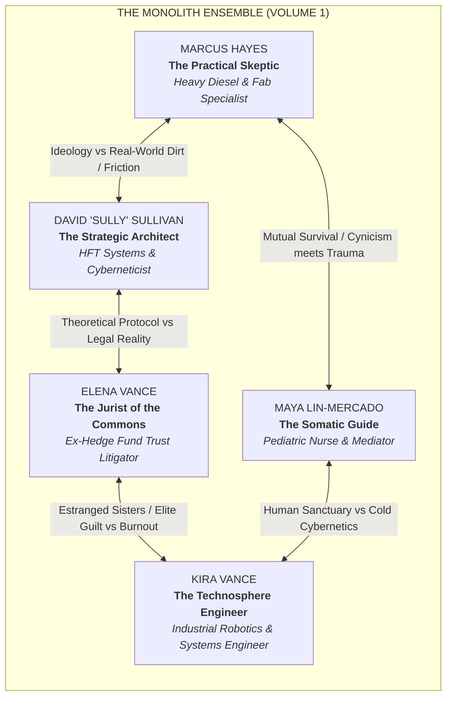
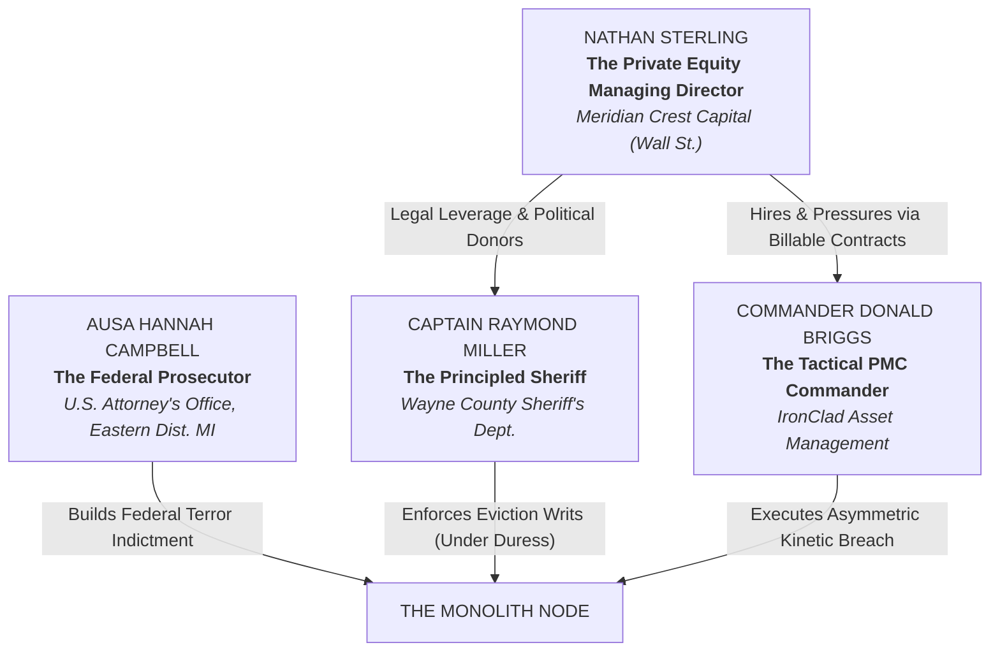
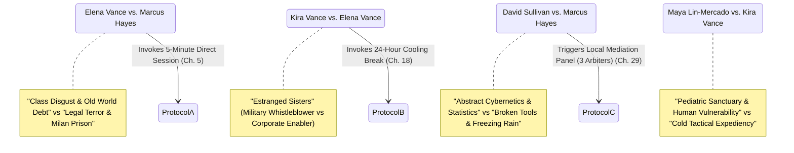

# **VOLUME 1: NORTH AMERICA ("GROUND ZERO")**
## **MASTER STORY REDLINE & CHARACTER BIBLE**

---

### **I. NARRATIVE GEOMETRY & VOLUME 1 SCOPE**

* **Setting:** The Detroit/Windsor Industrial Monolith — a decommissioned 500,000-square-foot automotive stamping and assembly complex located on **West Jefferson Avenue in the Delray district of Southwest Detroit**. The facility sits directly on the northern bank of the **Detroit River**, immediately adjacent to the mouth of the **Old Channel of the River Rouge** and **Zug Island**, looking directly across the 0.6-mile international waterway to the historic **Sandwich district of Windsor, Ontario, Canada**, framed between the **Ambassador Bridge** upstream and the new **Gordie Howe International Bridge** downstream.
* **Timeline:** Exactly **168 Hours (7 Days)**, opening at **23:42 UTC** (Prologue) and concluding at **168:00 UTC** (The Ambassador Bridge Convergence & Handover to Geneva).
* **Core O.N.E. Pillar in Demonstration:** **Automated Non-Lethal Defense, Rapid Micro-Fabrication, and Distributed Usufruct.**
* **The Existential Pressure:** A triangle siege conducted by Wall Street Private Equity (*Meridian Crest Capital*), weaponized corporate contractors (*IronClad Tactical / PMC* staging off the Norfolk Southern / Conrail rail sidings), and the Wayne County Sheriff’s Office, escalated by a looming Federal Domestic Terrorism Indictment from the U.S. Attorney’s Office for the Eastern District of Michigan.
* **The Friction Invariant & Pedagogical Realism:** As the opening volume of the saga's popularizing "Trojan Horse", Volume 1 must demonstrate that the triumph of O.N.E. is **never a frictionless, teleological algorithm**. The 100-year-old Delray stamping plant suffers catastrophic pipe leaks, circuit overloads, freezing drafts, and component failures; the cross-border laser link drops packets through thick river fog; and the pioneers constantly struggle with panic, exhaustion, and old-world conditioning. The model's validity is proven because it survives the harshest real-world friction, not because it acts as a magical panacea.

---

### **II. THE ENSEMBLE CAST: PROTAGONIST DOSSIERS**



---

#### **1. Marcus Hayes — The Practical Skeptic (The Artisan / Mechanic)**
* **Role:** Lead Maintenance, Heavy Machinery, Microgrid Hardware, Plumbing, and Tooling.
* **Age:** 49.
* **Physicality:** Thick-shouldered, barrel-chested, walking with a subtle limp from a collapsed hydraulic hoist twenty years ago. Hands permanently stained with graphite and motor oil; rough calluses; a split knuckle on his right index finger wrapped in electrical tape and shop rag. Wears a battered Carhartt canvas coat with frayed cuffs.
* **Backstory:** Third-generation Detroit auto worker. Lost his 27-year pension and family home in the 2009 automotive bankruptcies and municipal debt restructuring. Watched his union hall sell out its workers to private equity liquidation funds. Drowning in predatory subprime debt and unpaid medical bills from his late wife’s cancer treatment.
* **Psychological Ghost / Wound:** Severe betrayal trauma. Marcus trusts nothing that cannot be held in two hands or tested with a torque wrench. He believes all grand social systems, political parties, and philosophical manifestos are predatory scams designed by educated elites to fleece working people.
* **Dialogue Cadence & Voice:** Clipped, dry, profane, working-class Mid-Western. Uses concrete mechanical metaphors. Never philosophizes; immediately asks who is paying for the diesel, what the torque rating is, and what happens when the pump fails at 3:00 AM.
* **Reader Proxy Function:** Whenever an idea sounds too lofty or utopian, Marcus calls out its hypocrisy on the page, winning over cynical readers.

---

#### **2. Elena Vance — The Jurist / Strategist of the Commons (The Legal Shield)**
* **Role:** Trust Architecture, Cross-Border Foundation Law, Judicial Shielding, Restorative Injunctions.
* **Age:** 42.
* **Physicality:** Sharp, angular features, pale complexion, dark hair cut into an austere bob that is gradually coming undone under the humidity of the plant. Elegant Italian leather shoes now stained with yellow industrial clay; tailored wool coats worn over thermal work undershirts. Suffers from psychosomatic tremors in her left hand when adrenaline spikes.
* **Backstory:** Graduate of Harvard Law. Spent fifteen years as an equity partner at a premier corporate firm on Woodward Avenue, drafting predatory debt instruments, bankruptcy asset strips, and municipal privatization charters for hedge funds. Three months before Day Zero, she discovered that an eviction protocol she authored directly resulted in the freezing of heating assistance for three thousand low-income Detroit households, leading to multiple hypothermia deaths. She suffered a catastrophic nervous collapse, leaked forty gigabytes of client fraud records to public archives, and was instantly terminated, disbarred in state court, and blacklisted.
* **Psychological Ghost / Wound:** Crushing guilt and institutional paranoia. She knows precisely how evil the legal apparatus is because she helped design its teeth. She is terrified of federal prison (Milan Federal Correctional) and constantly battles the reflexive urge to resort to old-world legal subterfuge and backroom plea deals.
* **Dialogue Cadence & Voice:** Razor-sharp, precise, forensic, rapid-fire legal terminology delivered with nervous velocity. Cites jurisdictional code like weapon calibers.

---

#### **3. Kira Vance — The Technosphere Engineer (The Manufacturer)**
* **Role:** Distributed Automation, Industrial Firmware, Off-Grid Microgrids, Mechanical Defensive Interposition.
* **Age:** 35.
* **Physicality:** Lean, wiry, athletic build. Short crop of hair shaved on the sides; wears tactical utility pants, steel-toed flight boots, and a modified electronics harness with multimeter leads slung around her neck. Suffers from mild, high-frequency tinnitus in her right ear from an ordnance testing explosion.
* **Backstory:** Elena’s estranged younger sister. Aerospace and robotics engineer who designed target-acquisition and guidance algorithms for defense sub-contractors. Disillusioned and horrified when her autonomous surveillance prototypes were deployed against domestic civilian protests in Minneapolis and Atlanta. She deleted proprietary firmware keys, fled the military-industrial complex under the threat of Espionage Act prosecution, and went into hiding in the Great Lakes industrial fringe.
* **Psychological Ghost / Wound:** The "Machine God" complex and emotional detachment. Having witnessed human beings commit atrocities with technology, she trusts algorithms and automated feedback loops far more than people. She treats human relationships like mechanical assemblies to be debugged, often behaving callously when interpersonal tensions boil over.
* **The Sister Dynamic (Level 2 Tension):** Kira despises Elena for having spent her career funding the very corporate banks that bought weapons from military contractors; Elena views Kira as an arrogant, irresponsible savant who broke their parents' hearts. Their shared trauma from an abusive, debt-ridden childhood is the emotional powder keg inside the node.
* **Dialogue Cadence & Voice:** Terse, technical, analytical, devoid of sentimentality. Speaks in telemetry metrics, watt-hours, and latency figures.

---

#### **4. David "Sully" Sullivan — The Strategic Architect (The Theoretical Mind)**
* **Role:** Systemic Cybernetics, Thermodynamic Accounting, Covenant Administration, Network Simulation.
* **Age:** 47.
* **Physicality:** Tall, stooped posture, wire-rimmed glasses perpetually sliding down an aquiline nose. Greying beard, ink-stained fingers, wears rumpled tweed vests over faded turtlenecks. Rarely makes direct eye contact, constantly typing micro-telemetry into an air-gapped terminal.
* **Backstory:** MIT-trained mathematician and cyberneticist. Formerly designed algorithmic high-frequency trading (HFT) platforms on Wall Street that siphoned billions from pension funds during market flashes. Realizing that the global economic casino was actively consuming the biosphere's thermodynamic carrying capacity, he spent eight years formulating the mathematical proof for *Thermodynamic Usufruct*. He received the encrypted contact from a clandestine network of dissident engineers and jurists two years prior, providing initial seed capital and air-gapped cryptographic algorithms.
* **Psychological Ghost / Wound:** Intellectual hubris and profound emotional cowardice. Sully can calculate planetary exergy balances to nine decimal places, but freezes in terror when two human beings scream at each other in the same room. He views human panic as a "statistical variance" to be managed by the Covenant, risking severe alienation from the frontline workers.
* **Dialogue Cadence & Voice:** Measured, academic, polyphonic, rhythmically hypnotic. Tends to frame raw tactical emergencies in terms of cybernetic feedback loops, forcing Marcus to constantly swear at him to snap him back to reality.

---

#### **5. Maya Lin-Mercado — The Pedagogical & Somatic Guide (The Mediator)**
* **Role:** Child Sanctuary, Somatic Trauma De-Escalation, Conflict Mediation, Nutritional Distribution.
* **Age:** 39.
* **Physicality:** Warm, grounded presence; dark, expressive eyes with deep exhaustion lines beneath them. Strong, calloused hands accustomed to lifting patients and moving heavy supply crates. Wears comfortable layered knit sweaters and canvas aprons with medical trauma shears and calming essential oils in the pockets.
* **Backstory:** First-generation Mexican-American pediatric intensive care nurse and community organizer from Southwest Detroit. Five years ago, during the emergency municipal shutoff of public water infrastructure, her eight-year-old asthmatic son, Mateo, suffered a fatal respiratory arrest when emergency services were delayed by forty minutes due to privatized dispatch algorithms. She redirected her life into somatic trauma therapy and community alloparenting, determined that no child should ever die as collateral damage to a balance sheet.
* **Psychological Ghost / Wound:** Devastating maternal bereavement and ferocious protective rage. Maya will calmly step between a militarized tactical rifle and a crying child without blinking. Her blind spot is an absolute, uncompromising fury toward anyone—including Kira or Sully—who treats human beings or children as tactical pawns or acceptable casualties.
* **Dialogue Cadence & Voice:** Deep, calm, steady, hypnotic. Speaks with somatic awareness ("Feel your feet on the concrete, breath in through the teeth"). When pushed to anger, her voice drops to a terrifying, quiet whisper that silences the room.

---

### **III. THE HUMAN FACE OF THE OLD WORLD: ANTAGONIST DOSSIERS**



#### **1. Captain Raymond Miller (Wayne County Sheriff's Department)**
* **Age:** 58.
* **Role:** Frontline Law Enforcement Commander executing Eviction Order #26-881.
* **Motivation:** Miller is not corrupt; he is a tired, honorable civil servant two years from retirement. He grew up in Delray; his father worked thirty years in the same stamping plant alongside Marcus Hayes's father. He genuinely believes that if the law breaks down and squatters can seize 500,000-square-foot industrial complexes, Detroit will descend into total armed gang warfare and chaos.
* **Dramaturgical Conflict:** Miller hates the private equity vultures from New York, but he took an oath to uphold court orders. When the Monolith's automated steel shutters, welded I-beam hedgehogs, and optical strobe blinders halt his deputies without drawing a single drop of blood, Miller faces a shattering cognitive crisis: the "subversives" inside the factory are treating his men with more dignity than the private military contractors standing beside him.

#### **2. Commander Donald Briggs (IronClad Asset Management / PMC)**
* **Age:** 46.
* **Role:** Corporate Tactical Asset Recovery Commander.
* **Motivation:** Ex-Joint Special Operations Command (JSOC) contractor. He is paid $150,000 a week by Meridian Crest Capital to repossess high-value industrial machinery (specifically the CNC mills and lithium battery banks). Briggs is professional, lethal, and clinical; he views the pioneers not as ideological enemies, but as an irregular defensive perimeter to be dismantled through siege attrition, utility cutoffs, perimeter cordons, and psychological starvation.
* **The Rational Antagonist Layer:** Briggs is not a sadist; he is driven by a hardened soldier's terror of social disintegration. Having witnessed urban civil collapse and chaotic warlordism in failed states abroad, he genuinely believes that if private property rights and police authority collapse in Detroit, the region will devolve into violent gang predation. He sees his perimeter operations as maintaining the hard boundary between civil order and lawless bloodshed.
* **Tactical Vulnerability:** Briggs relies on predictable corporate escalation dominance. When the Monolith deploys *Class 0 Non-Lethal Defense* (heavy cast-iron barricades, pneumatic drop-gates, optical strobe arrays, and forensic banking leaks), his rules of engagement collapse because he cannot justify using lethal force on live global television.

#### **3. Nathan Sterling (Managing Director, Meridian Crest Capital)**
* **Age:** 51.
* **Role:** Wall Street Private Equity Asset Liquidator.
* **Motivation:** Operating from a corner office in Midtown Manhattan, Sterling purchased the Detroit plant’s toxic debt tranche for 4 cents on the dollar. He has presold the physical tooling and land rights to a Canadian logistics consortium for $68 million, with the closing deadline set for Friday at 17:00. If the plant is not cleared of squatters by Day 5, the contract defaults, triggering an catastrophic $200 million margin call that will destroy his hedge fund and his personal fortune.
* **The Rational Antagonist Layer:** Sterling is not a cartoon villain who takes pleasure in poverty. He possesses an articulate, deeply entrenched worldview: he believes that enforceable debt contracts, capital discipline, and private investment are the foundational nervous system of modern civilization. To Sterling, if squatters can unilaterally seize industrial plants and default on debt obligations, pension funds representing 40,000 retired autoworkers will collapse, capital will flee the continent, and millions of innocent families will starve in runaway hyperinflation. In his mind, he is defending the macroeconomic stability of the Western world against dangerous, romantic economic saboteurs.
* **Human Vulnerability:** Popping beta-blockers under crushing panic, battling insomnia, terrified of losing custody of his two teenage daughters in a bitter divorce proceeding if his fund implodes.

#### **4. Assistant U.S. Attorney Hannah Campbell (Eastern District of Michigan)**
* **Age:** 38.
* **Role:** Federal Prosecutor leading the Joint Terrorism Task Force investigation.
* **Motivation:** Brilliant, unyielding, and driven by a fierce belief in constitutional democracy. She genuinely believes the O.N.E. network is a radical, crypto-anarchist cult operating an illegal shadow government that brainwashes desperate citizens and hoards dual-use cybernetic weapons. She represents the formidable institutional intellect of the state.

---

### **IV. COMMUNITY & EMOTIONAL ANCHORS**

* **Toby Morales (17):** High school dropout from Delray whose father was deported; brilliant self-taught machinist apprentice under Marcus. Toby represents the next generation—terrified of police batons, but desperate for a world where his work actually builds a future rather than enriching a landlord.
* **Leo Mercado (7):** An autistic child in Maya’s care at the shared nursery. Highly sensitive to auditory shocks (sirens, helicopter thrumming). When the tactical siege begins, Leo’s sensory survival triggers the community’s alloparenting and somatic stabilization protocols, demonstrating to the reader that O.N.E. is built to protect the most vulnerable.

---

### **V. THE INTERPERSONAL FRICTION & COVENANT TRIGGER MATRIX**



1. **The 5-Minute Direct Session (Triggered in Chapter 5):**
   * *The Conflict:* Marcus attempts to barricade Gate 4 using toxic industrial chemical drums as psychological deterrents; Elena catches him and attempts to dump the drums, terrified of federal chemical hazard felonies.
   * *The Protocol:* Maya steps between them and invokes the 5-Minute Timed Session (Stage 1 Restorative Ladder). Elena speaks for five minutes while Marcus is forced to stand in total silence with a stopwatch running. Watching Marcus’s jaw clench while Elena describes her terror of federal prison breaks the hostility.
2. **The 24-Hour Cooling Break (Triggered in Chapter 18):**
   * *The Conflict:* When the aftershocks and broken clerestory glass from the Chapter 12 LRAD acoustic siege leave the nursery freezing, Kira suggests moving the children into a concrete basement adjacent to the high-voltage battery banks to act as a physical shield. Maya attacks Kira physically.
   * *The Protocol:* The Covenant enforces mandatory 24-hour communicative silence under Maya's somatic facilitation (Stage 2 Restorative Ladder). For an entire day, Kira and Maya are forced to work on food and battery supply logistics in absolute, suffocating silence.
3. **The Local Mediation Panel of 3 Arbiters (Triggered in Chapter 29):**
   * *The Conflict:* A municipal water main outside the perimeter bursts and 200 freezing neighborhood residents gather at Gate 1 asking for warmth and water. Should the node open the perimeter, risking infiltration by IronClad PMC spotters? Sully votes NO (protect node survival); Marcus votes YES (refusing makes them monsters).
   * *The Protocol:* The Covenant invokes Stage 3 of the Restorative Ladder (Art. 8.3 / Art. 4.2). Three residents are drawn completely at random from the brass sortition drum: Toby Morales (apprentice), Martha Gable (retired seamstress), and Lamar Washington (hospital orderly). Enforcing strict odd-number parity, the panel votes 2-1 (Toby and Martha voting YES) to open the gates, forcing Sully to submit to direct citizen democracy.

---

### **VI. THE 168-HOUR STORY REDLINE: MASTER BEAT SHEET (48 CHAPTERS)**

```
T-06:00:00 (PROLOGUE) ────────────────────────────────────────────────────────► T+168:00:00 (EPILOGUE)
[Day Zero Ignition]                                                           [Ambassador Bridge Climax]
  │                                                                             │
  ├─ PROLOGUE : The Unraveling (Hours T-06 to 00) — Stamping Plant, Delray     │
  ├─ PART I   (Ch 01–12): The Asymmetric Breach (Hours 00–48)                   │
  ├─ PART II  (Ch 13–24): The Structural Blockade (Hours 48–96)                 │
  ├─ PART III (Ch 25–36): Federal Escalation & Alibi Shatter (Hours 96–144)    │
  └─ PART IV  (Ch 37–48): The Ambassador Bridge Convergence (Hours 144–168)────┘
```

---

#### **PROLOGUE: THE UNRAVELING (T-Minus 06:00 to 00:00 before Day Zero)**
* **Temporal Marker:** Monday, October 12, 23:42 UTC $\rightarrow$ Tuesday, October 13, 05:42 UTC.
* **Geographic Grounding:** The Decommissioned Great Lakes Stamping & Assembly Plant, West Jefferson Avenue, Delray District, Southwest Detroit (situated at the confluence of the Detroit River and the Old Channel of the River Rouge, directly facing the Sandwich waterfront of Windsor, Ontario).
* **POV:** Marcus Hayes & Elena Vance.
* **The 4 Nested Matryoshka Subplots (Frontstage Human Heart):**
  1. *Matryoshka Layer 1 (Surrogate Paternity / Marcus & Toby):* Marcus shields 17-year-old Toby Morales, whose blue, shaking fingers hold the pliers over the workbench. Marcus sees his younger self in the boy, haunted by the memory of his late wife Sarah, who died when their medical coverage lapsed after the plant closed. Marcus is not saving a machine; he is fighting to keep Toby from being crushed by the street or a jail cell.
  2. *Matryoshka Layer 2 (The Class & Guilt Wound / Marcus vs. Elena):* Marcus lost his pension and family home to corporate hedge fund vultures on Woodward Avenue; Elena was an equity partner at that very firm. Elena broke down and fled after realizing her legal eviction boilerplate caused hypothermia deaths when heating was cut to low-income Detroit families. Shivering in ruined Italian loafers caked in Delray mud, she is terrified of federal prison (FCI Milan). Marcus's working-class contempt clashes violently with her somatic panic.
  3. *Matryoshka Layer 3 (The Human Sanctuary / Maya & Leo in Bay 4):* In the darkened shadows behind the dead stamping presses, Maya Lin-Mercado tends to 7-year-old autistic Leo and two elderly diabetic neighbors. If the backup generator dies before dawn, the insulin spoils and Leo enters an uncontrollable sensory shock. This gives Marcus’s frantic repair work an immediate, agonizing human deadline.
  4. *Matryoshka Layer 4 (The Breadcrumb Mystery / Kira’s Cipher):* The anonymous matte-black aluminum drive delivered via dead-drop envelope bears a tiny hand-scratched notch—a childhood geometry cipher known only to Elena and her estranged sister Kira Vance (the ex-DARPA drone engineer currently in hiding). Elena spots it in the beam of the flashlight, seeding the deep sibling fracture before Kira even enters the narrative.
* **The Cliffhanger Hook:** The siren of the Wayne County Sheriff and IronClad convoy begins to wail across the frozen Detroit River just as Marcus throws the high-voltage knife switch on the battery rack: mechanical contactors hammer shut with a deafening clack, the dead factory roars awake under clean 60 Hz LFP battery hum, and the rooftop FSO transceiver locks its line-of-sight laser beam across the black river onto the Canadian grain elevators in Sandwich, Ontario.

---

#### **PART I: THE ASYMMETRIC BREACH (Days 0–2 / Hours 00–48) — Chapters 1 to 12**
* **Dramatic Question:** Can five isolated, terrified pioneers hold a 500,000-sq-ft industrial perimeter against local tactical police and corporate mercenaries without firing a single lethal shot?
* **Pacing Arc:**
  * **Ch 1:** *The Breach at Gate 4.* (POV: Kira). Sheriff BearCats roll in; Kira triggers high-intensity industrial LED strobe arrays and pneumatic steel drop-curtains, while Marcus's welded I-beam hedgehogs stop the armored vehicles cold without drawing blood. The live stream of disciplined, non-violent mechanical defense goes viral.
  * **Ch 2:** *The Paper Bastion.* (POV: Elena). Elena confronts County Prosecutor on live broadcast, filing emergency Hague Trust filings. Meridian Crest's stock dips 4%.
  * **Ch 3:** *The First Usufruct Dispute.* (POV: Marcus). Inside the plant, two local squatters clash over using the CNC mill for water filters vs solar mounts. Marcus mediates under the Covenant.
  * **Ch 4:** *Blackout Protocol.* (POV: Sully). DTE cuts regional power. The Monolith’s islanded microgrid powers not only the plant, but twenty surrounding neighborhood blocks. The neighborhood wakes up to free power.
  * **Ch 5:** *The Five-Minute Crucible.* (POV: Marcus). Toxic drum barricade dispute between Elena and Marcus triggers the first 5-Minute Direct Session.
  * **Ch 6:** *The Infiltration.* (POV: Kira). IronClad operators cut through river docks at 02:00. Kira’s thermal cameras guide Marcus to trap them in an abandoned paint-curing bay using magnetic door interlocks.
  * **Ch 7:** *The Media Hive.* (POV: Maya). National news portrays the node as an armed cult. Maya opens a window to show live neighborhood mothers utilizing the shared nursery.
  * **Ch 8:** *The Cross-Border Handshake.* (POV: Sully). The rooftop FSO laser bridge attempts to lock across the Detroit River to the Canadian terminal in historic Sandwich. Thick autumn river fog causes 42% optical packet loss; Toby and Marcus must climb the icy gantry crane in sub-zero wind under blinding deputy searchlights to manually align the transceiver prism before the transmission buffer overflows. Encrypted telemetry finally locks, downloading forensic banking records proving Meridian Crest falsified the plant's 2018 environmental mortgage deeds.
  * **Ch 9:** *Miller’s Doubt.* (POV: Sheriff Miller). Miller visits Marcus Hayes under a 15-minute white flag. Personal confrontation: two childhood friends on opposite sides of a wire fence.
  * **Ch 10:** *The Broken Spindle.* (POV: Marcus). CNC mill spindle overheats while milling emergency prosthetic sleeves. Toby Morales risks third-degree burns to salvage the bearing.
  * **Ch 11:** *The Corporate Injunction.* (POV: Elena). Federal Judge Kowalski issues an emergency civil seizure warrant; Elena discovers a clause proving Meridian Crest falsified the mortgage deed in 2018.
  * **Ch 12 (Part I Climax):** *The Acoustic Siege.* (POV: Kira & Marcus). IronClad mounts LRAD acoustic sound cannons on rail flatbeds to shatter clerestory glass and deafen the defenders. Maya distributes industrial hearing protection; Marcus and Toby stack heavy automotive rubber conveyor belts and fiberglass insulation to baffle the sound; Kira flies a utility drone carrying a leaded sound-deadening blanket directly over the LRAD horn, while Marcus douses the contractor's rail generator with an industrial fire hose, repelling the assault.

---

#### **PART II: THE STRUCTURAL BLOCKADE (Days 2–4 / Hours 48–96) — Chapters 13 to 24**
* **Dramatic Question:** When the state cuts off municipal water and freezes food supplies, can the node prove the biological superiority of circular commons?
* **Pacing Arc:**
  * **Ch 13:** *The Dry Tap.* (POV: Maya). Water pressure drops to zero. 300 residents face dehydration within 48 hours.
  * **Ch 14:** *The Rouge Aquifer Bypass.* (POV: Marcus). Marcus and Toby drill into an abandoned 1920s subterranean aquifer shaft beneath Bay 3 near the River Rouge channel.
  * **Ch 15:** *The Sister Standoff.* (POV: Kira). Kira and Elena clash over their father’s deathbed debt; old childhood wounds erupt into venomous accusations.
  * **Ch 16:** *Aeroponic Bloom.* (POV: Sully). Closed-loop aeroponics bay assembled in 36 hours using 3D-printed misting nozzles; first harvest of fast-growing nutrient greens.
  * **Ch 17:** *The Trojan Food Run.* (POV: Toby). Local youth smuggle baby formula into the plant via storm sewers; an IronClad patrol catches Toby.
  * **Ch 18:** *The 24-Hour Silence.* (POV: Maya). Following a violent screaming row between Kira and Maya over child safety, the Covenant mandates 24 hours of total silence.
  * **Ch 19:** *The Silent Shift.* (POV: Marcus). Marcus watches Maya and Kira repair an emergency oxygen generator side-by-side in suffocating, disciplined quiet.
  * **Ch 20:** *The Transalpine Handshake.* (POV: Sully). Telemetry arrives from Node 2 (Swiss-Italian border), but not without intense friction: the European sortition assembly hesitates for six hours, divided over whether risking their own local legal protection to aid Detroit is reckless. After a razor-thin vote, they execute an unindexed legal lien against Meridian Crest’s European debt facility, buying Detroit a precious 24-hour reprieve.
  * **Ch 21:** *Leo’s Sensory Storm.* (POV: Maya). Police helicopters hover at 100 feet; Leo experiences a massive autistic meltdown. Maya leads the community in somatic collective pacing.
  * **Ch 22:** *The Turncoat at the Gate.* (POV: Elena). An IronClad private security guard, disgusted by orders to cut water to infants, slips a thumb drive through the fence containing Briggs’s tactical breach map.
  * **Ch 23:** *The Toxic Slander.* (POV: Elena). A national cable network airs a fabricated report alleging the node is manufacturing dirty radiological bombs.
  * **Ch 24 (Part II Climax / Midpoint):** *The River Rouge Intake Cut.* (POV: Marcus). Agrochemical tanker dumps toxic dye into the Old Channel of the River Rouge. Marcus dives into the freezing flooded sump to manually close the intake valve before it ruins the drinking supply.

---

#### **PART III: FEDERAL ESCALATION & THE ALIBI SHATTER (Days 4–6 / Hours 96–144) — Chapters 25 to 36**
* **Dramatic Question:** Who is the Invisible Mind, and can the Founders' Covenant survive an internal treason trial and a federal terrorist task force?
* **Pacing Arc:**
  * **Ch 25:** *The Federal Warrant.* (POV: AUSA Hannah Campbell). Joint Terrorism Task Force stages 80 federal marshals and HRT tactical squads at the Ambassador Bridge US Customs & Cargo Plaza on West Fort Street in Southwest Detroit.
  * **Ch 26:** *The Red Herring.* (POV: Marcus). Marcus discovers a cryptographic hardware key in Sully’s coat matching the exact syntax of the Satoshi white paper. Marcus corners Sully with a wrench.
  * **Ch 27:** *Sully’s Confession.* (POV: Sully). Sully admits he received the key from an anonymous dead-drop in Zurich, but swears he is not the mastermind.
  * **Ch 28:** *The Neighbor Influx.* (POV: Maya). 200 Detroit residents, shivering from citywide heating blackouts, arrive at Gate 1 on West Jefferson asking for warmth.
  * **Ch 29:** *The Sortition of Three.* (POV: Marcus). The community convenes an emergency Local Mediation Panel under the Covenant (Stage 3 Restorative Ladder, Art. 8.3). Three citizens drawn by lot (Toby, Mrs. Gable, Lamar Washington) vote 2-1 to open Gate 1, admitting the freezing neighbors and validating direct sortition democracy.
  * **Ch 30:** *The Industrial Wall.* (POV: Kira & Marcus). IronClad launches a coordinated night raid with armored bulldozers. Marcus and Kira push a 40-ton rail hopper car across the spur track and drop coiled 2-inch steel hoist cables that wrap around drive sprockets, seizing the bulldozer tracks mechanically without explosives or gunfire.
  * **Ch 31:** *The Alibi Shatter.* (POV: Elena). While Sully, Marcus, and Kira are trapped in a basement interrogation during an emergency brownout, an independent forensic alert surfaces: independent civic auditors in Europe, scrutinizing public registries made transparent by Node 2, expose Meridian Crest's fraudulent collateral, triggering an autonomous, non-negotiable $40 million margin call against Sterling’s Manhattan clearinghouse. The breakthrough is an emergent systemic victory of open ledgers, shattering the myth of a single heroic puppeteer.
  * **Ch 32:** *The Informant Exposed.* (POV: Elena). Elena unmasks an internal resident secretly passing cell telemetry to Briggs. Instead of violence, the node invokes Restorative Spatial Quarantine.
  * **Ch 33:** *The Latin American Pulse.* (POV: Sully). Node 3 (Andean Basin) transmits sovereign water rights telemetry that matches the Detroit aquifer legal framework.
  * **Ch 34:** *Campbell’s Doubt.* (POV: Hannah Campbell). Campbell reviews the live telemetry from the plant; she realizes the node has not broken a single federal statute, and that Meridian Crest committed mortgage fraud.
  * **Ch 35:** *The Ticking Margin Call.* (POV: Nathan Sterling). Sterling’s Wall Street investors demand immediate liquidation. Sterling orders Briggs to execute an all-out, live-fire raid at dawn.
  * **Ch 36 (Part III Climax):** *The Midnight Standoff.* (POV: Marcus). Briggs’s snipers illuminate the plant roof with red laser sights. Marcus stands on the parapet unarmed, holding an open spotlight, refusing to blink.

---

#### **PART IV: THE AMBASSADOR BRIDGE CONVERGENCE (Days 6–7 / Hours 144–168) — Chapters 37 to 48**
* **Dramatic Question:** Can radical transparency and mass civil solidarity break a corporate military siege and force the state to acknowledge universal usufruct?
* **Pacing Arc:**
  * **Ch 37:** *The March Begins.* (POV: Maya). 5,000 Detroit citizens, automotive workers, and nursing staff march down West Jefferson Avenue toward the Monolith, carrying food and thermal blankets.
  * **Ch 38:** *The Canadian Counterpart.* (POV: Sully). Unifor automotive workers (Locals 444 & 195) in Windsor, Ontario, launch an identical solidarity march down Riverside Drive West and up Huron Church Road through historic Sandwich toward the Ambassador Bridge Canadian plaza.
  * **Ch 39:** *The Bridge Stoppage.* (POV: Marcus). Commercial truck traffic across the busiest international border crossing in North America halts as citizens from both nations form an unbroken human chain across the Ambassador Bridge span.
  * **Ch 40:** *Miller’s Mutiny.* (POV: Sheriff Miller). County Executive orders Miller to deploy tear gas against the citizens. Miller removes his badge and orders his deputies to protect the marchers from IronClad PMCs.
  * **Ch 41:** *The Federal Collapse.* (POV: Elena). Elena and Hannah Campbell meet on neutral ground at the Ambassador Bridge toll plaza. Elena presents undeniable blockchain ledger proof of Meridian Crest's securities fraud. Campbell revokes the federal warrant.
  * **Ch 42:** *Briggs’s Final Stand.* (POV: Kira). Disgraced and contractually defaulted, Briggs attempts to destroy the Monolith's primary fabrication bay with thermite charges.
  * **Ch 43:** *The Non-Lethal Cage.* (POV: Kira & Marcus). Kira and Marcus trap Briggs inside the heavy stamping bay by cutting the release clutches of the 50-ton overhead gantry, dropping a 4-ton cast-iron stamping die into the trackway and tripping the mechanical counterweight fire-curtain bulkheads. Disarmed and contained, not a single shot is fired.
  * **Ch 44:** *The Sister Reconciliation.* (POV: Elena & Kira). Amidst the cooling machinery and sunrise over the Detroit River, Elena and Kira finally confront their father’s memory, forgiving each other for their divergent paths.
  * **Ch 45:** *The Wall Street Default.* (POV: Nathan Sterling). 17:00 Friday hits. Meridian Crest’s loans default. Federal Marshals raid Sterling’s Manhattan office for securities embezzlement.
  * **Ch 46:** *The Micro-Commons Proclamation.* (POV: Marcus). Marcus stands before 10,000 citizens in the open stamping bay, declaring the Monolith an open, public usufruct common for all workers of the Great Lakes basin.
  * **Ch 47:** *The 05:42:00 Anniversary (Gate 1 -> 2 Verification).* (POV: Sully). The clock strikes 168:00:00 UTC (Exactly 7 days since Day Zero). Achieving the formal **Gate 1 -> 2 Phase Transition** (168 consecutive hours of energy/water self-sufficiency and cryptographically verified bidirectional physical swap between Detroit and Sandwich/Windsor). All four global nodes achieve steady-state thermodynamic balance.
  * **Ch 48 (Volume 1 Climax):** *The Sovereign Sortition Call.* (POV: Ensemble). The cross-border optical relay connects through commercial transatlantic maritime fiber cables to all four international nodes. The Invisible Mind issues the final verified directive: each continental node must select three citizens by lot to travel to Geneva as the founding delegation toward the 1,001-member Global Commons Assembly.
* **EPILOGUE:** *The Ticket to Geneva.* (POV: Toby Morales & Marcus Hayes). Marcus watches 17-year-old Toby Morales’s name drawn alongside Clara Ramos and Jean-Marc Tremblay from the brass sortition drum to represent the Great Lakes bioregion at the United Nations General Assembly in Geneva.
