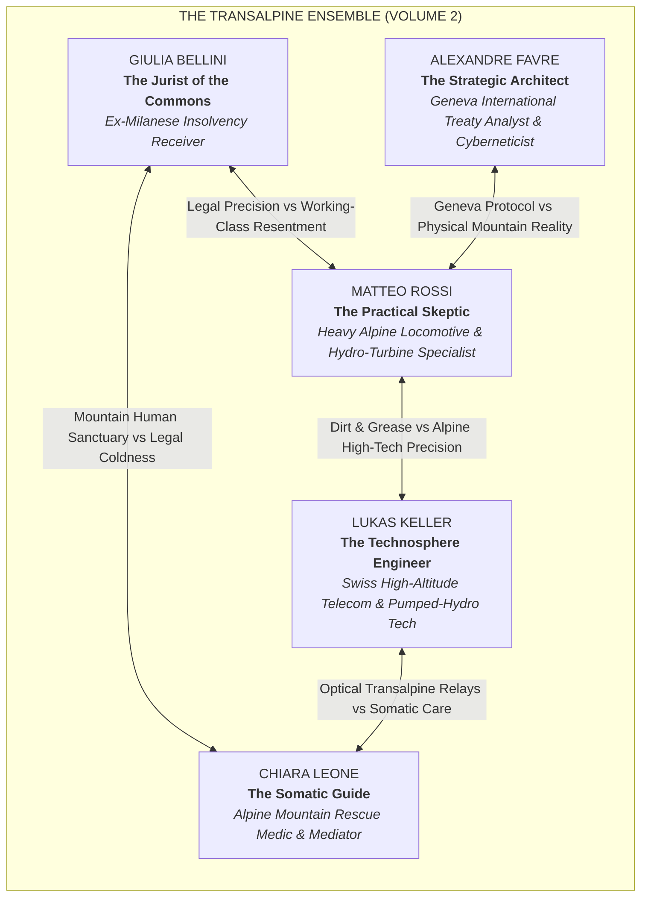
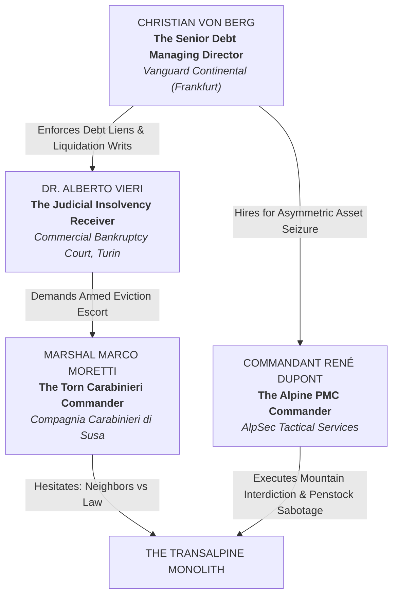

# **VOLUME 2: EUROPE ("THE TRANSALPINE CORRIDOR")**
## **MASTER STORY REDLINE & CHARACTER BIBLE**

---

### **I. NARRATIVE GEOMETRY & VOLUME 2 SCOPE**

* **Setting:** The Transalpine Rail & Metallurgical Complex — a decommissioned 400,000-square-foot industrial freight terminal and alpine rail-marshalling yard situated in the **Val di Susa at the mouth of the Fréjus Alpine Tunnel (Italian/French border)**, extending its line-of-sight laser relays through the high passes toward the **Swiss Canton of Valais and Lake Geneva**.
* **Timeline:** Exactly **168 Hours (7 Days)**, opening at **05:42 UTC ("Day Zero")** synchronized with the Detroit/Windsor ignition in Volume 1, and concluding at **168:00 UTC** (The Geneva Alpine Tunnel Handover & UN General Assembly Convergence).
* **Core O.N.E. Pillar in Demonstration:** **The Perpetual Asset-Locked Commons, Cross-Border Hague Trusts, Hydro-Kinetic Microgrids, and Restorative Direct Sortition.**
* **The Existential Pressure:** A judicial and corporate siege orchestrated by the **Frankfurt Financial Syndicate (*Vanguard Continental Debt Fund*)**, corrupt court-appointed bankruptcy receivers from Turin and Milan, and militarized private rail-security operators (*AlpSec Tactical*), backed by an emergency European arrest warrant under cross-border anti-sabotage directives.
* **The Friction Invariant & Pedagogical Realism:** To preserve the saga's popularizing integrity, the Transalpine node must **never operate as an effortless utopian enclave**. The alpine climate imposes brutal thermodynamic friction: freezing penstocks at -14°C, ice encrusting optical laser domes at 3,500 meters on Mount Rocciamelone, mountain avalanches severing secondary cables, and acute psychological hesitation among conservative mountain villagers who fear criminal prosecution. The validity of O.N.E.'s legal and hydro commons is proven under agonizing real-world stress.

---

### **II. THE ENSEMBLE CAST: PROTAGONIST DOSSIERS**



---

#### **1. Giulia Bellini — The Jurist of the Commons (The Legal Bastion)**
* **Role:** Cross-Border Foundation Law, Hague Civil Trusts, De-Privatization Injunctions, Restorative Panels.
* **Age:** 44.
* **Physicality:** Tall, sharp, dark eyes shadowed by chronic insomnia; tailored wool overcoats worn over heavy thermal mountain sweaters; damp leather Chelsea boots caked in Val di Susa gravel. Hands trembling slightly under severe adrenergic pressure.
* **Backstory:** Former senior bankruptcy trustee at a prestigious commercial court in Milan. Spent twelve years liquidating public hospitals, regional railway lines, and municipal water grids on behalf of private equity syndicates. When an emergency liquidation order she signed resulted in the cutoff of heating and emergency power to 1,200 mountain families during the blizzard of 2023, she suffered a moral collapse, stole three encrypted hard drives of offshore debtor fraud, and vanished into the western Alps.
* **Psychological Ghost / Wound:** Overwhelming guilt for having been the legal executioner of the working class. She is terrified of extradition to the high-security penitentiary in Turin (Le Vallette) and fights the reflexive urge to negotiate backroom settlements.
* **Voice & Cadence:** Razor-sharp, forensic, speaking Italian with the crisp velocity of a court litigator, alternating between clinical legal terminology and desperate moral clarity.

---

#### **2. Matteo Rossi — The Practical Skeptic (The Artisan / Mechanic)**
* **Role:** Lead Mechanics, Hydro-Electric Turbines, Rail Marshaling, Physical Fortification.
* **Age:** 51.
* **Physicality:** Broad-chested, thick forearms scarred by torch slag; permanent diesel and hydraulic grease beneath his fingernails. Wears a faded mountain work jacket with patched elbows and heavy steel-toed mountaineering boots.
* **Backstory:** Third-generation alpine railway mechanic and hydro-plant operator. Lost his pension and home during the corporate privatization of the regional rail transport network. Watched his union betrayed by political compromises. Drowning in unpayable private bank loans taken to pay for his late brother Paolo's silicosis treatments.
* **Psychological Ghost / Wound:** Deep, stubborn cynicism. He trusts only torque, steel, gravity, and the cold water of alpine torrents. He believes all grand European treaties are predatory tricks designed by banking technocrats to enslave valley people.
* **Voice & Cadence:** Low, gravelly, Piedmontese-tinged Italian. Sarcastic, practical, unyielding. Demands to know who pays for the grease, where the spare bearings come from, and what happens when the mountain freezes at -15°C.

---

#### **3. Lukas Keller — The Technosphere Engineer (The Manufacturer)**
* **Role:** High-Altitude Optical Laser Relays, Distributed Micro-Hydro, Automated Non-Lethal Defense.
* **Age:** 36.
* **Physicality:** Lean, tall, fair-haired, wearing mountaineering Gore-Tex shells and an electronics tool harness. Suffering from partial frostbite damage in two fingers of his left hand from an avalanche rescue mission.
* **Backstory:** Former senior telecommunications firmware designer in Zurich. Disillusioned after uncovering that European border surveillance drones he programmed were being used to hunt down refugees in freezing alpine passes.
* **Voice & Cadence:** Precise, Swiss-accented Italian and English, speaking with calm, analytical metric precision.

---

#### **4. Chiara Leone — The Somatic Guide (The Healer)**
* **Role:** Valley Sanctuary, Mountain Rescue Triage, Somatic De-escalation, Founders' Covenant Mediation.
* **Age:** 39.
* **Physicality:** Weather-beaten face, kind amber eyes, strong athletic build from twenty years of alpine rescue.
* **Backstory:** Lead emergency paramedic in the Susa Valley. Lost her daughter to an untreated asthma attack when local emergency clinics were privatized and shuttered.
* **Psychological Ghost / Wound:** Inconsolable maternal grief transformed into a fierce, protective maternal sanctuary for every vulnerable human being in the valley.

---

#### **5. Alexandre Favre — The Strategic Architect (The Internationalist)**
* **Role:** International Treaty Counter-Warfare, Sortition Engineering, Geneva Nexus Communications.
* **Age:** 41.
* **Physicality:** Slender, thoughtful, wire-frame glasses, woolen scarves.
* **Backstory:** Disillusioned international lawyer and cyberneticist who spent fifteen years in the backrooms of the UN and WTO in Geneva, realizing that international law exists purely to protect multinational debtor claims.

---

### **III. THE HUMAN FACE OF THE OLD WORLD: ANTAGONIST DOSSIERS**



#### **1. Director Christian Von Berg (Managing Director, Vanguard Continental Debt Fund, Frankfurt)**
* **Age:** 54.
* **Role:** European Distressed Debt Strategist & Sovereign Bond Architect.
* **The Rational Antagonist Layer:** Von Berg is not a cartoon villain. He oversees sovereign and municipal debt tranches that underpin the pension funds, healthcare reserves, and infrastructure bonds of 400 million European citizens. In his coherent worldview, the absolute enforceability of debt contracts and private capital discipline are the sole barriers preventing hyperinflation, currency collapse, and continental starvation. To Von Berg, the Susa pioneers are reckless, romantic eco-anarchists whose refusal to honor debt obligations threatens to trigger systemic contagion across European bond markets. He sincerely believes he is defending the macroeconomic stability of the European continent.
* **Human Vulnerability:** Suffers from severe hypertension, taking blood pressure medication while pacing his glass corner office in Frankfurt's financial district at 03:00 AM, terrified that if Susa successfully legally locks its assets under the Hague Convention, Vanguard’s multi-billion-euro liquidity pool will freeze.

#### **2. Maresciallo Marco Moretti (Compagnia Carabinieri di Susa)**
* **Age:** 52.
* **Role:** Frontline State Law Enforcement Commander.
* **The Rational Antagonist Layer:** Born in Bussoleno, Moretti knows every machinist, baker, and railway worker in the valley. He took an oath to uphold the Italian Constitution and the orders of the judiciary. He believes that if individual citizens can unilaterally decide which court rulings to obey, the republic collapses into violent vigilante rule and chaos.
* **Dramaturgical Conflict:** He detests the arrogance of corporate lawyers arriving from Frankfurt and Milan, but his duty requires him to enforce judicial eviction writs. When the node uses non-lethal hydro-deflectors and feeds the shivering townspeople without drawing a weapon, Moretti’s conscience fractures.

#### **3. Dr. Alberto Vieri (Court-Appointed Bankruptcy Receiver, Commercial Court of Turin)**
* **Age:** 47.
* **Role:** Legal Asset Stripper & Liquidator.
* **Motivation:** A rigid, meticulous legal positivist. Vieri does not hate the workers; he believes with bureaucratic purity that property belongs strictly to those holding registered legal title. To his mind, the law is blind and must be applied without sentimental exceptions.

#### **4. Commandant René Dupont (AlpSec Tactical Asset Protection)**
* **Age:** 48.
* **Role:** High-Altitude Corporate Tactical Security Commander.
* **Motivation:** Ex-French Mountain Commandos (*Chasseurs Alpins*). Methodical, professional, and calculating. He treats the siege of the rail complex as a high-altitude mountain containment exercise, focusing on utility interdiction, severed penstocks, avalanche barriers, and freezing out the defenders without causing televised lethal casualties.

---

### **IV. THE 168-HOUR MASTER REDLINE (PROLOGUE, 48 CHAPTERS, EPILOGUE)**

```
05:42 UTC (PROLOGUE) ────────────────────────────────────────────────────────► 168:00 UTC (EPILOGUE)
[Synchronized Day Zero Ignition]                                              [Geneva Alpine Tunnel Handover]
  │                                                                             │
  ├─ PROLOGUE : The Alpine Breach (Hours T-06 to 00) — Susa Rail Complex       │
  ├─ PART I   (Ch 01–12): The Mountain Fortress (Hours 00–48)                  │
  ├─ PART II  (Ch 13–24): The Frozen Siege & The Aqueduct (Hours 48–96)        │
  ├─ PART III (Ch 25–36): Transalpine Laser Mesh & Legal Default (Hours 96–144)│
  ├─ PART IV  (Ch 37–48): The Fréjus Tunnel March (Hours 144–168)              │
  └─ EPILOGUE : The Assembly of the Alps (Geneva Border Convergence)───────────┘
```

---

#### **PROLOGUE: THE ALPINE BREACH (T-Minus 06:00 to 00:00 before Day Zero)**
* **Temporal Marker:** Monday, October 12, 23:42 UTC $\rightarrow$ Tuesday, October 13, 05:42 UTC.
* **Geographic Grounding:** The Decommissioned Transalpine Freight Roundhouse & Marshaling Yard, Val di Susa at the mouth of the Fréjus Alpine Tunnel, Piedmont, Italy.
* **POV:** Giulia Bellini & Matteo Rossi.
* **The 4 Nested Matryoshka Subplots (Frontstage Human Heart):**
  1. *Matryoshka Layer 1 (Surrogate Paternity / Matteo & Davide):* Matteo guides 19-year-old apprentice Davide through unfreezing the Pelton turbine intake valve; Matteo is haunted by his late brother Paolo who suffocated from untreated rail silicosis.
  2. *Matryoshka Layer 2 (The Class & Guilt Wound / Matteo vs. Giulia):* Matteo's deep hatred for Milanese corporate liquidators clashes with Giulia's sheer panic of extradition to Le Vallette prison in Turin after stealing Vanguard's fraud dossiers.
  3. *Matryoshka Layer 3 (The Human Sanctuary / Chiara & Valley Elders):* In the warm locomotive inspection shed, Chiara tends to forty shivering valley elders and an asthmatic boy whose electric inhaler depends on the turbine starting.
  4. *Matryoshka Layer 4 (The Breadcrumb Mystery / Alexandre's Swiss Key):* Alexandre holds a cryptographic hardware key stamped with the same anonymous geometric cipher surfacing in Detroit.
* **The Cliffhanger Hook:** At 05:42 UTC, as Detroit ignites, Matteo hammers the high-pressure hydro valve; the Pelton runner roars to life under 600 meters of glacial head; Lukas’s laser transceiver fires a blinding cyan-blue beam piercing the blizzard toward the Swiss summit of Rocciamelone just as AlpSec tactical convoys screech outside the gates.

---

#### **PART I: THE MOUNTAIN FORTRESS (Hours 00–48) — Chapters 1 to 12**
* **Dramatic Question:** Can five isolated alpine pioneers hold an 80-acre rail terminal against private military contractors and judicial seizure without firing a shot?
* **Pacing Arc:**
  * **Ch 1:** *The Ballast Gate.* (POV: Matteo). AlpSec tactical vans attempt to breach Gate 1; Matteo trips the mechanical gravity release on an 80-ton gravel hopper car, locking the turntable.
  * **Ch 2:** *The Hague Bastion.* (POV: Giulia). Bankruptcy receiver Dr. Vieri serves liquidation writ #44-12; Giulia serves certified Hague Convention perpetual trust filings registered in Canton Valais.
  * **Ch 3:** *The First Hydro Dispute.* (POV: Matteo). Local machinists argue over allocating the 4.2 MW Pelton turbine output between track heaters and hospital lines; mediated under the Covenant.
  * **Ch 4:** *The Cold Blackout.* (POV: Lukas). Regional utility Enel cuts the valley grid; the terminal’s microgrid powers 2,000 freezing mountain homes across Susa and Bussoleno.
  * **Ch 5:** *The Five-Minute Crucible.* (POV: Giulia). Violent clash between Giulia's legal risk-aversion and Matteo's instinct to weld the switchyard triggers the 5-Minute Direct Session.
  * **Ch 6:** *The Tunnel Probe.* (POV: Lukas). AlpSec mercenaries infiltrate the Fréjus emergency ventilation gallery; Lukas triggers high-pressure water mist deflectors, driving them back harmlessly.
  * **Ch 7:** *The Media Smear.* (POV: Chiara). Milanese business news labels the node an armed terror cell; Chiara livestreams the roundhouse clinic showing grandmothers baking bread.
  * **Ch 8:** *The Transalpine Laser Lock.* (POV: Alexandre). Lukas attempts to lock the rooftop FSO infrared laser onto the high-altitude Swiss repeater at Col du Mont-Cenis. A blinding blizzard at 2,000 meters causes heavy optical scattering and 45% packet loss; Lukas must scale the exterior hydro-tower in -12°C winds to manually scrape ice from the optical dome with a brass spatula. The encrypted beam locks, transmitting critical Hague trust filings to Zurich and Detroit.
  * **Ch 9:** *The Marshal’s Hesitation.* (POV: Marshal Moretti). Carabinieri commander Moretti meets Matteo under a white flag at the level crossing; a moral officer torn between duty and his starving neighbors.
  * **Ch 10:** *The Frozen Runner.* (POV: Matteo). Pelton needle valve jams with glacial silt; apprentice Davide and Matteo crawl into the inspection pit at -8°C to free the nozzle by hand.
  * **Ch 11:** *The Frankfurt Injunction.* (POV: Giulia). Frankfurt syndicate Vanguard Continental secures an emergency European Arrest Warrant; Giulia uncovers Vanguard's falsified hospital debt tranches.
  * **Ch 12 (Part I Climax):** *The Glacial Flume Defense.* (POV: Lukas & Matteo). AlpSec mountain commandos scale the frozen gorge with hydraulic cutting torches and thermal drones to sever the 600-meter hydro penstock cable; Matteo and Lukas trigger the emergency pressure-relief bypass, creating a massive, 50-meter freezing glacial water curtain that blinds the drones' optics and encases the climbers' ropes in instant ice, repelling the assault completely without lethal violence.

---

#### **PART II: THE FROZEN SIEGE & THE AQUEDUCT (Hours 48–96) — Chapters 13 to 24**
* **Dramatic Question:** When the banking syndicate shuts off natural gas in -14°C weather, can the node prove the biological superiority of circular hydro-commons?
* **Pacing Arc:**
  * **Ch 13:** *The Pipeline Cut.* (POV: Chiara). Vanguard cuts regional natural gas pipelines. The valley temperature plunges; Chiara triages hypothermic arrivals in the roundhouse.
  * **Ch 14:** *The Glacial Flume Bypass.* (POV: Matteo). Matteo and Davide climb 800 meters through a blizzard to unfreeze an ancient stone flume, channeling glacial meltwater to save the turbine.
  * **Ch 15:** *The Sibling Fracture.* (POV: Alexandre). Alexandre’s brother, a senior Vanguard Frankfurt director, calls offering an escape deal; Alexandre rejects corporate privilege.
  * **Ch 16:** *The Roundhouse Greenhouse.* (POV: Chiara). In the warmth behind the hydro-turbine, residents build aeroponic food beds using recycled railway ties and steam radiators.
  * **Ch 17:** *The Mountain Smuggle.* (POV: Davide). Alpine youth ski patrollers smuggle infant formula and antibiotics across the French border via unguarded high-altitude cols.
  * **Ch 18:** *The 24-Hour Silence.* (POV: Chiara). A furious screaming match between Giulia and Lukas over transmitting resident manifests triggers the mandatory 24-Hour Cooling Break.
  * **Ch 19:** *The Silent Solder.* (POV: Matteo). Matteo and Giulia work side-by-side in complete silence repairing an emergency 500-volt transformer core while the gale howls outside.
  * **Ch 20:** *The Detroit Handshake.* (POV: Alexandre). Telemetry arrives from Detroit (Node 1) across the transatlantic underwater cable relay, but transatlantic routing jitters and Detroit's river fog require three manual verification resends. The cryptographic handshake finally clears, proving both nodes have achieved continuous islanded microgrid stability and validating cross-continental solidarity.
  * **Ch 21:** *The Avalanche Siren.* (POV: Chiara). Heavy snowfall and low-flying police helicopters threaten an avalanche; Chiara coordinates somatic grounding and emergency shelter.
  * **Ch 22:** *The Whistleblower in the Snow.* (POV: Giulia). A junior German accountant from Vanguard defects, hiking through the snow to deliver encrypted drives revealing Frankfurt's bankruptcy fraud.
  * **Ch 23:** *The Blackout Accusation.* (POV: Alexandre). Corporate television claims the Susa hydro plant is draining the regional reservoir; Alexandre publishes open carrying-capacity telemetry proving 100% water return.
  * **Ch 24 (Part II Climax / Midpoint):** *The Penstock Sabotage.* (POV: Matteo). AlpSec saboteurs cut the hydraulic governor line on the 600m penstock. Matteo races up the ice-coated steel catwalk, manually releasing the mechanical counterweight butterfly valve before the penstock ruptures.

---

#### **PART III: TRANSALPINE LASER MESH & LEGAL DEFAULT (Hours 96–144) — Chapters 25 to 36**
* **Dramatic Question:** Can cross-border peer-to-peer solidarity nullify a European financial syndicate's foreclosure machine?
* **Pacing Arc:**
  * **Ch 25:** *The European Warrant.* (POV: Chief Prosecutor De Luca). Interpol and state prosecutors deploy at Bardonecchia station with armored crowd-control trains.
  * **Ch 26:** *The Red Herring Key.* (POV: Matteo). Matteo finds a Swiss encrypted keycard in Alexandre’s briefcase; furious suspicion that Alexandre is an undercover Vanguard agent.
  * **Ch 27:** *Alexandre’s Confession.* (POV: Alexandre). Alexandre reveals the key was left for him in Geneva by the anonymous Invisible Mind, proving his innocence.
  * **Ch 28:** *The Valley Exodus.* (POV: Chiara). Over 1,500 valley residents, lacking heating in municipal housing, arrive at the rail complex seeking warmth and community kitchen.
  * **Ch 29:** *The Sortition of Three.* (POV: Matteo). Community convenes a Stage 3 Local Mediation Panel (Art. 8.3); three randomly drawn residents (Davide, a retired schoolteacher Signora Rossi, and an alpine guide) vote 2-1 to open the locomotive bays to the public.
  * **Ch 30:** *The Locomotive Barricade.* (POV: Matteo & Lukas). AlpSec tries to enter through the rail spur with armored rail loaders; Matteo shunts two dead 1970s diesel locomotives across the throat, locking the yard track mechanically.
  * **Ch 31:** *The Alibi Shatter.* (POV: Giulia). While Alexandre is in custody during a technical check, independent civic researchers and Swiss forensic auditors scrutinizing public registries exposed by the node uncover Vanguard’s fraudulent accounting. The European banking clearinghouse in Frankfurt automatically freezes Vanguard’s credit lines with an emergency margin call. The breakthrough is an emergent triumph of public ledger transparency, proving that truth, not a heroic hacker, breaks the debtor's hold.
  * **Ch 32:** *The Spy in the Shed.* (POV: Giulia). Giulia discovers an AlpSec tracking beacon hidden in the clinic; instead of retribution, the informant is placed in Restorative Spatial Quarantine.
  * **Ch 33:** *The Andean Pulse.* (POV: Alexandre). Node 3 (Atacama, Chile) transmits water telemetry verifying universal usufruct legal codes, validating the Italian-Swiss legal filings.
  * **Ch 34:** *Marshal Moretti’s Refusal.* (POV: Marshal Moretti). Ordered to deploy CS gas inside the roundhouse, Moretti formally refuses, citing the presence of infants and international medical flags.
  * **Ch 35:** *The Frankfurt Margin Call.* (POV: Vanguard Director Von Berg). Vanguard's credit lines freeze as European courts review the Hague filings; a $300 million margin call threatens Frankfurt.
  * **Ch 36 (Part III Climax):** *The Midnight Glare.* (POV: Matteo). Armored water cannons advance in the dark; Matteo and Lukas flood the rail approach with high-intensity 10,000-lumen locomotive searchlights, blinding the assault non-violently.

---

#### **PART IV: THE FRÉJUS TUNNEL MARCH (Hours 144–168) — Chapters 37 to 48**
* **Dramatic Question:** Can ten thousand unarmed citizens marching through an alpine railway tunnel break an international border and dismantle debt slavery forever?
* **Pacing Arc:**
  * **Ch 37:** *The Gathering at Bardonecchia.* (POV: Chiara). Thousands of Italian and French valley families gather at the western and eastern portals of the Fréjus Alpine Tunnel, carrying lanterns.
  * **Ch 38:** *The French Solidarity.* (POV: Alexandre). French SNCF railway workers and mountain residents in Modane, Savoie, assemble at the northern mouth of the Fréjus Tunnel in synchronized solidarity.
  * **Ch 39:** *The Tunnel March.* (POV: Matteo). Over 8,000 unarmed citizens from both sides of the Alps march into the 13-kilometer railway tunnel, meeting in the subterranean center and singing alpine folk songs under the glow of battery lanterns.
  * **Ch 40:** *The Police Defection.* (POV: Marshal Moretti). Italian and French border guards lower their riot shields and walk alongside the citizens through the tunnel.
  * **Ch 41:** *The Hague Injunction Sustained.* (POV: Giulia). The Swiss Federal Court and European Court of Human Rights uphold the Hague Perpetual Trust, declaring the Transalpine Corridor an international commons immune from debt seizure.
  * **Ch 42:** *The Saboteur’s Last Stand.* (POV: Lukas). AlpSec commanders attempt to plant demolition charges on the tunnel ventilation shaft.
  * **Ch 43:** *The Mechanical Net.* (POV: Matteo & Lukas). Matteo trips the gravity-actuated rail emergency arrestor nets, trapping the saboteurs safely inside the inspection siding without injury.
  * **Ch 44:** *The Mountain Healing.* (POV: Giulia & Matteo). Giulia confesses her grief over her past corporate career; Matteo forgives her, acknowledging that they are both children of the Alps.
  * **Ch 45:** *The Collapse of Vanguard.* (POV: Frankfurt News). Vanguard Continental Debt Fund files for Chapter 11 liquidation; European banking syndicates scramble to restructure debts around usufruct principles.
  * **Ch 46:** *The Transalpine Proclamation.* (POV: Matteo). On the mountain platform, Matteo and Giulia declare the Fréjus Corridor and Cenisio Watershed an open, un-seizable planetary commons.
  * **Ch 47:** *The 168-Hour Mark (Gate 1 -> 2 Verification).* (POV: Alexandre). Exactly 168 hours since Day Zero (05:42 UTC). The Transalpine node achieves steady-state thermodynamic autonomy, verified by cross-border laser swap with Geneva and Detroit.
  * **Ch 48 (Volume 2 Climax):** *The Sortition of Geneva.* (POV: Ensemble). The Invisible Mind broadcasts the final global convergence call. A brass sortition drum is brought forward on the rail platform to draw three alpine delegates to represent Europe in Geneva.

---

#### **EPILOGUE: THE DELEGATION OF THE ALPS (Hours 168:00 to 172:00)**
* **Temporal Marker:** Tuesday, October 20, 05:42 to 09:42 UTC.
* **Geographic Grounding:** Susa Alpine Marshaling Yard to Lake Geneva border crossing.
* **POV:** Giulia Bellini & Matteo Rossi.
* **Action:** The names of apprentice Davide, alpine medic Chiara, and retired rail machinist Pietro are drawn by lot. Along with Giulia, they board an open-source electric locomotive traveling through the Swiss mountains toward Lake Geneva, where the founding delegations from Detroit, the Andes, and the Malacca Strait are arriving to present the unified Constitution of O.N.E. to the United Nations.
