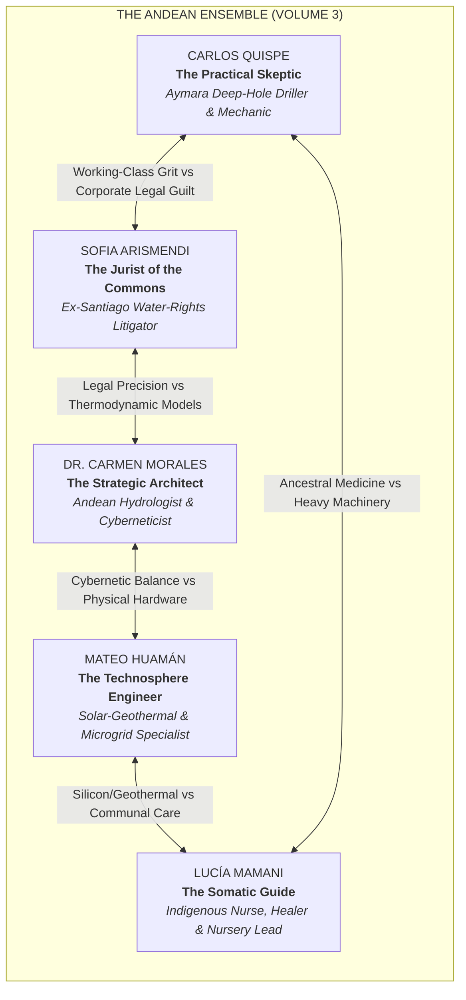
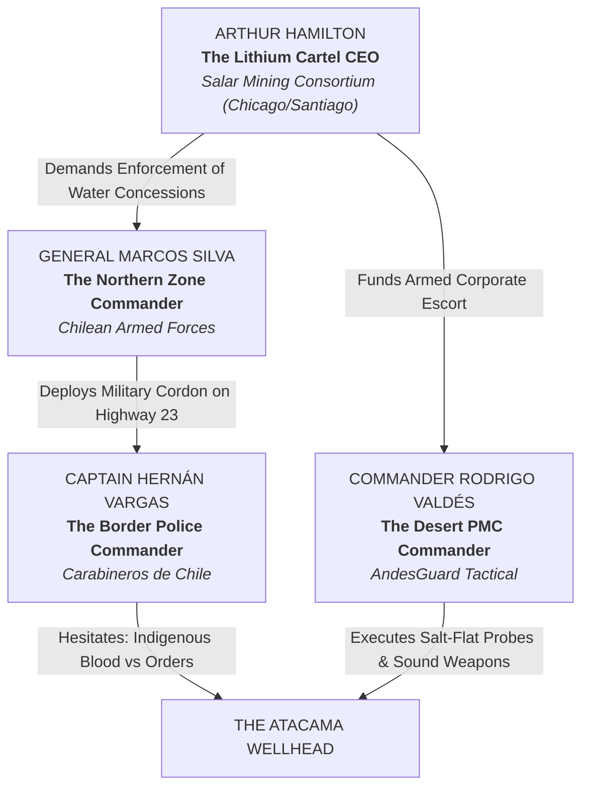

# **VOLUME 3: LATIN AMERICA ("THE ANDEAN WATERSHED")**
## **MASTER STORY REDLINE & CHARACTER BIBLE**

---

### **I. NARRATIVE GEOMETRY & VOLUME 3 SCOPE**

* **Setting:** The Atacama Deep-Shaft Mining Complex — a decommissioned underground copper and lithium extraction facility at 4,000 meters altitude in the **Salar de Atacama (Antofagasta Region, Chile / Bolivian Border)**, extending line-of-sight laser links over the volcanic peaks toward Lake Titicaca and the Peruvian Andes.
* **Timeline:** Exactly **168 Hours (7 Days)**, igniting at **05:42 UTC ("Day Zero")** synchronized with Detroit (Node 1) and the Alps (Node 2), concluding at **168:00 UTC** (The Atacama Water March & Geneva UN Handover).
* **Core O.N.E. Pillar in Demonstration:** **Water and Nutritional Sovereignty, Subterranean Geothermal Aeroponics, Communal Alloparenting, and Non-Lethal Kinetic Defense.**
* **The Existential Pressure:** A lethal water and resource blockade orchestrated by the **transnational lithium cartel (*Salar Mining Consortium*)**, privatized water utilities (*Aguas del Altiplano*), and militarized private security (*AndesGuard Tactical*), enforcing predatory water rights contracts under the Chilean Water Code.
* **The Friction Invariant & Pedagogical Realism:** To maintain the popularizing integrity of the saga, the Andean node must **never operate as an effortless utopian miracle**. High-altitude survival at 4,000 meters imposes agonizing physical and mechanical friction: severe hypoxia (soroche) causing headaches and cognitive fog, desert temperature swings from +35°C noon heat to -12°C freezing night, corrosive alkaline salt-dust choking water filtration membranes and optical laser domes, and profound historical fear among indigenous families who remember past military massacres. The victory of O.N.E.'s water commons is wrung through sheer human resilience and collective courage under mortal pressure.

---

### **II. THE ENSEMBLE CAST: PROTAGONIST DOSSIERS**



---

#### **1. Carlos Quispe — The Practical Skeptic (The Artisan / Mechanic — Reader Proxy)**
* **Role:** Deep-Shaft Drilling, Geothermal Pumps, Sluice Mechanics, Physical Fortification.
* **Age:** 54.
* **Physicality:** Thick, stocky frame; weather-beaten bronze skin lined by thirty years of high-altitude sun and salt dust; calloused hands with cracked knuckles wrapped in canvas tape.
* **Backstory:** Master deep-hole driller who spent three decades in the subterranean copper shafts of Chuquicamata and lithium brine fields of the Atacama. Lost his 12-year-old daughter Rosa to arsenic poisoning when mining consortia contaminated the community well. Watched his union leaders assassinated or bought off. Drowning in predatory consumer debt taken to pay for his late wife's dialysis.
* **Psychological Ghost / Wound:** Deep, burning rage against multinational corporations and empty political rhetoric. He trusts only torque, 36-inch pipe wrenches, ancestral stone canals, and gravity.
* **Voice & Cadence:** Low, gravelly Spanish interspersed with Quechua and Aymara expressions. Laconic, devastatingly practical, skeptical of lofty speeches.

---

#### **2. Sofia Arismendi — The Jurist of the Commons (The Legal Bastion)**
* **Role:** International Water Law, ILO Convention 169, Inter-American Human Rights Petitions, Hague Perpetual Trusts.
* **Age:** 41.
* **Physicality:** Sharp, intense gaze shadowed by severe soroche (altitude sickness); woolen ponchos worn over rumpled Santiago business suits; dusty leather boots.
* **Backstory:** Senior partner at an elite Santiago law firm specializing in privatizing ancestral water rights for foreign lithium consortia under the Chilean Water Code. Suffered a moral breakdown after visiting an indigenous school where children were drinking mineral sludge while nearby mining evaporation ponds consumed 2,000 liters of freshwater per second. Fled into the mountains with three encrypted drives of offshore bribery records.
* **Psychological Ghost / Wound:** Overwhelming guilt for having been the legal architect of indigenous dispossession. Terrified of military arrest and extradition to Santiago.

---

#### **3. Dr. Carmen Morales — The Strategic Architect (The Theoretical Mind)**
* **Role:** Hydrologic Carrying-Capacity Telemetry, Cybernetic Balance, Covenant Governance.
* **Age:** 45.
* **Physicality:** Slender, wire-frame glasses, dark hair tied in a practical braid; worn fleece jackets.
* **Backstory:** Former lead hydrologist at the University of Chile. Her predictive models on aquifer depletion were suppressed by government ministries under pressure from multinational mining lobbies.

---

#### **4. Mateo Huamán — The Technosphere Engineer (The Manufacturer)**
* **Role:** Geothermal Microgrids, 3D-Printed Aeroponic Nozzles, Optical Laser Transceivers.
* **Age:** 29.
* **Physicality:** Lean, energetic; missing the tip of his left index finger from a drilling rig accident.
* **Backstory:** Self-taught electronics wizard from Calama who built decentralized solar microgrids for rural desert clinics.

---

#### **5. Lucía Mamani — The Somatic Guide (The Healer)**
* **Role:** Subterranean Sanctuary, Infant Dehydration Triage, Somatic Grounding, Founders' Covenant Mediation.
* **Age:** 38.
* **Physicality:** Warm, steady presence; dark luminous eyes; woven wool lliclla carrying medicines and herbs.
* **Backstory:** Lead nurse in San Pedro de Atacama and Aymara community alloparenting director. Defends children with fierce, uncompromising maternal courage.

---

### **III. THE HUMAN FACE OF THE OLD WORLD: ANTAGONIST DOSSIERS**



#### **1. CEO Arthur Hamilton (CEO, Salar Mining Consortium & Chicago Lithium Exchange Director)**
* **Age:** 56.
* **Role:** Transnational Lithium Conglomerate Executive.
* **The Rational Antagonist Layer:** Hamilton is not a cartoon villain who relishes human suffering. He oversees the critical supply of battery-grade lithium carbonate that powers electric vehicle gigafactories across North America, Europe, and Asia. In his coherent, articulate worldview, the massive, uninterrupted extraction of lithium brine is the singular technological prerequisite for decarbonizing the planet and halting catastrophic global climate change. To Hamilton’s mind, if ancestral communities can unilaterally shut down commercial extraction wells to preserve local desert aquifers, global battery supply chains will shatter, electric car production will collapse, tens of thousands of factory workers will be laid off, and fossil fuel consumption will soar. He genuinely believes that sacrificing a few thousand square kilometers of hyper-arid desert is a necessary, noble, and minor price to pay to save the planetary biosphere.
* **Human Vulnerability:** Battles debilitating chronic anxiety, guzzling antacids during emergency midnight board calls from Chicago and Zurich as lithium spot prices swing wildly, terrified that a production halt in the Salar will bankrupt his conglomerate and trigger lawsuits from global automakers.

#### **2. Captain Hernán Vargas (Carabineros de Chile, Frontera Norte)**
* **Age:** 45.
* **Role:** Frontline Desert Border Police Commander.
* **The Rational Antagonist Layer:** A native of Calama with Aymara blood, Vargas rose through the ranks through rigid discipline and unblemished service. He took an oath to enforce the laws and Constitution of the Republic. He believes that if private property rights and concession contracts are discarded, Chile will descend into the catastrophic hyperinflation, warlordism, and social disintegration that devastated neighboring countries in past decades.
* **Dramaturgical Conflict:** He is ordered to cut off water tankers and arrest indigenous mothers carrying clay water jars. When Carlos Quispe and Lucía Mamani offer his dehydrated conscripts clean, cool water from the mine under international humanitarian flags, Vargas faces an agonizing crisis between his constitutional uniform and his ancestral conscience.

#### **3. General Marcos Silva (Comando de Operaciones del Norte)**
* **Age:** 58.
* **Role:** Military Zone Commander executing strategic resource protection.
* **Motivation:** A disciplined, Prussian-trained military officer who views strategic mineral reserves and international treaty credibility as the bedrock of Chilean national sovereignty.

#### **4. Commander Rodrigo Valdés (AndesGuard Tactical Asset Protection)**
* **Age:** 44.
* **Role:** High-Desert Corporate Security Contractor.
* **Motivation:** Ex-Chilean special forces (*Comandos de Montagna*). Cold, professional, and efficient. He views the mining complex strictly as a perimeter containment puzzle, employing tracked bulldozers, quick-cure concrete slurry trucks, and river intake diversions to force a bloodless surrender.

---

### **IV. THE 168-HOUR MASTER REDLINE (PROLOGUE, 48 CHAPTERS, EPILOGUE)**

```
05:42 UTC (PROLOGUE) ────────────────────────────────────────────────────────► 168:00 UTC (EPILOGUE)
[Synchronized Day Zero Ignition]                                              [Geneva Atacama Handover]
  │                                                                             │
  ├─ PROLOGUE : The Desert Wellhead (Hours T-06 to 00) — Salar de Atacama       │
  ├─ PART I   (Ch 01–12): The Salt Fortress (Hours 00–48)                       │
  ├─ PART II  (Ch 13–24): The Subterranean Oasis & Silt Freeze (Hours 48–96)    │
  ├─ PART III (Ch 25–36): Cordillera Laser Mesh & Cartel Default (Hours 96–144) │
  ├─ PART IV  (Ch 37–48): The Water March of the Atacama (Hours 144–168)        │
  └─ EPILOGUE : The Assembly of the Altiplano (Flight to Geneva)────────────────┘
```

---

#### **PROLOGUE: THE DESERT WELLHEAD (T-Minus 06:00 to 00:00 before Day Zero)**
* **Temporal Marker:** Monday, October 12, 23:42 UTC $\rightarrow$ Tuesday, October 13, 05:42 UTC.
* **Geographic Grounding:** Decommissioned Mina San Gabriel headframe and ventilation shaft, Salar de Atacama, Antofagasta Region, Chile (4,000 meters altitude).
* **POV:** Carlos Quispe & Sofia Arismendi.
* **The 4 Nested Matryoshka Subplots (Frontstage Human Heart):**
  1. *Matryoshka Layer 1 (Surrogate Paternity / Carlos & Mateo):* Carlos guides young Mateo through bleeding the air lock on the deep geothermal pump; Carlos is haunted by his daughter Rosa who died of arsenic contamination.
  2. *Matryoshka Layer 2 (Class & Guilt / Carlos vs. Sofia):* Carlos's working-class contempt for Santiago corporate lawyers clashes with Sofia's acute altitude sickness and terror of military arrest.
  3. *Matryoshka Layer 3 (The Human Sanctuary / Lucía & Thirsty Children):* In the underground tunnel, Lucía tends to forty dehydrated indigenous children and elderly miners whose municipal water was cut.
  4. *Matryoshka Layer 4 (The Breadcrumb Mystery / The Engraved Copper Seed):* Carmen produces a solid copper cryptographic drive bearing the same anonymous geometric cipher surfacing in Detroit and Susa.
* **The Cliffhanger Hook:** At 05:42 UTC, Carlos trips the high-pressure valve on the geothermal bypass; clean freshwater gushes from the 600-meter mine shaft into the holding reservoir; Mateo’s optical transceiver on the headframe fires a brilliant cyan-blue laser beam piercing the desert night toward the Andean cordillera, just as AndesGuard gun-truck convoys accelerate across the salt flats toward the mine gates.

---

#### **PART I: THE SALT FORTRESS (Hours 00–48) — Chapters 1 to 12**
* **Dramatic Question:** Can five desert pioneers hold a high-altitude mine shaft against corporate gun-trucks without firing a single lethal shot?
* **Pacing Arc:**
  * **Ch 1:** *The Slurry Gate.* (POV: Carlos). AndesGuard gun-trucks attempt to breach Gate 1; Carlos trips the gravity release of a 60-ton gravel and mine-tailing sluice, blocking the road harmlessly.
  * **Ch 2:** *The Paper River.* (POV: Sofia). Cartel receivers present water concession seizure writs; Sofia serves emergency ILO Convention 169 and Hague Perpetual Trust injunctions.
  * **Ch 3:** *The First Water Dispute.* (POV: Carlos). Local farmers and miners argue over allocating the 40,000 daily liters between community cisterns and aeroponic coils; mediated under the Covenant.
  * **Ch 4:** *The Dry Siphon.* (POV: Mateo). Utility monopoly cuts regional power lines; the mine's geothermal turbine powers drinking pumps for five surrounding indigenous ayllus.
  * **Ch 5:** *The Five-Minute Crucible.* (POV: Sofia). Fierce argument between Sofia's legal caution and Carlos's desire to weld the headframe triggers the 5-Minute Direct Session.
  * **Ch 6:** *The Shaft Probe.* (POV: Mateo). AndesGuard operators attempt to infiltrate via an abandoned adit; Mateo triggers high-pressure water fogging, driving them back shivering in the desert cold.
  * **Ch 7:** *The Media Slander.* (POV: Lucía). Television networks in Santiago claim the mine is an armed narcotrafficking cell; Lucía livestreams the clean water filling ceramic jars for infants.
  * **Ch 8:** *The Cordillera Laser Lock.* (POV: Carmen). Mateo attempts to lock the headframe optical laser onto the Peruvian high-altitude repeater above Lake Titicaca. A blinding salt-dust storm (*viento blanco*) whips across the salar at 90 km/h, causing 48% optical beam dispersion; Carlos and Mateo must climb the shaking 50-meter steel headframe in sub-zero winds with oxygen masks to manually clean alkaline dust crusts from the collimator lens. The cyan beam locks, transmitting ancestral water trust telemetry to Detroit and Susa.
  * **Ch 9:** *The Carabineros’ Doubt.* (POV: Captain Vargas). Border police captain Vargas, an indigenous northern native, confronts Carlos under a white flag; moral struggle of an officer ordered to starve his own people.
  * **Ch 10:** *The Sand-Choked Impeller.* (POV: Carlos). Deep-well pump impeller jams with volcanic sand; Carlos and Mateo dive into the flooded sump at 4°C to clear the intake.
  * **Ch 11:** *The Santiago Warrant.* (POV: Sofia). Provincial court issues an expedited military extraction warrant; Sofia discovers registry files proving Salar Mining bribed the water ministry.
  * **Ch 12 (Part I Climax):** *The Geothermal Steam Defense.* (POV: Mateo & Carlos). AndesGuard advances with tracked armored bulldozers and concrete slurry pumps to cap the mine intake shaft; Carlos and Mateo manipulate the deep geothermal bypass valve to vent high-pressure 90°C volcanic steam into the defile, creating a blinding, impassable thermal fog bank and tripping the gravel sluice to trap the bulldozers safely without injury.

---

#### **PART II: THE SUBTERRANEAN OASIS & SILT FREEZE (Hours 48–96) — Chapters 13 to 24**
* **Dramatic Question:** When the cartel cuts electricity and night temperatures drop to -12°C, can the node feed and hydrate 5,000 families in subterranean tunnels?
* **Pacing Arc:**
  * **Ch 13:** *The Freeze of the Salt Flat.* (POV: Lucía). Night temperatures plunge; municipal cisterns freeze solid; Lucía coordinates emergency shelter in the deep mine gallery.
  * **Ch 14:** *The Volcanic Heat Exchanger.* (POV: Carlos). Carlos and Mateo tap a 90°C geothermal steam fissure 300 meters down, warming the living quarters and driving aeroponic misting coils.
  * **Ch 15:** *The Family Ransom.* (POV: Sofia). Sofia’s estranged father, a prominent corporate lobbyist in Santiago, calls offering amnesty if she returns the stolen drives; she refuses.
  * **Ch 16:** *The Subterranean Harvest.* (POV: Carmen). First harvest of fast-growing nutrient greens and spirulina in the dark mine galleries under LED grow lights.
  * **Ch 17:** *The Mule-Train Caravan.* (POV: Mateo). Indigenous youth on mountain mules smuggle solar panels and insulin vials across the Bolivian border passes.
  * **Ch 18:** *The 24-Hour Silence.* (POV: Lucía). Violent argument between Sofia and Carmen over transmitting water logs triggers the Covenant's 24-Hour Cooling Break.
  * **Ch 19:** *The Silent Pipe.* (POV: Carlos). Carlos and Sofia work for 24 hours in complete silence repairing a severed irrigation flange, forging mutual respect.
  * **Ch 20:** *The Detroit-Susa Handshake.* (POV: Carmen). At Hour 72, telemetry from Detroit (Node 1) and Susa (Node 2) arrives through high-altitude microwave-optical relays; heavy atmospheric jitter requires four manual checksum reconciliations before the three-continent mutual usufruct protocol locks in steady-state balance.
  * **Ch 21:** *The Salt Meltdown.* (POV: Lucía). Helicopter downdrafts trigger panic among malnourished children; Lucía leads ancestral somatic grounding chants.
  * **Ch 22:** *The Defector from Calama.* (POV: Sofia). A junior logistics clerk from Salar Mining defects, bringing satellite telemetry of the cartel's illegal brine extraction pipelines.
  * **Ch 23:** *The Poison Accusation.* (POV: Carmen). Corporate news alleges the mine’s geothermal water contains cyanide; Carmen publishes open chemical telemetry proving mineral purity.
  * **Ch 24 (Part II Climax / Midpoint):** *The Pipeline Sabotage.* (POV: Carlos). AndesGuard infiltrators try to blast the main community aqueduct line. Carlos scales the rock face in a blinding sandstorm, securing the valve and redirecting the flow into gravity basins before the pipe bursts.

---

#### **PART III: CORDILLERA LASER MESH & CARTEL DEFAULT (Hours 96–144) — Chapters 25 to 36**
* **Dramatic Question:** Can open thermodynamic accounting dismantle a multinational mining conglomerate on the global commodities exchange?
* **Pacing Arc:**
  * **Ch 25:** *The Military Cordon.* (POV: General Silva). Chilean army special units deploy at the junction of Highway 23, isolating the Salar de Atacama.
  * **Ch 26:** *The Red Herring Ledger.* (POV: Carlos). Carlos finds an offshore bank registry in Carmen’s computer; furious accusations of embezzlement.
  * **Ch 27:** *Carmen’s Confession.* (POV: Carmen). Carmen reveals the account was an anonymous donation from Zurich escrow funds to buy community solar equipment.
  * **Ch 28:** *The Indigenous Influx.* (POV: Lucía). 3,000 Aymara and Atacameño families arrive at the headframe with clay water vessels seeking sanctuary.
  * **Ch 29:** *The Sortition of Three.* (POV: Carlos). The node convenes a Stage 3 Local Mediation Panel under the Covenant; three randomly drawn citizens (a teenager, an elder weaver, and a pump hand) vote 2-1 to open the deep aquifers to all surrounding villages.
  * **Ch 30:** *The Salt-Brine Moat.* (POV: Carlos & Mateo). AndesGuard tries to storm the perimeter with tracked bulldozers; Carlos floods the access track with thick mineral slurry, bogging the heavy vehicles down harmlessly.
  * **Ch 31:** *The Alibi Shatter.* (POV: Sofia). While Carmen is in custody during a security review, independent commodities researchers and environmental auditors in London and Chicago, analyzing public telemetry of the cartel's dried-up brine wells exposed by the node, discover that Salar Mining has been falsifying its reserve capacity. Credit rating agencies downgrade the cartel's debt to junk, triggering an automated $400 million margin call that paralyzes Hamilton's operations. The victory is an emergent outcome of public, verifiable facts.
  * **Ch 32:** *The Mercenary in the Shaft.* (POV: Sofia). An AndesGuard scout is trapped in an inspection hoist; the node provides him water, blankets, and medical care under Restorative Quarantine.
  * **Ch 33:** *The Asian Link.* (POV: Carmen). Node 4 (Malacca Straits) transmits supply-chain data, proving the cartel’s lithium shipments were already falsified.
  * **Ch 34:** *Captain Vargas’s Stand.* (POV: Captain Vargas). Ordered to shoot non-violent water carriers, Vargas orders his Carabineros to protect the community water line from private mercenaries.
  * **Ch 35:** *The Chicago Default.* (POV: Salar CEO Hamilton). Futures markets in Chicago freeze trading on Salar Mining stock; lenders demand a $400 million immediate margin call.
  * **Ch 36 (Part III Climax):** *The Dawn Floodlights.* (POV: Carlos). Mercenary assault vehicles advance in the dark; Carlos and Mateo illuminate the salt flats with 50,000-lumen mine searchlights, forcing them to halt without a shot fired.

---

#### **PART IV: THE WATER MARCH OF THE ATACAMA (Hours 144–168) — Chapters 37 to 48**
* **Dramatic Question:** Can twenty thousand unarmed indigenous citizens carrying water jars across the desert break corporate water privatization forever?
* **Pacing Arc:**
  * **Ch 37:** *The Gathering at Toconao.* (POV: Lucía). Communities across the desert assemble at sunrise carrying ceramic pitchers filled with clean water from the mine.
  * **Ch 38:** *The Miner Strike.* (POV: Carlos). 10,000 copper and lithium miners across the Atacama down tools in spontaneous general strike in solidarity with the node.
  * **Ch 39:** *The Great Salt March.* (POV: Carlos). Over 20,000 people march across the glittering white expanse of the Salar de Atacama, singing ancient water hymns.
  * **Ch 40:** *The Border Dissolution.* (POV: Captain Vargas). Bolivian and Chilean border guards embrace the marchers, allowing water to flow freely across the frontier.
  * **Ch 41:** *The Constitutional Injunction Sustained.* (POV: Sofia). The Supreme Court in Santiago and the Inter-American Court uphold the perpetual commons trust, declaring water a human right.
  * **Ch 42:** *The Mercenary Commander’s Retreat.* (POV: Mateo). Contract defaulted and fuel exhausted, the AndesGuard commander signs the non-violent withdrawal surrender.
  * **Ch 43:** *The Mechanical Seal.* (POV: Carlos & Mateo). Carlos locks the main aquifer pipeline into the permanent public gravity distribution network.
  * **Ch 44:** *The Desert Healing.* (POV: Sofia & Carlos). Sofia and Carlos pour water onto the arid soil in an ancestral challa ceremony, honoring Carlos’s daughter Rosa.
  * **Ch 45:** *The Dissolution of Salar Mining.* (POV: International Press). The lithium cartel declares bankruptcy; its physical infrastructure is de-privatized under municipal trust.
  * **Ch 46:** *The Andean Proclamation.* (POV: Carlos). Carlos speaks before the assembled crowd, proclaiming the waters and soil of the Andes an open, sovereign commons.
  * **Ch 47:** *The 168-Hour Mark (Gate 1 -> 2 Verification).* (POV: Carmen). The clock hits 168:00:00 UTC. 168 consecutive hours of thermodynamic and hydrologic self-sufficiency verified via laser swap with Detroit, Susa, and Malacca.
  * **Ch 48 (Volume 3 Climax):** *The Sortition of the Altiplano.* (POV: Ensemble). The Invisible Mind broadcasts the global call. Three names are drawn from the bronze drum to represent South America at the United Nations in Geneva.

---

#### **EPILOGUE: THE ASSEMBLY OF THE ALTIPLANO (Hours 168:00 to 172:00)**
* **Temporal Marker:** Tuesday, October 20, 05:42 to 09:42 UTC.
* **Geographic Grounding:** San Pedro de Atacama to Santiago International Airport, bound for Geneva.
* **POV:** Carlos Quispe & Sofia Arismendi.
* **Action:** The names of young Mateo, nurse Lucía, and an elderly Aymara water-master are drawn by lot. Carrying clay jars filled with Andean glacial water, they board an international flight alongside Sofia and Carlos, heading to Lake Geneva where the delegations from North America, Europe, and Asia are convening to present the Constitution of O.N.E. to humanity.
