# **VOLUME 4: ASIA-PACIFIC ("THE MARITIME COMMONS")**
## **MASTER STORY REDLINE & CHARACTER BIBLE**

---

### **I. NARRATIVE GEOMETRY & VOLUME 4 SCOPE**

* **Setting:** The Keppel-Batam Decommissioned Maritime Hub & Shipyard — a sprawling complex of dry docks, container berths, and rusted gantry cranes spanning the **Straits of Malacca (Singapore / Riau Archipelago / Johor corridor)**, sending Free Space Optics (FSO) laser beams across the sea lanes to container vessels and terrestrial nodes.
* **Timeline:** Exactly **168 Hours (7 Days)**, igniting at **05:42 UTC ("Day Zero")** synchronized with Detroit (Node 1), the Alps (Node 2), and the Atacama (Node 3), concluding at **168:00 UTC** (The Straits Flotilla Convergence & Geneva UN Handover).
* **Core O.N.E. Pillar in Demonstration:** **The Immaterial Data Commons, Post-Quantum Optical Laser Mesh, Universal Usufruct of Maritime Capital, and Non-Lethal Kinetic Defense (Gravity-Assisted Gantry Cranes, High-Pressure Marine Water Monitors, Steam & Mist Target-Blinders).**
* **The Existential Pressure:** Total digital and financial interdiction by **Aegis-Omni Predictive Policing Platforms**, algorithmic social-credit lockouts, maritime debt receivers, and militarized private contractor flotillas (*Apex Marine Tactical*).
* **The Friction Invariant & Pedagogical Realism:** To preserve the saga's popularizing mission, the Asia-Pacific maritime node must **never function as a flawless digital or mechanical utopia**. The equatorial maritime environment creates intense physical friction: blinding monsoon downpours causing optical laser rain-fade and 50% packet drops, salt-crust corrosion on high-voltage battery terminals, 4-knot tidal currents ripping subsea cables, and severe psychological terror among dockworkers who fear automated biometric arrest. The triumph of the maritime commons is won through human grit and improvisational seamanship under relentless pressure.

---

### **II. THE ENSEMBLE CAST: PROTAGONIST DOSSIERS**

---

#### **1. Captain Jin Wei — The Practical Skeptic (The Artisan / Engineer — Reader Proxy)**
* **Role:** Marine Propulsion, Heavy Gantry Mechanics, Tidal Mooring, Physical Harbor Defense.
* **Age:** 52.
* **Physicality:** Broad-shouldered, stooped from thirty years inside engine rooms; leathery skin etched by salt spray and engine oil; permanent chemical burn scar across his right collarbone.
* **Backstory:** Chief marine engineer who spent three decades on ultra-large container ships and oil tankers across the Indian Ocean and South China Sea. Blacklisted across global registries after refusing an owner's order to abandon a burning Indonesian cargo crew in international waters. Lost his life savings when a predatory ship-mortgage fund seized his pension and frozen maritime accounts.
* **Psychological Ghost / Wound:** Bitter skepticism of corporate promises and mathematical abstractions. Believes only in what floats, heavy cast-iron diesel blocks, and gravity.
* **Voice & Cadence:** Deep, gravelly voice rasped by diesel fumes, laced with Malay maritime slang and Hokkien seafaring oaths. Terse, unflinching, deeply loyal to working mariners.

---

#### **2. Dr. Lin Zhang — The Jurist of the Commons (The Digital Bastion)**
* **Role:** Post-Quantum Cryptography, International Admiralty Law, UNCLOS Usufruct Treaties, Free Space Optics Network.
* **Age:** 38.
* **Physicality:** Slender, sharp, observant eyes; dark hair cut in an efficient bob; perpetually dressed in rain-resistant utility jackets over faded Singapore tech conference shirts.
* **Backstory:** Former lead architect for a transnational surveillance consortium in Singapore, designing predictive biometric risk-scoring algorithms used by port authorities to track, deny dockage, and arrest undocumented workers. Suffered a crisis of conscience after witnessing families evicted and blacklisted by automated risk score flags. Fled with encrypted cold-storage cryptographic keys into the Batam shipyard shadows.
* **Psychological Ghost / Wound:** Crushing guilt for having built the algorithmic panopticon that imprisoned her fellow citizens.
* **Voice & Cadence:** Fast, precise, analytical, frequently translating complex algorithmic and legal architectures into visceral physical analogies.

---

#### **3. Chen Rui — The Strategic Architect (The Systems Mind)**
* **Role:** Autonomous Navigation Networks, Covenant Sortition Protocols, Straits Carrying-Capacity Telemetry.
* **Age:** 46.
* **Physicality:** Quiet, contemplative, spectacles held together by wire, hands stained with circuit flux and sea salt.
* **Backstory:** Former harbormaster systems engineer who saw the commercial ports privatized and converted into militarized choke points.

---

#### **4. Aisyah binti Rahman — The Technosphere Engineer (The Hardware Specialist)**
* **Role:** Subsea Cable Repair, Battery Energy Storage Systems (BESS), Marine Solar Arrays, Non-Lethal High-Pressure Monitors.
* **Age:** 29.
* **Physicality:** Athletic, lightning-fast reflexes, bright red tool harness, hands scarred from electrical arcs.
* **Backstory:** Daughter of an oil platform rigger; top electrical technician fired for organizing dockside battery-storage technicians.

---

#### **5. Uncle Tan — The Somatic Guide (The Community Heart)**
* **Role:** Floating Nursery Logistics, Trauma De-escalation, Elder Food Distribution, Somatic Care.
* **Age:** 66.
* **Physicality:** Wiry, warm crinkling smile around sun-squinted eyes, faded dockworker tattoos on weathered forearms.
* **Backstory:** Four decades as a stevedore and community elder in the old harbor kampongs before they were bulldozed for luxury marinas.

---

### **III. THE HUMAN FACE OF THE OLD WORLD: ANTAGONIST DOSSIERS**

#### **1. Director Sean Tan (Chief Systems Strategist, Aegis-Omni Predictive Logistics, Singapore)**
* **Age:** 49.
* **Role:** Transnational Algorithmic Surveillance & Maritime Choke-Point Architect.
* **The Rational Antagonist Layer:** Tan is not a cartoon villain. He oversees the automated vessel-scheduling, biometric risk-scoring, and automated customs clearance algorithms that govern forty percent of the entire planet's seaborne container commerce through the Straits of Malacca. In his articulate, mathematically grounded worldview, without automated risk scoring, real-time credit enforcement, and algorithmic container scheduling, the world's most congested shipping lane would devolve into catastrophic ship collisions, catastrophic oil spills, armed piracy, and global supply chain paralysis. For Tan, if unindexed, rogue freighters can dock without biometric clearance or commercial cargo manifests, supermarket shelves in Tokyo, London, and New York would empty within ninety-six hours. He genuinely believes he is defending the planetary logistics lifeline that keeps eight billion human beings from starvation.
* **Human Vulnerability:** Plagued by chronic insomnia and eye twitching, swallowing espresso in his chilled Marina Bay command center while staring at red collision telemetry alerts, terrified that a shipping freeze in Malacca will trigger a global economic cardiac arrest.

#### **2. Commander Zachary Cross (Apex Marine Tactical PMC)**
* **Age:** 47.
* **Role:** High-Seas Corporate Interdiction Commander.
* **Motivation:** Ex-Royal Navy clearance diver and maritime counter-piracy contractor. He views his operation strictly as maintaining the security of international maritime trade lanes and preventing unauthorized vessel seizures. When the dockers repel his boarding craft with water monitors rather than live bullets and treat wounded divers with medical care, Cross's corporate mandate loses moral legitimacy.

#### **3. Harbormaster Raymond Wong (Maritime Safety Directorate)**
* **Age:** 58.
* **Role:** Chief Admiralty Civil Servant.
* **Motivation:** An honorable, rigid civil servant with forty years of harbor service, obsessed with navigational safety and preventing catastrophic maritime collisions in the narrow strait.

---

### **IV. MASTER REDLINE (PROLOGUE, 48 CHAPTERS, EPILOGUE)**

#### **PROLOGUE: THE MARITIME BREACH (T-Minus 06:00 to 00:00 before Day Zero)**
* **Temporal Marker:** Monday, October 12, 23:42 UTC $\rightarrow$ Tuesday, October 13, 05:42 UTC.
* **Geographic Grounding:** Decommissioned Keppel-Batam Maritime Hub, Berth 9 and Graving Dock 3, Singapore / Batam Straits.
* **POV:** Jin Wei & Lin Zhang.
* **The 4 Nested Matryoshka Subplots (Frontstage Human Heart):**
  1. *Matryoshka Layer 1 (Surrogate Paternity / Jin Wei & Apprentice Divers):* Jin Wei guides 18-year-old apprentice diver Daniel through securing the sub-sea seawater cooling intake under a tropical pre-monsoon swell; Jin is haunted by three deep-sea divers lost in an uncompensated saturation accident.
  2. *Matryoshka Layer 2 (Class & Guilt / Jin Wei vs. Lin Zhang):* Jin's dockside contempt for corporate maritime auditing elites clashes with Lin's panic over extradition and biometric blacklisting by Singapore Commercial Affairs and Aegis-Omni after stealing the predictive algorithm code.
  3. *Matryoshka Layer 3 (The Human Sanctuary / Uncle Tan & Stranded Seafarers):* In the decommissioned container freight shed, Uncle Tan shelters forty stranded Filipino and Indonesian mariners whose ship was abandoned by bankrupt owners, including an infant requiring power for a medical nebulizer.
  4. *Matryoshka Layer 4 (The Breadcrumb Mystery / The Anonymous Titanium Drive):* Aisyah produces an unmarked waterproof titanium data module bearing the same anonymous geometric cipher surfacing in Detroit, Susa, and the Atacama.
* **The Cliffhanger Hook:** At 05:42 UTC, as Detroit, Susa, and Atacama ignite, the global algorithmic freeze strikes the Straits. Terminal gantry cranes freeze; biometric dock gates lock; Jin manual-trips the mechanical ballast sluice to isolate Berth 9; Aisyah engages the tidal turbine array; Lin locks the rooftop FSO infrared laser transceiver, firing a blinding cyan beam through torrential tropical rain toward an offshore communications beacon in international waters just as corporate gunboats scream through the outer harbor.

---

* **ACT I: THE LOCKOUT & THE GHOST TERMINAL (Hours 00–42 / Ch 01–12)**
  * Ch 01: 05:42 UTC. The algorithmic freeze hits the Straits. Dock passes wiped; automated cranes stop. Jin Wei and Lin Zhang secure Berth 9.
  * Ch 02: The tactical private patrols arrive. Jin drops the manual counterweight gantry, blocking the landward causeway without violence.
  * Ch 03: Uncle Tan transforms an empty dry dock into a sanctuary for 400 stranded mariners and their families.
  * Ch 04: Aisyah brings an islanded 12MWh marine battery array online using tidal flow generators.
  * Ch 05: Lin Zhang aims the first rooftop FSO laser into the monsoon squall. Torrential tropical downpours cause 50% optical scattering; Aisyah and Jin must scale the swaying 65-meter gantry crane in blinding monsoon winds to manually wipe salt crusts from the collimator prism. The link locks onto international waters.
  * Ch 06: Breadcrumb 1: A waterlogged corporate logbook reveals coordinated algorithmic seizures of private vessels.
  * Ch 07: High-pressure marine fire monitors repel a midnight boarding attempt by corporate gunboats without lethal harm.
  * Ch 08: The First Founders' Covenant Assembly on the deck of a dry-docked freighter under the 5-Minute rule.
  * Ch 09: Lin deploys Hague maritime liens against the private equity flotilla, paralyzing their legal insurance coverage.
  * Ch 10: Jin guides apprentice divers to repair an underwater fiber-optic conduit amidst dangerous 4-knot tidal currents.
  * Ch 11: Food supplies tighten; Uncle Tan organizes saltwater aquaponics in repurposed ballast tanks.
  * Ch 12: Act I Climax: Corporate gunboats deploy electronic jamming; the optical laser link pierces the cloud layer to Node 2 (Alps) and Node 1 (Detroit).

* **ACT II: THE STRAITS BLOCKADE & THE DIGITAL COMMONS (Hours 43–96 / Ch 13–24)**
  * Ch 13: The naval blockade tightens across the international traffic separation scheme.
  * Ch 14: Predatory banks declare the terminal an illegal salvage operation; Lin executes a reciprocal usufruct cargo swap with Chilean lithium nodes.
  * Ch 15: Jin confronts a mutiny among private security crewmen, winning them over with clean water and medical care.
  * Ch 16: A storm surge threatens the dry dock gates; Jin and Aisyah manually ballast a barge to cushion the blow.
  * Ch 17: Children in the floating nursery build miniature solar boats; Uncle Tan de-escalates trauma among displaced families.
  * Ch 18: Corporate drones attempt to sever the optical transceiver; turbine steam discharge mist curtains disorient the swarm's optical sensors safely.
  * Ch 19: Breadcrumb 2: Lin decrypts the algorithm's source code, exposing falsified debt records used to seize ships.
  * Ch 20: The Sortition Council convenes; an ordinary tugboat deckhand is selected to lead the shipping dispatch team.
  * Ch 21: Emergency medical supply run through the mangrove creeks avoids satellite infrared sensors.
  * Ch 22: Lin presents the UNCLOS Immaterial Commons Brief, converting the hub into an internationally protected refuge.
  * Ch 23: Jin and Lin share their deepest wounds over cold tea in the crane cab during a midnight squall.
  * Ch 24: Act II Climax: An entire convoy of independent container ships cuts satellite transponders and aligns with Node 4's laser grid.

* **ACT III: THE HIGH SEAS COUNTER-SIEGE (Hours 97–138 / Ch 25–36)**
  * Ch 25: The corporate consortium cuts regional power; Node 4's tidal-battery microgrid powers thirty coastal fishing villages.
  * Ch 26: Private military gunboats launch a coordinated amphibious push; mechanical water curtains blind their guidance systems.
  * Ch 27: Lin transmits the global debt cancellation ledger via multi-hop optical satellite relay.
  * Ch 28: Jin rescues an injured contractor diver trapped in a sluice valve, demonstrating unconditional O.N.E. sanctuary.
  * Ch 29: The adversary attempts to plant contraband firearms to justify lethal intervention; the node's open cameras expose the plot.
  * Ch 30: Breadcrumb 3: The discovery that global maritime insurance syndicates are insolvently overleveraged.
  * Ch 31: Aisyah and Uncle Tan stabilize an infant with oxygen powered by the marine fuel cell.
  * Ch 32: Hundred-vessel civilian flotilla forms an impassable buffer around the maritime hub.
  * Ch 33: A tense standoff at the international channel border; Jin holds the radio frequency with calm moral authority.
  * Ch 34: Lin successfully locks the hub's assets into a perpetual Hague Trust, binding admiralty courts worldwide.
  * Ch 35: The consortium's chief operations officer arrives on a flagship, demanding surrender; is invited to witness the assembly.
  * Ch 36: Act III Climax: Corporate crewmen refuse orders to ram civilian vessels, dropping anchors in solidarity.

* **ACT IV: THE OCEAN COMMONS & THE GENEVA RUN (Hours 139–168 / Ch 37–48 & Epilogue)**
  * Ch 37: The blockade collapses from within as shipping crews across Asia adopt O.N.E. open navigation protocols.
  * Ch 38: The terminal reopens trade as a true commons: zero speculative tolls, absolute transparent energy accounting.
  * Ch 39: Lin, Jin, and Aisyah finalize the Asia-Pacific contribution to the global O.N.E. Constitution.
  * Ch 40: Sortition lottery chooses Captain Jin Wei and Dr. Lin Zhang as maritime delegates to the Geneva World Assembly.
  * Ch 41: Tearful farewells at Berth 9 as Uncle Tan and Aisyah take over permanent command of the Malacca Commons.
  * Ch 42: Boarding an electric sea-glider flight path toward Switzerland; encrypted check-in with Detroit, Turin, and Atacama.
  * Ch 43: In flight over the Indian Ocean: Lin and Jin review the integrated 4-continent thermodynamic ledger.
  * Ch 44: Interception attempts by private corporate jets avoided via international civil aviation open-skies declarations.
  * Ch 45: Landing on Lake Geneva: the waters are frozen; Marcus Hayes and Giulia Bellini welcome the Asian delegation.
  * Ch 46: The Four Founders unite in the Geneva safehouse: four continents, four struggles, one unbroken covenant.
  * Ch 47: Carlos Quispe arrives from the Andes; the five delegations seal the Master Charter of Open Networked Earth.
  * Ch 48: Climax: The march onto the floor of the Palais des Nations under the eyes of the world.
  * Epilogue: The Malacca Straits at dawn. Thousands of ships navigate freely without toll or fear. The sea is open forever.
