# **VOLUME 5: GLOBAL CLIMAX ("THE GENEVA CHARTER")**
## **MASTER STORY REDLINE & CHARACTER BIBLE**

---

### **I. NARRATIVE GEOMETRY & VOLUME 5 SCOPE**

* **Setting:** Geneva, Switzerland — The historic shores of **Lake Geneva**, the labyrinthine stone courtyards and diplomatic halls of the **Palais des Nations**, and the surrounding Alpine valleys, illuminated by four converging optical laser beams fired from Detroit (North America), Fréjus (Europe), Atacama (Latin America), and Malacca (Asia-Pacific).
* **Timeline:** Exactly **168 Hours (Day Zero to Day Seven)**, climaxing at **168:00 UTC** (The World Civic Assembly, the Unanimous Ratification of the O.N.E. Constitution, and the Universal Debt Jubilation).
* **Core O.N.E. Pillar in Demonstration:** **Planetary Sortition, Constitutional Invariants (Class 0), Universal Debt Cancellation, Universal Usufruct of Capital Assets, and Unconditional Non-Lethal Defense.**
* **The Existential Pressure:** A desperate attempt by the **Global Sovereign Debt Syndicate**, the **Emergency G20 Financial Stabilization Board**, and corporate private armies (*Aegis-Apex Joint Command*) to enforce planetary financial martial law, arrest the four delegations, and permanently silence the global optical laser commons.
* **The Friction Invariant & Pedagogical Realism:** The global climax of O.N.E. must **never degenerate into an effortless utopian victory lap or teleological fairy tale**. The delegates arrive in Geneva battered, hypothermic, and psychologically wounded from seven days of mortal siege; the unheated lakeside boatyard faces power brownouts, freezing alpine gales, and logistical shortages; and the 1,001 randomly selected sortition jurors from 80 countries experience intense initial friction, translation barriers, cultural suspicions, and genuine terror of global economic collapse. The ratification of the O.N.E. Constitution is not an automatic decree—it is a miracle of patient human listening, de-escalation, and moral courage won under the ticking clock of global panic.

---

### **II. THE ENSEMBLE CAST: THE FOUR CONTINENTAL DELEGATIONS**

---

#### **1. The North American Voice: Marcus Hayes (50) & Elena Vance (42)**
* **Presence:** Marcus carries the oil-blackened hands of the Detroit rust belt, wearing his work jacket with the embroidered patch of his late wife Sarah. Elena brings the forensic evidence of predatory foreclosure that sparked the first siege.

#### **2. The European Voice: Giulia Bellini (43) & Matteo Rossi (51)**
* **Presence:** Giulia brings the ironclad Hague Trust documents and European bankruptcy audit files that froze the international debt cartels; Matteo brings the quiet, unyielding stamina of the alpine workers.

#### **3. The Latin American Voice: Carlos Quispe (54) & Sofia Arismendi (41)**
* **Presence:** Carlos carries a sealed clay jar of living glacial meltwater from the Atacama aquifer; Sofia carries the ILO 169 indigenous treaties and water rights declarations.

#### **4. The Asia-Pacific Voice: Captain Jin Wei (52) & Dr. Lin Zhang (38)**
* **Presence:** Jin brings the solidarity of two hundred thousand seafaring mariners; Lin brings the open-source cryptographic keys that dismantled the global algorithmic surveillance net.

---

### **III. THE HUMAN FACE OF THE OLD WORLD: ANTAGONIST DOSSIERS**

#### **1. Chairwoman Eleanor Vanderbilt (Emergency G20 Financial Stabilization Board & BIS Governor)**
* **Age:** 58.
* **Role:** Global Central Banking & Sovereign Debt Defense Architect.
* **The Rational Antagonist Layer:** Eleanor Vanderbilt is not a cartoon villain who relishes human suffering. She is a brilliant, exhausted macroeconomist who has spent three decades steering international financial institutions through sovereign debt crises, banking collapses, and currency hyperinflations. In her coherent, deeply responsible worldview, the absolute sanctity of enforceable debt obligations, centralized currency clearinghouses, and private asset title is the singular fragile scaffolding preventing the entire global division of labor from collapsing into catastrophic darkness. To Vanderbilt, if four hundred trillion dollars of debt claims are unilaterally annulled and private property enclosures are abolished overnight, global maritime trade will freeze in mid-ocean, payment clearinghouses will fail, regional electric power grids and water filtration plants across the globe will go dark, and billions of innocent people will starve in violent urban collapse. In her mind, she is the tragic, unyielding guardian holding back a global dark age.
* **Human Vulnerability:** Survives on black tea and sleeping pills, trembling from exhaustion in her Geneva lakeside hotel suite, weeping in private over the terrifying possibility that she might be wrong and that humanity's suffering has been caused by the very financial apparatus she gave her life to defend.

#### **2. General Dietrich Kruger (Aegis-Apex Joint Corporate Security Command)**
* **Age:** 52.
* **Role:** Transnational Private Defense Commander.
* **Motivation:** A disciplined, decorated former NATO general who views the protection of diplomatic premises and international order as a sacred, non-partisan duty to prevent armed rioting and diplomatic assassinations.

#### **3. Ambassador Marco De Santis (Chief Jurist, UN International Law Commission)**
* **Age:** 61.
* **Role:** Veteran Diplomatic Arbitrator.
* **Motivation:** An incorruptible international legal scholar who has dedicated his career to the UN Charter. When presented with Elena and Giulia’s Hague perpetual commons filings, he recognizes with awe that O.N.E. has achieved the very promise the original founders of the United Nations sought in 1948.

---

### **IV. MASTER REDLINE (PROLOGUE, 48 CHAPTERS, EPILOGUE)**

#### **PROLOGUE: THE NIGHT OF FOUR BEACONS (T-Minus 06:00 to 00:00 before Day Zero)**
* **Temporal Marker:** Monday, October 12, 23:42 UTC $\rightarrow$ Tuesday, October 13, 05:42 UTC.
* **Geographic Grounding:** Lake Geneva Boatyard (*Chantier Naval des Eaux-Vives*), Rue de Lausanne, and the outer perimeter of the Palais des Nations, Geneva, Switzerland.
* **POV:** Alexandre Favre & Chairwoman Eleanor Vanderbilt.
* **The 4 Nested Matryoshka Subplots (Frontstage Human Heart):**
  1. *Matryoshka Layer 1 (Surrogate Mentorship / Alexandre & Nils):* Alexandre guides 19-year-old Swiss telecom apprentice Nils through calibrating the optical collimator prism on the boatyard roof amidst a bitter pre-dawn alpine bise; Alexandre is haunted by his younger sister Claire who took her own life after being crushed by algorithmic student debt syndication.
  2. *Matryoshka Layer 2 (The Systemic Faultline / Alexandre vs. Eleanor Vanderbilt):* Alexandre's unyielding cybernetic conviction clashes with Eleanor Vanderbilt's private despair. From her high-security suite overlooking Lake Geneva, the G20 Stabilization Board chairwoman stares at secret solvency audits proving the world's top fifty banks are already bankrupt, terrified that an uncoordinated systemic collapse will trigger global famine.
  3. *Matryoshka Layer 3 (The Human Sanctuary / The Boatyard Refuge):* Inside the boatyard's unheated repair shed, municipal Swiss volunteers and an elderly retired UN archivist shelter twenty undocumented migrant families, keeping infant warmers running on a salvaged locomotive battery bank.
  4. *Matryoshka Layer 4 (The Breadcrumb Mystery / The Complete Geometric Key):* Alexandre verifies the fourth and final cryptographic hardware key, its hand-carved markings completing the unified cipher received from Detroit, Susa, and the Atacama.
* **The Cliffhanger Hook:** At 05:42 UTC, the global synchronized countdown reaches zero. Across four continents, the nodes in Detroit, Susa, Atacama, and Malacca fire their switches. High above Lake Geneva, four brilliant, un-jammable cyan-blue optical laser beams converge against the low alpine cloud canopy; the Jet d'Eau illuminates like a burning crystal spine as Swiss tactical sirens erupt across the city and emergency alerts flood the G20 terminal displays.

---

* **ACT I: THE GLOBAL RUN (Hours 00–42 / Ch 01–12)**
  * Ch 01: 05:42 UTC. The simultaneous ignition across four continents. The diplomatic corridors of Geneva detect four synchronized un-jammable laser beacons.
  * Ch 02: Emergency meeting of the International Monetary Stabilization Board in Geneva; banking panic spreads as margin calls fail globally.
  * Ch 03: The European delegation navigates the frozen Mont Blanc passes as private security squads attempt to intercept their electric rail shuttle.
  * Ch 04: Detroit Node 1 confirms cross-Atlantic laser synchronization; Marcus and Elena prepare for emergency transatlantic flight.
  * Ch 05: In Geneva, diplomatic aides and translation staff secretly read the leaked drafts of the O.N.E. Founders' Covenant.
  * Ch 06: Breadcrumb 1: A financial whistleblower in Zurich reveals that the top fifty investment funds have run out of physical liquidity.
  * Ch 07: Carlos and Sofia touch down in Lisbon via civilian humanitarian transport, evading mercenary extradition warrants.
  * Ch 08: Geneva local citizens and Swiss municipal workers refuse government orders to erect razor-wire barriers around the lake.
  * Ch 09: Lin Zhang broadcasts the live thermodynamic audit of world resource flows, demonstrating that humanity produces 140% of its needed food and clean water.
  * Ch 10: Private contractor gunships circle Geneva airspace; Swiss air traffic controllers enforce open civilian airspace protocols.
  * Ch 11: Giulia Bellini enters the Palais des Nations archives under an emergency diplomatic passport, filing the Perpetual Hague Trust.
  * Ch 12: Act I Climax: All four delegations cross the Swiss frontier simultaneously; the four laser beams strike the summit of the Jet d'Eau.

* **ACT II: THE SANCTUARY OF THE COMMONS (Hours 43–96 / Ch 13–24)**
  * Ch 13: The delegates meet face-to-face for the first time in an unheated boatyard on Lake Geneva.
  * Ch 14: Marcus and Carlos embrace: the Detroit auto-mechanic and the Atacama driller recognize the same calloused hands.
  * Ch 15: The banking syndicate demands the immediate deployment of military tanks; international soldiers question their orders.
  * Ch 16: Elena and Lin coordinate the global debt nullification protocol, matching frozen debts against documented environmental plunder.
  * Ch 17: Children from the Geneva neighborhood join the nursery in the boatyard, sharing bread baked with solar power.
  * Ch 18: Corporate mercenaries attempt a silent breach of the boatyard at 3 AM; pneumatic water barriers and blinding fog non-violently disorient them.
  * Ch 19: Breadcrumb 2: The discovery of an encrypted Swiss vault holding the original 1948 Universal Declaration records.
  * Ch 20: The First Provisional Global Commons Assembly: 1,001 ordinary citizens from 80 countries selected by open, verified sortition gather in Geneva.
  * Ch 21: A heated dispute between legalists and technicians resolved through the mandatory 5-Minute Covenant Timer.
  * Ch 22: The world media narrative cracks as mainstream news anchors resign on air, broadcasting the O.N.E. feed directly.
  * Ch 23: Marcus stands on the frozen jetty with Sarah’s memory, realizing that his grief has finally found meaning in saving others.
  * Ch 24: Act II Climax: Over two hundred thousand Swiss and European citizens surround the Palais des Nations with candles, creating an impenetrable human shield.

* **ACT III: THE SIEGE OF DIPLOMACY (Hours 97–138 / Ch 25–36)**
  * Ch 25: The Palais des Nations doors are sealed by private military contractors; the delegates refuse to force entry with weapons.
  * Ch 26: Matteo and Jin construct a non-lethal gravity ramp using harbor cranes, opening a peaceful corridor into the courtyard.
  * Ch 27: The G20 finance ministers issue an ultimatum: surrender the nodes or face global communications blackout.
  * Ch 28: Carlos steps onto the television feed, holding the jar of Atacama water: "You cannot copyright the rain. You cannot foreclose the sun."
  * Ch 29: A corporate defector delivers the private mercenary command frequencies to Giulia; no ambush is launched.
  * Ch 30: Breadcrumb 3: The realization that the mercenary soldiers' own families are benefiting from the node microgrids in their home cities.
  * Ch 31: Sofia presents the Article 6 Constitutional Invariant: absolute bodily autonomy and zero retaliatory punishment.
  * Ch 32: The military commanders order the perimeter cleared; soldiers lower their rifles and step aside for the citizens.
  * Ch 33: A tense standoff in the Grand Rotunda; Marcus Hayes walks unarmed past armored guards to the podium microphone.
  * Ch 34: The reading of the O.N.E. Constitution begins, translated simultaneously into 140 languages across the optical mesh.
  * Ch 35: The banking syndicate’s chief negotiator enters the hall to debate; is met not with hatred, but with an offer of debt amnesty and sanctuary.
  * Ch 36: Act III Climax: The 1,001 sortition jurors vote by 94% supermajority to adopt the Charter of Open Networked Earth.

* **ACT IV: THE CHARTER OF HUMANITY (Hours 139–168 / Ch 37–48 & Epilogue)**
  * Ch 37: The signing ceremony: Marcus, Giulia, Carlos, and Jin place their thumbprints on the living constitution.
  * Ch 38: The global debt jubilee takes effect: 400 trillion dollars of fictitious speculative debt canceled simultaneously.
  * Ch 39: The four laser transceivers switch from defensive pulses to permanent global carrying-capacity telemetry.
  * Ch 40: News arrives from Detroit, Susa, Atacama, and Malacca: military blockades have melted into public celebrations.
  * Ch 41: Elena Vance sheds her final guilt: the law has been restored as an instrument of life rather than extraction.
  * Ch 42: The sortition lottery mechanism is activated worldwide: the first permanent planetary civic council is drawn from all humankind.
  * Ch 43: A quiet dawn over Lake Geneva. Snow falls gently on the lake. The four delegations share breakfast in the open courtyard.
  * Ch 44: Marcus gives Toby Morales’s compass back to a young Swiss apprentice, passing the craft of the artisan to the next generation.
  * Ch 45: International courts formally recognize the Perpetual Trust of the Earth as sovereign and untouchable.
  * Ch 46: The four lasers merge high in the stratosphere into a single brilliant white canopy of light.
  * Ch 47: The final speeches: not from generals or presidents, but from a machinist, an ex-lawyer, a driller, and a sailor.
  * Ch 48: Climax: The Charter is ratified. The old world ends not with an atomic roar, but with the quiet turning of an open valve.
  * Epilogue: One year later. Southwest Detroit, the Val di Susa, the Atacama Desert, and the Malacca Straits are thriving green hubs. Marcus watches the sunrise over the Detroit River. The Earth is open. The Earth is one.
