# **O.N.E. FOUNDATION & LEGAL FRAMEWORK (SWITZERLAND)**
## **Dual-Tier Roadmap: Swiss Verein (Association) to Swiss Stiftung (Foundation)**

**Document Classification:** Legal Strategy, Corporate Governance & Operational Roadmap  
**Jurisdiction:** Swiss Confederation (ZGB, OR, FusG, BGBB)  
**Location:** [`foundation/legal_framework.md`](legal_framework.md)  
**Related Systems:** [`ONE NETWORKED EARTH (O.N.E.).md`](../ONE%20NETWORKED%20EARTH%20%28O.N.E.%29.md) | [`roadmap/roadmap.md`](../roadmap/roadmap.md)  

---

## **I. EXECUTIVE SUMMARY & STRATEGIC VISION**

To ground the principles of **Open Networked Earth (O.N.E.)** in physical reality (publishing the books, operating web infrastructure, receiving donations/royalties, and acquiring land for seed micro-nodes) while protecting the founding author from personal liability and unwanted exposure, Switzerland offers the premier global jurisdiction.

This framework outlines an organic, low-friction, and future-proof **Two-Stage Evolution**:

1. **Stage 1 (Immediate / Bootstrap): The Swiss Verein (*Association*)**
   - **Initial Capital Required:** **CHF 0.-**
   - **Setup Time:** 1–3 weeks.
   - **Function:** Immediate corporate personality, bank accounts, domain registration, official publisher of the books, collector of donations, and legal buyer of initial pilot land.
2. **Stage 2 (Maturity / Institutional): The Swiss Stiftung (*Foundation*)**
   - **Endowment Trigger:** Once reserves and land equity surpass **CHF 50,000–100,000**.
   - **Transition Mechanism:** Statutory Asset Transfer (*Vermögensübertragung*) under the **Swiss Merger Act (FusG Art. 86 ff.)**.
   - **Function:** An "orphan", un-takeoverable sovereign vault holding all land and core IP under federal supervision (*ESA*) in perpetuity, with the *Verein* preserved as the active democratic community.



---

## **II. STAGE 1: THE SWISS VEREIN BLUEPRINT (ZGB Art. 60–79)**

### **1. Legal Basis & Privileges**
Under Article 60, Paragraph 1 of the Swiss Civil Code (*Schweizerisches Zivilgesetzbuch - ZGB*):
> *"Associations with a political, religious, scientific, artistic, charitable, social or other non-commercial purpose acquire legal personality as soon as their will to exist as a corporate body is apparent from their articles of association."*

* **Statutory Capital:** **CHF 0.-** (No minimum capital required by law).
* **Personal Liability Shield:** Members and board members bear **zero personal liability** for the debts of the association; obligations are secured exclusively by the association's assets (ZGB Art. 75a).
* **Founders:** Minimum of 2 natural or legal persons (recommended: 3 persons to form President, Treasurer, and Secretary).

### **2. Official Purpose Framing (*Zweckbestimmung*)**
To ensure acceptance by the Commercial Register, banks, and tax authorities, the purpose clause must avoid apocalyptic fiction or raw manifesto rhetoric, translating O.N.E. into recognized scientific and civic terminology:

> **Suggested Purpose Clause (*Statuten Art. 2*):**  
> *"The Association is non-profit and non-commercial. It aims to research, publish, and practically implement decentralized resilient infrastructure, open-source technological and social models, bioregional ecological land regeneration, and community-level economic commons. The Association may publish research and educational literature, operate digital communication networks, accept contributions and grants, and acquire real estate or rights in rem in Switzerland and abroad in furtherance of its purpose."*

### **3. Commercial Register Entry (*Handelsregister*)**
While voluntary for non-commercial associations, **registration in the Commercial Register is practically mandatory** to open corporate bank accounts and sign notarial real estate deeds:
* **Filing Documents:**
  1. Signed Articles of Association (*Statuten*).
  2. Minutes of the Constitutive General Assembly (*Gründungsprotokoll*).
  3. Form for Registration (*Anmeldung*) signed by authorized board members.
  4. Certified signature samples of board members (certified by a Swiss notary or the registry office, ~CHF 30–50 per person).
* **Administrative Cost:** Typically **CHF 350 to CHF 600** depending on the Canton.

---

## **III. AUTHOR PROTECTION & ATTRIBUTION STRATEGY**

To guarantee that the primary author is insulated from direct targeting, civil harassment, or unwanted exposure:



1. **The Collective Imprint Model:**  
   The books, synoptic documents, and website are published under the corporate copyright imprint of the association:  
   *`"© Open Networked Earth Association (Verein O.N.E.), Switzerland. Published under the Open Usufruct Commons License."`*  
   Individual authorship is dissolved into the institutional/collective voice.
2. **The Fiduciary Board Firewall:**  
   The public Commercial Register (*Handelsregister*) lists the Board members (*Vorstand*). By founding the *Verein* with 2 or 3 trusted colleagues or public advocates who serve on the board, the author's personal name does not need to be the sole signatory or public face.
3. **Decoupled Digital Systems:**  
   The official website (`.org`, `.ch`, or `.earth`) and book publishing platforms (Amazon KDP, IngramSpark, local eco-printers) are owned directly by the *Verein* using its Swiss business UID (*Unternehmens-Identifikationsnummer*).

---

## **IV. BANKING & FINANCIAL ARCHITECTURE**

### **1. Swiss Institutional Banking Setup**
Under the Swiss Agreement on Due Diligence (*VSB 20 / CDB 20*), the *Verein* will submit **Form K** (*Erklärung bei Stiftungen/Vereinen*) declaring the controlling board and legitimate nature of funds.

* **Primary Recommendation: Alternative Bank Schweiz (ABS)**  
  * Switzerland's premier ethical, social, and ecological bank.
  * Explicitly designed to finance commons, organic cooperatives, ecological land stewardship, and socio-economic transformation projects.
* **Secondary Recommendation: Cantonal Banks (e.g., ZKB, BCGE, BCV, BCVS)**  
  * High stability, deep local mortgage/real estate expertise for cantonal land acquisitions.
* **Digital Asset / Crypto Treasury: Sygnum Bank or AMINA Bank (Zug/Crypto Valley)**  
  * Institutional Swiss crypto banks capable of accepting Bitcoin, Ethereum, or stablecoin grants and cleanly converting them to Swiss Francs (CHF) with complete AML audit trails.

### **2. Revenue Streams**
* **Book Royalties:** Global paperbacks, e-books, and audiobooks flow directly to the *Verein’s* IBAN.
* **Membership Dues (*Mitgliederbeiträge*):** Supporters join as active/supporting members (e.g., CHF 50–250/year).
* **Targeted Grants & Donations:** Tax-efficient contributions earmarked for the *"Seed Micro-Node Acquisition Fund"*.

---

## **V. LAND ACQUISITION PROTOCOLS FOR SEED MICRO-NODES**



### **1. Domestic Acquisitions in Switzerland (Navigating the BGBB)**
Under the Swiss Federal Act on Rural Land Rights (*Bundesgesetz über das bäuerliche Bodenrecht - BGBB*), productive agricultural parcels can strictly only be bought by certified individual farmers (*Selbstbewirtschafter*).  
The *Verein* acquires land via:
* **Exempt Rural Parcels:** Real estate outside the BGBB scope, including disused alpine mills, old workshops, stone quarries, former transport facilities, or buildings within the rural village building zone (*Dorfzone*).
* **The *Baurecht* (Building Rights, ZGB Art. 779):** The association negotiates a 50-to-100-year hereditary lease with a municipality or landowner. The association owns and controls the micro-grid, water systems, and buildings, while avoiding the agricultural purchase ban.
* **Forestry Land (*Wald*):** Forestry parcels are often subject to distinct cantonal forestry regulations that are accessible for ecological conservation.

### **2. Cross-Border Land Holdings (International Micro-Nodes)**
A Swiss *Verein* can legally own land globally:
* **Italy (Piedmont / Liguria / Aosta):** Swiss entities enjoy full treaty reciprocity (*Reciprocità*). The *Verein* obtains an Italian corporate *Codice Fiscale* and buys alpine hamlets or agricultural acreage via an Italian public notary.
* **France (Ain / Jura / Haute-Savoie):** The *Verein* obtains a SIREN number. To navigate agricultural land agencies (*SAFER*), the *Verein* can form a French wholly-owned agricultural civil company (*SCEA* or *GFA*).
* **United States:** The *Verein* forms a 100%-owned Wyoming or Vermont LLC to acquire large off-grid acreage with minimal zoning hurdles.

---

## **VI. STAGE 2: THE INSTITUTIONAL TRANSITION TO A STIFTUNG**

When accumulated liquid capital and land equity reach **CHF 50,000 to CHF 100,000**, the project upgrades into a **Swiss Stiftung (Foundation)** under ZGB Art. 80 ff.

### **1. Why the Stiftung is the Ultimate Destination**
* **The "Ownerless Vault":** A foundation has no owners, no shareholders, and no members. It cannot be bought, sold, or liquidated by a hostile takeover.
* **Federal State Supervision (*ESA*):** Supervised by the *Eidgenössische Stiftungsaufsicht*, ensuring that the land and assets can **never be redirected** away from O.N.E.'s non-speculative usufruct principles.

### **2. Statutory Transition Mechanism: The Swiss Merger Act (FusG)**
Because a *Verein* (membership body) cannot be converted to a *Stiftung* (asset institution) via a single checkbox, Swiss law provides the **Transfer of Assets (*Vermögensübertragung*, FusG Art. 86 ff.)**:

1. **Founding the Stiftung:** The *Verein* acts as the official Founder (*Stifter*) before a Swiss notary, using CHF 50,000–100,000 of its reserves as the endowment capital.
2. **Asset Transfer Agreement:** The *Verein* and the new *Stiftung* execute an inventory contract listing all land titles, bank accounts, software code, and publishing agreements.
3. **Universal Succession (*Ipso Jure*):** Upon entry in the Cantonal Commercial Register, **all assets, land deeds, and contracts transfer automatically to the Stiftung** by operation of law.
4. **Dual Model Preservation:** The *Verein* is not dissolved; it becomes the democratic membership arm, while the *Stiftung* acts as the permanent landholder.

> **Full Statutory Deed & Statutes:**  
> The complete bilingual founding charter, public deed, and governance by-laws are codified in [`statutes_foundation_one.md`](statutes_foundation_one.md).

---

## **VII. IMMEDIATE ACTION CHECKLIST**

- [ ] **Step 1: Core Circle Alignment**  
  Review roadmap with 2 trusted colleagues/friends to confirm Board roles (President, Treasurer, Actuary).
- [ ] **Step 2: Finalize Articles of Association (*Statuten*)**  
  Adapt the standardized Swiss non-profit template in [Section VIII](#viii-statuten-template-articles-of-association).
- [ ] **Step 3: Hold Inaugural General Assembly**  
  Execute the founding minutes (*Gründungsprotokoll*), sign the *Statuten*, and certify signatures at the local notary/registry office.
- [ ] **Step 4: Commercial Register Entry**  
  Submit registration to the Cantonal Commercial Register (*Handelsregisteramt*).
- [ ] **Step 5: Corporate Bank Account**  
  Open corporate account at Alternative Bank Schweiz (ABS) or Cantonal Bank using the *Handelsregisterauszug*.
- [ ] **Step 6: Digital & Publishing Assets**  
  Transfer domain ownership and book publishing imprints directly to the *Verein*.

---

## **VIII. APPENDIX: SWISS VEREIN STATUTEN (CORE BLUEPRINT)**

*(Standard Swiss legal format according to ZGB Art. 60 ff., ready for customization)*

```markdown
# STATUTEN DES VEREINS "OPEN NETWORKED EARTH (O.N.E.)"

## I. Name, Sitz und Zweck
Art. 1 - Unter dem Namen "Open Networked Earth (O.N.E.)" besteht ein nicht-gewinnorientierter Verein im Sinne von Art. 60 ff. ZGB mit Sitz in [Politische Gemeinde / Kanton].
Art. 2 - Zweck des Vereins ist die Förderung, Erforschung und praktische Realisierung von dezentralen, krisenresistenten Infrastrukturen, gemeinwohlorientierten ökologischen Kreisläufen, offenen technologischen Wissensallmenden und bioregionalen Pilotprojekten (Seed Micro-Nodes). Der Verein kann Bildungswerke und Publikationen herausgeben, Liegenschaften oder dingliche Rechte im In- und Ausland erwerben sowie alle Geschäfte tätigen, die dem Vereinszweck dienen.

## II. Mittel
Art. 3 - Die Mittel des Vereins bestehen aus:
- Mitgliederbeiträgen
- Erträgen aus Publikationen und eigenen Veranstaltungen
- Zuwendungen, Schenkungen, Legaten und Förderbeiträgen
- Erträgen des Vereinsvermögens

## III. Mitgliedschaft
Art. 4 - Mitglied mit Stimmrecht kann jede natürliche oder juristische Person werden, welche die Ziele des Vereins unterstützt.

## IV. Organe
Art. 5 - Die Organe des Vereins sind:
a) Die Generalversammlung (Vereinsversammlung)
b) Der Vorstand
c) Die Revisionsstelle (sofern gesetzlich vorgeschrieben oder freiwillig gewählt)

## V. Vorstand und Zeichnungsberechtigung
Art. 6 - Der Vorstand besteht aus mindestens zwei Mitgliedern. Er vertritt den Verein nach aussen und führt die laufenden Geschäfte.
Art. 7 - Die Vorstandsmitglieder zeichnen zu zweien kollektiv für den Verein.

## VI. Haftung
Art. 8 - Für die Verbindlichkeiten des Vereins haftet ausschliesslich das Vereinsvermögen. Eine persönliche Haftung der Mitglieder ist ausgeschlossen (Art. 75a ZGB).

## VII. Auflösung und Mittelverwendung
Art. 9 - Bei Auflösung des Vereins fällt das verbleibende Vermögen einer wegen Gemeinnützigkeit oder öffentlichem Zweck steuerbefreiten juristischen Person mit ähnlicher Zielsetzung in der Schweiz zu.
```
