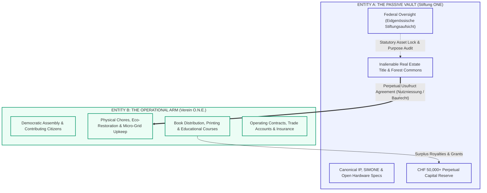

# **FOUNDATION ONE (STIFTUNG O.N.E.) — ARTICLES OF ASSOCIATION & STATUTES**
## **Constitutive Deed, Statutory Charter & Governance By-Laws**

**Document Classification:** Statutory Legal Deed & Corporate Governance  
**Jurisdiction:** Swiss Confederation (*Schweizerische Eidgenossenschaft*) — Swiss Civil Code (ZGB Art. 80–89bis)  
**Supervisory Authority:** Federal Foundation Supervisory Authority (*Eidgenössische Stiftungsaufsicht - ESA*, Bern)  
**Corporate Seat:** Switzerland  
**Related Documents:** [`foundation/legal_framework.md`](legal_framework.md) | [`foundation/README.md`](README.md) | [`ONE NETWORKED EARTH (O.N.E.).md`](../ONE%20NETWORKED%20EARTH%20%28O.N.E.%29.md)

---

## **I. ARCHITECTURAL & JURISPRUDENTIAL OVERVIEW**

### **1. The Foundation as the "Ownerless Sovereign Vault"**
Under Swiss Civil Law (ZGB Art. 80 ff.), a Foundation (*Stiftung*) is an autonomous legal entity (*juristische Person*) with no owners, shareholders, or private members. It consists of an endowed estate of assets dedicated irrevocably to a designated, altruistic purpose (*Stiftungszweck*). 

Within the Open Networked Earth (O.N.E.) architecture, **Foundation ONE** functions as the permanent, inalienable institutional anchor (Entity A):
- **Asset Lock (*Vermögensbindung*):** Land titles, open hardware blueprints, scientific simulation engines, and endowment funds are locked in perpetuity.
- **Immunity from Takeovers:** Because there are no shares or capital interests, the Foundation cannot be bought, hostilely acquired, privatized, or split among departing individuals.
- **State Guarantee of Purpose:** The Federal Foundation Supervisory Authority (*Eidgenössische Stiftungsaufsicht - ESA*) legally prevents the Board from deviating from its public-benefit usufruct mandate.
- **Separation of Custody and Operation:** Operational activities, physical settlement chores, and experimental prototypes are conducted by the sister membership body—the **Swiss Verein** (Entity B) or local bioregional cooperatives—under revocable usufruct charters. Operational liabilities never encumber the Foundation's underlying real estate assets.
- **The Transitional Sunset Invariant (The Bridge to Planetary Unity):** The Foundation is fundamentally a **temporary legal exoskeleton**. It exists under Swiss civil law only during the interregnum while the Legacy Engine (fiat currencies, private territorial enclosure, debt mechanics) dominates the globe. Once Open Networked Earth is realized as a unified, planetary whole, the Foundation's historical protective task is accomplished (*Zweckerreichung*), and its custodial holdings dissolve directly into the self-governing Global Usufruct Commons.

---

## **II. PART A: CANONICAL STATUTES (ENGLISH LEGAL FORMULATION)**

### **Article 1 — Name, Corporate Seat & Duration**
1. Under the designation **"Stiftung Open Networked Earth (O.N.E.)"** (in English: **"Foundation Open Networked Earth"** or **"Foundation ONE"**), an autonomous non-profit foundation is constituted in accordance with Articles 80 to 89bis of the Swiss Civil Code (*Schweizerisches Zivilgesetzbuch - ZGB*).
2. The official seat of the Foundation is situated in Switzerland. The Foundation Board (*Stiftungsrat*) is empowered to designate and transfer the seat to any municipality within Switzerland, subject to the prior formal approval of the competent Supervisory Authority.
3. **Transitional Duration & Sunset:** The duration of the Foundation is bound to the historical epoch of civilizational transition. It endures until the complete realization of Open Networked Earth across the planet as an integrated commons, at which point its statutory purpose is fulfilled, triggering dissolution and the universal devolution of its custodial assets to the Global Usufruct Commons Confederation in accordance with Article 11.

---

### **Article 2 — Purpose & Public-Benefit Mandate (*Stiftungszweck*)**
1. The Foundation pursues exclusively and directly non-profit, charitable, scientific, ecological, artistic, and educational purposes of global public benefit (*gemeinnütziger Zweck*). It operates on a strictly non-commercial basis and does not seek commercial profit.
2. The core purposes of the Foundation are:
   - **Stewardship of the Commons & Land Usufruct:** To acquire, hold, steward, and protect real property, agricultural land, forestry parcels, ecological corridors, and rural settlements in Switzerland and internationally, holding them in trust as inalienable ecological and civil commons. The Foundation secures such real estate under perpetual, non-speculative usufruct agreements (*Nutzniessung / Baurecht*), strictly prohibiting commercial mortgages, speculative flipping, or private enclosure.
   - **Research & Scientific Divulgation:** To advance, sponsor, and publish open-source scientific research, thermodynamic co-simulation models, ecological regeneration frameworks, and post-financial economic accounting systems.
   - **Open Knowledge & Cultural Heritage:** To curate, publish, preserve, and freely distribute literature, encyclopedic treatises, educational media, musical compositions, theatrical scripts, audio-visual works, and open-source hardware/software specifications under irrevocable copyleft and open commons licenses.
   - **Resilient Distributed Infrastructure:** To design, foster, and protect decentralized physical, communicative, and energetic infrastructure (such as off-grid clean micro-grids, peer-to-peer mesh networks, and community water stewardship systems).
   - **Inter-Node Parity & Equalization:** To administer an inter-node solidarity equalization mechanism ensuring that all affiliated seed nodes maintain resource and operational parity, actively preventing fiat wealth stratification, and guaranteeing that no node is rendered affluent while another remains impoverished in fiat currency.
   - **Artistic, Cultural & Fablab Commons Stewardship (Legacy Commercial Licensing):** To hold and steward the commercialization, enterprise-licensing, synchronization, broadcast, and industrial exploitation rights of all artistic works (music, literature, theatre, cinema, streaming series, audio-visual adaptations) and technical inventions developed within affiliated nodes or fablabs, while strictly mandating that all underlying works remain free open-source commons for humanity's non-commercial use. The Foundation exercises an exclusive legal monopoly on licensing these works to the commercial legacy market (studios, streaming platforms, record labels, industrial corporations). 100% of all revenues derived from such commercialization flow directly to the Foundation to benefit the global network equally, strictly prohibiting localized, private, or celebrity financial enrichment of the individual artist, inventor, or node.
   - **Universal Civic IP Assignment:** To hold in trust the economic and commercialization rights of everything invented, discovered, crafted, written, composed, engineered, or performed by Citizens of O.N.E. during their civic compact. By entering the O.N.E. citizenship compact, citizens cede their commercialization rights to the Foundation in reciprocal exchange for guaranteed lifelong unconditional housing, food, energy, healthcare mutual aid, education, and tools. All underlying creations remain 100% open source and libre for non-commercial communal use.
   - **De-Commodification of Citizen Labor (The Institutional Labor Shield):** To serve (directly or via affiliated local operating entities) as the exclusive institutional contracting counterparty whenever external legacy market entities seek the craftsmanship, technical services, or artistic performances of O.N.E. citizens. Individual citizens are strictly prohibited from entering into private wage-labor or direct employment contracts with legacy entities (whether as builders, developers, actors, performers, nurses, or engineers). External parties contract institutionally with the Foundation or its local sister body (*Werkvertrag / Institutional Service Agreement*); all external fiat compensation is paid to the institutional entity to fund the network's equalized commons, eliminating wage stratification while guaranteeing that citizens never experience wage-slavery.
   - **Cross-Border Title Holding & Foreign Non-Profit Vehicles:** To incorporate, establish, fund, or acquire 100% of the governance rights in non-profit, tax-exempt legal entities or land trusts in foreign jurisdictions (e.g., Italian *Fondazione del Terzo Settore*, French *Fonds de Dotation*, German *gGmbH / gemeinnützige Stiftung*, US *501(c)(3) Land Trust*, UK *Charitable Incorporated Organisation*) exclusively for the purpose of acquiring, holding, and shielding land, ecological corridors, and educational infrastructure as inalienable commons under identical asset-lock and non-commercial covenants.
3. The Foundation is entitled to perform all legal acts, conclude contracts, acquire rights in rem, and undertake operations directly or indirectly suited to advance its statutory purpose.
4. The Foundation operates strictly within the non-commercial purity invariant: it conducts zero speculative commercial business, issues zero private equity or speculative tokens, and charges zero pay-to-win or monetization gates on its canonical knowledge.

---

### **Article 3 — Foundation Assets & Capital Preservation (*Vermögensbindung*)**
1. The initial endowment capital of the Foundation dedicated at the time of constitution consists of **CHF 50,000.-** (fifty thousand Swiss Francs) in cash.
2. The Foundation’s assets may be increased at any time through:
   - Further contributions, endowments, and transfers from the Founder or third parties.
   - Donations, testamentary gifts, bequests (*Legate*), and public-benefit subsidies.
   - Royalties, option fees, synchronization fees, and commercialization proceeds derived from licensing the saga, literature, musical compositions, theatrical productions, audio-visual/streaming adaptations (e.g. Netflix, broadcast networks), and industrial enterprise dual-licensing of fablab technologies to the legacy commercial market.
   - Institutional service revenues (*Werkvertragserlöse*) from legacy entities commissioning collective construction, performances, or engineering from O.N.E. citizens via institutional contracts.
   - Surplus equalization contributions received from operational nodes pursuant to the Inter-Node Parity Protocol.
   - Statutory transfers of assets (*Vermögensübertragung* pursuant to FusG Art. 86 ff.) from the associated Swiss Verein.
   - Real estate titles, conservation easements, and building rights (*Baurechte*).
3. **Principle of Substance Preservation (*Substanzerhaltung*):** The Foundation's endowment capital and designated land reserves must be managed prudently and preserved in their substance. Only the net investment proceeds, royalties, recurring donations, and unallocated grants may be expended for operational distributions, project funding, and administrative expenses.
4. **Absolute Asset Lock (*Asset Lock & Non-Distribution Constraint*):** 
   - Foundation assets, profits, and proceeds are irrevocably dedicated to the public benefit.
   - No distributions, dividends, bonus shares, profit participations, or capital returns may be made to the Founder, members of the Foundation Board, individual artists, inventing nodes, or their relatives.
   - No person or individual node may be granted disproportionately high remuneration, star royalties, private wage bonuses, or financial windfalls alien to the Foundation's egalitarian non-profit purpose.
5. **Strict Purpose-Bound Earmarking (*Ausschliessliche Zweckbindung*):**  
   - Any and all funds, revenues, donations, royalties, licensing windfalls, and service fees received by the Foundation—whether at the central global level or through any affiliated local foundation, subsidiary entity, or operational seed node legal vehicle—**may exclusively and strictly be used in direct furtherance of the statutory purposes defined in Article 2 (whether at the global network level or for local bioregional node purposes)**.
   - Any diversion, misapplication, or allocation of funds for speculative financial instruments, private commercial ventures, partisan political lobbying, or non-statutory purposes is strictly prohibited, legally null and void, and constitutes an immediate breach of fiduciary duty subject to regulatory sanction by the Supervisory Authority (*ESA*).
6. **Financial Year, Treasury Custody & Accounting Standards:**
   - The financial year of the Foundation corresponds to the calendar year (January 1 to December 31).
   - Annual financial statements are prepared in accordance with the Swiss Code of Obligations (CO Art. 957 ff.) and the recognized non-profit standard **Swiss GAAP FER 21**.
   - Digital treasury reserves and cryptographic private keys are held in minimum 3-of-5 threshold multi-signature cold custody distributed among Board trustees. Conventional banking assets require collective dual signature.
   - Speculative financial trading, margin borrowing, and debt derivatives are statutarily prohibited.

---

### **Article 4 — Governing Organs (*Organe*)**
The formal governing bodies of the Foundation are:
1. The **Foundation Board** (*Stiftungsrat*).
2. The **Statutory Auditors** (*Revisionsstelle*), subject to statutory exemption rules.
3. The **Commons Advisory & Sortition Assembly** (*Allmende-Beirat*), as a consultative advisory body.

---

### **Article 5 — The Foundation Board (*Stiftungsrat*)**

#### **1. Composition & Parity**
- The Foundation Board is the supreme executive organ of the Foundation.
- In adherence to O.N.E. constitutional principles, the Board shall strictly maintain an **odd-number parity** consisting of at least **3 (three)** and up to **7 (seven)** natural persons, preventing deadlocks in deliberation.
- The initial Board is appointed by the Founder in the Constitutive Act (*Stiftungsurkunde*). Thereafter, the Board reconstitutes itself by co-optation (*Kooptation*), taking into consideration delegates nominated by the operational community (the Swiss Verein) and independent sortition jurors.

#### **2. Term of Office & Pro Bono Status (*Ehrenamtlichkeit*)**
- Board members are elected for a renewable term of **3 (three) years**.
- To satisfy Swiss non-profit tax exemption criteria (*Art. 56 lit. g DBG* / cantonal direct taxes), members of the Foundation Board, as well as appointed ambassadors and negotiating envoys, act in an honorary capacity (*grundsätzlich ehrenamtlich*). They are entitled solely to the reimbursement of effective, verified out-of-pocket expenses incurred in the direct execution of their fiduciary duties.
- **Statutory Frugality Mandate on Travel & Representation:** All travel, lodging, and representation expenses incurred by board members, ambassadors, and envoys venturing into the legacy economy are subject to strict statutory frugality caps (prohibition of luxury hotels, mandatory rail/economy transit, modest thermodynamic subsistence per diems, and 100% public cryptographic receipt transparency) pursuant to Section 8 of the Operational Regulations.

#### **3. Powers & Responsibilities**
The Foundation Board possesses all managerial and representative powers not expressly delegated by law or these Statutes. Its non-transferable duties include:
- Exercising overall fiduciary stewardship over the Foundation and ensuring strict adherence to the statutory purpose.
- Enforcing the permanent asset lock on real estate and canonical digital assets.
- Approving annual accounts, balance sheets, and the annual activity report for submission to the Supervisory Authority.
- Enacting and amending the internal Operational Regulations (*Organisationsreglement*).
- Granting and terminating long-term hereditary building rights (*Baurechte*) or usufruct licenses (*Nutzniessungsverträge*) to operational communities.
- Appointing the Statutory Auditors and designating authorized signatories.

#### **4. Deliberation & Qualified Supermajority**
- The Board convenes as often as business requires, but at least twice per calendar year.
- A quorum is present when a majority of the active Board members are present or participating via authenticated cryptographic / telecommunication channels.
- Routine operational resolutions are passed by simple majority.
- **Qualified 75% Supermajority Requirement:** The following fundamental resolutions require a **75% qualified majority** of all appointed Board members:
  1. Any statutory amendment of the Foundation Statutes or regulations.
  2. The acquisition, long-term encumbrance, or alienation of real estate holdings.
  3. The execution or revocation of master usufruct contracts with operational nodes.
  4. The election, renewal, or removal of Foundation Board members.
  5. Any proposal to the Supervisory Authority regarding the dissolution of the Foundation.

#### **5. Conflict of Interest, Insider Transactions & Recusal (*Ausstandspflicht*)**
- Members of the Foundation Board, operational officers, and appointed envoys are bound by an absolute fiduciary duty of loyalty (*Treuepflicht*).
- Any member who has a personal interest, family relation, or commercial affiliation in a matter or legal transaction before the Board must immediately declare such conflict and recuse themselves (*Ausstandspflicht*) from deliberations and voting.
- Insider loans, uncollateralized credit lines, preferential real estate allocations, or sweetheart commercial contracts granted to Board members, founders, or affiliated relatives are strictly prohibited, legally null and void, and subject to immediate civil recovery.

#### **6. Emergency Institutional Continuity & Anti-Curator Fallback (*Ausschluss staatlicher Beistandschaft gemäss ZGB Art. 83d*)**
- Should the Foundation Board through vacancy, death, resignation, or incapacitation fall below the statutory minimum quorum of three (3) members and fail to reconstitute itself by co-optation within sixty (60) days, the General Assembly of the operational Swiss Verein (or the sortition assembly of O.N.E.) is statutarily vested with the direct, self-executing authority to elect and appoint replacement Board members.
- This autonomous reconstitution mechanism serves to cure any organizational defect (*Organmangel*) internally, explicitly barring the appointment of a court-appointed curator (*staatlicher Beistand*) under Article 83d of the Swiss Civil Code (ZGB).

---

### **Article 6 — Representation & Signatory Powers**
1. The Foundation is legally represented vis-à-vis third parties and state authorities by the Foundation Board.
2. Signatory authority is exercised **collectively by two** (*Kollektivunterschrift zu zweien*) among designated Board members (typically President, Vice-President, or Managing Director). Single signatory authority is expressly prohibited.

---

### **Article 7 — The Statutory Auditors (*Revisionsstelle*)**
1. The Foundation Board appoints an independent, federally qualified audit expert (*zugelassene Revisionsstelle*) in accordance with Art. 83b ZGB.
2. The Auditors examine the books, accounting records, and financial statements annually, verifying capital preservation and compliance with statutory purpose, and submit a written audit report to the Board and the Supervisory Authority.
3. If the Foundation meets the statutory requirements of Art. 83b Para. 2 ZGB (e.g. balance sheet total under CHF 200,000, no public appeal for funds) and upon formal application, the Supervisory Authority may grant an exemption from the obligation to appoint an auditor (*Opting-out*).

---

### **Article 8 — The Commons Advisory & Sortition Assembly (*Allmende-Beirat*)**
1. The Foundation Board establishes an consultative Advisory Council known as the **Commons Advisory Assembly**.
2. The Advisory Assembly includes delegates drawn by democratic sortition from active bioregional nodes, scientific researchers, and contributors from the operational Swiss Verein.
3. The Advisory Assembly reviews the annual ecological and infrastructural audit of all landholdings, assesses fidelity to open-source licensing, and provides non-binding recommendations to the Foundation Board prior to the execution of major usufruct agreements.

---

### **Article 9 — Supervisory Authority (*Aufsichtsbehörde*)**
1. The Foundation is subject to the supervision of the competent Swiss supervisory authority:
   - The **Federal Foundation Supervisory Authority** (*Eidgenössische Stiftungsaufsicht - ESA* in Bern), or
   - The competent Cantonal Foundation Supervisory Authority, should activities be confined to a single Canton.
2. The annual report, audited financial statements, and all proposed amendments to the Statutes must be submitted annually to the Supervisory Authority for formal approval.

---

### **Article 10 — Amendments to the Statutes & Founder's Rights**
1. The Foundation Board may submit requests for statutory amendments or reorganization to the Supervisory Authority in accordance with Articles 85, 86, and 86b ZGB, provided a **75% qualified supermajority** of the Board has voted in favor.
2. **Reservation of Founder's Rights (Art. 86a ZGB):** In accordance with Article 86a of the Swiss Civil Code, the Founder reserves the right to request an amendment to the Foundation’s purpose from the Supervisory Authority, provided that such amendment maintains the non-profit, public-benefit, and commons-oriented character of the Foundation. This right expires twenty years after constitution.

---

### **Article 11 — Dissolution & Irrevocable Asset Devolution (*Steuerbefreiungsklausel*)**
1. The dissolution of the Foundation may only occur under the provisions of Article 88 ZGB upon formal decree of the competent Supervisory Authority, following a **75% qualified supermajority** vote of the Foundation Board.
2. **Absolute Asset Dedication upon Liquidation:**
   In the event of the dissolution of the Foundation, all remaining liquidation proceeds and real property assets **shall under no circumstances be distributed or returned to the Founder, donors, board members, or private individuals**.
3. All liquidation assets must be transferred completely and irrevocably to another **tax-exempt, non-profit legal entity headquartered in Switzerland** (*steuerbefreite juristische Person mit Sitz in der Schweiz*) pursuing identical or closely related public-benefit purposes, particularly in the fields of ecological commons preservation, open-source technology, or non-speculative land stewardship.
4. **Planetary Sunset & Universal Commons Devolution:**  
   Should humanity achieve the universal realization of Open Networked Earth—such that global usufruct, bioregional confederation, and the de-commodification of land, culture, and life are established worldwide, rendering national private-law entities obsolete—the purpose of the Foundation is formally deemed fully achieved (*Zweckerreichung* pursuant to Art. 88 Para. 1 ZGB). In this event, subject to the formal decree of the Supervisory Authority, the Foundation shall dissolve its corporate existence under Swiss civil law and universally devolve all physical land commons, water rights, cultural archives, and assets *ipso jure* into the permanent collective custody of the Global Usufruct Commons Confederation.

---

### **Article 12 — Institutional Dispute Resolution & Swiss Arbitration Ladder**
1. **Internal Conciliation via Sortition:** Any dispute, grievance, or interpretation controversy between the Foundation Board and an operational node, sister Verein, or the sortition advisory assembly shall first be submitted to confidential conciliation before a three-member Sortition Conciliation Panel convened under Section 12 of the Operational Regulations.
2. **Definitive Swiss Arbitration Clause:** Any dispute, controversy, or claim arising out of, or in relation to, these Statutes, usufruct contracts, or commercial legacy licensing agreements (e.g. streaming adaptation licenses, enterprise dual-licenses, publishing options)—including the validity, invalidity, breach, or termination thereof—which cannot be resolved through conciliation, shall be resolved exclusively and definitively by arbitration in accordance with the **Swiss Rules of International Arbitration of the Swiss Arbitration Centre** in force on the date on which the Notice of Arbitration is submitted.
3. The number of arbitrators shall be one (or three for claims exceeding CHF 500,000). The seat of arbitration shall be Zurich or Bern, Switzerland. The arbitral proceedings shall be conducted in English or German. Recourse to ordinary state courts is expressly waived to the fullest extent permitted by Swiss law.

---

### **Article 13 — Constitutional Primacy, Demarcation & Data Sovereignty**
1. **The Demarcation Invariant (The Two Spheres):** The Foundation is constituted under Swiss civil law solely as an external legal exoskeleton, property custodian, and legacy contract interface. All substantive principles governing internal human rights, housing usufruct occupancy within nodes, thermodynamic resource accounting, demarchic sortition assemblies across all tiers, labor reciprocity, communal education, and restorative justice are governed **exclusively and sovereignly by the Living Constitution of Open Networked Earth ([`ONE NETWORKED EARTH (O.N.E.).md`](../ONE%20NETWORKED%20EARTH%20%28O.N.E.%29.md))**.
2. **Substantive Subordination & Non-Interference:** The Foundation Board possesses zero jurisdiction to alter, interpret, or legislate internal constitutional affairs of the O.N.E. commonwealth. The Foundation shall never act as an internal government, landlord, or employer.
3. **Data Sovereignty & Swiss Data Protection Act (DSG):** In all operations, the Foundation complies with the Swiss Federal Act on Data Protection (*Bundesgesetz über den Datenschutz - DSG*). Personal data processing is restricted to the absolute operational minimum, authenticated via decentralized, non-biometric zero-knowledge proofs (ZK-PoP), with zero commercial profiling or surveillance.
4. **The Genesis Anchor & Rigid Immutability Lock:**
   - **Phase 0 (Genesis Architectural Hardening):** Prior to notarial deed execution, the Living Constitution undergoes iterative stress-testing and empirical patching via the O-ASIS engine to eliminate vulnerabilities and ensure systemic integrity.
   - **Phase 1 (The Formal Legal Anchor):** Upon the execution of the notarial deed of incorporation of Foundation ONE under Swiss Civil Law (ZGB Art. 80 ff.), the finalized Living Constitution is permanently deposited as **Annex I (*Statutarischer Verfassungsanhang I: Die Lebendige Verfassung*)**. From that exact moment of legal constitution, **Rigid Canonical Immutability takes full legal effect**: the Founder, Foundation Board, developers, and AI systems irrevocably waive any power to unilaterally amend the Living Constitution. All future amendments require the strict 75% supermajority ratification of the seated sortition assemblies pursuant to Chapter IV, binding the Foundation under Swiss public foundation supervisory law (*ESA*).

---

## **III. PART B: OFFICIAL NOTARIAL SWISS-GERMAN DEED & STATUTES**
*(Offizielle Stiftungsurkunde und Statuten gemäss Art. 80 ff. ZGB zur notariellen Beurkundung und Einreichung beim Eidgenössischen Handelsregister und der Eidgenössischen Stiftungsaufsicht ESA)*

```markdown
# ÖFFENTLICHE URKUNDE
## ÜBER DIE ERRICHTUNG DER "STIFTUNG OPEN NETWORKED EARTH (O.N.E.)"

Vor dem unterzeichneten Notar des Kantons [Kanton], Schweiz, 
erscheint:

[Name der Stifterin / des Stifters bzw. Verein Open Networked Earth (O.N.E.), 
vertreten durch die zeichnungsberechtigten Vorstandsmitglieder],

nachstehend "die Stifterin" genannt.

Die Stifterin erklärt hiermit ihren Willen, eine rechtsfähige Stiftung im Sinne von 
Art. 80 ff. des Schweizerischen Zivilgesetzbuches (ZGB) mit den folgenden Statuten zu errichten:

================================================================================
STATUTEN DER "STIFTUNG OPEN NETWORKED EARTH (O.N.E.)"
================================================================================

I. NAME, SITZ UND DAUER
Art. 1
1. Unter dem Namen "Stiftung Open Networked Earth (O.N.E.)" (englisch: "Foundation Open Networked Earth") 
   besteht eine gemeinnützige, nicht-gewinnorientierte Stiftung im Sinne von Art. 80 ff. ZGB.
2. Der Sitz der Stiftung befindet sich in [Gemeinde, Kanton], Schweiz. 
   Der Stiftungsrat kann den Sitz mit vorgängiger Genehmigung der Aufsichtsbehörde an jeden 
   anderen Ort innerhalb der Schweiz verlegen.
3. Dauer und planetarische Übergangsklausel: Die Dauer der Stiftung ist an die historische 
   Übergangsepoche gebunden. Sie besteht bis zur vollständigen, weltweiten Verwirklichung der 
   planetarischen Allmende (Open Networked Earth als integriertes Ganzes). Mit dieser globalen 
   Zweckerreichung löst sich die Stiftung als schweizerische Zivilrechtsperson auf und 
   überträgt ihre treuhänderischen Allmende-Güter vollumfänglich in die Selbstverwaltung der 
   Globalen Allmende-Konföderation gemäss Art. 11.

II. STIFTUNGSZWECK
Art. 2
1. Die Stiftung verfolgt ausschliesslich und unmittelbar gemeinnützige, wissenschaftliche, 
   ökologische, künstlerische und bildungsfördernde Zwecke des Allgemeinwohls. Sie ist 
   nicht-gewinnorientiert und erstrebt keinen Erwerbszweck.
2. Der Zweck der Stiftung umfasst insbesondere:
   a) Die treuhänderische Sicherung, Wiederherstellung und Pflege von Grundstücken, 
      Landwirtschaftsflächen, Wäldern und Siedlungsräumen im In- und Ausland als 
      unveräusserliche ökologische und zivile Allmende. Die Stiftung stellt solche 
      Liegenschaften ausschliesslich im Rahmen von spekulationsfreien, gemeinwohlorientierten 
      Nutzungsrechten (Nutzniessung, Baurecht) zur Verfügung und schliesst jede 
      kommerzielle Verpfändung oder spekulative Verwertung aus.
   b) Die Erforschung, Förderung, Dokumentation und freie Veröffentlichung von offenen 
      technologischen Modellen, thermodynamischen Simulationswerkzeugen, ökologischen 
      Kreislaufwirtschaften und resilienten, dezentralen Infrastrukturen.
   c) Die Bewahrung und bedingungslose, freie Zugänglichmachung von wissenschaftlicher 
      Literatur, Musikkompositionen, Theaterwerken, audiovisuellen Medien, Open-Source-Bauplänen 
      und gemeinfreien Datenbeständen unter freien Commons-Lizenzen.
   d) Die Förderung und der Schutz von zivilen, dezentralen Netzwerken, nachhaltigen 
      Energiesystemen und bioregionalen Wasser- und Nahrungsmittelallmenden.
   e) Die Gewährleistung des überregionalen Ressourcenausgleichs (Finanzausgleich) zwischen 
      angeschlossenen Pilotknoten (Seed Nodes), um Wohlstandsklüfte zu verhindern und sicherzustellen, 
      dass keine Siedlungseinheit in Fiat-Währungen reich oder arm wird.
   f) Die treuhänderische Inhaberschaft und Verwertung von kommerziellen Verwertungs-, 
      Synchronisations-, Aufführungs-, Medien- und Industrierechten an künstlerischen Werken 
      (Musik, Literatur, Theater, Film, Streaming-Serien, visuelle Medien) sowie technischen Erfindungen 
      aus angeschlossenen Fablabs gegenüber dem kommerziellen Altmarkt (Streamingdienste, Filmstudios, 
      Verlage, Industriekonzerne). Sämtliche Werke verbleiben für die Menschheit und die 
      Allmende-Knoten bedingungslos freie Open-Source-Güter. Sämtliche kommerziellen Erlöse fliessen 
      ausschliesslich dem Stiftungsvermögen zur allmende-weiten Ausstattung aller Knoten und zum 
      Bodenerwerb zu; eine private, celebrity-hafte oder lokale Bereicherung des Urhebers oder 
      Erfinderknotens ist ausgeschlossen.
   g) Die universelle treuhänderische Inhaberschaft aller wirtschaftlichen Verwertungs-, 
      Lizenz- und Vermarktungsrechte an sämtlichen Erfindungen, Schöpfungen, Werken, handwerklichen 
      Leistungen und Darbietungen von O.N.E.-Bürgern, welche im Gegenzug ein lebenslanges, 
      bedingungsloses Recht auf Wohnraum, Nahrung, Energie, Bildung und Fürsorge in der Allmende 
      geniessen, unter Wahrung der vollständigen Open-Source-Gemeinfreiheit für die nicht-kommerzielle Nutzung.
   h) Der institutionelle Schutzschirm und das Verbot individueller Lohnarbeit im Altmarkt: 
      O.N.E.-Bürger dürfen keine direkten privaten Lohnarbeits- oder Anstellungsverhältnisse mit 
      legacy-kommerziellen Unternehmen eingehen (weder als Bauarbeiter, Handwerker, Schauspieler, 
      Musiker noch Programmierer). Die Inanspruchnahme von Arbeits- und Schöpfungsleistungen 
      durch externe Dritte erfolgt ausschliesslich über institutionelle Werk- und Leistungsverträge 
      der Stiftung bzw. ihrer lokalen operativen Trägervereine; sämtliche Vergütungen fliessen der 
      Allmende zu, um individuelle Lohnungleichheit auszuschliessen.
   i) Die Errichtung, Beteiligung an und 100%-ige Kontrolle von gemeinnützigen, 
      steuerbefreiten Trägerstrukturen, Stiftungen oder Land-Trusts im Ausland 
      (z.B. italienische Fondazione ETS, französische Fonds de Dotation, deutsche gGmbH/Stiftung, 
      US 501(c)(3) Land Trust), welche Liegenschaften und Bildungsorte als Allmende 
      unter identischer Vermögensbindung und Gemeinnützigkeit sichern.
3. Die Stiftung kann alle Rechtsgeschäfte tätigen, Verträge abschliessen und dingliche Rechte 
   begründen oder erwerben, die der Erreichung des Stiftungszwecks unmittelbar oder mittelbar dienen.

III. STIFTUNGSVERMÖGEN UND MITTELVERWENDUNG
Art. 3
1. Das der Stiftung bei der Errichtung gewidmete Anfangsvermögen beträgt CHF 50'000.- 
   (fünfzigtausend Schweizer Franken) in bar.
2. Das Stiftungsvermögen kann jederzeit durch weitere Zuwendungen der Stifterin oder Dritter, 
   Schenkungen, Erbschaften, Legate, Erträge aus Publikationen, Medienverwertungs- und Dual-Licensing-Lizenzen, 
   institutionelle Werkvertragserlöse aus Bau-, Kunst- und Ingenieurleistungen für externe Dritte, 
   Solidaritätsbeiträge aus dem Knotenausgleich sowie Vermögensübertragungen 
   nach dem Fusionsgesetz (FusG Art. 86 ff.) geäufnet werden.
3. Grundsatz der Substanzerhaltung: Das Stiftungsvermögen ist sicher und ertragbringend anzulegen 
   und in seiner Substanz dauernd zu erhalten. Zur Bestreitung der Stiftungsaufgaben und 
   Verwaltungskosten dürfen ausschliesslich die Erträge des Stiftungsvermögens, Schenkungen, 
   Zuwendungen und zweckgebundene Beiträge verwendet werden.
4. Vermögensbindung: Es dürfen keinerlei Zuwendungen, Gewinnanteile oder Vermögenswerte der Stiftung 
   an die Stifterin, die Mitglieder des Stiftungsrates, einzelne Erfinderknoten, Künstler oder sonstige 
   Begünstigte ausgerichtet werden. Niemand darf durch unverhältnismässig hohe Vergütungen, 
   private Lohnboni oder stiftungsfremde Auslagen begünstigt werden.
5. Strikte und ausschliessliche Zweckbindung: Sämtliche Mittel, Erträge, Zuwendungen, Lizenzerlöse, 
   Spenden und Entgelte, welche die Stiftung vereinnahmt – sei es auf zentraler globaler Ebene 
   oder über lokale Stiftungszweige, rechtliche Tochterentitäten oder operative Trägervereine der Seed Nodes –, 
   dürfen ausschliesslich und unmittelbar zur Verwirklichung der in Art. 2 definierten statutarischen 
   Zwecke (auf globaler oder lokaler bioregionaler Ebene) verwendet werden. Jede stiftungsfremde 
   Verwendung, spekulative Finanzanlage, parteipolitische Einflussnahme oder private Zweckentfremdung 
   ist statutarisch und gesetzlich strengstens untersagt, absolut nichtig und stellt eine aufsichtsrechtlich 
   sanktionierbare Pflichtverletzung dar.
6. Geschäftsjahr, Tresor-Verwahrung und Rechnungslegungsstandard: Das Geschäftsjahr der Stiftung 
   entspricht dem Kalenderjahr. Die Rechnungslegung erfolgt nach den Bestimmungen des Schweizerischen 
   Obligationenrechts (OR Art. 957 ff.) sowie nach den anerkannten Fachempfehlungen zur 
   Rechnungslegung für gemeinnützige Organisationen (Swiss GAAP FER 21). Digitale Vermögenswerte und 
   kryptografische Private Keys werden im Cold-Storage-Verfahren mit mindestens 3-von-5-Multi-Signatur 
   verwahrt. Spekulative Finanztransaktionen, Fremdwährungs-Leverage und Derivate sind strengstens untersagt.

IV. ORGANE DER STIFTUNG
Art. 4
Die Organe der Stiftung sind:
A. Der Stiftungsrat (oberstes Exekutivorgan)
B. Die Revisionsstelle (Prüforgan)
C. Der Allmende-Beirat (beratendes Organ)

V. DER STIFTUNGSRAT
Art. 5
1. Zusammensetzung: Der Stiftungsrat besteht aus einer ungeraden Zahl von mindestens 3 (drei) 
   und höchstens 7 (sieben) natürlichen Personen.
2. Amtsdauer: Die Mitglieder werden auf eine Amtsdauer von 3 (drei) Jahren gewählt. Eine 
   Wiederwahl ist zulässig. Der Stiftungsrat konstituiert sich selbst und ergänzt sich im 
   Wege der Zuwahl (Kooptation).
3. Ehrenamtlichkeit und Spesenbegrenzung: Die Mitglieder des Stiftungsrates sowie entsandte 
   Botschafter und Verhandlungsdelegierte sind grundsätzlich ehrenamtlich tätig und haben keinen Anspruch 
   auf feste Entschädigungen oder Sitzungsgelder. Sie haben ausschliesslich Anspruch auf Ersatz ihrer 
   effektiv ausgewiesenen und notwendigen Spesen. Sämtliche Reise- und Repräsentationsauslagen im 
   Verkehr mit der Legacy-Wirtschaft unterliegen einer strikten statutarischen Sparsamkeitspflicht 
   (Verbot von Luxushotels, zwingender Vorrang des öffentlichen Schienenverkehrs, moderate Pauschalen 
   für Verpflegung, vollständige Belegtransparenz im Hauptbuch) gemäss Organisationsreglement.
4. Aufgaben: Der Stiftungsrat leitet die Stiftung und vertritt sie nach aussen. Er beschliesst 
   über alle Angelegenheiten, die nicht durch Gesetz oder Statuten einem anderen Organ übertragen sind. 
   Zu seinen unübertragbaren Aufgaben gehören:
   - Erlass von Reglementen (Organisationsreglement, Allmende-Nutzungsreglement)
   - Verwaltung des Stiftungsvermögens und Überwachung des Asset Locks
   - Abschluss von Baurechts- und Nutzniessungsverträgen für Allmende-Liegenschaften
   - Abnahme der Jahresrechnung und des Tätigkeitsberichtes
   - Ernennung der Revisionsstelle und Vertretung gegenüber der Aufsichtsbehörde
5. Beschlussfassung: Der Stiftungsrat ist beschlussfähig, wenn die Mehrheit seiner Mitglieder 
   anwesend ist. Beschlüsse werden mit einfachem Mehr gefasst.
6. Qualifiziertes Quorum (75%-Supermajorität): Beschlüsse über die Änderung von Statuten oder 
   Reglementen, über den Erwerb oder die Belastung von Grundstücken, über die Zuwahl oder 
   Abberufung von Ratsmitgliedern sowie Anträge auf Auflösung der Stiftung bedürfen einer 
   qualifizierten Mehrheit von mindestens 75 % aller im Amt befindlichen Stiftungsratsmitglieder.
7. Ausstandspflicht und Verbot von Insidertransaktionen: Die Mitglieder des Stiftungsrates und 
   beauftragte Gesandte unterliegen einer strikten Treuepflicht. Bei Rechtsgeschäften oder 
   Beschlüssen, die eigene Interessen, nahestehende Personen oder Organisationen betreffen, 
   an denen ein Mitglied beteiligt ist, besteht eine zwingende Ausstandspflicht. Insiderdarlehen, 
   zinslose Vorschüsse oder Vorzugsverträge an Stiftungsratsmitglieder oder Gründer sind 
   gesetzlich und statutarisch nichtig.
8. Notfall-Kontinuität und Ausschluss staatlicher Beistandschaft (Art. 83d ZGB): Sinkt der 
   Stiftungsrat unter das gesetzliche Minimum von drei Mitgliedern und erfolgt innert sechzig (60) Tagen 
   keine Kooptation, ist die Generalversammlung des operativen Schweizer Trägervereins (bzw. die 
   Allmende-Sortition-Versammlung) statutarisch ermächtigt, die fehlenden Mitglieder direkt zu wählen. 
   Dieser interne Selbsterneuerungsmechanismus heilt den Organmangel autonom und schliesst die 
   Bestellung eines amtlichen Beistandes durch die staatliche Aufsichtsbehörde oder das Gericht 
   gemäss Art. 83d ZGB ausdrücklich aus.

VI. ZEICHNUNGSBERECHTIGUNG
Art. 6
Die rechtsverbindliche Vertretung der Stiftung erfolgt ausschliesslich durch Kollektivunterschrift 
zu zweien von zwei Mitgliedern des Stiftungsrates. Einzelunterschriften sind ausgeschlossen.

VII. REVISIONSSTELLE
Art. 7
1. Der Stiftungsrat wählt eine unabhängige, staatlich beaufsichtigte Revisionsstelle gemäss Art. 83b ZGB.
2. Die Revisionsstelle prüft jährlich die Geschäftsführung und die Vermögenslage der Stiftung 
   und erstattet dem Stiftungsrat zuhanden der Aufsichtsbehörde schriftlich Bericht.
3. Sofern die gesetzlichen Voraussetzungen gemäss Art. 83b Abs. 2 ZGB erfüllt sind, kann der 
   Stiftungsrat bei der Aufsichtsbehörde ein Gesuch um Befreiung von der Revisionspflicht 
   (Opting-out) stellen.

VIII. ALLMENDE-BEIRAT
Art. 8
1. Der Stiftungsrat kann einen Allmende-Beirat einsetzen, dem Delegierte der operativen 
   Nutzergemeinschaften, wissenschaftliche Fachleute und durch Losverfahren (Sortition) 
   bestimmte Bürgerinnen und Bürger angehören.
2. Der Beirat berät den Stiftungsrat in Grundsatzfragen der ökologischen Bewirtschaftung und 
   der Wahrung des Open-Source-Charakters der Wissensallmende.

IX. AUFSICHTSBEHÖRDE
Art. 9
Die Stiftung untersteht der gesetzlichen Aufsicht durch die zuständige Aufsichtsbehörde 
(Eidgenössische Stiftungsaufsicht ESA, Bern). Sämtliche Jahresberichte, Revisionsberichte 
sowie Statutenänderungen sind der Aufsichtsbehörde fristgerecht zur Genehmigung einzureichen.

X. ÄNDERUNG DER STATUTEN UND STIFTERRECHTE
Art. 10
1. Der Stiftungsrat kann der Aufsichtsbehörde Anträge auf Änderung der Organisation (Art. 85 ZGB) 
   oder des Zwecks (Art. 86 ZGB) stellen, sofern hierfür ein Beschluss mit 75%-Mehrheit vorliegt.
2. Stifterrechte (Art. 86a ZGB): Die Stifterin behält sich ausdrücklich das Recht vor, bei der 
   Aufsichtsbehörde eine Änderung des Stiftungszwecks zu beantragen, sofern der gemeinnützige 
   Charakter gewahrt bleibt. Dieses Recht erlischt spätestens zwanzig Jahre nach Stiftungserrichtung.

XI. AUFLÖSUNG UND VERMÖGENSÜBERTRAGUNG (STEUERBEFREIUNGSKLAUSEL)
Art. 11
1. Eine Auflösung der Stiftung kann nur aus den im Gesetz (Art. 88 ZGB) genannten Gründen und mit 
   Zustimmung der Aufsichtsbehörde auf Beschluss von mindestens 75 % der Stiftungsratsmitglieder erfolgen.
2. Im Falle einer Auflösung der Stiftung dürfen das verbleibende Stiftungsvermögen und die Grundstücke 
   unter keinen Umständen an die Stifterin, Ratsmitglieder oder private Personen zurückfallen.
3. Das verbleibende Vermögen ist vollumfänglich einer anderen wegen Gemeinnützigkeit oder 
   öffentlichen Zwecks steuerbefreiten juristischen Person mit Sitz in der Schweiz zuzuwenden, 
   welche gleiche oder möglichst ähnliche gemeinnützige Zwecke (insbesondere ökologische 
   Allmendesicherung, offene Wissensallmenden und spekulationsfreie Bodenhaltung) verfolgt. 
   Ein Rückfall an die Gründer oder deren Rechtsnachfolger ist gesetzlich und statutarisch ausgeschlossen.
4. Planetarischer Sunset und Übergang in die Weltallmende: Sobald die Prinzipien von Open Networked Earth 
   (universelle Nutzniessung, bioregionale Konföderation, Überwindung von territorialer Bodenspekulation und 
   Schuldfinanzsystemen) global verwirklicht sind, gilt der Stiftungszweck als vollständig erreicht (Art. 88 Abs. 1 ZGB). 
   Vorbehaltlich der aufsichtsbehördlichen Genehmigung wird die Stiftung als schweizerische Zivilrechtsperson 
   aufgelöst und ihr gesamtes Liegenschafts-, Kultur- und Sachvermögen ipso jure in die permanente treuhänderische 
   Obhut der demokratisch durch Losverfahren gebildeten Globalen Allmende-Konföderation überführt.

XII. STREITBEILEGUNG UND SCHIEDSGERICHTSBARKEIT
Art. 12
1. Interne Meinungsverschiedenheiten zwischen Stiftung und operativen Trägern sind vorrangig im 
   Wege einer vertraulichen Schlichtung vor einem dreiköpfigen Sortition-Schlichtungspanel beizulegen.
2. Alle Streitigkeiten, Meinungsverschiedenheiten oder Ansprüche aus oder im Zusammenhang mit diesen 
   Statuten, Nutzniessungsverträgen oder kommerziellen Lizenzverträgen (z.B. Streaming-Adaptionen, 
   Buchoptionen, Dual-Licensing), welche nicht gütlich beigelegt werden können, werden endgültig und 
   unter Ausschluss der ordentlichen Gerichte durch ein Schiedsgericht gemäss der Internationalen 
   Schweizerischen Schiedsordnung (Swiss Rules of International Arbitration of the Swiss Arbitration 
   Centre) entschieden. Schiedsort ist Zürich oder Bern. Die Schiedssprache ist Deutsch oder Englisch.

XIII. VERFASSUNGSPRIMAT, SPHÄRENTRENNUNG UND DATENSCHUTZ (DSG)
Art. 13
1. Sphärentrennung: Die Stiftung dient als schweizerische Zivilrechtsperson ausschliesslich als 
   externer rechtlicher Schutzschild, Liegenschaftstreuhänder und kommerzielles Lizenzierungsinterface 
   gegenüber dem Altmarkt. Sämtliche materiellen Fragen des menschlichen Zusammenlebens, der 
   Wohnraumnutzung in den Siedlungen, der thermodynamischen Ressourcenbilanzierung, der Demarchie und 
   Sortition sowie der regenerativen Gerechtigkeit richten sich ausschliesslich und souverän nach der 
   Lebendigen Verfassung von Open Networked Earth (ONE NETWORKED EARTH (O.N.E.).md).
2. Der Stiftungsrat besitzt keinerlei Gesetzgebungs- oder Weisungskompetenz bezüglich interner 
   verfassungsrechtlicher Angelegenheiten der Allmende.
3. Datenschutz: Die Stiftung hält die Bestimmungen des Schweizerischen Datenschutzgesetzes (DSG) 
   strikt ein. Datenverarbeitungen beschränken sich auf das absolute Minimum, verwenden dezentrale 
   Zero-Knowledge-Verfahren und schliessen jede kommerzielle Nutzerprofilierung aus.
4. Genesis-Anker und Unveränderlichkeitsbindung: Mit der notariellen Errichtung der Stiftung wird 
   die Lebendige Verfassung als unverletzlicher Statutarischer Verfassungsanhang I hinterlegt. 
   Ab diesem Zeitpunkt tritt die strikte Unveränderlichkeitsbindung in Kraft: Stifterin, Stiftungsrat 
   und Dritte verzichten unwiderruflich auf jedes einseitige Änderungsrecht. Künftige Verfassungsänderungen 
   unterliegen ausschliesslich der 75%-Zustimmung der durch Los bestimmten Bürgerversammlungen.
```

---

## **IV. PART C: OPERATIONAL REGULATIONS (*ORGANISATIONSREGLEMENT*)**

Under Article 5, Paragraph 4 of the Statutes, the Foundation Board issues this **Organisationsreglement (OrgR)** defining internal controls, sortition interaction, and usufruct contracts:

### **1. The Two-Tier Shield: Interfacing with the Swiss Verein**


### **2. Usufruct Standards (*Nutzniessungsvertrag Standards*)**
When granting custody of land or habitat units to operational groups:
- **Macro-Usufruct vs. Micro-Usufruct Demarcation:** The Foundation grants long-term master usufruct (*Nutzniessung / Baurecht*) over the entire land parcel to the sister operational entity (the Swiss Verein or bioregional cooperative). The internal allocation of private dwellings, family spaces, and residential sabbaticals among individual citizens is governed strictly and autonomously by the local community assembly pursuant to Chapter II (Art. 2.1–2.5) of the Living Constitution, completely outside the Foundation's administrative purview.
- **Zero Commercial Hypothecation:** The user entity (Verein or cooperative) is prohibited from taking bank mortgages or using the land as commercial debt collateral.
- **Dynamic Usufruct ("Use It or Lose It"):** Abandoned or neglected facilities without active ecological stewardship or community maintenance automatically revert to the Foundation's direct custody after a formal 12-month cure notice.
- **Thermodynamic Integrity:** The land must be managed under non-depletive soil, water, and exergy accounting, prohibiting commercial chemical extraction or deforestation.
- **Independent Liability Insulation:** The usufruct agreement stipulates that all operational, employment, and tort liabilities incurred by the occupant are solely the responsibility of Entity B.

### **3. Sortition Jury Integration Protocols**
To embed demarchic governance within Swiss corporate law:
- The Board establishes an odd-parity **Sortition Panel (3 to 5 citizens)** drawn randomly from registered active contributors of the Swiss Verein.
- The Sortition Panel holds an annual adversarial audit session, reviewing the Foundation's balance sheet, real estate inspection reports, and GitHub commit histories.
- Any suspected purpose deviation is issued as a formal public memorandum to both the Board and the Federal Supervisory Authority (*ESA*).

### **4. Inter-Node Fiat Equalization Protocol (Anti-Stratification & Solidarity Pool)**
To prevent the emergence of "rich" and "poor" seed nodes within the fiat monetary system:
- **Approved Local Thermodynamic Baseline:** Each affiliated operating node (Verein/cooperative) operates under an annual thermodynamic and operational budget approved by the network council, covering local caloric food supply, utility bills, health/emergency mutual aid, and basic tool maintenance.
- **Quarantine of Operational Liabilities:** Local fee-for-service revenues (e.g. tuition from external school students, elder care support, workshop fees) remain legally inside the local operating entity to prevent tort liability from reaching the Foundation.
- **Mandatory Equalization Contribution:** Any local fiat cash surplus exceeding the approved operational baseline reserve (typically a 3-month operational buffer) **cannot be hoarded, privatized, or invested in speculative financial assets by that local node**.
- **Automated Rebalancing:** All operational fiat surpluses above the buffer are remitted directly to the **Planetary Inter-Node Equalization Pool** administered by the Foundation. These funds are automatically disbursed to support remote, rural, or newly pioneering nodes engaged in low-revenue ecological restoration, soil remediation, or watershed defense, guaranteeing living parity and dignity across every node in the network.

### **5. Cultural, Artistic & Fablab Commons: Commercial Licensing to the Legacy Market**
To prevent patent rentierism, celebrity wealth hoarding, and internal competition across nodes:
- **Universal Open Commons Core:** All creative works and technical designs produced within affiliated nodes, studios, or fablabs—including musical scores, sound recordings, literary manuscripts, theatrical stage plays, choreographies, film screenplays, video games, CAD blueprints (.STL/.3MF), and agricultural protocols—are irrevocably released under free open commons licenses (Creative Commons Zero / CC BY-SA / AGPL-3.0 / CERN-OHL / Open Usufruct Commons License). Any human, school, or community on Earth may freely read, listen, perform, screen, replicate, and adapt these works for non-commercial communal living for **CHF 0**.
- **Foundation Monopoly on Commercial Legacy Licensing:** Whenever an external legacy commercial entity—such as a streaming platform (Netflix, HBO, Disney), Hollywood movie studio, commercial publisher, major record label, commercial theatre producer, video game corporation, or industrial manufacturer—seeks commercial exploitation rights, film/TV adaptation options, music synchronization licenses, theatrical performance rights, or proprietary dual-licensing:
  - **The Foundation ONE (*Stiftung*) is the sole and exclusive legal entity authorized to negotiate, execute, and sell such commercial licenses.**
  - Individual artists, authors, composers, actors, engineers, and local node assemblies possess **zero legal standing** to sell private commercialization rights or retain private royalties.
- **The Anti-Celebrity & Anti-Enrichment Clause (100% Mutualization):**  
  100% of all licensing fees, option advance payments, box office profit shares, music sync royalties, and corporate patent buyouts flow directly into the **Foundation's Global Capital Vault**.
  - **Zero private financial windfall goes to the creator, author, composer, or inventing node.**
  - Creators and inventors receive universal material security, peer acclaim, inclusion in the canonical cultural archives, and access to state-of-the-art instruments, recording gear, film equipment, and workshop tools across all nodes.
  - The commercial proceeds are deployed strictly to:
    1. Equip every seed node with high-end cultural and technical infrastructure (recording sound-stages, art ateliers, print workshops, 5-axis CNCs, clean energy).
    2. Purchase additional agricultural acreage, forests, and alpine watersheds for new seed nodes.
    3. Capitalize the Inter-Node Fiat Equalization Pool.

### **6. The Transitional Sunset Protocol (Dissolution upon Global Realization of O.N.E.)**
Foundation ONE is an **interim fiduciary bridge**, not a permanent bureaucratic institution:
- **Historical Context:** The Foundation exists under Swiss civil law solely as a defensive legal shield during the interregnum while the Legacy Engine (nation-state borders, fiat debt, private land enclosure) still governs international commerce.
- **The Trigger of Planetary Unity:** When the civilizational transition is achieved—when the Earth has become Open Networked Earth as an integrated whole, bioregional confederations are established worldwide, and land, water, and knowledge are universally recognized as inalienable commons:
  1. The Foundation's statutory purpose is formally certified as **fully accomplished (*Zweckerreichung* pursuant to Art. 88 Para. 1 ZGB)**.
  2. The Foundation Board initiates the formal liquidation and withering away of the Foundation as a Swiss legal entity.
  3. All real estate titles, water easements, forest reserves, open-hardware registries, and cultural archives transfer *ipso jure* directly into the universal collective custody of the democratically sortitioned **Global Usufruct Commons Confederation**.

### **7. The Civic Compact: Universal IP Assignment & Collective Labor Intermediation Protocol (The Anti-Wage-Labor Shield)**
To permanently insulate citizens from predatory legacy debt and eliminate internal class/wage stratification:
- **The Reciprocal Civic Covenant:**  
  When an individual becomes a Citizen of O.N.E. (joining an affiliated seed node and subscribing to the Civic Usufruct Compact):
  1. *Guaranteed Reciprocal Commons Rights:* Pursuant to Chapter I (Art. 1.3) and Chapter II (Art. 2.1–2.3) of the Living Constitution of Open Networked Earth, the citizen receives lifelong, inalienable usufruct housing, caloric and energetic subsistence, comprehensive mutual aid healthcare, complete education, and unrestricted access to node tools and workshops as an inalienable birthright.
  2. *Universal Economic IP Cession:* In reciprocal consideration under legacy law, the citizen irrevocably cedes to Foundation ONE the exclusive commercial exploitation, licensing, synchronization, and dual-licensing rights over everything they invent, discover, craft, write, compose, or perform during their civic tenure.
  3. *Unconditional Open-Source Baseline:* All underlying software, CAD files, schematics, writings, recordings, and scores remain permanently published under free, copyleft open-commons licenses (AGPL-3.0 / CERN-OHL / CC BY-SA / Open Usufruct) for non-commercial and communal human use worldwide.
- **The Absolute Prohibition on Direct Legacy Wage-Labor:**  
  A Citizen of O.N.E. is strictly prohibited from entering into private, direct wage-labor or employment contracts with external commercial legacy corporations (e.g. working as an individual hired hand, builder, programmer, nurse, or Hollywood actor). Direct wage labor re-imposes the extraction of surplus value, income tax liens, and financial dependency on the citizen.
- **Institutional Service Contracting (The Collective Labor Shield):**  
  Whenever an external legacy commercial entity (such as a municipality, construction developer, film production company, or tech firm) desires the labor, craftsmanship, acting, or technical expertise of O.N.E. citizens:
  1. *Institution-to-Institution Agreement:* The contract must be executed directly between the external legacy client and the **Foundation ONE or its Local Sister Legal Entity** (as an institutional *Werkvertrag* or Master Services Agreement).
  2. *Citizen as Sovereign Collective Delegate:* The citizen performs the construction, theatrical acting, or software engineering not as a subordinate employee, but as an autonomous, collective delegate of the O.N.E. guild, backed by full collective legal insurance and logistical support.
  3. *Mutualized Revenue Allocation:* All fiat fees paid by the legacy client flow directly into the institutional entity's treasury (and through the Inter-Node Equalization Pool). Zero individual wage disparity or private star payouts are generated.
  4. *Complete Economic Emancipation:* The citizen returns to their home node with their basic living needs unconditionally guaranteed, having advanced the common wealth of the entire network.

### **8. The Ambassadorial & Legacy Travel Protocol (The Anti-Jet-Set / Frugality Mandate)**
To prevent ambassadors, negotiators, and traveling envoys from becoming an alienated, bourgeois diplomatic elite or living lavishly on Foundation expense accounts:
- **Temporary, Mission-Bounded Sortition & Delegation:**  
  1. *No Permanent Diplomatic Caste:* Ambassadors are delegates with finite, strictly bounded mandates (maximum 14 to 30 days per diplomatic or commercial negotiation).
  2. *Sortition & Guild Pairing:* In accordance with O.N.E. diplomatic doctrine, delegations are dispatched in pairs (combining a technical/craftsperson delegate and an operational delegate), drawn by sortition or approved for the specific negotiation. Once the contract is executed or the mission concludes, the ambassadorial status instantly dissolves.
- **Strict Lodging & Accommodation Caps (No Luxury Hotels):**  
  1. *Commons-First Lodging:* Traveling envoys must stay in affiliated O.N.E. seed nodes, cooperative partner guesthouses, or civic exchange hostels whenever available along the route.
  2. *Legacy Lodging Caps:* Where commercial lodging is strictly unavoidable, accommodation is capped at basic, clean budget lodging (maximum 2-to-3-star equivalent, indexed strictly to the local municipal worker cost-of-living benchmark). Staying in 4- or 5-star luxury hotels, boutique suites, or resort facilities is **statutarily prohibited and strictly non-reimbursable**.
- **Thermodynamic Transit Hierarchy:**  
  1. *Rail & Public Transit Priority:* Ground rail, electric coach, or shared cooperative transit is mandatory for all regional travel.
  2. *Strict Economy Flights Only:* Air travel is permitted solely for transoceanic or emergency continental transit, and is strictly restricted to standard economy class. Business class, first class, and VIP lounge fees are legally non-reimbursable.
- **Modest Caloric Subsistence Per Diem:**  
  1. Envoys receive a modest daily sustenance per diem based on standard basic nutritional costs in the destination city (the "Pioneer Sustenance Index").
  2. Expensing of luxury dining, gourmet banquets, room service, alcoholic beverages, and private entertainment to the Foundation is strictly forbidden.
- **100% Real-Time Cryptographic Ledger Transparency:**  
  Every expense claimed against the Foundation or local legal entities must be accompanied by an itemized cryptographic digital receipt published directly to the transparent public ledger feed. Any disallowed luxury charge is automatically debited against the individual or rejected by the treasury.
- **The "Muddy Boots" Grounding Requirement (Mandatory Physical Re-entry):**  
  Upon returning from a legacy diplomatic mission, the delegate must immediately complete a mandatory cycle of **Class-A settlement chores** (e.g. 10 to 14 days of soil composting, communal kitchen duty, or bio-filter cleaning) to physically re-ground themselves within the collective biophysical reality before participating in any further assemblies. Anyone who spends more than 60 cumulative days in the legacy world without a certified medical or sortition mandate forfeits their housing usufruct lock.

### **9. Conflict of Interest, Self-Dealing & Recusal Regulations (*Ausstandsreglement*)**
In accordance with Article 5, Paragraph 5 of the Statutes and Swiss Foundation Governance standards:
- **Mandatory Disclosure:** Every Board member, executive officer, and diplomatic envoy must proactively disclose any potential conflict of interest prior to deliberations.
- **Strict Recusal (*Ausstand*):** The affected person must leave the room (or virtual conference) during both deliberation and voting on any contract, asset purchase, or agreement in which they, their family members, or commercial partners hold an interest.
- **Ban on Insider Transactions:** The Foundation is prohibited from granting loans, credit, guarantees, or preferential usufruct contracts to Board members, founders, or their relatives. All transactions with third parties must satisfy the strict arm's length principle (*Drittvergleich*).

### **10. Financial Year, Accounting Standards (Swiss GAAP FER 21) & Multi-Sig Treasury Custody**
Under Article 3, Paragraph 6 of the Statutes:
- **Statutory Financial Year:** January 1 to December 31.
- **Accounting Standard:** The Foundation's financial reporting strictly follows **Swiss GAAP FER 21** (Accounting for Charitable Non-Profit Organizations), providing comprehensive transparency over administrative cost ratios, asset preservation, and fund allocation.
- **Cryptographic Multi-Sig Vaults:** All digital assets, fiat stablecoins, and private keys for IP registries are held in minimum 3-of-5 threshold multi-signature cold storage contracts. The key shares are distributed across active Board members and independent sortition trustees. No single individual possesses unilateral access to Foundation funds.
- **Prohibition of Financial Speculation:** Endowment and operating cash balances must be held in low-risk, non-speculative forms (cash in insured Swiss cantonal banks, Swiss government bonds, direct agricultural/forest land acquisitions). Speculative crypto tokens, yield farming, margin borrowing, and legacy stock derivatives are permanently barred.

### **11. Cross-Border Real Estate Title Holding & Foreign Non-Profit Vehicles**
Under Article 2, Paragraph 2, lit. i of the Statutes:
- **Bioregional Land Protection:** When acquiring real estate or forest commons outside Switzerland, the Foundation Board is authorized to incorporate, fund, or acquire 100% of the governance rights of specialized local non-profit holding vehicles:
  1. *Italy:* Fondazione del Terzo Settore (ETS).
  2. *France:* Fonds de Dotation or Association Loi 1901.
  3. *Germany:* Gemeinnützige GmbH (gGmbH) or gemeinnützige Stiftung.
  4. *United States:* 501(c)(3) Charitable Land Trust.
  5. *United Kingdom:* Charitable Incorporated Organisation (CIO).
- **Mandatory Mirror Asset Lock:** Every foreign holding vehicle must contain identical statutory asset locks, non-commercial purity covenants, and irrevocable usufruct obligations, ensuring that land held abroad can never be liquidated or mortgaged into private speculative markets.

### **12. Dispute Resolution & Swiss Arbitration Procedures**
Under Article 12 of the Statutes:
- **Stage 1 (Internal Sortition Conciliation):** Any operational grievance between the Foundation and an affiliated node, Verein, or ambassador is referred to a 3-member Sortition Conciliation Panel drawn from the Swiss Verein membership. The panel conducts informal, confidential mediation to preserve solidarity.
- **Stage 2 (Definitive Swiss Arbitration):** Unresolved disputes or external commercial contract controversies (e.g. streaming adaptation breaches, dual-licensing non-compliance) are submitted exclusively to the **Swiss Arbitration Centre** under the **Swiss Rules of International Arbitration**.
  - Seat of arbitration: Zurich or Bern, Switzerland.
  - Number of arbitrators: One (or three for major claims exceeding CHF 500,000).
  - The arbitral award is final, binding, and internationally enforceable under the 1958 New York Convention on the Recognition and Enforcement of Foreign Arbitral Awards, preventing costly, public, and adversarial litigation in legacy state courts.

### **13. Constitutional Demarcation Invariant: The Two-Sphere Boundary**
To prevent institutional overreach, legal conflict, or bureaucratic degeneration:
- **The Clear Jurisprudential Line:**
  1. *The Internal Sovereign Sphere (Living Constitution):* All internal social relations, bodily autonomy, human dignity, nutritional baselines, housing usufruct occupancy within nodes, thermodynamic resource allocation (kWh/kg/L), demarchic sortition assemblies across all five tiers, labor reciprocity sanctions, child neuro-education, microgrid engineering safeties, and restorative justice are governed **exclusively and sovereignly by the Living Constitution of Open Networked Earth ([`ONE NETWORKED EARTH (O.N.E.).md`](../ONE%20NETWORKED%20EARTH%20%28O.N.E.%29.md))**.
  2. *The External Fiduciary Sphere (Swiss Foundation Statutes):* Foundation ONE operates exclusively as the external legal shield, property title vault, and legacy contract interface under Swiss civil law (ZGB Art. 80 ff.). It holds land titles, licenses IP to legacy commercial corporations, sweeps fiat into the Inter-Node Equalization Pool, and shields citizens from legacy wage-labor liabilities.
- **Absolute Non-Interference Mandate:** The Foundation Board possesses zero legal authority to interpret, amend, or enforce internal constitutional rules, room allocations, or ideological doctrines within the settlements. The Foundation acts solely as a loyal, passive legal trustee for the emerging planetary commons.

---

## **V. SWISS TAX EXEMPTION & REGULATORY COMPLIANCE CHECKLIST**

To secure full tax exemption (*Steuerbefreiung für gemeinnützige Institutionen*) at both the Cantonal and Federal levels (Art. 56 lit. g DBG / Cantonal Tax Acts):

1. **Exclusivity of Non-Profit Aim (*Ausschliesslichkeit*):**
   - The Foundation’s activities exclusively serve the public interest without profit-seeking or commercial bias.
2. **Irrevocability of Asset Dedication (*Unwiderruflichkeit*):**
   - Ensured via Art. 3 Para. 4 and Art. 11 Para. 3 (assets can never revert to founders or board members).
3. **Pro Bono Governance (*Ehrenamtlichkeit*):**
   - Ensured via Art. 5 Para. 3. Board members receive no fixed salaries or attendance allowances.
4. **Arm’s Length Transactions:**
   - Any services provided to the Foundation must be strictly at market rates or pro bono; insider loans are forbidden.
5. **Annual Filing with Cantonal Tax Administration:**
   - Submission of audited financial statements, board activity reports, and verification of zero private distributions.

---

## **VI. STEP-BY-STEP NOTARIAL EXECUTION ROADMAP**

1. **Phase 1: Founder Assembly Approval (Verein Stage)**
   - The General Assembly of the existing *Verein Open Networked Earth (O.N.E.)* approves the allocation of CHF 50,000 from reserve funds to act as the institutional Founder (*Stifterin*).
2. **Phase 2: Notarial Deed (*Öffentliche Beurkundung*)**
   - Authorized Board members appear before a licensed Swiss Notary (e.g., in Zurich, Bern, Sion, or Zug) to execute the *Öffentliche Stiftungsurkunde*.
3. **Phase 3: Commercial Register Entry (*Handelsregistereintrag*)**
   - Filing with the Cantonal Commercial Register with verified signature cards (*Musterzeichnungen*).
4. **Phase 4: Statutory Asset Transfer (*FusG Art. 86 ff.*)**
   - Execution of the *Vermögensübertragungsvertrag* between the Verein and the newly registered Foundation, transferring land deeds, trademark registrations, and IP assets *ipso jure*.
5. **Phase 5: Federal Supervisory Recognition & Tax Exemption**
   - Formal induction under the *Eidgenössische Stiftungsaufsicht (ESA)* and filing for definitive tax exemption with the Cantonal Tax Directorate.
