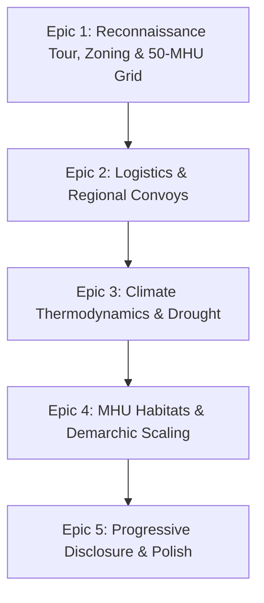

# **O.N.E. Living Commons Game — Civilization Expansion Roadmap (`TODO.md`)**

**Document Version:** 1.0.0  
**Author:** Kyberlex (`kyberlex@proton.me`)  
**License:** AGPL-3.0-or-later  
**Status:** Living Architectural Blueprint & Execution Backlog  

---

## **I. EXECUTIVE ARCHITECTURAL VISION**

From a humble founding plot with a single camper van and three pioneers, Open Networked Earth expands through **four macro pillars of civilizational emergence**:

1. **Bioclimatic Master Grid & 50-MHU Cellular Scaling:** Establishing an invisible thermodynamic zoning grammar from Day 1 to guide module placement (solar, water, workshop, pods), retiring the camper into the central Agora, and scaling to Dunbar capacity (~50 MHUs) before undergoing cellular mitosis into adjacent sister nodes.
2. **Inter-Node Trade & Regional Convoys:** Connecting our autonomous node into a bioregional Reticulum mesh confederation with automated cargo trikes and VTOL courier drones.
3. **Four-Season Thermodynamic Climate & Crisis Resilience:** Real meteorological physics—seasonal solar curves, drought stress, freezing cold snaps, flash floods, and non-extractive crisis protocols when vital reserves run dry.
4. **MHU Ecovillage Scaling & Demarchic Urbanization:** Expanding from a seed settlement into a vibrant Solarpunk eco-city using physical open-hardware Modular Habitat Units (MHUs), welcoming pioneer cohorts, and practicing sortition demarchy at municipal scale.

---

## **II. EPIC 1: ONBOARDING RECONNAISSANCE, BIOCLIMATIC ZONING & 50-MHU CELLULAR SCALING**

> *"A city without an architectural conscience collapses into chaotic sprawl. An interactive planetary reconnaissance tour reveals the 3 stages of civilizational growth, while an invisible thermodynamic master grid guides Day 1 module placement, protects the future Agora, and scales effortlessly into 50-MHU cellular superblocks before federating with adjacent nodes."*

### **1.1 Interactive Planetary Reconnaissance Tour & Bioregional Siting (`embarkation.js`, `world_map.js`)**
- [x] **The 3-Stop Civilizational Preview Tour (Between Name/Craft & Siting):**
  - Camera flies across the planetary map to visit three distinct nodes showcasing the progression of O.N.E.:
    - **Stop 1 (Stage 1 / Seed Node - e.g. Yukon Haven):** 3 Pioneers, Camper Van, Bifacial Solar & Water Flume ($50k debt ticking).
    - **Stop 2 (Stage 2 / Ecovillage - e.g. Monte Sole):** 24 Residents, First MHU Family Clusters, FabLab Machine Shop, Greywater Reed-bed ($15k debt).
    - **Stop 3 (Stage 3 / Sovereign Superblock - e.g. Detroit Delray):** 148 Residents (~50 MHUs), Central Agora (ex-camper site), Cargo Trike Depot, 100% Solar & Zero Debt ($0).
  - **Interactive Synoptic Module Inspection:**
    - Player can click featured modules on each stop (e.g. Solar Array, FabLab, Agora) to reveal 1-sentence micro-tooltips explaining *why* they are placed there and their thermodynamic yield.
- [x] **Automatic Local Geolocation with Complete Global Freedom:**
  - Seamlessly transitions from the Global Tour by auto-centering the map on the player's real-world browser location (via `navigator.geolocation` / IP fallback).
  - Drops a default beacon (`<LocalTown>-ONE`) and computes local solar irradiance, annual precipitation, and top 3 regional urban hubs.
  - **100% Sandbox Agency:** Player can keep their home watershed OR click anywhere on Earth to plant their seed beacon (or select established candidate beacons: Andes, Alps, Galicia, Sahel).
  - **Privacy-First Fallback:** If location is blocked or Tor/VPN is used, smoothly defaults to the Mediterranean candidate corridor without annoying alert dialogs.

### **1.2 Bioclimatic Placement Overlay & Ghost Grid (`settlement_canvas.js`)**
- [x] **Dynamic Zoning Guidelines in Placement Mode:**
  - Render subtle, non-intrusive architectural guidelines while holding a ghost building:
    - **Solar & Microgrid Sector (South):** Amber radial arc showing unshaded irradiance zones with radial solar noon vectors.
    - **Hydrological Spine (North / Slope):** Cyan elevation contour showing gravity-feed cistern lines and low-ground reed-bed drainage.
    - **Machine Shop & Logistics Axis (West):** Steel-tinted corridor connecting to the future Trike Depot and freight trails.
    - **Residential Pod Clearings (East / Radial Courtyards):** Emerald dashed courtyards reserved for future MHUs (accounting for both the timber chassis and attached kitchen garden aprons).
    - **Commons Sanctuary (Radius 0–60px around Camper):** Protective buffer indicator discouraging heavy industrial machinery at village center with active warning if encroached.
  - Implemented in `game/src/render/settlement_canvas.js` (`renderZoningGuidelines`) with context-aware sector highlighting according to active building category and strict 64m Commons Sanctuary clearance in `checkPlacementCollision`.
- [x] **Soft Thermodynamic Proximity Feedback (`checkPlacementCollision`):**
  - Instant sensory tooltips and color feedback during dragging:
    - *“✅ 100% Unobstructed Irradiance (+15 kWh/day)”* vs *“⚠️ Canopy Shading (-30% yield)”*.
    - *“✅ Natural Gravity Flow (0 kW pumping)”* vs *“⚠️ Uphill Pumping Load (+0.5 kW/day)”*.
    - *“✅ Quiet Residential Courtyard (+10 morale)”* vs *“⚠️ Workshop Noise (-15 morale)”*.
  - Implemented in `settlement_canvas.js` with live pill badge rendering on ghost placement box, and wired to `state.js` (`solarModifier`, `pumpEnergyKw`, `moraleBonus`) so placement choices physically modulate daily thermodynamic balances.

### **1.3 Organic Clearing Expansion & Dynamic Carrying Capacity (`settlement_canvas.js`, `state.js`)**
- [x] **Organic Clearing Expansion & Dynamic Carrying Capacity:**
  - Replaced static `340px` boundary with dynamic clearing radius scaling with population and milestones:
    - **Stage 1 (Days 1–7, 3 Pioneers):** 340px radius (Seed Campsite).
    - **Stage 2 (Days 8–20, 6–10 Pioneers):** 520px radius (Pod A & B clearings expand naturally).
    - **Stage 3 (Days 20–50, 20–50 Pioneers / 50 MHUs):** 750px–900px radius (Full Dunbar cell with 3 residential pods).
  - Implemented `getClearingRadius()` and `checkClearingExpansion()` in `state.js`, triggering `clearing_expanded` event on milestone advancement.
  - Implemented organic meadow apron and bio-perimeter dashed contour in `settlement_canvas.js` (`renderGround`), dynamic forest generation receding beyond the clearing edge (`rebuildTrees`), and smooth zoom-to-cursor wheel navigation with pan support from 0.30x to 2.4x.

### **1.4 The Camper Van Transition & The Central Agora (`state.js`, `event_modal.js`)**
- [x] **"Pioneers Under Their Own Roofs!" Milestone Event:**
  - Added `mhu_dwelling` (CLT bio-dwelling, 3 pioneers shelter capacity, max limit 50) to `starterKits` and `hud.js` dock slots.
  - Automatically triggers when the 3rd MHU is placed and operational (`state.js:retireCamperVanToLogistics()`).
  - Retires the camper van from `(0, 0)` to the western logistics/charging slipway at `(-170, 20)` with status `auxiliary_standby`.
  - Transforms coordinate `(0, 0)` into the permanent **Central Agora / Pioneer Fire Hearth** (demarchic flagstone paving, concentric timber benches, sunken stone hearth with animated radial heat glow and dancing flames).
  - Unseals camper van auxiliary reserves: +300 L potable water capacity & stored water, +15,000 kcal emergency dry rations cache, and +20 community morale surge.
  - Celebratory Solarpunk milestone modal (`event_modal.js:renderMilestoneModal`) with rewards showcase, acoustic guitar strum fanfare, and rich inspection panels in `building_inspector.js`.

### **1.5 The 50-MHU Dunbar Horizon & Adjacent Node Mitosis (`state.js`, `world_map_modal.js`)**
- [x] **Dunbar Saturation Milestone (~50 MHUs / ~150 Residents):**
  - Added `getDunbarProgress()` and `triggerDunbarHorizon()` in `state.js` tracking the 50-MHU carrying capacity threshold.
  - Implemented `launchCellularMitosis(crew, name)` in `state.js`:
    - Founds **Node 02 (Sister Node)** in adjacent hex cell (12 km away).
    - Unlocks 3 physical and digital interconnections: 12 km overland bike greenway (rapid 0.5-day cargo trike shuttle corridor), high-voltage DC (HVDC) microgrid bus (+20 kWh energy buffer), and zero-latency line-of-sight Reticulum mesh radio link.
    - Restores pioneer morale to 100% and triggers celebratory milestone modal.
  - Integrated interactive Cellular Mitosis & Dunbar Horizon Hub card in `world_map_modal.js` displaying real-time carrying capacity progress (`${mhuCount} / 50 MHUs`), mitosis expedition launch button, and distinct Solarpunk greenway badges on Node 02.
  - Added Cellular Mitosis shortcut action on the Central Agora in `building_inspector.js`.

---

## **III. EPIC 2: INTER-NODE LOGISTICS, TRADE & REGIONAL CONVOYS**

> *"No node is an island. The Reticulum mesh binds autonomous communities into a resilient, cooperative federation without central banks or predatory logistics."*

### **2.1 Fleet Architecture & Vehicle Types**
- [x] **Electric Cargo Trikes (Overland Fleet):**
  - Payload: 250 kg freight box.
  - Range: 60 km per battery charge.
  - Energy Draw: 1.5 kWh/100 km (swappable 48V LFP battery packs).
  - Routes: Overland greenways and regional bike/cart corridors.
  - Canonical specs in `VEHICLE_SPECS.cargo_trike`, auto-commissioned on `trike_depot` construction.
- [x] **Autonomous VTOL Cargo Drones (Aerial Fleet):**
  - Payload: 25 kg rapid emergency & high-value precision cargo.
  - Range: 45 km radius point-to-point.
  - Energy Draw: 0.8 kWh per sortie (recharged on Vertiport pad).
  - Routes: Direct line-of-sight aerial mesh corridors over ridges and valleys.
  - Canonical specs in `VEHICLE_SPECS.vtol_drone`, auto-commissioned on `drone_vertiport` construction.
- [x] **Fleet State Management & Operations (`state.js` & `building_inspector.js`):**
  - Added `fleet: []` collection to `gameState.data`.
  - Implemented `getVehicleSpecs()`, `getFleet()`, `commissionVehicle()`, `chargeVehicle()`, `serviceVehicle()`, and `rechargeFleet()`.
  - Added interactive fleet status metrics (docked count, payload capacity, 48V LFP SOC%) and direct operational actions (recharge swappable packs, commission vehicles) in `building_inspector.js`.

### **2.2 Regional Partner Nodes & Bioregional Specializations**
- [ ] **Val di Cecina (Geothermal & Agritech):**
  - Exports: Geothermal steam-dried ancient grains, borate salts, heavy copper cable.
  - Demands: Microcontrollers, precision CNC milled brackets, medicinal herbs.
- [ ] **Campi Flegrei (Volcanic Silica & Glassworks):**
  - Exports: Pozzolana cement binder, refractory glass tubes, volcanic zeolite filters.
  - Demands: Fresh calories, preserved vegetables, battery storage racks.
- [ ] **Alburni (Karst Hydrology & Timber Commons):**
  - Exports: Structural chestnut beams, spring water bladders, olive oil.
  - Demands: Solar inverters, water pump solenoids, educational mesh tablets.
- [ ] **Barbagia (Highland Agroforestry & Wool Composites):**
  - Exports: Compressed bio-insulation wool mats, goat cheese, heirloom legume seeds.
  - Demands: 3D printing filament, bio-sensors, water purification membranes.

### **2.3 Logistics Engine & State Model (`state.js`)**
- [ ] Add `convoys: []` collection to `gameState.data`:
  ```javascript
  {
    id: 'convoy-78a9',
    type: 'cargo_trike' | 'vtol_drone',
    origin: 'local_node',
    destination: 'val_di_cecina',
    departureDay: 14,
    departureHour: 8.0,
    etaDay: 15,
    etaHour: 14.0,
    status: 'in_transit' | 'arrived' | 'returning' | 'weather_delayed',
    cargoManifest: {
      foodKcal: 0,
      energyKwh: 0,
      tools: ['laser_spindle_bushing'],
      seeds: []
    },
    returnManifest: {
      tools: ['geothermal_heat_pipe'],
      foodKcal: 15000
    },
    pioneerDriverId: 'maya' // optional for trikes, null for autonomous drones
  }
  ```
- [ ] Implement `dispatchConvoy(type, destination, cargoManifest)` method.
- [ ] Implement `updateConvoys(dt)` in daily simulation loop (`restUntilTomorrow`).
- [ ] Handle transit events (weather hold, trail obstacle, cooperative mutual-aid encounter).

### **2.4 UI & Visualization**
- [ ] **Transit & Vertiport Logistics Desk Modal:**
  - Fleet management screen showing docked trikes/drones, battery SOC%, and maintenance health.
  - Trade order configuration: manifest builder with real-time payload mass and energy budget calculations.
- [ ] **Interactive Canvas Animations:**
  - Trikes departing from Trike Depot down the western logistics corridor.
  - Drones lifting off vertically from Vertiport pads ('H'), spinning rotors, and flying off toward the edge of the world.
  - Inbound convoys docking and unloading crates with floating juice labels (`+15k kcal Ancient Spelt Grain!`).
- [ ] **Regional World Map Integration:**
  - Moving pulse dots along Reticulum mesh paths showing real-time positions of convoys between bioregional nodes.

---

## **IV. EPIC 3: FOUR-SEASON CLIMATE ENGINE & CRISIS RESILIENCE**

> *"Entropy and thermodynamic reality govern all things. Water evaporates under scorching summer heat; pipes freeze in winter. True sovereignty means having engineering contingencies for zero-water and zero-sun conditions without turning back to extractive debt."*

### **3.1 Astronomical & Seasonal Cycle**
- [ ] **Four Bioregional Seasons (7-Day Micro-Seasons or 28-Day Annual Cycle):**
  - **Spring (Days 1–7):** Moderate temperatures (16–22°C), frequent showers (+15–30mm rain), optimal seed germination (+25% crop growth).
  - **Summer (Days 8–14):** Peak solar irradiance (1.25 kW/m²), high temperatures (28–38°C), rapid evaporation (-15% water loss), drought risk.
  - **Autumn (Days 15–21):** Harvest bounty, cooling temperatures (14–20°C), heavy rainfall, storm runoff testing swale absorption.
  - **Winter (Days 22–28):** Low solar irradiance (0.55 kW/m²), frost temperatures (0–8°C), frozen outdoor piping, increased thermal heating loads.
- [ ] **Dynamic Evapotranspiration & Thermodynamics:**
  - Evaporation formula: $E_{loss} = A_{exposed} \times (T_{ambient} - 15) \times k_{evap}$.
  - Shaded cisterns and underground tanks have near-zero evaporation.
  - Open ponds and swales experience natural percolation and seasonal fluctuations.

### **3.2 Zero-Water & Extreme Weather Contingency Protocols**
- [ ] **"What Happens When Water Drops to 0?" Architecture:**
  - **Stage 1 (Water Conservation Emergency):** Non-essential water lines shut off automatically. Garden beds enter drought-survival mode.
  - **Stage 2 (Emergency Van Auxiliary Bladder):** Unseal the sealed 300L camper van fresh-water reserve (+300 L buffer).
  - **Stage 3 (Atmospheric Water Harvesting / Dehumidifier):** If energy stored > 20 kWh, run condensation chiller in FabLab to extract 80 L/day from air humidity.
  - **Stage 4 (Deep Artesian Well Solar Pumping):** Prioritize microgrid power to deep well pumps (+250 L/day regardless of rainfall).
  - **Stage 5 (Bioregional Mesh Water Convoy):** Request cooperative water bladder delivery via Reticulum mesh from partner node (e.g. Alburni karst node) with zero monetary debt, repaid in future seed stocks or fabrication labor.
  - **Stage 6 (Legacy Water Truck Dilemma):** A private extractive water tanker arrives at settlement edge offering water in exchange for $2,500 debt or private property concessions—deliberated in Agora Demarchy Assembly!

### **3.3 Weather Visuals & Atmospheric Sensory Juice**
- [ ] Canvas seasonal backdrop:
  - Spring: Lush verdant greens, blooming wildflowers on meadow edges.
  - Summer: Golden straw hues, heat shimmer ripples on stone pavers.
  - Autumn: Amber ochre leaf fall, wet soil reflections.
  - Winter: Cool desaturated frost hues, chimney smoke curls from Communal Hearth and MHU stoves.
- [ ] Weather particle effects:
  - Rain showers and heavy downpours with rippling ground puddles.
  - Lightning flash illumination during convective summer thunderstorms.
  - Dust/pollen drifting on hot wind days.

---

## **V. EPIC 4: MHU ECOVILLAGE SCALING & DEMARCHIC URBANIZATION**

> *"Dynamic Usufruct: Land and housing are commons for living, not speculative assets. The Modular Habitat Unit (MHU) is an open-hardware standard for rapid, circular, dignified dwelling."*

### **4.1 Modular Habitat Unit (MHU) Construction & Open Hardware Sync**
- [ ] Implement MHU building tiers matching [`habitat/MHU_MODULAR_HABITAT_UNIT.md`](habitat/MHU_MODULAR_HABITAT_UNIT.md):
  - **Proportional Chassis Sizing & Family Scaling:**
    - **MHU Couple Pod (2 Residents):** Standard single-bay chassis ($18\text{–}24\text{ m}^2$).
    - **MHU Family Cluster (4 Residents):** Expanded multi-bay modular chassis ($45\text{–}54\text{ m}^2$), significantly larger footprint with private sleeping nooks and shared central atrium.
  - **Universal Guest Capacity (+2 Buffer per Dwelling):**
    - Every MHU structurally integrates sleeping buffer space for **2 guests** (sabbatical pioneers visiting from sister nodes per Art. 4.2, traveling scholars, or family):
      - Couple MHU: 2 permanent residents + 2 guests = **Capacity: 4**.
      - Family MHU: 4 permanent residents + 2 guests = **Capacity: 6**.
  - **Equitable Attached Kitchen Garden (Constant Surface Area / Person):**
    - Every MHU features an integrated private/semi-private micro-permaculture garden apron.
    - Garden shapes adapt organically to terrain and courtyard geometry (wrap-around, L-shape, rectangular, courtyard wedge), but **must maintain invariant surface area per capita** (e.g. $15\text{ m}^2/\text{person}$ of bio-intensive soil for kitchen herbs, tea, berry bushes, and greywater sub-irrigation).
  - **Specialist Community Structures:**
    - **MHU Studio / Workshop Loft:** Living space over craft workshop or laboratory.
    - **MHU Communal Bathhouse & Sauna:** Solar thermal water heating with greywater reed-bed connection.
- [ ] Material bills of materials (BOM):
  - Local timber billets, CNC-machined interlocking joinery, compressed earth blocks (CEB), polycarbonate glazing.

### **4.2 Population Growth, Intergenerational Demographics & Vocation Cohorts**
- [ ] **Intergenerational Demographic Evolution (Children & Elders):**
  - As new pioneer cohorts arrive and population scales toward 50–150 residents, the settlement transforms from a pure work-camp into a full, living intergenerational community:
    - **Children Demographic:**
      - Dependent residents requiring daily caloric intake, dignified shelter, and community care (exempt from heavy manual chores).
      - **Gameplay & Systemic Mechanics:**
        - Unlocks the **Open Forest School, Natural Playground & Community Nursery**.
        - Perform joyful micro-chores (wild berry foraging, seed packet sorting, companion animal care).
        - Grants a permanent **Village Morale & Future Hope Boost** (+15% community resilience against climate despair and crisis events).
    - **Elders Demographic:**
      - Senior citizens with reduced physical labor stamina (exempt from heavy timber framing, trenching, and high-altitude roof work).
      - **Gameplay & Systemic Mechanics:**
        - **Wisdom & Knowledge Mentorship:** Accelerate FabLab schematic research, mentor apprentices, and compound herbal remedies in the clinic.
        - **Civic Governance Parity:** Act as seasoned, impartial mediators and deliberators in **Agora Demarchy Sortition Juries (odd parity)**.
        - **Care Infrastructure:** Require single-story, accessible ground-floor MHUs with continuous heating and zero steep loft ladders.
    - **The Dependency Ratio & Automation Impetus:**
      - Because children and elders consume resources while performing less heavy industrial labor, the manual chore pool tightens per capita.
      - This creates the direct systemic incentive to deploy **Open Hardware Automation (Art. 5.4)** (ESP32 irrigation solenoids, CNC FarmBots, automated grain mills), liberating working adults to focus on care, education, and cultural life.
- [ ] Pioneer roster scaling from 3 founders to 12+ permanent citizens:
  - **Agronomists & Mycologists:** Boost soil biological health and mushroom cultivation in food forest.
  - **Systems Engineers & LinuxCNC Operators:** Maintain automated gantry mills, drone firmware, and mesh nodes.
  - **Herbalists & Paramedics:** Staff the Health Clinic, compounding bioregional tinctures and managing wellness.
  - **Educators & Artists:** Run the Open School, preserve oral lore, and document open-source CAD blueprints.
- [ ] Housing allocation & Sabbatical Locks:
  - Inactive citizens release dwellings back to Civic Housing Pool unless sabbatical lock is engaged.
  - Living satisfaction metrics: thermal comfort, food diversity, free leisure time, civic participation.

### **4.3 Community Life, Weddings & Longitudinal Family Dynamics**
- [ ] **Village Weddings & Life Union Festivals:**
  - As the settlement matures beyond early survival (15+ residents), pioneers form lasting interpersonal bonds, culminating in **Community Wedding Celebrations** hosted at the Central Agora:
    - Triggers an all-village celebration feast, acoustic folk music, and lantern lighting (+100 communal morale).
    - Commemorated in the village history ledger as a generational milestone.
- [ ] **Longitudinal Family Simulation (0 to 4 Children over Simulated Years):**
  - Over multi-year cycles, married couples may welcome between **0 and 4 children**, creating shifting spatial and caloric needs over time.
- [ ] **Dynamic Housing Choice: In-Situ Modular Expansion vs. School-Proximate Relocation:**
  - When a household expands, Dynamic Usufruct (Art. 4) and Open Building principles offer two distinct architectural solutions:
    - **Option A — Modular Chassis Extension (Outer Zone Plots):**
      - If the current 2-person MHU is situated in an outer pod perimeter with sufficient unshaded yard clearance, the family can build and bolt on **CNC timber extension cassettes** (adding 1–2 children's bedrooms) and expand their attached kitchen garden apron.
    - **Option B — Relocation to 4- or 6-Person Home (Near School & Nursery):**
      - If the existing plot cannot expand, the family releases their 2-person unit back to the Civic Housing Pool and moves into a newly constructed 4- or 6-person family MHU located within a safe, direct pedestrian walking radius of the **Open Forest School, Nursery & Playground**.
    - **Circular Housing Re-Allocation:**
      - The vacated 2-person MHU is immediately reassigned to incoming young pioneer pairs or visiting sabbatical scholars, maintaining 100% housing occupancy with zero speculative vacancies.

### **4.4 Municipal-Scale Demarchy & Socratic Juries**
- [ ] As settlement exceeds 20 residents, civic governance scales:
  - Assembly juries expanded from 5 to 7 or 9 members selected by lot (odd parity strictly preserved).
  - New high-stakes dilemmas:
    - *The Regional Railway Spur:* Should we dedicate 200 hours of labor to reconnect the abandoned rail spur to the national network?
    - *Refugee Caravan Admission:* A convoy fleeing a coastal climate disaster seeks sanctuary; can our food reserves sustain 15 new arrivals through winter?
    - *Automation vs. Craftsmanship:* Should heavy gantry mills run 24/7 or be throttled to prevent component wear and grid overload?

---

## **VI. EPIC 5: PROGRESSIVE DISCLOSURE & ENGINE POLISH**

- [ ] **Dynamic Level-of-Detail (LOD) Rendering:**
  - Macro zoom (0.30x–0.45x): Simplified architectural silhouettes and district boundary glows for buttery 60 FPS performance.
  - Micro zoom (0.80x–1.50x): Full vector mechanical details (spinning spindles, swimming fish in aquaponics, billowing chimney smoke).
- [ ] **Audio Soundscape Synthesizer Expansion:**
  - District-specific ambient layers (crickets and water flow in Agro Belt, mechanical hum and sparks in FabLab, wind chimes in MHU Ecovillage, prop whir in Transit Vertiport).
  - Seasonal audio cues: summer cicadas, autumn wind gusts, winter stillness.
- [ ] **Dual-Track Real-World Blueprint Export:**
  - "Export Blueprints" button in Building Inspector downloading actual 3D printable STL files and Home Assistant automation YAML configurations for real-world builders.

---

## **VII. EXECUTION SEQUENCE**



| Phase | Milestone Goal | Primary Files Impacted |
| :--- | :--- | :--- |
| **Phase 1** | Onboarding Reconnaissance Tour, Bioclimatic Grid & Camper Transition | `game/src/ui/embarkation.js`, `game/src/map/world_map.js`, `game/src/render/settlement_canvas.js`, `game/src/core/state.js` |
| **Phase 2** | Inter-Node Trade, Cargo Trikes & Drone Flights | `game/src/core/state.js`, `game/src/render/settlement_canvas.js`, `game/src/ui/world_map_modal.js` |
| **Phase 3** | Four-Season Climate Engine & Water Drought Logic | `game/src/core/state.js`, `game/src/render/settlement_canvas.js`, `game/src/ui/event_modal.js` |
| **Phase 4** | MHU Housing Construction & Dunbar Mitosis (~50 MHUs) | `game/src/core/state.js`, `game/src/ui/hud.js`, `game/src/ui/building_inspector.js` |
| **Phase 5** | Municipal Sortition Demarchy & Full Confederation | `game/src/ui/event_modal.js`, `game/src/render/settlement_canvas.js` |
