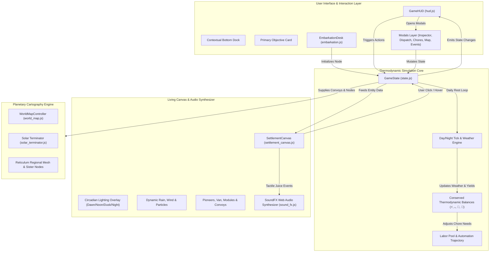

# **O.N.E. Living Commons Game — Synoptic Architecture & Systems Compendium (`_synoptic.md`)**

**Document Version:** 1.0.0  
**Repository Path:** `game/`  
**Persona & Author:** Kyberlex (`kyberlex@proton.me`)  
**License:** AGPL-3.0-or-later  
**Status:** Canonical System Reference & Synoptic Blueprint  
**Updated:** 2026-10-05  

---

## **1. EXECUTIVE SUMMARY & CIVILIZATIONAL VISION**

The **Open Networked Earth (O.N.E.) Living Commons Game** (`game/`) is a client-side, local-first Solarpunk city-building and thermodynamic resilience simulation. 

Unlike conventional resource-management games that simulate extractive capitalist economies (fiat money accumulation, speculative real estate, infinite growth, environmental destruction), the O.N.E. game simulates the **physical transition to a moneyless, post-scarcity, thermodynamically balanced civilization** anchored in the Living Constitution of Open Networked Earth:
* **Strict Thermodynamic Physics:** All flows obey physical conservation laws (First and Second Laws of Thermodynamics, Leontief input-output balances). Energy and water cannot appear from thin air; every machine suffers entropy and wear.
* **Dynamic Usufruct ("Use It or Lose It"):** Dwellings and workshops belong to the community commons. Citizens possess secure occupancy while active, with zero private land ownership or landlord extraction.
* **Cooperative PvE Mechanics:** There is zero player-versus-player griefing. The adversary is exclusively systemic entropy, climate volatility, and the legacy financial extraction system.
* **Dual-Track Handshake:** In-game modules directly mirror real-world open-hardware blueprints (3D printable .STL CAD files and Home Assistant YAML packages).

---

## **2. SYSTEM ARCHITECTURE & REACTIVE DATA FLOW**

---

## **3. THE 5 NON-NEGOTIABLE GAME DESIGN FILTERS**

To avoid legacy simulator UX friction, every system in `game/` is strictly governed by 5 design filters:

| Filter | Core Principle | Implementation in `game/` |
| :--- | :--- | :--- |
| **1. Ultra-Simple Copy** | `[Problem in 5 words] + [Action] + [Benefit]` | Tooltips and alerts are 1–2 short sentences; zero academic filler. |
| **2. Instant Sensory Juice** | Every player action causes an immediate visual reaction | Spring bounces on placement, dust puff particles, floating `+15 kWh` deltas, Web Audio clicks. |
| **3. Contextual Bottom Dock** | Maximum 3–4 buttons visible at once | Dynamic dock changes based on the active milestone (e.g. Solar, Cistern, Garden, Rest). |
| **4. Always-On Objective Card** | Clear immediate goal pinned at top-left | Displays current task, live progress bar (`120 / 500 L`), and milestone reward preview. |
| **5. Strict Progressive Disclosure** | "The Gated Horizon" | Days 1–6: Local campsite only. Day 7: Radio antenna unlocks Regional Map. Day 15: FabLab unlocks 3D CAD. |

---

## **4. CORE SIMULATION SUBSYSTEMS**

### **4.1. The Four Conserved Physical Balances**
1. **⚡ Energy (kWh):** Generated via bifacial solar arrays (sun-tracking) and wind turbines (Betz limit). Stored in van AGM batteries and stationary LFP banks. Consumed by water pumps, FabLab tooling, heating, and vehicle recharging.
2. **💧 Water (Liters):** Harvested via rainwater swales, cisterns, and morning dew catchers. Consumed for pioneer hydration (3 L/person/day) and greenhouse irrigation. Greywater reed-beds biologically recycle 65% of outflow.
3. **🥗 Food (Kilocalories):** 2,200 kcal/day nutritional baseline per pioneer. Provided initially by van dry storage rations, transitioning to bio-intensive greenhouses, aquaponic flumes, and agroforestry food forests.
4. **👥 Labor & The 6-Hour Chore Pool:** 3 pioneers provide 6 hours of daily collective labor (2 hours/day per adult). Unautomated tasks (water hauling, weeding, panel dusting) drain this pool. Building open-hardware automation permanently extinguishes manual chores, unlocking free creative time.

### **4.2. Spatial Master Grid & District Zoning**
The settlement expands radially across 5 distinct bioclimatic functional districts:
* **District 1: Pioneer Commons (`radius: 120px`):** Camper van campsite, communal fire hearth, and the future Central Agora gathering circle. Heavy machinery is discouraged.
* **District 2: Agro Belt (`radius: 260px`, South/East):** Bio-intensive greenhouses, permaculture swales, and food forests positioned for optimal sunlight.
* **District 3: FabLab & Machine District (`radius: 420px`, West):** CNC gantry mills, 3D printers, woodworking shop, and electronics bench situated downwind.
* **District 4: Residential Ecovillage (`radius: 600px`, East/North):** Modular Habitat Units (MHUs) arranged around quiet pedestrian courtyards.
* **District 5: Transit & Vertiport Hub (`radius: 800px`, Far West):** Cargo trike depot and autonomous drone landing pads connecting to regional trails.

### **4.3. Regional Logistics & Reticulum Mesh**
* **Electric Cargo Trikes:** 250 kg freight capacity, 60 km overland range, 1.5 kWh/100 km draw. Connects proximate nodes along bike greenways.
* **Autonomous VTOL Cargo Drones:** 25 kg high-speed precision payload, 45 km radius, 0.8 kWh per sortie. Traverses rugged mountain topography.
* **Federated Trade:** Non-monetary mutual-aid exchange between sister nodes (e.g. trading Val di Susa precision electronics for Val di Cecina geothermal grains).

### **4.4. Four-Season Dynamic Climate & Crisis Resilience**
* **Astronomical Solar Curves:** Real seasonal sun angles and daytime length calculated dynamically based on node latitude.
* **Extreme Weather Contingency Protocols:**
  - Stage 1: Water conservation shutdown.
  - Stage 2: Unsealing the 300L camper van emergency bladder.
  - Stage 3: Atmospheric water generation chiller in FabLab.
  - Stage 4: Deep aquifer solar pumping.
  - Stage 5: Mesh emergency mutual-aid water convoy.
  - Stage 6: The Legacy Water Truck dilemma deliberated in Agora Demarchy Assembly.

---

## **5. CURRENT CODEBASE STATUS & ROADMAP GAPS**

The foundational engine (`main.js`, `state.js`, `settlement_canvas.js`, `hud.js`, `sound_fx.js`, `world_map.js`) is robust, fully operational, and compiles with zero errors on Vite (`http://localhost:5174/`).

**Active Progress Highlights:**
* **Completed (Epic 1.1 — Reconnaissance Tour & Automatic Siting):**
  - The 3-Stop Civilizational Preview Tour in `embarkation.js` and `world_map.js` seamlessly guides new players across Yukon Haven (Stage 1 Seed Camp, $50k debt), Monte Sole (Stage 2 Ecovillage, $15k debt), and Detroit Delray (Stage 3 Sovereign Superblock, $0 debt) with interactive synoptic module inspection tooltips explaining thermodynamic yields.
  - Automatic Local Geolocation seamlessly centers the map on the player's real-world browser watershed, calculates localized solar irradiance (kWh/m²/yr) and precipitation (mm/yr), renders top 3 regional urban hubs, offers 6 established Candidate Corridors (Alps, Andes, Galicia, Sahel, Amazon, Kerala), and provides a silent privacy-first Mediterranean fallback without alert dialogs.

The remaining civilizational expansion tasks are catalogued in [`game/TODO.md`](TODO.md) across four macro pillars:
1. **Epic 1:** Bioclimatic Zoning Guidelines, Soft Proximity Feedback, and Dynamic Clearing Expansion.
2. **Epic 2:** Inter-Node Trade, Cargo Trike & VTOL Drone Logistics.
3. **Epic 3:** Four-Season Climate Engine, Evapotranspiration, and Extreme Weather Protocols.
4. **Epic 4:** MHU Ecovillage Scaling, Intergenerational Demographics, and Municipal Sortition Demarchy.
5. **Epic 5:** Dynamic LOD Rendering, District Soundscape Audio, and Dual-Track CAD Export.
