# OPEN NETWORKED EARTH (O.N.E.)
## Urban Scaling & Transition Blueprint: From Seed Nodes to Bioregional Metropolises (v1.0)
### An Architectural, Infrastructural, and Jurisprudential Guide for Civilizational Retrofitting

---

## 1. Scope and Scaling Philosophy

The transition of Open Networked Earth (O.N.E.) from isolated, low-CapEx rural seed nodes ($10^1 - 10^3$ inhabitants) to dense, federated metropolises ($10^4 - 10^6+$ inhabitants) does not rely on tabula rasa megaprojects or destructive demolitions. Demolishing existing cities wastes centuries of embodied thermodynamic exergy and mineral resources. 

Scaling occurs via **The Dual-Track Handshake** (Article 9.1) and **Bioregional Subsidiarity** (Article 10.1): inserting open-source, closed-loop infrastructural fabrics into existing legacy urban shells while the speculative market collapses under ecological debt and financial insolvency.



---

## 2. The Five Pillars of Urban Retrofitting

Existing cities are restructured without mass demolition through five open-source interventions:



### Pillar 1: Spatial De-paving & Superblocks (The Rueda Model)
* **Strategy:** Reorganize road grids into $400 \times 400\text{ m}$ clusters (Superblocks).
* **Execution:** Inter-neighborhood motorized transit is confined to peripheral arterials. Interior streets become one-way loops capped at $10\text{ km/h}$, reserved for pedestrians, micro-mobility, and emergency services.
* **Biophysical Impact:** Frees $60\% - 70\%$ of paved surface for permeable soil regeneration, bio-swales, community food forests, and localized fitodepuration.

### Pillar 2: Industrialized Thermal Retrofitting (Energiesprong Approach)
* **Strategy:** Rapid exterior encapsulation of legacy multi-family buildings (e.g., 1950s–1980s concrete and brick blocks) without displacing occupants.
* **Execution:** High-resolution LiDAR 3D scanning generates millimeter-accurate building models. Distributed municipal Fab-Labs pre-fabricate insulated timber-frame panels complete with integrated triple-glazing, VMC ventilation ducts, and finishes. Panels are hoisted and fastened to the existing exterior in days.
* **Thermodynamic Impact:** Slashes heating and cooling demand by $70\% - 85\%$, achieving net-zero operational status via factory-fitted rooftop photovoltaic arrays.

### Pillar 3: Multi-Story Open Building & Usufruct Infill (Habraken Framework)
* **Strategy:** Decouple the structural frame ("Base/Support") from the interior architecture ("Infill") in abandoned office towers and industrial parks (Article 2.1, 9.5).
* **Execution:** Steel-and-concrete commercial floor plates are reclaimed as municipal Commons Trusts (Article 9.2). Standardized, fire-rated prefabricated modules (dry-joint timber cassettes and standardized modular utility pods) are mounted inside commercial footprints to generate high-ceiling, luminous residential units and local Tier 3 prototyping suites.

### Pillar 4: Hydrological Daylighting & Jus Biosphaerae
* **Strategy:** Re-exposing culverted rivers, urban creeks, and buried drainage networks (Article 10.2).
* **Execution:** Uncapping concrete canalizations restores natural riverine geomorphology. Riparian buffers mitigate 100-year urban flash-flood dynamics, eliminate stormwater surging into sewer networks, and establish passive cross-ventilation corridors that lower urban heat-island peaks by $3^\circ\text{C} - 5^\circ\text{C}$.

### Pillar 5: Cellular DC Microgrids & 30-Day Islanding
* **Strategy:** Dismantling centralized single-point-of-failure utility grids into autonomous, interconnected sub-networks (Article 6.1, 6.2).
* **Execution:** Medium-voltage DC distribution backbones connect urban blocks. Subterranean parking structures and obsolete transit tunnels are re-engineered into thermal mass stores and localized stationary battery banks (Lithium Iron Phosphate / Sodium-ion). Sub-second autonomic analog protection trips decouple municipal districts during wider macro-grid collapse, safeguarding the mandatory 30-day Tier 1 survival baseline.

---

## 3. Urban Circular Metabolism: The DIDO Architecture

Metropolises within O.N.E. transition out of the extractive linear paradigm:



1. **Short-Loop Metallurgy & Repair:** Heavy machine tooling, induction forges, and industrial CNC routers are placed within municipal fab-labs to process localized scrap metals into structural framing and parts under universal repairability covenants (Article 6.3).
2. **Organic Nutrient Return:** Municipal sanitation streams separate greywater from concentrated organic solids. Solids are diverted to anaerobic thermophilic digestors (producing biogas for backup dispatch and stabilized biochar for peri-urban agroecological zones), ending urban soil depletion.

---

## 4. Federated Civic Governance for Large Urban Centers

To prevent bureaucratic entrenchment and oligarchic capture, metropolises do not deploy centralized city halls, executive mayors, or party-based municipal councils (Article 4.1). Governance scales fractally through concentric demarchic assemblies in strict odd parity (Article 4.2):



* **Non-Delegable Lot Selection:** Assemblies are populated by statistically stratified random sortition across age, gender, and sub-basin geography (Article 4.3).
* **Adversarial Epistemic Parity:** Modeling of energy balancing, water flows, and public safety is submitted to assemblies by Tripartite Epistemic Working Groups (1/3 guild scientists, 1/3 sortition citizens, 1/3 Heretic's Commons verifiers) with zero legislative or executive authority (Article 4.4).

---

## 5. Directory of Open-Source Models, Tools & Frameworks

The following open-source frameworks, standards, and repositories provide the technical, architectural, and legal substrate for executing the O.N.E. urban transition:

### Urban Planning & Spatial Restructuring
* **Superblocks / Superilles (Agència d'Ecologia Urbana de Barcelona):**
  * *Focus:* Pedestrianization, urban mobility reduction, green corridors, and noise remediation.
  * *Resources:* [BCN Ecologia Models](https://bcnecologia.net) | [Barcelona Superilles Portal](https://ajuntament.barcelona.cat/superilles/en/)
* **Fab City Global Initiative:**
  * *Focus:* The Data-In, Data-Out (DIDO) urban transformation protocol; urban self-sufficiency tracking across food, energy, and localized manufacturing.
  * *Platform:* [https://fab.city](https://fab.city) | [Fab City Whitepaper & Standards](https://fab.city/resources)
* **C40 Clean Construction & Municipal Retrofit Playbooks:**
  * *Focus:* Embodied carbon calculation frameworks and structural retrofit guidance for high-density municipal assets.
  * *Knowledge Base:* [https://www.c40.org](https://www.c40.org)

### Industrialized Envelope Retrofitting & Open Modular Architecture
* **Energiesprong Open Standard:**
  * *Focus:* Industrial off-site net-zero retrofitting methodology using prefab insulated shells, rooftop PV, and factory-integrated mechanical cores.
  * *Technical Specs & Case Studies:* [https://energiesprong.org](https://energiesprong.org)
* **Open Building Network / CIB W104:**
  * *Focus:* The structural methodology of John Habraken; architectural segregation between permanent urban frames (Support) and modular interior architecture (Infill).
  * *Documentation & Theory:* [https://www.open-building.org](https://www.open-building.org)
* **WikiHouse Skylark Structural Engine:**
  * *Focus:* Open-source, CNC-milled timber block systems easily adapted for multi-story internal infill partitions and rooftop vertical extensions.
  * *Repository:* [https://www.wikihouse.cc](https://www.wikihouse.cc) | [GitHub Source](https://github.com/wikihouseproject)
* **OpenStructures System:**
  * *Focus:* Dimensional modularity and mechanical compatibility standards for furniture, interior layout components, and domestic infrastructure.
  * *Standard:* [https://openstructures.net](https://openstructures.net)

### CAD, BIM, and Engineering Infrastructure Software
* **OSArch / Open-Source Architecture Community:**
  * *Focus:* Vendor-neutral, fully free toolchains covering the entire architecture, engineering, and construction pipeline.
  * *Community:* [https://osarch.org](https://osarch.org)
* **BlenderBIM (IfcOpenShell):**
  * *Focus:* Open-source native authoring of ISO-standard Industry Foundation Classes (IFC4) BIM data models for neighborhood and multi-family scale.
  * *Software:* [https://blenderbim.org](https://blenderbim.org)
* **FreeCAD (BIM & Path Workbench):**
  * *Focus:* Parametric modeling of mechanical and structural building components with direct CAM/G-code generation for municipal milling arrays.
  * *Repository:* [https://www.freecad.org](https://www.freecad.org)
* **QGIS (Bioregional Hydrology & Geographic Analysis):**
  * *Focus:* Watershed delineation, ecological carrying capacity mapping, and topographic catchment analysis.
  * *Tool:* [https://qgis.org](https://qgis.org)

### Grid Automation, Industrial Controls & Mesh Communications
* **OpenPLC Project:**
  * *Focus:* IEC 61131-3 compliant, bit-for-bit verifiable industrial PLC firmware for district water gates, breaker panels, and localized microgrid switching.
  * *Software & Schematics:* [https://openplcproject.com](https://openplcproject.com)
* **Home Assistant / ESPHome (Local-First Telemetry):**
  * *Focus:* Privacy-respecting abiotic telemetry, air-quality monitoring, and energy flow management running strictly on local network hardware.
  * *Platforms:* [https://www.home-assistant.io](https://www.home-assistant.io) | [https://esphome.io](https://esphome.io)
* **Meshtastic (Off-Grid Mesh Telemetry):**
  * *Focus:* Open-source, off-grid LoRa-based communication firmware for encrypted inter-neighborhood telemetry independent of commercial telecom infrastructure.
  * *Protocol:* [https://meshtastic.org](https://meshtastic.org)
* **LibreMesh / OpenWrt:**
  * *Focus:* Autonomous, self-configuring wireless mesh networks for municipal data commons and telemetry distribution.
  * *Repositories:* [https://libremesh.org](https://libremesh.org) | [https://openwrt.org](https://openwrt.org)

---

## 6. Implementation Checklist: The Municipal Transition Sequence

```
    YEAR 1-3                  YEAR 3-6                    YEAR 6-10
[ INSTITUTIONAL SHIELD ]    [ STRUCTURAL DECOUPLING]    [ EQUILIBRIUM COVENANT ]
- Defaulted asset trusts    - Superblocks mapped        - Full monetary exit
- Demarchic registry set    - Facade prefab launched    - Baseline guaranteed
- Pilot microgrids live     - Daylighting excavated     - Swords-to-plowshares
```

1. **Step 1: Establishing the Asset-Locked Enclave:** Reclaim insolvent, bankrupt, or vacant commercial properties under non-profit Community Land Trusts (CLTs) protected by adverse possession covenants (Article 9.2, 9.5).
2. **Step 2: Activating the Sortition Mesh:** Enroll residents into a cryptographically verified, non-biometric personhood registry (ZK-PoP), convening the initial 15-citizen Neighborhood Sortition Councils (Article 4.3, 7.4.4).
3. **Step 3: Deploying the Urban Fab-Lab:** Outfit a reclaimed industrial shell with standard 3-axis CNC tables, welding stations, and an OpenPLC automation line to begin fabrication of retrofit cassettes and micro-hydro/solar hardware (Article 6.3).
4. **Step 4: Street Grid Re-allocation:** Block transient traffic through temporary planters and barriers, establishing the first Superblock perimeter and breaking asphalt for stormwater collection swales.
5. **Step 5: Envelope Cladding Operations:** Execute external deep thermal retrofits using the Energiesprong panel method, mounting DC heat pumps and building ventilation cores.
6. **Step 6: Islanding Verification (Black-Sky Audit):** Verify that the neighborhood can decouple from the regional transmission grid and municipal water mains, sustaining 100% of resident Tier 1 biological needs for 30 consecutive days from localized storage (Article 6.1.2).
