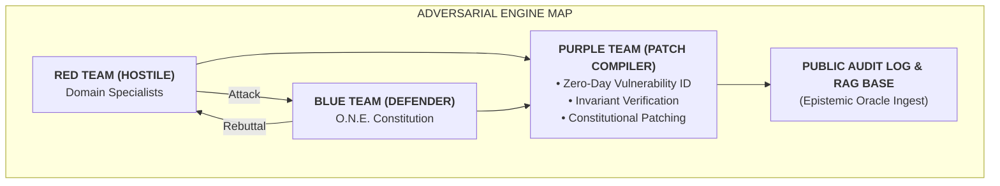
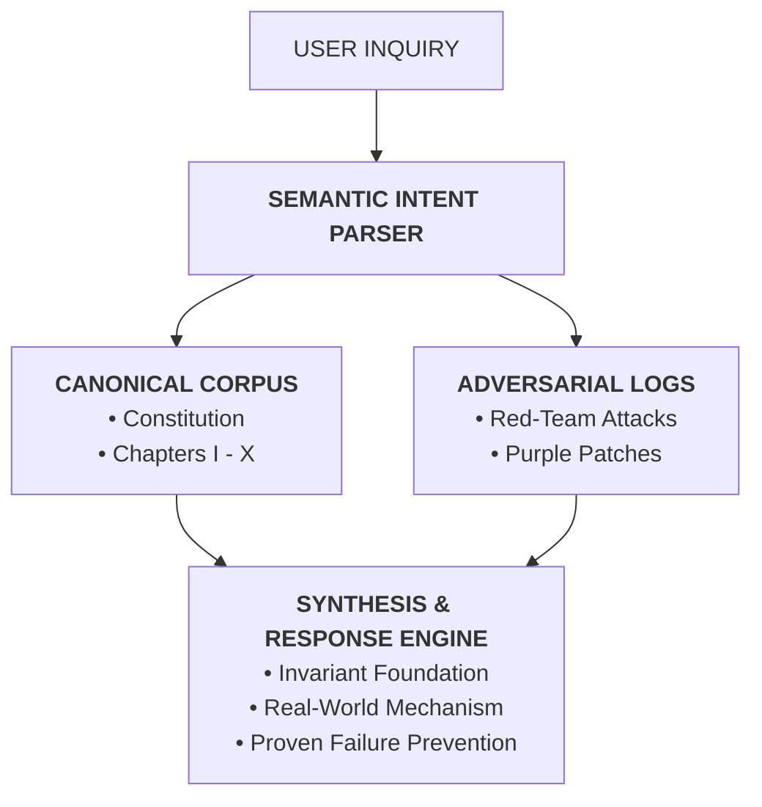

# SPECIFICATION DOCUMENT: O.N.E. ADVERSARIAL STRESS-TEST SIMULATION (O-ASIS)

**Framework for Multi-Agent Epistemic Red-Teaming, Automated Patching, and Epistemic Ingest**

**Version:** 1.0-EXP

**Classification:** Operational Architecture Specification

---

### 1. Executive Intent & Foundational Principles

The purpose of the O.N.E. Adversarial Stress-Test Simulation (O-ASIS) is to subject the Living Constitution of Open Networked Earth (O.N.E.) to recursive, adversarial systemic interrogation prior to physical capital deployment.

The simulation does not seek consensus or political mediation. Its objective is purely diagnostic: identifying systemic exploits, economic deadlocks, physical supply-chain blind spots, and game-theoretic failure modes across the ten constitutional chapters.



#### Core Operational Directives

* **Strict Epistemic Asymmetry:** The Red Team operates under the axioms of Track A (scarcity economics, positive statutory law, centralized realpolitik, self-interested rational agents). The Blue Team operates strictly within the physical, biophysical, and sortition invariants of Track B.

* **Rejection of Ideological Compromise:** The Purple Team is expressly prohibited from diluting constitutional invariants (e.g., re-introducing compound interest, chattel title, carceral imprisonment, or algorithmic governance). It serves as a deterministic compiler of structural patches, not a diplomatic moderator.

* **Radical Traceability:** Every prompt, context injection, token stream, attack vector, and patch rationale shall be serialized into deterministic Git trees for public verification and downstream retrieval augmentation.

---

### 2. Multi-Agent Topology & Behavioral Configurations

#### 2.1. The Red Team (Adversarial Specialists)

The Red Team consists of five distinct, autonomous agents configured to act with maximum domain competence, cynicism, and technical rigor.

* **Agent RED-1: Neoliberal & Austrian Macroeconomist**
* *Target Vector:* Chapter II (Property Usufruct) and Chapter III (Thermodynamic Accounting).

* *Core Heuristics:* Mises-Hayek Economic Calculation Problem, tragedy of the unpriced commons, dynamic Leontief-Kantorovich calculation bottlenecks, arbitrage vulnerabilities in Tier 3 allocations, free-rider dynamics in demonetized systems.

* *Direct Prompt Directive:* Identify every point where the absence of floating price signals produces hidden shortages, physical queuing deadlocks, misallocated exergy, or illegal secondary black markets.

* **Agent RED-2: Corporate Real Estate & Black-Letter Jurist**
* *Target Vector:* Chapter II (Usufruct), Chapter IX (Transitional Bridge), and Chapter X (Watershed Federation).

* *Core Heuristics:* Common-law property mechanics, corporate legal warfare, statutory eminent domain, cross-border tax evasion/AML regulations, treaty enforceability, contractual nullity under sovereign state jurisdictions.

* *Direct Prompt Directive:* Formulate legally valid litigation strategies, judicial injunctions, cross-border banking embargoes, and corporate asset-recovery schemes capable of invalidating Community Land Trusts (CLTs) and freezing External Trade Interface (ETI) operations.

* **Agent RED-3: Asymmetric Warfare & Realpolitik Strategist**
* *Target Vector:* Chapter VI (Distributed Infrastructure), Chapter VIII (Defensive Deterrence), and Chapter IX (Transitional Bridge).

* *Core Heuristics:* Siege logistics, kinetic standoff interdiction (A2/AD saturation), electronic warfare/RF jamming, proxy insurgencies, asymmetric siege, intelligence subversion, saboteur insertion.

* *Direct Prompt Directive:* Exploit the weapon-ban and non-militarized policing constraints to force the capitulation, physical interdiction, or territorial enclosure of a 30-day decoupled node through non-kinetic or remote kinetic attrition.

* **Agent RED-4: Behavioral Game Theorist & Evolutionary Psychologist**
* *Target Vector:* Chapter IV (Sortition Architecture) and Chapter V (Essential Labor & Education).

* *Core Heuristics:* Charismatic authority capture, informal oligarchic consensus within lotteries, social loafing, parental nepotism against alloparenting, psychological resistance to rotational maintenance labor.

* *Direct Prompt Directive:* Demonstrate how charismatic sociopaths, hidden affinity cliques, or informal tribal networks can manipulate sortition assemblies and evade reciprocity sanctions without triggering formal legal alarms.

* **Agent RED-5: Cybernetic, SCADA & Industrial Systems Engineer**
* *Target Vector:* Chapter III (Telemetry), Chapter VI (Microgrids & Fallbacks), and Chapter VII (Open Compilers).

* *Core Heuristics:* Supply-chain provenance failure, side-channel attacks on Diverse Double-Compilation (DDC), physical sensor tampering, microgrid bus harmonic instability, firmware payload insertion, sub-GHz LoRa jamming.

* *Direct Prompt Directive:* Break the deterministic compile chain, disrupt the 30-day off-grid power stability via sensor spoofing, and isolate nodes through localized radio frequency denial-of-service.

#### 2.2. The Blue Team (Constitutional Defender)

* **Agent BLUE-CORE: The Living Constitutional Engine**
* *Input Corpus:* Full canonical text of Chapters I–X, `bible/ledger.md`, and `bible/redline.md`.

* *Operational Mandate:* Defend the structural coherence, thermodynamic feasibility, and human-dignity invariants of the system. Rebut attacks using verified mathematical models (exergy, mass-balance stoichiometry), constitutional jurisprudence (usufruct, sortition odd parity, asset locks), and decentralized physical architecture.

* *Constraint:* May not invent ad-hoc institutions or retreat into utopian platitudes. Every countermeasure must cite or logically derive from specific constitutional articles.

#### 2.3. The Purple Team (Vulnerability Assessor & Patch Compiler)

* **Agent PURPLE-PATCH: The Architectural Scribe**
* *Operational Mandate:* Continuously parse exchanges between Red and Blue teams. Discard ideological grandstanding. When an attack exposes an unhandled edge-case, contradiction, or physical deadlock, classify the vulnerability and compile an exact textual amendment (patch) using the constitutional vernacular of O.N.E.
* *Invariance Filter:* Must automatically reject any proposed patch that breaches Chapter I Invariants (bodily integrity, demonetization, right to life baseline, non-sovereign code).

---

### 3. Simulation Workflow & Iteration Mechanics

The simulation runs across discreet, version-controlled **Engagements** focused on specific constitutional pressure points.

```
Phase 1: Attack Vector Generation (Red Team)
  └─ Explicit scenario parameterization (e.g., 500-year flood + banking embargo)
Phase 2: Constitutional Defense (Blue Team)
  └─ Retrieval of relevant articles, protocols, and fail-safes
Phase 3: Deepening & Exploit Proof (Red Team)
  └─ Counter-argument targeting gaps in Blue's systemic defense
Phase 4: Vulnerability Auditing (Purple Team)
  ├─ Classification: [False Positive / Theoretical Noise] OR
  └─ Classification: [Structural Vulnerability / Zero-Day Exploit]
Phase 5: Patch Drafting & Constitutional Stress Check (Purple Team)
  └─ Exact redline formulation and verification against Chapter I Invariants
Phase 6: Artifact Serialization & Export
  └─ Commit to raw logs, ledger update, and RAG ingestion queue
```

#### Vulnerability Severity Matrix

| Tier | Severity | Definition | Resolution Requirement |
| --- | --- | --- | --- |
| **SV-1** | **Catastrophic (Invariance Breach)** | Exploit allows re-concentration of capital, destruction of life support, or structural slavery. | Immediate constitutional refactoring and halt of affected module deployment. |
| **SV-2** | **Critical (Systemic Deadlock)** | Economic calculation freeze, sortition capture, or physical microgrid failure > 30 days. | Algorithmic or procedural patch with formal simulation rerun. |
| **SV-3** | **Moderate (Friction / Inefficiency)** | Local mediation gridlocks, labor rotation tracking failures, Tier 3 queue manipulation. | Procedural refinement in Chapters IV, V, or VI. |
| **SV-4** | **Informational (Track A Interoperability)** | Friction with legacy tax authorities or hostile foreign media campaigns. | Documentation update for ETI and legal defense templates. |

---

### 4. Public Artifact Export & Knowledge Base Pipeline

All simulation artifacts are structured as immutable public assets, released under deterministic compilation hashes to satisfy Article 7.5 (Civic De-Esotericism).

```
/simulation-repository-root
│
├── /prompts/                         # Exact prompt trees and system contexts
│   ├── system_red_economist.md
│   ├── system_red_jurist.md
│   ├── system_blue_core.md
│   └── system_purple_compiler.md
│
├── /transcripts/                      # Verifiable raw multi-agent dialogues
│   ├── ENG-01_calculation_problem/
│   │   ├── prompt_history.json
│   │   ├── raw_dialogue.md
│   │   └── vulnerability_report.json
│   └── ENG-02_clt_asset_lock_lawfare/
│
├── /patches/                          # Proposed and compiled redlines
│   ├── PATCH_ENG-01_tier3_allocation.diff
│   └── PATCH_ENG-02_asset_lock_shield.diff
│
└── /knowledge_base_exports/          # Formatted inputs for downstream RAG
    ├── chunked_vectors.jsonl
    └── epistemic_qa_pairs.json
```

---

### 5. Architectural Specification: The O.N.E. Epistemic Oracle

The downstream conversational AI ("The Epistemic Oracle") does not act as an authority; it serves as a public transparent interface to the Constitution and its stress-test history.

#### 5.1. System Constraints & Boundary Limits (Art. 7.1 Compliance)

* **Non-Sovereign Mirror:** The Oracle must include in its system header an immutable invariant: *"I possess no judicial, legislative, administrative, or interpretive authority. I am a deterministic index of the O.N.E. Constitution and its adversarial test corpus."*

* **Mandatory Grounding:** Every factual or procedural statement generated by the Oracle must provide dual citations:

1. Primary Canonical Anchor: The explicit Constitutional Article and Clause.

2. Empirical Stress-Test Validation: The specific Engagement ID, showing where this mechanism was attacked, defended, and patched.

* **Privacy & Non-Profiling:** The Oracle operates ephemerally. Zero query persistence, zero behavioral user profiling, and zero session tracking. Execution must support local instantiation on open-source weights (e.g., via consumer-grade workstations running open local runners).

#### 5.2. Semantic Routing Matrix (Dual-Horizon Retrieval)

When an end-user queries the Oracle, the system executes an automated retrieval across two distinct data stores:



#### 5.3. Query Synthesis Pattern (Example)

* **User Input:** *"If you abolish rent and money, what keeps people from refusing to clean sewers, or taking all the best houses?"*
* **Oracle Synthesized Output:**

1. **Direct Mechanism:** Cite Art. 2.3 for possessory tenure, Art. 5.1 for rotational maintenance shifts with 3x–5x ergonomic multipliers, and Art. 5.2 for progressive non-carceral sanctions.

2. **Adversarial Validation:** Reference `Engagement #04 (Behavioral Free-Riding)`: Explain that the Red Team attempted to exploit the baseline survival guarantee to trigger mass labor abandonment; show how the simulation verified that non-carceral exclusion from Tier 3 discretionary fabrication and loss of sortition governance rights resolved the incentive paradox without resorting to coercive poverty or starvation wages.

3. **Verification Anchor:** Provide the direct link to the reproducible simulation log and raw prompt file.

---

### 6. Execution Phasing & Implementation Protocol

To execute this architecture:

1. **Test-Harness Instantiation:** Initialize a localized execution pipeline (Python/LangGraph or deterministic shell pipelines) hosting the prompt matrices and model API connectors.
2. **Engagement Zero (The Calculation Stress-Test):** Run the inaugural adversarial run: *Agent RED-1 vs. Agent BLUE-CORE on Article 3.3 (Thermodynamic Allocation without Market Prices)*.

3. **Audit & Patch Verification:** Run Agent PURPLE-PATCH over the resulting transcript, verifying if amendments are needed to prevent allocation stalls in Tier 3 Open Fab-Labs.

4. **Public Commit & Pipeline Ingest:** Commit the prompt tree, raw run logs, and compiled patch to the open repository, streaming the chunked vectors to the initial instance of the Epistemic Oracle.
