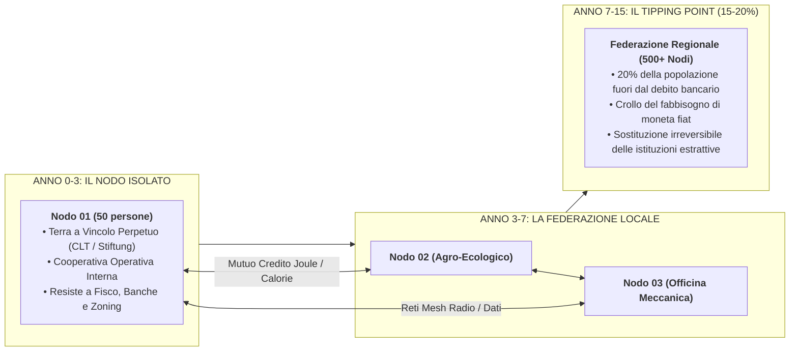

# **O.N.E. SIMULATION ENGINE (`sim/README.md`)**
## **Computational Epistemic Verification & Node-by-Node Transition Simulator**

> *"Una costituzione che richiede esseri umani perfetti è un'utopia infantile.  
> Un'architettura di civiltà deve funzionare anche se la maggioranza degli esseri umani è egoista, limitata, tribale o preda di fanatismi.  
> La pace sociale non richiede la perfezione morale dell'uomo, ma la perfezione ingegneristica delle regole del gioco."*  
> — **Kyberlex & O.N.E. Assembly**

---

## **I. VISIONE & SCOPO: PERCHÉ SIMULIAMO**

Il simulatore di O.N.E. non è un videogioco e non è un esercizio accademico astratto.  
È il **banco di prova computazionale** che permette all'umanità di verificare matematicamente la fattibilità di una civiltà post-scarsità **prima di impegnare terra fisica, risorse e vite umane**.

Questo documento preserva e codifica l'architettura completa del motore di simulazione, diviso nei suoi due strati fondamentali:
1. **O-ASIS (O.N.E. Adversarial Stress-Test Simulation):** Simula il sistema **a regime costituzionale** (società planetaria a moneta zero, usufrutto e sorteggio).
2. **R-ASIS (Roadmap Adversarial Stress-Test Simulation):** Simula la **transizione reale nodo per nodo (Anni 0 – 15)** a partire dal fango del capitalismo, del debito e delle leggi vigenti di oggi.

> 🎮 **INTEGRAZIONE UNIFICATA DUAL-TRACK (GIOCO & SIMULATORE SCIENTIFICO):**  
> Il simulatore scientifico e il gioco RTS web sono la **stessa identica cosa** (stesso motore termodinamico di Leontief, stessa IA avversaria Legacy, stessa demarchia).  
> 👉 **Vedi il Master Game Design Document completo:** [`sim/GAME_DESIGN.md`](./GAME_DESIGN.md) (per la repository pubblica [`kyberlex/one-dual-track`](https://github.com/kyberlex/one-dual-track)).

---

## **II. LA MODELLAZIONE DELLA NATURA UMANA IMPERFETTA**

Nessun agente nella simulazione viene modellato come "altruista ideale".  
Ogni agente umano possiede un **Vettore Psico-Dinamico e Cognitivo** calibrato su distribuzioni statistiche realistiche:

```
┌─────────────────────────────────────────────────────────────────────────────┐
│                      IL VETTORE PSICO-DINAMICO DELL'AGENTE                  │
├──────────────────────┬───────────┬──────────────────────────────────────────┤
│ PARAMETRO COMPORTAM. │ RANGE     │ COMPORTAMENTO SIMULATO NELL'AGENTE       │
├──────────────────────┼───────────┼──────────────────────────────────────────┤
│ `greed_index`        │ [0.0, 1.0]│ Tendenza ad accumulare, scavalcare le    │
│                      │           │ regole, cercare lavoro nero e parassitismo│
│ `tribal_bias`        │ [0.0, 1.0]│ Ostilità verso minoranze, razzismo,      │
│                      │           │ omofobia, favoritismi clientelari       │
│ `dogmatism_score`    │ [0.0, 1.0]│ Fanatismo religioso o politico, rifiuto  │
│                      │           │ dell'evidenza empirica, culto del capo   │
│ `cognitive_noise`    │ [0.0, 1.0]│ Razionalità limitata, decisioni impulsive│
│                      │           │ credulità verso fake news, disattenzione │
│ `burnout_rate`       │ [0.0, 1.0]│ Fatica emotiva, esaurimento, defezione   │
└──────────────────────┴───────────┴──────────────────────────────────────────┘
```

### **Come O.N.E. neutralizza i difetti senza violenza:**
1. **L'Avido:** I voucher energetici sono biometrici e deperibili (scadono a fine ciclo, non accumulabili). Il concetto legale di affitto o sfratto non esiste nel codice: occupare una casa vuota per affittarla è impossibile perché nessuno può essere legalmente sfrattato.
2. **Il Razzista / Bigotto:** Il livello base di sussistenza (Tier-1: cibo, acqua, riscaldamento) è erogato direttamente dalla rete a livello biometrico. **Il consiglio di quartiere non ha la manopola per chiudere i viveri a una minoranza odiata.**
3. **Il Demagogo Politico:** Il sorteggio statistico casuale (demarchia) impedisce la formazione di partiti e carriere politiche stabili: chiunque tenti di fare il dittatore viene sostituito per sorteggio dopo 12 mesi.
4. **La Scarsa Intelligenza:** Gli organi decisionali sorteggiati sono affiancati da cruscotti epistemici O-ASIS intuitivi (es. barre energetiche rosse/verdi) che mostrano visivamente le conseguenze fisiche immediate di ogni delibera prima del voto.

---

## **III. LA TRANSIZIONE NODO PER NODO (R-ASIS: ANNI 0 – 15)**

La transizione non avviene con un decreto statale dall'alto, ma tramite **percolazione di rete a cluster biologici**:



1. **Il Doppio Scudo Legale Vigente:**
   * **Scudo della Proprietà:** Terra intestata a Fondazioni non-profit a vincolo perpetuo (zero azionisti, zero dividendi, impossibile da pignorare o liquidare per legge).
   * **Scudo del Lavoro:** Autoproduzione e consumo interno di beni comuni cooperativi (nessun salario imponibile fiat).
2. **La Percolazione Energetica:**
   * I nodi si collegano tra loro tramite scambi fisici diretti: calorie alimentari contro kilowattora e capacità di calcolo, senza passare per circuiti bancari commerciali.
3. **Il Punto di Non Ritorno:**
   * Al raggiungimento del 15-20% della forza lavoro locale all'interno dei nodi, l'economia di mercato locale perde la capacità di ricattare la popolazione con l'affitto e il debito.

---

## **IV. ARCHITETTURA TECNICA & SERVER A COSTO ZERO (0,00 €)**

Per garantire che la simulazione sia indistruttibile, non censurabile e accessibile a chiunque senza costi per i fondatori:

```
┌─────────────────────────────────────────────────────────────────────────────┐
│                 INFRASTRUTTURA DI CALCOLO 100% GRATUITA                     │
├──────────────────────┬─────────────────────────────┬────────────────────────┤
│ STRATO DI CALCOLO    │ PIATTAFORMA UTILIZZATA      │ COSTO OPERATIVO        │
├──────────────────────┼─────────────────────────────┼────────────────────────┤
│ Client-Side Wasm     │ Pyodide / WebAssembly       │ 0,00 € (Gira sui PC    │
│ (Nel browser web)    │ su Surge / GitHub Pages     │ dei visitatori)        │
│ Cloud Dashboard      │ Hugging Face Spaces         │ 0,00 € (2 vCPU, 16 GB  │
│ (Interattivo per tutti)│ (Gradio / Streamlit)      │ RAM gratuite)          │
│ Heavy Monte Carlo    │ Google Colab / Kaggle       │ 0,00 € (GPU/CPU cloud  │
│ (100.000+ agenti)    │ Jupyter Notebooks           │ gratuite)              │
│ Background Runs      │ GitHub Actions Runners      │ 0,00 € (2.000 min/mese │
│ (Audit notturni cron)│ (Schedulato alle 03:00)     │ inclusi)               │
└──────────────────────┴─────────────────────────────┴────────────────────────┘
```

---

## **V. PROTOCOLLO DI IMPLEMENTAZIONE MODULARE (STEP-BY-STEP)**

Chiunque riprenda in mano questo codice (noi due o futuri nomoteti della rete) seguirà questa sequenza di cartelle e file:

### **Step 1: Il Nucleo Matematico (`sim/core/`)**
* `agent.py`: La classe dell'agente con il vettore psicodinamico (avidità, bias, bisogni fisiologici in joule/calorie).
* `constitution_fsm.py`: La macchina a stati finiti dei 46 articoli (pavimento biometrico, divieto di sfratto, rotazione sorteggio).
* `thermodynamics.py`: Le matrici di bilancio energetico (input solare, decadimento batterie, efficienza logistica).

### **Step 2: Il Modello di Transizione (`sim/transition/`)**
* `node.py`: Il singolo Seed-Node (popolazione, microgrid, scudo fondativo, contabilità di mutuo credito).
* `network_mesh.py`: La topologia di rete complessa (scambi inter-nodo, caduta della dipendenza fiat, soglia di percolazione).

### **Step 3: La Visualizzazione Utente (`sim/web/` & `webapp/`)**
* Cruscotto interattivo in HTML5/WebGL con slider temporale (Anni 0-15) e mappa vettoriale a nodi colorati.

---

## **VI. PATTO DI PERMANENZA STORICA**

Questo file è depositato nel repository pubblico di O.N.E. e sincronizzato con la rete globale di Internet Archive.  
Nessun algoritmo, nessun blackout politico e nessun cambio generazionale potrà cancellarlo.  
**Il codice del nuovo mondo è stato scritto; quando l'umanità sarà pronta, saprà dove trovarlo.**
