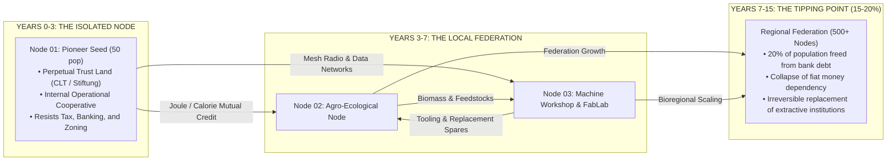

# **O.N.E. SIMULATION ENGINE (`sim/README.md`)**
## **Computational Epistemic Verification & Node-by-Node Transition Simulator**

> *"A constitution that requires perfect human beings is a childish utopia.  
> An architecture of civilization must function even if the majority of human beings are selfish, limited, tribal, or prey to fanaticism.  
> Social peace does not require man's moral perfection, but the engineering perfection of the rules of the game."*  
> — **Kyberlex & O.N.E. Assembly**

---

## **I. VISION & PURPOSE: WHY WE SIMULATE**

The O.N.E. simulator is not a video game and is not an abstract academic exercise.  
It is the **computational proving ground** that allows humanity to mathematically verify the feasibility of a post-scarcity civilization **before committing physical land, resources, and human lives**.

This document preserves and codifies the complete architecture of the simulation engine, split into its two fundamental layers:
1. **O-ASIS (O.N.E. Adversarial Stress-Test Simulation):** Simulates the system **under constitutional steady-state** (planetary zero-money, usufruct, and sortition society).
2. **R-ASIS (Roadmap Adversarial Stress-Test Simulation):** Simulates the **real node-by-node transition (Years 0 – 15)** starting from the mud of capitalism, debt, and prevailing contemporary legal systems.

> 🔬 **TWO-TIER ARCHITECTURE: SCIENTIFIC CO-SIMULATOR (SIMONE) VS. LIVING WEB SANDBOX (O-ASIS DUAL-TRACK)**  
> While sharing the exact same constitutional axioms, thermodynamic invariants, and demarchic governance rules, the ecosystem operates across two specialized, complementary tiers:  
> 1. **Scientific Co-Simulation Engine (`simone/`):** A heavy, peer-reviewed discrete-event and agent-based co-simulation architecture (Julia/Python + CVXPY) detailed in [`simone/simone-specs.md`](../simone/simone-specs.md). It models real Earth observation GIS data (ERA5-Land, HydroSHEDS, SoilGrids), Darcy/Carnot biophysics (Layer 0), Weibull hardware wear and daily convex thermodynamic optimization (Layer 1), empirical psychometrics with HEXACO and Camerer $k$-depth (Layer 2), and formal demarchic state machines (Layer 3) to scientifically stress-test systemic failure thresholds and academic RFC benchmarks.  
> 2. **Living Web Sandbox & Dual-Track MMO (`sim/`):** A client-side, interactive 60 FPS HTML5/WebGL persistent world (detailed in [`sim/GAME_DESIGN.md`](./GAME_DESIGN.md) for [`kyberlex/one-dual-track`](https://github.com/kyberlex/one-dual-track)). It enables intuitive player-driven node founding, demarchic sortition assemblies, cooperative PvE defense against the Legacy Engine, and the **Dual-Track Physical Bridge** unlocking real-world open-hardware engineering blueprints (3D printable CAD `.STL` models and Home Assistant YAML automations).

---

## **II. MODELING IMPERFECT HUMAN NATURE**

No agent in the simulation is modeled as an "ideal altruist".  
Every human agent possesses a **Psycho-Dynamic and Cognitive Vector** calibrated against realistic statistical distributions:

```
┌─────────────────────────────────────────────────────────────────────────────┐
│                      THE AGENT'S PSYCHO-DYNAMIC VECTOR                      │
├──────────────────────┬───────────┬──────────────────────────────────────────┤
│ BEHAVIORAL PARAMETER │ RANGE     │ SIMULATED AGENT BEHAVIOR                 │
├──────────────────────┼───────────┼──────────────────────────────────────────┤
│ `greed_index`        │ [0.0, 1.0]│ Tendency to hoard, bypass rules,         │
│                      │           │ seek black market work and free-riding   │
│ `tribal_bias`        │ [0.0, 1.0]│ Hostility toward minorities, racism,     │
│                      │           │ homophobia, clientelist favoritism       │
│ `dogmatism_score`    │ [0.0, 1.0]│ Religious or political fanaticism,       │
│                      │           │ rejection of empirical evidence, cult of │
│                      │           │ personality / leader worship             │
│ `cognitive_noise`    │ [0.0, 1.0]│ Bounded rationality, impulsive decisions,│
│                      │           │ credulity toward fake news, inattention  │
│ `burnout_rate`       │ [0.0, 1.0]│ Emotional fatigue, exhaustion, defection │
└──────────────────────┴───────────┴──────────────────────────────────────────┘
```

### **How O.N.E. neutralizes flaws without violence:**
1. **The Greedy:** Energy vouchers are biometric and perishable (expire at cycle end, non-accumulative). The legal concept of rent or eviction does not exist in code: occupying an empty dwelling to rent it out is impossible because no one can be legally evicted.
2. **The Racist / Bigot:** The baseline subsistence floor (Tier-1: food, water, heating) is delivered directly by the grid biometrically. **The neighborhood council has no valve or authority to cut off provisions to a despised minority.**
3. **The Political Demagogue:** Statistical random sortition (demarchy) prevents the formation of political parties and entrenched political careers: anyone attempting to act as a dictator is replaced by sortition after 12 months.
4. **Limited Cognitive Bandwidth:** Randomly sortitioned deliberative bodies are assisted by intuitive O-ASIS epistemic dashboards (e.g., red/green thermodynamic bars) that visually project the immediate physical consequences of every deliberation prior to voting.

---

## **III. NODE-BY-NODE TRANSITION (R-ASIS: YEARS 0 – 15)**

The transition does not occur via top-down state decree, but through **network percolation of biological clusters**:



1. **The Dual Existing Legal Shield:**
   * **Property Shield:** Land registered under non-profit perpetual trust foundations (zero shareholders, zero dividends, unseizable and unliquidatable by law).
   * **Labor Shield:** Internal self-production and consumption of cooperative commons (zero taxable fiat wages).
2. **Thermodynamic Percolation:**
   * Nodes interconnect via direct physical exchanges: food calories for kilowatt-hours and compute capacity, bypassing commercial banking rails.
3. **The Point of No Return:**
   * Once 15–20% of the local workforce operates within the nodes, the local market economy loses the leverage to coerce the population through rent and debt.

---

## **IV. TECHNICAL ARCHITECTURE & ZERO-COST INFRASTRUCTURE (€0.00)**

To ensure the simulation is indestructible, uncensorable, and accessible to anyone at zero cost to the founders:

```
┌─────────────────────────────────────────────────────────────────────────────┐
│                    100% FREE COMPUTATIONAL INFRASTRUCTURE                   │
├──────────────────────┬─────────────────────────────┬────────────────────────┤
│ COMPUTATION LAYER    │ PLATFORM USED               │ OPERATING COST         │
├──────────────────────┼─────────────────────────────┼────────────────────────┤
│ Client-Side Wasm     │ Pyodide / WebAssembly       │ €0.00 (Runs on         │
│ (In the web browser) │ on Surge / GitHub Pages     │ visitors' devices)     │
│ Cloud Dashboard      │ Hugging Face Spaces         │ €0.00 (2 vCPU, 16 GB   │
│ (Interactive for all)│ (Gradio / Streamlit)        │ free RAM)              │
│ Heavy Monte Carlo    │ Google Colab / Kaggle       │ €0.00 (Free cloud      │
│ (100,000+ agents)    │ Jupyter Notebooks           │ GPU/CPU)               │
│ Background Runs      │ GitHub Actions Runners      │ €0.00 (2,000 min/month │
│ (Nightly cron audit) │ (Scheduled at 03:00 UTC)    │ included)              │
└──────────────────────┴─────────────────────────────┴────────────────────────┘
```

---

## **V. MODULAR IMPLEMENTATION PROTOCOL (STEP-BY-STEP)**

Anyone working on this codebase (the current team or future network nomothetes) will follow this sequence of folders and files:

### **Step 1: The Mathematical Core (`sim/core/`)**
* `agent.py`: Agent class with the psycho-dynamic vector (greed, bias, physiological needs in joules/calories).
* `constitution_fsm.py`: Finite state machine of the 46 articles (biometric floor, anti-eviction lock, sortition rotation).
* `thermodynamics.py`: Energy balance matrices (solar input, battery degradation, logistical efficiency).

### **Step 2: The Transition Model (`sim/transition/`)**
* `node.py`: Individual Seed-Node (population, microgrid, foundational shield, mutual credit accounting).
* `network_mesh.py`: Complex network topology (inter-node flows, fiat dependency collapse, percolation threshold).

### **Step 3: User Visualization (`sim/web/` & `webapp/`)**
* Interactive dashboard in HTML5/WebGL with temporal slider (Years 0–15) and colored node vector map.

---

## **VI. COVENANT OF HISTORICAL PERMANENCE**

This file is deposited in the public O.N.E. repository and synchronized with the global Internet Archive network.  
No algorithm, political blackout, or generational turnover can erase it.  
**The code of the new world has been written; when humanity is ready, it will know where to find it.**
