# O-ASIS DUAL-TRACK: PLAYER FIELD MANUAL & SURVIVAL RULEBOOK
**The Living Solarpunk Sandbox & Physical Resilience MMO**

*Author: Kyberlex &lt;kyberlex@proton.me&gt;*  
*Repository: [https://github.com/kyberlex/ONE](https://github.com/kyberlex/ONE)*  
*License: AGPL-3.0-or-later • 100% Free & Open-Source Commons*  
*Target Audience: Pioneers, Gamers, Builders, and 12+ Explorers*

---

## 🎮 WELCOME TO O-ASIS!

Imagine waking up in a near-future world where the old power grid keeps flickering, food prices are through the roof, and people are trapped in endless debt. 

Instead of giving up, you and a crew of brave friends found a plot of wild land and decided to build something new: **a living, self-sufficient Solarpunk eco-village**.

Here, there are **no bank loans, no rent lords, no cryptocurrency tokens, and no microtransactions**. Everything your village needs to survive—clean solar electricity, fresh drinking water, organic greenhouse crops, and mesh internet—has to be built, balanced, and looked after by **you and your community**.

Best of all: whenever you master a technology in the game, you can click one button to **download real 3D printable files (`.STL`) and real home automation code (`.YAML`)** to build real hydroponics and solar monitors in your own house or garden!

---

## 🏆 HOW TO WIN & HOW YOU LOSE

Like all great games, O-ASIS has clear rules, real stakes, and epic goals.

### 🌟 How to Win: The 4 Grand Triumphs
You don't "beat" O-ASIS by crushing other players—you win together as a team by reaching these 4 milestones:

1. **Total Thermodynamic Autonomy (Survival Master):** Keep all 4 resource bars green for **30 full in-game days** without suffering a single blackout, drought, or famine.
2. **Zero-Chore Solarpunk Village (Robot Utopia):** Research and build all **5 autonomous cybernetic robots** in the FabLab. When your robot fleet takes over daily cleaning, watering, and repairs, mandatory human chores drop toward **0 hours per week**!
3. **The 5 Civic Megaprojects (Master Builder):** Team up with your neighbors to complete all 5 *Cantieri Civici*: the Solar Amphitheater, Geothermal Heating Loop, High-Temp Metal Smelter, Biogas Digester, and Long-Range Mesh Mast.
4. **The Physical Handshake (The Dual-Track Legend):** Download an open-hardware `.STL` model and Home Assistant configuration, and assemble a real-life food or energy gadget in the physical world!

---

### 💀 How You Lose: The 4 Failure States
If you don't pay attention to physics, your settlement will collapse:

1. **The Midnight Blackout (Energy = 0 kWh):** At night, solar panels stop producing power. If your battery storage empties out, the whole village goes dark. Greenhouse heaters turn off, crops freeze, and automated systems crash!
2. **The Hydroponic Desiccation (Water = 0 Liters):** If your water tanks run dry, aeroponic misting pumps stop. Tender greenhouse greens dry out and die within 6 hours.
3. **The Village Famine (Calories = 0 kcal):** Citizens burn 2,200 calories per day just staying alive. If the pantry is empty, pioneers get exhausted, stop working chores, and eventually abandon the village.
4. **The Legacy Debt Trap (Autonomy = 0%):** The old financial system ("The Legacy AI") will tempt you with easy money or bailouts during crises. If you accept too many predatory loans or install centralized surveillance meters, your settlement loses its independence and gets foreclosed!

---

## 🚀 YOUR FIRST 5 MINUTES: QUICKSTART GUIDE

When the game loads, you are looking at your new village canvas. Here is exactly what to do in your first 5 minutes:

```
[SPACE] Pause/Resume  |  [H] Pick a House  |  [C] Pick a Chore  |  [1/2/5] Change Speed
```

1. **Take a breath:** If things are moving too fast, press `[Space]` to **pause time**. You can look around without anything depleting.
2. **Look at the Top Bar (The 4 Magic Bars):**
   - ⚡ **Energy (kWh):** Glows bright yellow/green during daytime (charging batteries) and drains at night.
   - 💧 **Water (Liters):** Rain fills it; showers and vertical gardens drink it.
   - 🥗 **Calories (kcal):** Food in the pantry. Keep it stocked with fresh harvests!
   - 💻 **Compute (MFLOPS):** The village brainpower. Powers robot pathfinding and weather sensors.
3. **Claim Your Home Pod:** Press `[H]` or click any empty hexagonal dome. Click **"Claim Dwelling Pod"**. That dome is now yours!
4. **Choose Your Daily Chore:** Press `[C]` to open the Chores Board. Pick one guild you want to help today (like tending greenhouse tomatoes or inspecting solar wires).
5. **Resume Time:** Press `[1]` for normal speed, `[2]` for fast forward, or `[5]` if you want to speed through the night.

---

## 🗺️ TOUR OF YOUR VILLAGE & CANVAS CONTROLS

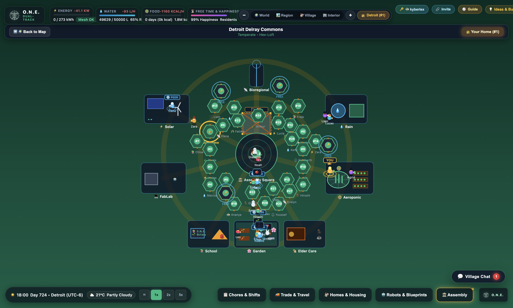
*Figure 1: The village tactical view. Notice the hexagonal dwelling pods, the glowing central hearth fire, greenhouse domes, and the autonomous robots driving around doing their jobs.*

### What You See on Screen
- **The Central Hearth Fire:** The glowing bonfire at the center of town. At sunset, all citizens gather here to talk, eat dinner, and hold council meetings.
- **Dwelling Pods (Geodesic Domes):** The hexagonal houses where pioneers sleep. Occupied domes glow with warm light inside!
- **Aeroponic Greenhouses:** Big round domes full of lush vertical plant towers, growing fresh greens and vegetables 24/7.
- **FabLab & Workshop:** The maker shed with 3D printers, laser cutters, and shredders that turn old plastic bottles into new robot parts.
- **Batteries & Water Cisterns:** Your survival buffers. Always keep an eye on them before sunset!

### Moving Around the Map
- **Pan the Camera:** Use `[W]`, `[A]`, `[S]`, `[D]` keys or click-and-drag with your mouse (or swipe with your finger on tablets/phones).
- **Zoom In / Out:** Use mouse wheel or `[+]` / `[-]` keys to zoom in close to watch citizens or pull back to see the whole village.

---

## 🌍 EXPLORING THE WORLD: 100% OFFLINE MAP

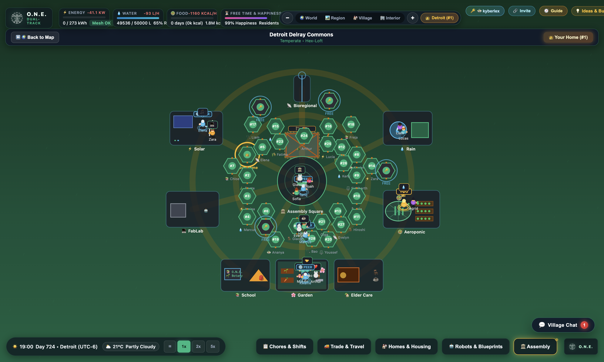
*Figure 2: The global cartography view. The curved dark shadow is the real astronomical solar terminator showing where it is currently day and night across Earth.*

Press `[M]` anytime to zoom out into the **Global Cartography View**.

- **No Internet Required:** The map doesn't download tiles from Google or commercial providers. It is rendered 100% offline using pure math, so it works even if you are totally off-grid.
- **Real-Time Day & Night Shadow:** The big dark shadow sweeping across the globe is the real astronomical terminator. You can see which parts of Earth are currently in sunlight and which are in starlight.
- **Sister Eco-Villages:** Discover other autonomous commons around the globe, like *Valencia Commons* in Spain, *Rojava Ecological Commune*, *Chiapas Caracoles*, and *Cascadia Bioregional Commons*.
- **Trade Caravan Routes:** The glowing dotted lines show electric rovers traveling between nodes, carrying barter goods back and forth!

---

## 🏡 HOUSING RULES: "USE IT OR LOSE IT" & SABBATICAL LOCKS


*Figure 3: Inside your dwelling pod. You can see your hydroponic salad rack, battery backup, and the cryptographic Sabbatical Lock switch.*

### The Usufruct Rule: Homes are for Living, Not Speculating
In O-ASIS, nobody can buy 10 houses and force others to pay rent:
- **Free Shelter:** Any unhoused player can claim an empty pod for free.
- **The 30-Day Rule ("Use It or Lose It"):** If someone claims a house and then disappears for more than 30 in-game days without telling anyone, the village council automatically reassigns the empty pod to a newcomer who needs shelter.
- **Personal Gear is Sacred:** Your clothes, tools, private diary, and computer passwords remain 100% private and can never be taken by anyone else.
- **Heavy Furniture Swap:** Big beds and tables stay with the dome or go to the village Swap Shop so nothing goes to waste.

### Going on Vacation? Use the "Sabbatical Lock"!
If you are planning to go on an expedition, explore another village, or take a break from the game:
1. Open your house sheet (`[H]`).
2. Toggle on the **Sabbatical Lock**.
3. Your pod is now cryptographically locked and legally protected for up to **90 days**.
4. While you are away, your house turns off all heavy appliances and drops into low-power standby mode, saving precious electricity for the rest of the village!

---

## 🧹 ROTATIONAL CHORES & FIRING YOURSELF WITH ROBOTS!

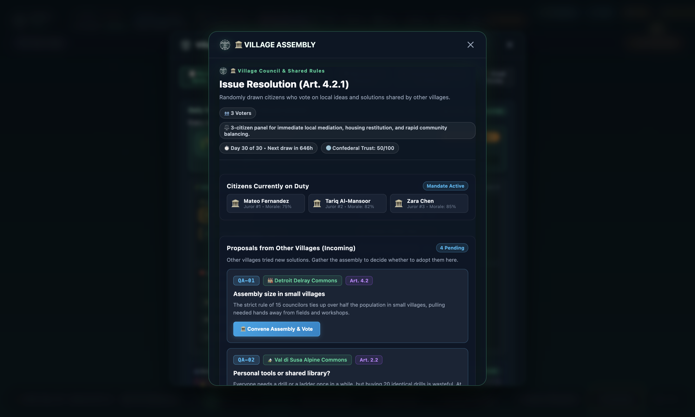
*Figure 4: The Chores Board showing the 4 civic guilds, active shifts, and how many weekly hours of chores have been eliminated by your robot fleet.*

### The 4 Civic Guilds
Nobody gets stuck doing the dirty jobs forever. Every week, pioneers rotate through 4 guilds:
1. **🌾 Land & Food Guild:** Watering vertical gardens, planting seeds, checking mushroom beds, and making compost.
2. **⚡ Facilities & Energy Guild:** Wiping dust off solar panels, checking battery cables, and unclogging water filters.
3. **🍲 Care & Hearth Guild:** Cooking communal lunches, brewing herbal teas, looking after children, and organizing celebrations.
4. **🔧 Workshop & FabLab Guild:** 3D printing spare machine parts, sharpening tools, and shredding plastic scrap.

### Machines Get Tired (Entropy & Wear-and-Tear)
Nothing lasts forever! If a water pump runs for 100 hours without someone greasing its bearings, it turns yellow (*Degraded*), then red (*Critical*), and finally explodes (*Broken*). If a pump breaks at midnight, you have to wake up an engineer to fix it before your plants wither!

---

## 🤖 YOUR 5 ROBOT BUDDIES (HOW TO CANCEL HUMAN LABOR!)

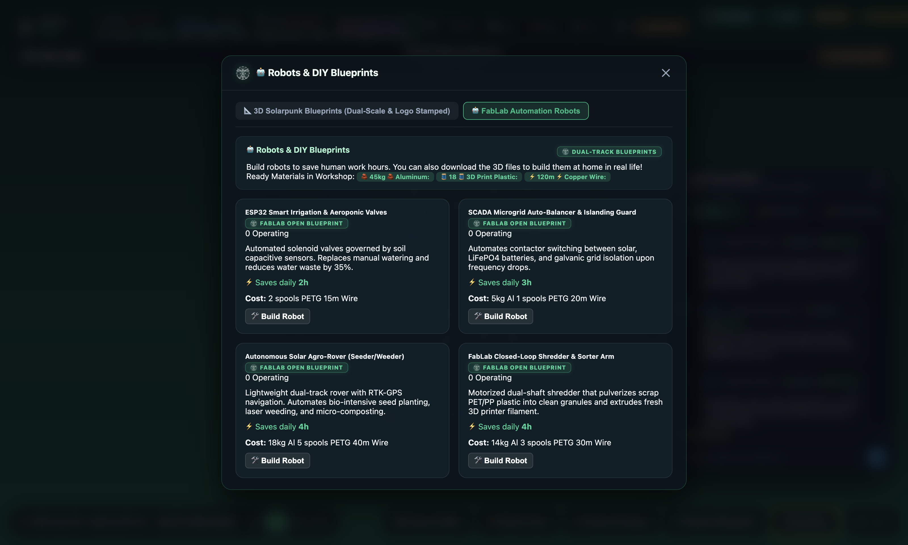
*Figure 5: The FabLab Robotics Tech Tree. Research parts and build autonomous automata to reduce human chore hours to zero.*

Why do manual labor when you can build friendly solarpunk robots to do it for you? Press `[B]` to visit the FabLab and build these 5 machines:

1. **🚜 Agro-Rover (`ROV-01`):** A rugged 4-wheeled robot that patrols outdoor vegetable beds, measures soil moisture, and weeds without chemicals.
2. **🚁 Mist Drone (`DRN-02`):** A solar-powered quadcopter that flies over greenhouse domes, spraying organic bio-nutrients and scanning for leaf pests.
3. **🐛 SCADA Crawler (`SCADA-03`):** A small tracked robot that crawls along electrical conduits and pipe runs, fixing tiny leaks and checking voltages.
4. **🚚 Heavy Logistics Carrier (`LOG-04`):** An automated cargo cart that carries harvest crates from greenhouses straight to the kitchen pantry.
5. **🦾 Cobot Fabricator (`BOT-05`):** A high-precision robot arm inside the workshop that 3D prints replacement screws, brackets, and pipe fittings.

> **💡 THE SOLARPUNK DREAM:** Every robot you deploy automatically removes hours of mandatory chores from the weekly roster. Build a balanced fleet, and mandatory human chores drop to **under 4 hours a week**—leaving you all the time in the world to build, make music, or relax!

---

## 🏛️ ATHENIAN DEMARCHY: VOTING LIKE ANCIENT ATHENS

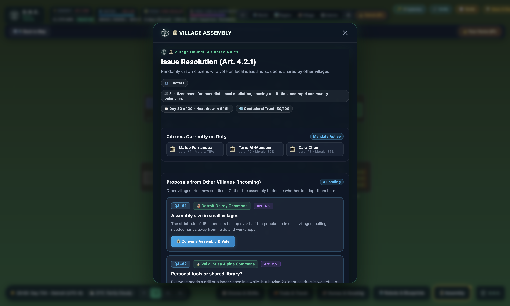
*Figure 6: The Citizen Sortition Assembly. A random jury of pioneers votes on community crises, creating binding case laws in the Confederal Codex.*

### No Corrupt Politicians!
O-ASIS has **no elections, no campaign ads, and no professional politicians**. Instead, it uses **Athenian Demarchy (Sortition)**:
- Whenever a big dilemma hits the village, the computer randomly selects a jury of everyday citizens (3 citizens for small villages, 15 for larger villages).
- It is always an **odd number**, so there can never be a tie vote!
- If your name gets pulled, you sit on the council and cast your vote!

### Tough Dilemmas to Solve
The Legacy AI will constantly test your village with tricky choices:
- *"Solar storm! Solar output is down 50%. Do we shut off greenhouse heating (risking tomato crops) or shut off the FabLab (halting robot construction)?"*
- *"A legacy debt collector shows up demanding $10,000 for ancient land taxes. Do we cut off our power line and go full island mode, or trade surplus olive oil to pay them off?"*

Every choice your council ratifies becomes part of the **Confederal Case Law Codex**—a permanent book of village laws that guides future generations!

---

## 🏗️ TEAM MEGAPROJECTS & CROSS-COUNTRY TRADE CONVOYS

### Cantieri Civici (Giant Community Builds)

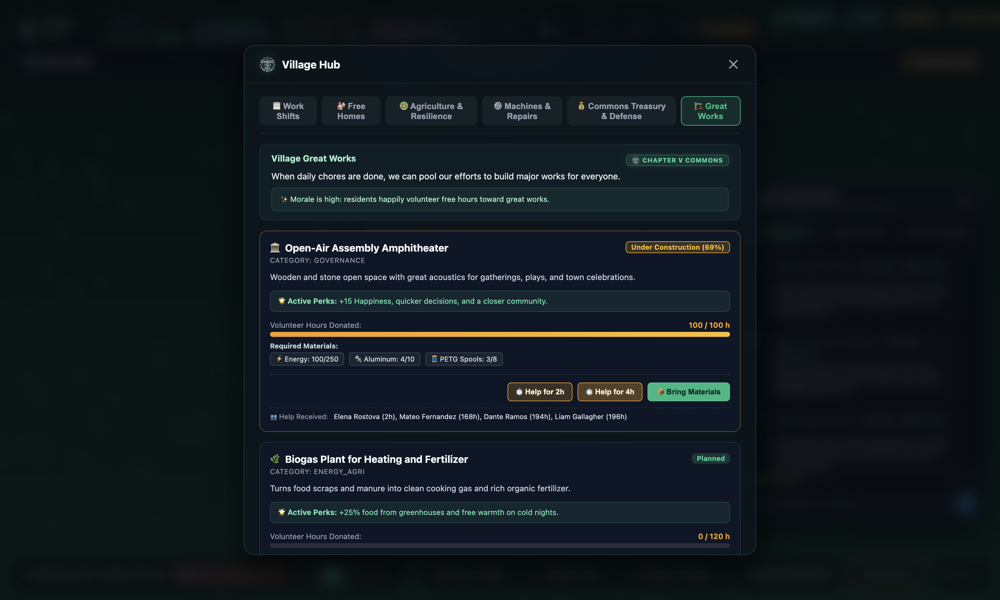
*Figure 7: The Cantieri Civici board. Work with your friends to contribute labor shifts and pooled materials to build epic infrastructure.*

Press `[P]` to open **Cantieri Civici**. These are massive communal builds that nobody can complete alone:
- **Solarpunk Community Amphitheater:** A gorgeous outdoor stone arena for assemblies, theater, and concerts. Boosts happiness!
- **District Geothermal Heating Loop:** Pumps warmth from deep underground through insulated pipes, keeping all houses warm in winter without electricity.
- **FabLab High-Temperature Induction Smelter:** Melts down discarded aluminum cans and scrap metal to cast shiny new robot frames.
- **Biogas Digester Sphere:** Turns kitchen scraps into clean cooking gas and liquid plant fertilizer.
- **Long-Range LoRa Mesh Mast:** A tall hilltop antenna connecting your village to neighboring towns up to 50 km away.

When a project hits 100%, the whole village automatically throws a **Grand Feast Celebration** with music and fireworks!

---

### Trade Convoys (Solidarity Barter)

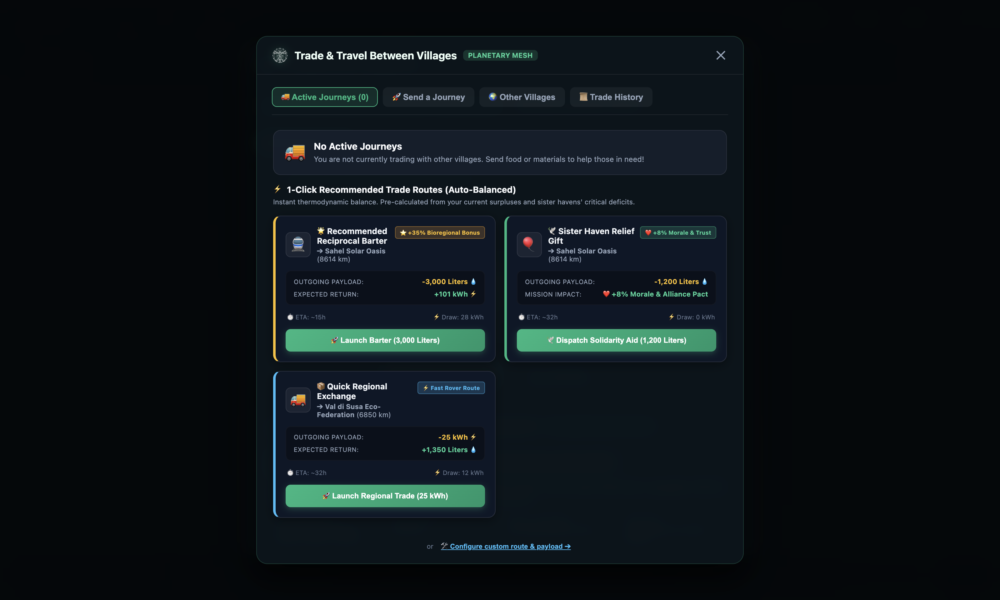
*Figure 8: Inter-Node Trade Convoys. Load up solar trucks with extra food or batteries, ship them across mountains, and watch the "Fiat Dollars Displaced" counter climb!*

If your village makes way too much olive oil but needs spare battery cells:
1. Open the Convoys menu.
2. Load an electric transport rover with your surplus goods.
3. Choose your destination (like *Rojava* or *Cascadia*).
4. Watch the rover drive across real mountain passes and highways!
5. **The Displaced Fiat Counter:** The game tracks how many thousands of dollars you saved by trading directly with other free communities instead of buying from extractive corporations.

---

## 🔑 ZERO-LOGIN MULTIPLAYER: PASSWORDS ARE DEAD!

### Your Sovereign Passport (No Google or Email Needed!)

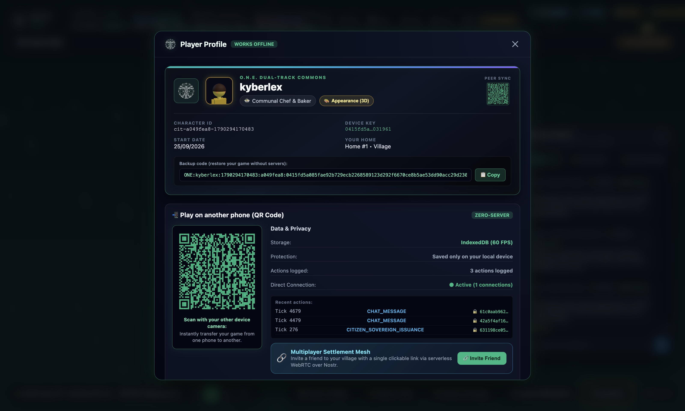
*Figure 9: Your Sovereign Passport. A private elliptic-curve keypair made in your browser gives you a unique solarpunk avatar and instant 2D QR sync.*

You never have to give O-ASIS your email address, phone number, or create a password:
- When you first load the game, your browser uses modern cryptography (**ECDSA P-256**) to generate your own digital keypair.
- Your key creates your unique citizen handle and custom solarpunk avatar.
- **Switch from PC to Phone in 2 Seconds:** Click **"Sync Devices"**, point your smartphone camera at the high-density QR code on screen, and boom—your player profile and village appear on your phone instantly!

---

### 1-Click Multiplayer Rooms (WebRTC + Nostr)

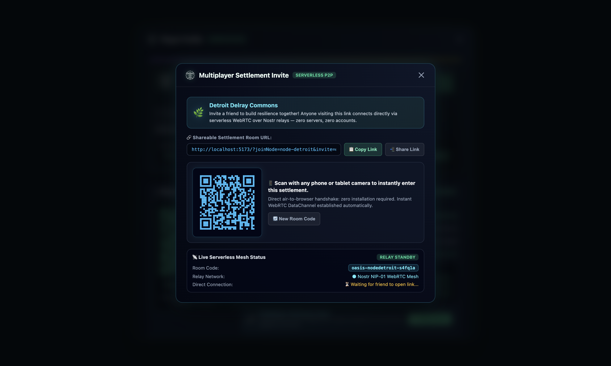
*Figure 10: The Multiplayer Invite panel. Copy your room link and send it to friends to play together on a decentralized peer-to-peer mesh.*

- Click the **Multiplayer** button and copy your unique room URL (for example: `?joinNode=valencia-commons`).
- Paste the link into WhatsApp, Discord, or Signal.
- When your friends click it, their browsers connect directly to yours via **WebRTC peer-to-peer data channels** coordinated by decentralized Nostr relays. There are no expensive game servers in the middle!

---

### Village Chat & Secret Encrypted Whispers

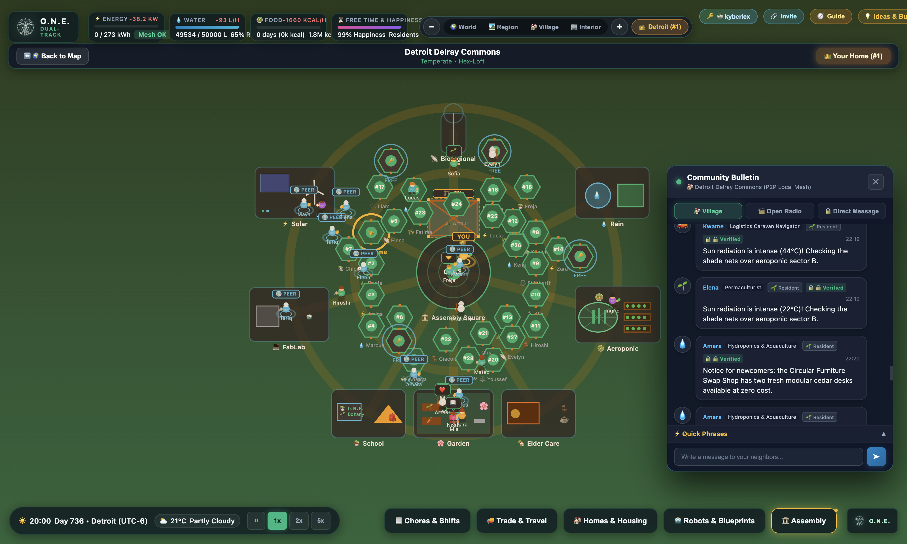
*Figure 11: The Village Chat drawer. Talk to the whole town around the fire, or click any player to start an End-to-End Encrypted (E2EE) private whisper channel.*

Press `[T]` to pull out the chat drawer:
- **Plaza Chat:** Send messages to everyone currently in town.
- **Encrypted Whispers:** Click any friend's name to whisper. Messages are encrypted right on your device using military-grade encryption (**ECDH + AES-256-GCM**). Even the relay servers cannot read what you wrote!
- **Quick-Phrase Buttons:** On a phone? Tap quick buttons like *"Batteries low!"*, *"Heading to greenhouse"*, or *"Convoy incoming!"* without typing.

---

## 🛠️ THE DUAL-TRACK BRIDGE: PRINT REAL GADGETS!

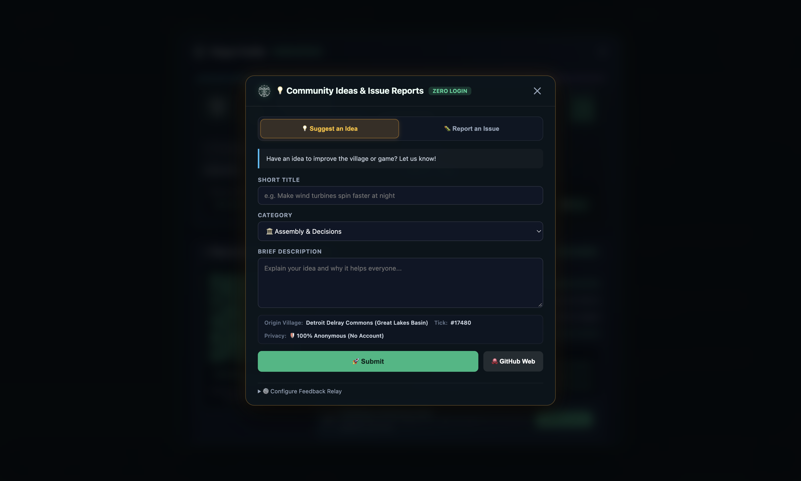
*Figure 12: The interactive 3D Prop Inspector. Rotate and inspect real-world 3D printable components in 1:50 miniature or 1:1 real engineering scale.*

This is where O-ASIS leaves every other game behind. Everything you research in the game corresponds to **real open-source engineering files**:

1. Press `[B]` and click on the **3D Prop Inspector**.
2. Rotate, tilt, and zoom around real 3D models of hydroponic pipe brackets, solar sensors, and weather stations.
3. Switch between **1:50 Miniature Scale** (to see how it fits in a village) and **1:1 Real Scale** (to see the actual screw holes and pipe threads).
4. Click **"Download CAD (.STL)"**: Open the file in Cura, PrusaSlicer, or Bambu Studio, and 3D print it on any desktop 3D printer!
5. Click **"Download Home Assistant (.YAML)"**: Flash an ESP32 microchip and connect real moisture sensors and solar inverters in your own bedroom or greenhouse!

---

## 📢 ANONYMOUS BUG REPORTS & SUGGESTIONS

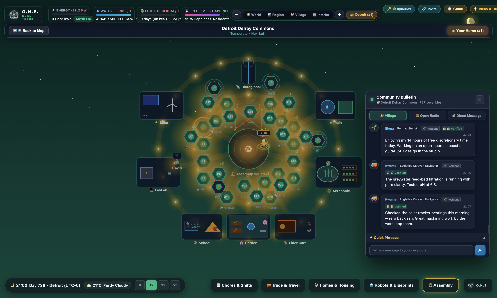
*Figure 13: The Anonymous Feedback Relay. Submit bug reports, feature ideas, or simulation hypotheses directly to GitHub without tracking or account creation.*

Found a bug or have an awesome idea for a new robot?
- Click the bug icon in the bottom corner.
- Type your message and hit Submit.
- A private proxy strips your IP address and sends your idea directly to the developers on GitHub—**completely anonymously**, without requiring a GitHub account or tracking cookies!

---

## ⌨️ MASTER CONTROLS CHEATSHEET

Keep this handy reference next to your keyboard:

| Key | What it Does |
|:---:|:---|
| `[Space]` | **Pause / Unpause:** Freeze time to think, plan, or stop an emergency! |
| `[1]` | **Normal Speed:** 1 second = 1 in-game hour. |
| `[2]` | **Fast Forward:** 2x speed for busy work. |
| `[5]` | **Hyper Warp:** 5x speed to zoom through quiet nights. |
| `[W]` `[A]` `[S]` `[D]` | **Move Camera:** Pan north, west, south, and east across the map. |
| `[+]` / `[-]` | **Zoom In / Zoom Out:** Get close to the action or view the whole valley. |
| `[H]` | **Housing Sheet:** View dwelling domes, claim a pod, or lock for sabbatical. |
| `[C]` | **Chores Board:** View the 4 civic guilds and assign daily shifts. |
| `[D]` | **Demarchy & Codex:** Deliberate in the Citizen Assembly and view village laws. |
| `[P]` | **Megaprojects (Cantieri):** Team up to build amphitheatres and heating loops. |
| `[B]` | **FabLab & Hardware:** Inspect 3D models and download `.STL` / `.YAML` blueprints. |
| `[M]` | **World Map:** Toggle the 100% offline planetary projection. |
| `[N]` | **Node Overview:** Inspect village health, population, and biomass reserves. |
| `[T]` | **Village Chat:** Open the chat drawer for plaza messages and secret whispers. |
| `[Esc]` | **Close Any Window:** Instantly dismiss any open menu or sheet. |

---

## ❓ PIONEER SURVIVAL FAQ & EMERGENCY FIXES

#### 🚨 Emergency: "My battery is at 10% and it's 2 AM! What do I do?!"
> **Hit `[Space]` immediately to pause!** Open your Chores board (`[C]`). Shut down heavy FabLab machines and metal smelters. Keep only essential greenhouse heaters running on battery power until the sun comes up at 06:00!

#### 🚨 Emergency: "A machine is flashing red and smoking!"
> A water pump or solar inverter broke from wear-and-tear. Open the Chores board, assign an engineer from the Facilities Guild, and ensure your FabLab has spare screws in stock!

#### ❓ Question: "Can another player steal my house while I am offline?"
> Not if you turned on your **Sabbatical Lock** before leaving! A sabbatical lock shields your home for up to 90 days. If you leave without a lock for over 30 days, the community can reuse the pod.

#### ❓ Question: "How do I play with my friends at school or at home?"
> Click the Multiplayer button, copy your unique room invite link, and text it to them. They can join right in their browser on a laptop, tablet, or phone without installing anything!

---

*“Do not treat O-ASIS as passive entertainment. Master its Leontief physics, build your village, download the open STL models, flash Home Assistant onto an ESP32 board, and begin assembling real thermodynamic resilience in the physical world.”*

**— Kyberlex & The O.N.E. Commons Collective**
