# **O-ASIS Dual-Track Simulation — Synoptic Architecture & Legacy Systems Compendium (`_synoptic.md`)**

**Document Version:** 1.0.0  
**Repository Path:** `sim/`  
**Persona & Author:** Kyberlex (`kyberlex@proton.me`)  
**License:** AGPL-3.0-or-later  
**Status:** Historical Reference & System Specification  
**Updated:** 2026-10-05  

---

## **1. EXECUTIVE SUMMARY & PURPOSE OF O-ASIS**

**O-ASIS** (Open-source Autonomous Settlement & Infrastructure Simulator) is a scientific, discrete-event thermodynamic sandbox and multi-agent simulation engine. 

Developed under the master directive of Open Networked Earth, O-ASIS was engineered to serve as an **empirical, computational proof-of-concept** demonstrating that human settlements can achieve high living standards, dignity, and technological sophistication without money, debt, or speculative real estate:
1. **Physical Grounding (No Magic Resources):** All economic and social activity is bound by strict Leontief input-output matrices and the Second Law of Thermodynamics.
2. **The Dual-Track Handshake:** Every virtual building module, energy harvester, and water filtration system directly corresponds to open-source physical engineering blueprints (3D printable CAD .STL/.3MF models and Home Assistant Zigbee/MQTT YAML packages).
3. **The Adversary Engine:** Instead of player-versus-player conflict, the simulation models systemic confrontation against the simulated **Legacy Engine AI**, representing institutional debt, financial extraction, and speculative property enclosure.

---

## **2. SYSTEM ARCHITECTURE & LEGACY MODULE MAP**

```mermaid
graph TD
    subgraph UI_Layer["UI & Presentation Layer (sim/app/src/ui/)"]
        HUD["Top HUD (hud.js)"]
        Nav["Nav Groups (nav_groups.js)"]
        Panels["12 Full-Screen Glassmorphic Panels (Node, Citizen, Dilemma, Convoys, etc.)"]
        CAD3D["Three.js CAD & Avatar Viewer (viewer3d.js)"]
    end

    subgraph Simulation_Engine["Simulation Engine (sim/app/src/engine/)"]
        Sim["Discrete-Event Loop (simulation.js)"]
        Node["Settlement Node Model (node.js)"]
        Thermo["Thermodynamics & Leontief (thermodynamics.js)"]
        Adversary["Legacy Engine Adversary AI (adversary.js)"]
        Sortition["Athenian Demarchy Sortition (sortition.js)"]
        Convoys["Trade Convoys & Fleet (trade_convoy.js)"]
        P2P["WebRTC P2P Mesh (p2p_mesh.js)"]
        IDB["IndexedDB Storage (storage_idb.js)"]
        Anchor["Consensus Anchor (consensus_anchor.js)"]
    end

    subgraph Canvas_Rendering["Canvas & Visual Layer (sim/app/src/settlement/)"]
        Settlement["2D Settlement Renderer (settlement_renderer.js)"]
        Interior["2D Interior Cross-Section Renderer (interior_renderer.js)"]
        Civic["Civic Projects Renderer (civic_projects_renderer.js)"]
        Robots["Robot Fleet Manager (robot_manager.js)"]
    end

    subgraph Cartography_Layer["Planetary Cartography (sim/app/src/map/)"]
        Leaflet["WorldMapController (world_map.js)"]
        Terminator["Solar Terminator (solar_terminator.js)"]
        Hex["H3 Hex Grid Math (hex.js)"]
    end

    Sim -->|Ticks State| Node
    Node -->|Conserved Flows| Thermo
    Node -->|Debt & Extraction| Adversary
    Node -->|Civic Assemblies| Sortition
    Node -->|Fleet Operations| Convoys
    Node -->|Visual Entities| Settlement
    Node -->|Spatial Beacons| Leaflet
    Node -->|Local Persistence| IDB
    Sim -->|State Broadcast| P2P
    P2P -->|Snapshot Hashing| Anchor
    HUD -->|Tab Switches| Panels
    Panels -->|Mutates State| Node
    Panels -->|Renders 3D Hardware| CAD3D
```

---

## **3. SCIENTIFIC & NOMOTHETIC PILLARS**

### **3.1. Conserved Thermodynamic Balances (`thermodynamics.js`)**
O-ASIS strictly models four physical conserved balances:
* **⚡ Energy (kWh):** Solar generation calculated with atmospheric attenuation and astronomical solar zenith angles. Wind generation modeled using the Betz limit coefficient ($C_p \le 0.593$). Battery degradation modeled with depth-of-discharge (DoD) cycle wear.
* **💧 Water (Liters):** Rain catchment calculated from roof catchment area, precipitation intensity, and first-flush runoff efficiency. Evapotranspiration computed dynamically from temperature and relative humidity. Greywater reed-bed bio-filtration recycles 65% of domestic greywater.
* **🥗 Food (Kilocalories):** Invariant 2,200 kcal/person/day metabolic floor. Food production modeled through bio-intensive permaculture yields and greenhouse photosynthesis curves.
* **💻 Compute (FLOPs / CPU Hours):** Microgrid SCADA automation, ESP32 telemetry, and drone pathfinding draw computational and electrical power.

### **3.2. Nomothetic Demarchy & Dynamic Usufruct (`sortition.js`, `node.js`)**
* **Athenian Sortition:** Citizen juries are selected by lot from the population roster. Assemblies strictly enforce **odd-parity quorums** (3, 5, 7, or 9 jurors) to eliminate deadlocks.
* **75% Qualified Supermajority:** Fundamental constitutional modifications require a 75% qualified affirmative vote.
* **Dynamic Usufruct ("Use It or Lose It"):** Dwellings are assigned to active residents. Unoccupied homes without an engaged Sabbatical Lock are automatically released back to the Civic Housing Pool.

### **3.3. The Legacy Engine Adversary AI (`adversary.js`)**
* Models the encroachment of the surrounding financial system:
  - **Land Debt & Property Taxes:** Unpaid property debt compounds with interest.
  - **Speculative Land Enclosure:** Neighboring parcels are bought up by private conglomerates, threatening settlement access corridors.
  - **The Hostile Buyout Dilemma:** The Legacy Engine offers high-dollar buyouts to lure pioneers away from the commons.

---

## **4. THE EVOLUTIONARY LEAP: WHY `game/` SUCCEEDED `sim/`**

While `sim/` remains scientifically rigorous and feature-complete, player testing revealed several UX frictions that necessitated the creation of the streamlined **Living Commons Game** (`game/`):

| Design Dimension | Legacy Simulator (`sim/`) | Living Commons Game (`game/`) |
| :--- | :--- | :--- |
| **User Interface Paradigm** | 12 full-screen modal tables covering the canvas | Contextual Bottom Dock (max 3–4 buttons) & pinned Objective Card |
| **Information Architecture** | All systems unlocked on Day 1 (overwhelming cognitive load) | Strict Progressive Disclosure ("The Gated Horizon" Days 1, 7, 15, 25, 35) |
| **Visual Feedback & "Juice"** | Static numbers and text logs | Bouncing spring transforms, floating delta text, dust puffs, sound FX |
| **Narrative Focus** | Academic/technocratic simulation | Tactile Solarpunk journey from 1 camper van to a thriving ecovillage |
| **Onboarding Experience** | 10-step modal guide tour | Interactive 3-stop planetary tour & real-world geolocation beacon |

---

## **5. THE "SIM REUSE FIRST" CATALOG FOR `game/`**

Per the master protocol in `.agents/skills/game-engine/SKILL.md`, the new game engine reuses and refines proven algorithms from `sim/`:

1. **Sprite & Rendering Math:** Camper van vector rendering, walking pioneer cadence, and animated wind turbines transplanted from `sim/app/src/settlement/settlement_renderer.js`.
2. **Astronomical Cartography:** Planetary solar terminator math and H3 hex grid calculations transplanted from `sim/app/src/map/solar_terminator.js` and `hex.js`.
3. **Physical Formulas:** Irradiance curves, Betz limit, and metabolic kcal floors transplanted from `sim/app/src/engine/thermodynamics.js`.
4. **Sortition Algorithms:** Demarchy sortition with odd-parity logic transplanted from `sim/app/src/engine/sortition.js`.
5. **Localization:** Complete 14-language dictionaries transplanted directly from `sim/app/src/i18n/`.
